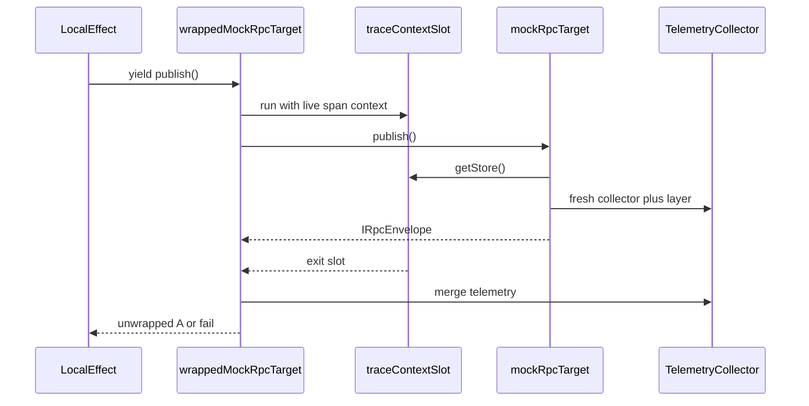

# makeTraceableRpcTarget Implementation Plan

> **For agentic workers:** REQUIRED SUB-SKILL: Use superpowers:subagent-driven-development (recommended) or superpowers:executing-plans to implement this plan task-by-task. Steps use checkbox (`- [ ]`) syntax for tracking.
>
> **Also save a copy to:** [.plans/plans/015-plan-make-traceable-rpc-target.md](.plans/plans/015-plan-make-traceable-rpc-target.md) when executing (matches prior logger spike plans).

**Goal:** Make logger-ready cross-runtime calls look like Cap’n Web stubs — `yield* wrappedAccountBlockRepo.publish(...)` — by hiding ALS context, envelope merge, and `'lost'` spans inside a Proxy, and implement RpcTarget methods with `makeRpcHandler(name)(fn)` on one mock file per RpcTarget.

**Architecture:** `makeTraceableRpcTarget(mockRpcTarget)` returns a Proxy that sets an `AsyncLocalStorage` slot, invokes Promise methods on the mock target, merges `IRpcEnvelope.telemetry`, unwraps Either, and on transport reject records a `'lost'` child span. `makeRpcHandler` implements each mock target method: reads the slot, runs a named Effect in a fresh collector/layer, returns the envelope (former `runBoundary`). Workflow mocks live under `finalizeAccountCommands/` as target objects; delayed work uses a shared `queuedJobs` array the spec dispatches explicitly.

**Tech Stack:** Effect 3.21.4, `node:async_hooks` AsyncLocalStorage, vitest, existing `@zerospin/logger` (`renderTraceDag`, collectors, layers). No new npm deps. No imports from system-worker / dispatch-worker / core.

## Naming (locked)

Do **not** use `callee`, `caller`, or `raw` in identifiers, comments, or examples.

1. **mock target** — object whose methods are `makeRpcHandler(...)(...)` and return `Promise<IRpcEnvelope<...>>` (Cap’n Web–shaped). Examples: `mockRpcTarget`, `accountBlockRepo`, `systemWorker`.
2. **wrapped target** — `makeTraceableRpcTarget(mockTarget)` result; methods return `Effect`. Examples: `wrappedMockRpcTarget`, `wrappedAccountBlockRepo`.
3. Span names use real procedure names (`AccountBlockRepo.publish`, `MockRpc.double`), never `Callee.*` / `Caller.*`.

Canonical example:

```ts
const mockRpcTarget = {
  double: makeRpcHandler("MockRpc.double")(function* (n: number) {
    yield* Effect.logInfo("working");
    return n * 2;
  }),
};
const wrappedMockRpcTarget = makeTraceableRpcTarget(mockRpcTarget);

yield * wrappedMockRpcTarget.double(21);
```

## Global Constraints

1. Touch only `packages/logger` (zero blast radius). Do not modify the dirty lockfile.
2. No new named `type` / `interface` assignments without asking — prefer mapped/inline return types and `satisfies`.
3. No new abstractions beyond `traceContextSlot`, `makeRpcHandler`, `makeTraceableRpcTarget`, and the mock folder files listed below (already approved in design).
4. Public teaching surface must not use `runBoundary` / `decodeEnvelope` / `currentTraceContext` at call sites; those become internals or disappear.
5. ALS is a spike stand-in for wire-carried `ITraceContext`. Comment in slot module: does not cross real DO RPC; Workers need `nodejs_als` / `nodejs_compat` for ALS in-isolate only.
6. `causedBy` / `retryOf` stay on `Effect.withSpan(..., { links })` at drain/alarm — no new link helper.
7. Verify with `nx run @zerospin/logger:test`, `nx run @zerospin/logger:ts`, `nx run @zerospin/logger:lint`.
8. Commit steps are optional unless the user asks to commit (repo user rule).
9. Follow **Naming (locked)** — no `callee` / `caller` / `raw` in code or plan examples.

## File Structure

```
packages/logger/src/
  traceContextSlot.ts              ALS get/run helpers
  makeRpcHandler.ts                mock RpcTarget method: Effect → Promise<IRpcEnvelope>
  makeTraceableRpcTarget.ts        Proxy: Effect methods + lost spans over a mock target
  boundary.ts                      DELETE or reduce to non-exported internals moved into the two factories
  makeTraceableRpcTarget.spec.ts   replaces boundary.spec.ts claims
  index.ts                         export new helpers; stop exporting retired boundary names
  finalizeAccountCommands/
    queuedJobs.ts
    SystemApi.ts
    SystemWorker.ts
    AccountRepo.ts
    AccountBlockRepo.ts
    ActorRepo.ts
    finalizeAccountCommandsWorkflow.spec.ts
  finalizeAccountCommandsWorkflow.spec.ts  DELETE (moved into folder)
  boundary.spec.ts                         DELETE after migration
```



---

### Task 1: AsyncLocalStorage trace context slot

**Files:**

1. Create: `packages/logger/src/traceContextSlot.ts`
2. Create: `packages/logger/src/traceContextSlot.spec.ts`
3. Modify: `packages/logger/src/index.ts` (export only if tests outside package need it — prefer **not** exporting; keep slot package-internal)

**Interfaces:**

1. Consumes: `ITraceContext` from `./types.ts`
2. Produces:
   - `runWithTraceContext<A>(context: ITraceContext | null, fn: () => Promise<A>): Promise<A>`
   - `getTraceContextFromSlot(): ITraceContext | null`

3. **Step 1: Write the failing test**

```ts
import { describe, expect, it } from "vitest";
import { getTraceContextFromSlot, runWithTraceContext } from "./traceContextSlot.ts";
import type { ITraceContext } from "./types.ts";

describe("traceContextSlot", () => {
  it("returns null outside runWithTraceContext", () => {
    expect(getTraceContextFromSlot()).toBeNull();
  });

  it("exposes context inside runWithTraceContext and clears after", async () => {
    const context: ITraceContext = {
      traceId: "trc_test",
      parentSpanId: "spn_parent",
    };
    const seen = await runWithTraceContext(context, async () => getTraceContextFromSlot());
    expect(seen).toEqual(context);
    expect(getTraceContextFromSlot()).toBeNull();
  });

  it("nests and restores prior context", async () => {
    const outer: ITraceContext = {
      traceId: "trc_outer",
      parentSpanId: "spn_outer",
    };
    const inner: ITraceContext = {
      traceId: "trc_inner",
      parentSpanId: "spn_inner",
    };
    await runWithTraceContext(outer, async () => {
      expect(getTraceContextFromSlot()).toEqual(outer);
      await runWithTraceContext(inner, async () => {
        expect(getTraceContextFromSlot()).toEqual(inner);
      });
      expect(getTraceContextFromSlot()).toEqual(outer);
    });
  });
});
```

2. **Step 2: Run test — expect FAIL** (module missing)

`nx run @zerospin/logger:test -- src/traceContextSlot.spec.ts`

3. **Step 3: Implement**

```ts
import { AsyncLocalStorage } from "node:async_hooks";
import type { ITraceContext } from "./types.ts";

/*
 * Spike stand-in for wire-carried ITraceContext.
 * ALS works in Workers with nodejs_als / nodejs_compat but only in-isolate —
 * it does not cross real Cap'n Web / Durable Object RPC.
 */
const storage = new AsyncLocalStorage<ITraceContext | null>();

export const runWithTraceContext = <A>(
  context: ITraceContext | null,
  fn: () => Promise<A>,
): Promise<A> => storage.run(context, fn);

export const getTraceContextFromSlot = (): ITraceContext | null => storage.getStore() ?? null;
```

4. **Step 4: Run test — expect PASS**

5. **Step 5: Commit only if user asked**

---

### Task 2: `makeRpcHandler` (mock RpcTarget methods)

**Files:**

1. Create: `packages/logger/src/makeRpcHandler.ts`
2. Create: `packages/logger/src/makeRpcHandler.spec.ts`

**Interfaces:**

1. Consumes: slot, `makeTelemetryCollector`, `makeTelemetryLayer`, `Tracer.externalSpan` / `Effect.withParentSpan` (logic formerly in `runBoundary`)
2. Produces: `makeRpcHandler(name)(fn) => (...args) => Promise<IRpcEnvelope<A, E>>` where `fn` is an Effect.fn-compatible generator; root span name is `name`; parent from `getTraceContextFromSlot()` when non-null

3. **Step 1: Failing test — named span + ALS parentage + Left keeps telemetry**

```ts
import { Effect } from "effect";
import { describe, expect, it } from "vitest";
import { makeRpcHandler } from "./makeRpcHandler.ts";
import { runWithTraceContext } from "./traceContextSlot.ts";
import type { ITraceContext } from "./types.ts";

describe("makeRpcHandler", () => {
  it("returns Right envelope with a named ok span", async () => {
    const handle = makeRpcHandler("MockRpc.double")(function* (n: number) {
      yield* Effect.logInfo("working");
      return n * 2;
    });
    const envelope = await handle(21);
    expect(envelope.result).toEqual({ _tag: "Right", right: 42 });
    expect(envelope.telemetry.spans[0]?.name).toBe("MockRpc.double");
    expect(envelope.telemetry.spans[0]?.status).toBe("ok");
    expect(envelope.telemetry.spans[0]?.parentSpanId).toBeNull();
  });

  it("parents under ALS trace context", async () => {
    const handle = makeRpcHandler("MockRpc.double")(function* () {
      return 1;
    });
    const context: ITraceContext = {
      traceId: "trc_parent",
      parentSpanId: "spn_parent",
    };
    const envelope = await runWithTraceContext(context, () => handle());
    const span = envelope.telemetry.spans[0]!;
    expect(span.traceId).toBe("trc_parent");
    expect(span.parentSpanId).toBe("spn_parent");
  });

  it("encodes domain failure as Left with error span", async () => {
    const handle = makeRpcHandler("MockRpc.fail")(function* () {
      return yield* Effect.fail("domain-error" as const);
    });
    const envelope = await handle();
    expect(envelope.result).toEqual({ _tag: "Left", left: "domain-error" });
    expect(envelope.telemetry.spans[0]?.status).toBe("error");
  });
});
```

2. **Step 2: Run — expect FAIL**

3. **Step 3: Implement** by inlining former `runBoundary` body: fresh collector, optional `Effect.withParentSpan(Tracer.externalSpan(...))` from slot, `Effect.fn(name)(fn)`, `Effect.either` + `makeTelemetryLayer`, build `IRpcEnvelope`. Do not re-export `runBoundary`.

4. **Step 4: PASS**

---

### Task 3: `makeTraceableRpcTarget` (Proxy over a mock RpcTarget)

**Files:**

1. Create: `packages/logger/src/makeTraceableRpcTarget.ts`
2. Create: `packages/logger/src/makeTraceableRpcTarget.spec.ts`

**Interfaces:**

1. Consumes: slot `runWithTraceContext`, envelope merge (former `decodeEnvelope`), live span context via `Effect.currentSpan`, `TelemetryCollector`, `makeSpanId`
2. Produces: `makeTraceableRpcTarget(mockRpcTarget)` — ES6 Proxy; function properties become `(...args) => Effect` that:
   1. Reads live `ITraceContext` from current span (or null)
   2. `runWithTraceContext(ctx, () => Reflect.apply(method, mockRpcTarget, args))`
   3. On fulfilled `IRpcEnvelope`: merge telemetry into ambient collector; unwrap Right/Left
   4. On Promise reject: add `'lost'` span named as the method key under current parent, then fail the Effect with the transport error
3. Skip wrapping non-functions and `then` (avoid thenable traps)

4. **Step 1: Failing integration tests** (port claims from `boundary.spec.ts`):

```ts
const mockRpcTarget = {
  double: makeRpcHandler("MockRpc.double")(function* (n: number) {
    yield* Effect.logInfo("working");
    return n * 2;
  }),
};
const wrappedMockRpcTarget = makeTraceableRpcTarget(mockRpcTarget);

const program = Effect.gen(function* () {
  return yield* wrappedMockRpcTarget.double(21);
}).pipe(Effect.withSpan("LocalOp.run"));

// assert: same traceId, MockRpc.double.parentSpanId === LocalOp.run.spanId, log correlated

// 2) invoke mockRpcTarget.double() with empty ALS → root parentSpanId null

// 3) transport lost baked into Proxy
const flakyMockRpcTarget = makeTraceableRpcTarget({
  double: () => Promise.reject(new Error("socket died")),
});
// under LocalOp.run + TelemetryCollector: expect lost span name 'double'
```

**Lost span naming rule (locked):** use `String(prop)` (e.g. `finalizeAccountBlock`). Successful handler spans keep `makeRpcHandler('SystemWorker.finalizeAccountBlock')` names. Update the workflow inline snapshot for lost spans to method-key names (e.g. `finalizeAccountBlock [lost]`).

2. **Step 2: FAIL**

3. **Step 3: Implement Proxy** with internal merge/unwrap (do not export `decodeEnvelope`).

4. **Step 4: PASS** including lost-span test without manual `collector.addSpan` at call site.

---

### Task 4: Retire public boundary API

**Files:**

1. Modify: `packages/logger/src/index.ts` — export `makeRpcHandler`, `makeTraceableRpcTarget`; remove `runBoundary`, `decodeEnvelope`, `currentTraceContext` exports
2. Delete: `packages/logger/src/boundary.spec.ts`
3. Delete or empty: `packages/logger/src/boundary.ts` after logic lives in the two factories (if tiny shared bits remain, keep as non-exported `./boundaryInternal.ts` imported only by factories — avoid if possible)
4. Modify: any remaining imports inside logger

5. **Step 1:** Grep `packages/logger` for `runBoundary|decodeEnvelope|currentTraceContext` and fix.
6. **Step 2:** `nx run @zerospin/logger:test` + `ts` + `lint` green.
7. **Step 3:** Confirm `makeTraceableRpcTarget.spec.ts` covers former boundary claims (parentage, merge, Left, lost, fresh root).

---

### Task 5: `queuedJobs` + mock RpcTargets (one file per target)

**Files:**

1. Create: `packages/logger/src/finalizeAccountCommands/queuedJobs.ts`
2. Create: `packages/logger/src/finalizeAccountCommands/ActorRepo.ts`
3. Create: `packages/logger/src/finalizeAccountCommands/AccountBlockRepo.ts`
4. Create: `packages/logger/src/finalizeAccountCommands/AccountRepo.ts`
5. Create: `packages/logger/src/finalizeAccountCommands/SystemWorker.ts`
6. Create: `packages/logger/src/finalizeAccountCommands/SystemApi.ts`

**Interfaces:**

1. `queuedJobs.ts` produces a mutable harness:

```ts
export const queuedJobs: Array<{
  name: "drain" | "alarm";
  delayMs: number;
  run: () => Promise<IRpcEnvelope<void, string>>;
}> = [];

export let systemWorkerRpcAttempts = 0;
export let accountBlockPublishAttempts = 0;
export let subscriberDeliveryAttempts = 0;

export const resetFinalizeHarness = (): void => {
  queuedJobs.length = 0;
  systemWorkerRpcAttempts = 0;
  accountBlockPublishAttempts = 0;
  subscriberDeliveryAttempts = 0;
};
```

2. Each `*Repo.ts` / `System*.ts` exports a **mock RpcTarget** object whose methods are `makeRpcHandler(...)(...)` returning `Promise<IRpcEnvelope<...>>`.
3. Cross-target calls use `const wrappedAccountBlockRepo = makeTraceableRpcTarget(accountBlockRepo)` (or equivalent) inside handlers — never name variables `raw` / `callee` / `caller`.
4. Same-runtime nested steps use `Effect.withSpan` / `Effect.fn` inside the owning target file.
5. Behavior parity with current [finalizeAccountCommandsWorkflow.spec.ts](packages/logger/src/finalizeAccountCommandsWorkflow.spec.ts):
   1. SystemWorker: attempt 1 Promise.reject (transport); attempt 2 success path into AccountRepo
   2. AccountBlockRepo.publish: attempt 1 Left; attempt 2 success + push drain job `delayMs: 0`
   3. drain: `causedBy` link to publish context; processSubscriber; ActorRepo fail once; schedule alarm `delayMs: 500`
   4. alarm: `retryOf` processSubscriber; second delivery ok

**ActorRepo.ts sketch:**

```ts
export const actorRepo = {
  handleAccountBlocks: makeRpcHandler("ActorRepo.handleAccountBlocks")(function* () {
    subscriberDeliveryAttempts += 1;
    if (subscriberDeliveryAttempts === 1) {
      return yield* Effect.fail("mock actor delivery failure");
    }
  }),
};
```

**AccountBlockRepo** owns publish / drainActorOutbox / processSubscriber / alarm / refreshQueue handlers; processSubscriber uses `makeTraceableRpcTarget(actorRepo).handleAccountBlocks()` with `Effect.either` catch + queue alarm (same control flow as today’s monolith).

**SystemApi** exposes `finalizeAccountCommands` as a local Effect entry the spec runs with `makeTelemetryLayer` (originating trace). Prefer: spec runs SystemApi body as Effect with layer, and SystemApi calls `makeTraceableRpcTarget(systemWorker).finalizeAccountBlock()` with `Effect.retry`.

---

### Task 6: Workflow spec in folder

**Files:**

1. Create: `packages/logger/src/finalizeAccountCommands/finalizeAccountCommandsWorkflow.spec.ts`
2. Delete: `packages/logger/src/finalizeAccountCommandsWorkflow.spec.ts`

**Spec responsibilities only:**

1. `resetFinalizeHarness()`
2. Run originating SystemApi Effect with collector/layer
3. Assert result + attempt counters
4. Assert drain pending; `shift` + `await run()` drain; assert alarm queued
5. Run alarm job
6. Merge three batches; assert 3 traces, lost/error/ok, link kinds
7. `toMatchInlineSnapshot(renderTraceDag(...))` — update for Proxy lost-span naming and any address churn

No `runBoundary` / `decodeEnvelope` / manual lost-span construction in the spec.

1. **Step 1:** Move/adapt test; run focused — update snapshot.
2. **Step 2:** Full package matrix green.

---

### Task 7: Barrel + matrix + scope check

**Files:**

1. Modify: `packages/logger/src/index.ts`

Exports: add `makeRpcHandler`, `makeTraceableRpcTarget`. Do **not** export `traceContextSlot` helpers, `queuedJobs`, or mock targets (test-only folder).

1. **Step 1:** `nx run-many -t test ts lint -p @zerospin/logger --skipNxCache`
2. **Step 2:** `nx run @zerospin/logger:clean`; confirm git only touches `packages/logger`
3. **Step 3:** Commit only if user asks

## Self-review checklist

1. Spec coverage: Proxy over mock RpcTarget, `makeRpcHandler` methods, ALS, lost-in-Proxy, per-target folder, queuedJobs explicit dispatch, DAG snapshot, retire boundary exports — all tasked.
2. No placeholders / TBD left in tasks.
3. Naming consistency: `makeTraceableRpcTarget`, `makeRpcHandler`, `runWithTraceContext`, `getTraceContextFromSlot`, `resetFinalizeHarness`, `mockRpcTarget` / `wrappedMockRpcTarget` (no `callee` / `caller` / `raw`).
4. ALS production caveat documented in Task 1 comment.
5. Lost span names = method keys; snapshot updated in Task 6.
