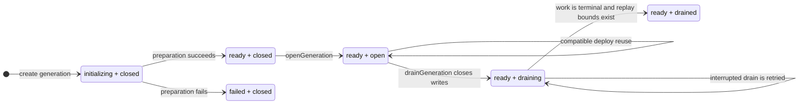
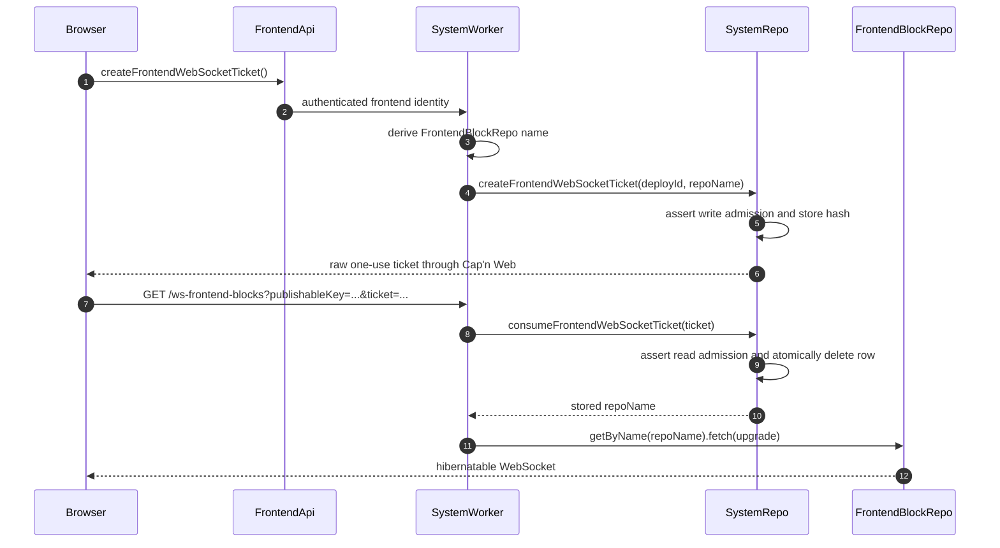

# Abbreviation ownership and frontend WebSocket admission design

**Date:** 2026-07-17
**Status:** Approved for planning

## Problem Statement

1. `coreAbbreviations` currently mixes shared protocol identifiers, system-worker Durable Object names, application API-key identifiers, unused application run identifiers, and misleading names such as `defaultSession` and `systemRecord`.
2. The browser currently constructs a generation-scoped `FrontendBlockRepo` name and sends durable identity plus a signature through `/ws-subscriber/{repoName}`. Worker entrypoints trust that caller-supplied repo name and forward the upgrade directly.
3. Cap'n Web can authenticate the browser before the upgrade, but its in-memory RPC session cannot own the frontend-block connection because `FrontendBlockRepo` WebSockets must remain hibernatable.
4. The replacement must preserve generation admission: new credentials cannot be minted while draining, an already-minted credential can still be consumed while reads remain admitted, and drained generations reject new upgrades without actively closing existing sockets.

## Solution

1. Split abbreviation ownership according to the runtime or protocol that owns each identifier. Keep only genuinely shared wire and persisted identifiers in core.
2. Replace the caller-addressed WebSocket route with fixed `/ws-frontend-blocks` entrypoints. Authenticate through the existing Cap'n Web `FrontendApi`, mint a short-lived one-use ticket, and let `SystemWorker` derive the exact `FrontendBlockRepo` name.
3. Store only a SHA-256 ticket hash and its server-derived routing data in the generation's `SystemRepo`. The native WebSocket upgrade remains a direct fetch to the hibernating `FrontendBlockRepo` after atomic ticket consumption.
4. Treat ticket minting as write admission and ticket consumption as read admission. Keep readiness and admission as separate generation-state axes.

## User Stories

1. As a core-package consumer, I want shared abbreviations to describe shared protocol identities instead of deployment-specific implementation details.
2. As a Zerospin application owner, I want application API-key abbreviations owned by the application package that creates and parses those keys.
3. As a browser session, I want to authenticate through the existing Cap'n Web boundary and receive a disposable WebSocket credential without exposing my signature in the URL.
4. As a system operator, I want WebSocket routing derived from authenticated server state so a browser cannot select a generation, account, actor, or Durable Object name.
5. As a generation being drained, I want new ticket minting to stop immediately while already-admitted reads and already-minted tickets can finish.
6. As a frontend session, I want bootstrap to fail when the WebSocket handshake fails instead of reporting a usable session with no live frontend-block delivery.
7. As a `FrontendBlockRepo`, I want the final native WebSocket connection to remain directly hibernatable without an in-memory Cap'n Web transport or proxy Durable Object.

## Implementation Decisions

### Abbreviation ownership

1. `packages/core` keeps an exported shared registry with these exact entries and values:
   1. `stagedCursor: 'stcur'`
   2. `pushedCursor: 'pcur'`
   3. `serviceCursor: 'svcur'`
   4. `accountCursor: 'acur'`
   5. `account: 'acct'`
   6. `actor: 'actr'`
   7. `system: 'sys'`
   8. `deploy: 'dpl'`
   9. `generation: 'gen'`
   10. `session: 'sesn'`
   11. `command: 'cmd'`
2. Rename `systemRecord` to `system` and `defaultSession` to `session`. Consolidate all production session and command schemas, tables, allocators, and identifier types on the shared values. Literal identifiers used only as isolated test fixtures do not need mechanical replacement.
3. `packages/system-worker` owns one unexported `systemWorkerAbbreviations` object with these exact entries and values:
   1. `authorizationAttemptCursor: 'atzcur'`
   2. `systemRepo: 'sysrepo'`
   3. `accountRepo: 'acctrepo'`
   4. `authorizationRepo: 'atzrepo'`
   5. `actorRepo: 'actrrepo'`
   6. `frontendRepo: 'frtrepo'`
   7. `serviceRepo: 'svcrepo'`
   8. `accountBlockRepo: 'acctbrepo'`
   9. `actorBlockRepo: 'actrbrepo'`
   10. `serviceBlockRepo: 'svcbrepo'`
   11. `systemLogRepo: 'syslogrepo'`
   12. `frontendBlockRepo: 'frtbrepo'`
4. `zerospin-apps/apis` owns one exported `cloudIdAbbreviations` object containing only its public API-key families:
   1. `systemProductionSecretKey: 'spsk'`
   2. `systemProductionPublishableKey: 'sppk'`
   3. `systemProductionKeyPair: 'spkp'`
   4. `userDevSecretKey: 'udsk'`
   5. `userDevPublishableKey: 'udpk'`
   6. `userDevKeyPair: 'udkp'`
5. Inline `organization: 'org'` at its sole application route-schema use.
6. Delete the unused application run prefixes `finalizePushedRun`, `publishFinalizedRun`, `publishFinalizedSystemRun`, and `fanoutAccountCommandsRun`.
7. Delete the old core `cloudIdAbbreviations` module after all consumers move. Do not add a compatibility export or forwarding shim. Existing abbreviation values remain unchanged, so this ownership refactor does not require persisted-state migration.

### Ticket creation and storage

1. Add exported frontend program `@zerospin/frontend/createFrontendWebSocketTicket`, implemented as `Effect.fn('createFrontendWebSocketTicket')`. Its only current consumer is React's `acquireFrontendWebSocket`.
2. The frontend program generates a fresh session signature, opens the existing authenticated `getFrontendApi(...)` Cap'n Web capability, calls `FrontendApi.createFrontendWebSocketTicket()`, preserves the existing linked telemetry/error behavior, and returns the raw ticket string.
3. The server call chain and method names are fixed:
   1. `FrontendApi.createFrontendWebSocketTicket()`
   2. `SystemWorker.createFrontendWebSocketTicket(...)`
   3. `SystemRepo.createFrontendWebSocketTicket({ deployId, repoName })`
   4. `SystemRepo.consumeFrontendWebSocketTicket({ ticket })`
4. `FrontendApi` accepts no browser-supplied generation, account, actor, or repo name for ticket creation. `SystemWorker` derives the exact `FrontendBlockRepo` name from the authenticated frontend identity and its pinned deploy/generation.
5. Each raw ticket is 32 cryptographically random bytes encoded as unpadded base64url. It expires 30 seconds after minting.
6. `SystemRepo` hashes the raw ticket with SHA-256 and stores only the unpadded base64url hash. Raw tickets are never persisted or logged.
7. Add generation-local `frontendWebSocketTickets` storage with `ticketHash`, `deployId`, `repoName`, and `expiresAt` columns. `ticketHash` is plain text with a unique index, not the abbreviation-prefixed primary-key primitive. No extra record ID is added.
8. Minting independently performs write admission even though the caller already holds a `FrontendApi` capability, because that capability can outlive an `open` to `draining` transition.
9. Consumption hashes the supplied ticket, performs read admission for the stored deploy, and atomically deletes the matching unexpired row while returning its stored `repoName`. Concurrent or repeated consumers cannot both succeed.
10. A failed final `FrontendBlockRepo` upgrade does not restore a consumed ticket. Bootstrap fails and a later bootstrap attempt must authenticate and mint another ticket.
11. Do not add a cleanup alarm. Delete an expired matching row on attempted consumption, remove expired rows while minting, and delete every remaining ticket when the generation reaches `drained`.

### Admission semantics

1. Readiness and admission remain independent fields in `SystemRepo.generationState`. `ready + drained` is a valid persisted state; drained does not mean failed or deleted.
2. The admission contract is:

| State                   | Ordinary reads | Ordinary writes | Ticket mint | Ticket consume |
| ----------------------- | -------------: | --------------: | ----------: | -------------: |
| `initializing + closed` |             No |              No |          No |             No |
| `ready + closed`        |             No |              No |          No |             No |
| `ready + open`          |            Yes |             Yes |         Yes |            Yes |
| `ready + draining`      |            Yes |              No |          No |            Yes |
| `ready + drained`       |             No |              No |          No |             No |
| `failed + closed`       |             No |              No |          No |             No |

3. Deploy mismatch rejects both mint and consume. The ticket's stored deploy is authoritative during consumption.
4. Beginning drain changes admission from `open` to `draining` before draining registered work. Completion changes it to `drained` only after the outboxes are terminal and all service/account replay bounds are durable.
5. Existing connected WebSockets are not actively closed when the generation becomes drained. Admission governs new operations; this design adds no socket registry, drain broadcast, forced reconnect, or reconnect protocol.

### Fixed WebSocket route

1. Replace `/ws-subscriber/{repoName}` with `/ws-frontend-blocks?publishableKey=...&ticket=...`. The path carries no generation, account, actor, frontend, or Durable Object name.
2. The original session signature remains inside Cap'n Web authentication and never appears in the URL. The disposable ticket is the only credential in the WebSocket URL. `publishableKey` is public routing input, not authentication proof.
3. Hosted `zerospin-apps/apis` resolves `publishableKey` to the active SystemWorker and forwards the fixed request. A mismatched key routes to a SystemWorker where the ticket cannot be consumed.
4. Standalone Workers such as Shopping recognize the fixed route and forward it to their loopback `SystemWorker`. `SystemWorker` owns ticket consumption and the final direct `FRONTEND_BLOCK_REPO.getByName(repoName).fetch(request)` call.
5. Keep Worker entrypoint route bodies explicit for now. Do not add an exported route helper, wrapper, type alias, or shared Worker abstraction. The follow-up desire to simplify example Worker files is recorded in `TODOS.md`.
6. The external response contract is:
   1. `426` when the request is not a WebSocket upgrade.
   2. `400` when a required query parameter is missing or malformed.
   3. `401` with one generic invalid-or-expired message for unknown, expired, replayed, wrong-deploy, or admission-rejected tickets.
   4. `500` for unexpected storage or routing failures.
   5. `101` for a successful upgrade.
7. The route never reveals whether a ticket existed or which lifecycle check rejected it.

### Browser connection lifecycle

1. `acquireFrontendWebSocket` calls the frontend ticket program before constructing the WebSocket.
2. Acquisition waits for the browser's `open` event before succeeding. An `error` or `close` before `open` fails session bootstrap and releases the socket/listeners.
3. Preserve existing message decoding, block application, cursor advancement, telemetry, and scoped close behavior after the connection opens.
4. Do not add automatic reconnect. A later explicit bootstrap creates a fresh signature and ticket.

### Rollout and documentation

1. Treat the public Zerospin and vendored `zerospin-apps` changes as one compatibility migration with no old route or abbreviation shim.
2. Implement and verify the public Zerospin packages first, publish/commit that state, update `zerospin-apps/vendor/zerospin`, then migrate and verify application imports and the hosted gateway. Preserve unrelated changes in both worktrees.
3. After implementation, expand `wiki/architecture/DeploySystem.md` with the generation state diagram, admission matrix, drain-order explanation, and the distinction between generation readiness and the local HTTP readiness gate.
4. Add a separate frontend WebSocket architecture page only after the ticket route exists at `HEAD`. It documents authentication, minting, redemption, hosted/standalone routing, and the final hibernating connection.
5. Refresh affected wiki index/glossary references and source hashes, then run the wiki freshness check. Do not document proposed ticket behavior as current architecture before implementation.

## Testing Decisions

1. Use the Shopping workerd flow as the highest end-to-end seam. It authenticates, mints a ticket, upgrades through `/ws-frontend-blocks`, pushes commands, receives the authoritative frontend block, and proves the final `FrontendBlockRepo` remains the live WebSocket owner.
2. Add focused SystemRepo/SystemWorker lifecycle coverage for:
   1. raw ticket absence from storage
   2. the 30-second expiry boundary
   3. atomic single use and concurrent/replay rejection
   4. deploy mismatch
   5. `open` mint and consume
   6. `draining` consume but no mint
   7. `drained`, closed, and failed rejection
   8. expired-row cleanup and final drain purge
   9. generic external error mapping
3. Extend React bootstrap coverage to prove the URL contains only `publishableKey` and `ticket`, acquisition waits for `open`, pre-open `error` or `close` fails bootstrap, post-open messages retain existing behavior, and scope release closes the socket.
4. Extend existing frontend-program and FrontendApi leaf tests for fresh signature generation, exact RPC delegation, raw-ticket return, telemetry links, and encoded failures without making them separate acceptance seams.
5. Add focused `zerospin-apps/apis` gateway coverage for publishable-key resolution, active SystemWorker forwarding, fixed-path validation, and no direct caller-provided repo-name forwarding.
6. Update abbreviation unit/type tests and production call sites in both repositories. Verify the deleted core module and obsolete names have no production imports or identifier factories.
7. Run the affected Nx build, typecheck, lint, node-test, workerd-test, and Shopping browser/end-to-end targets available in each workspace. Finish with `git diff --check` and `.llmwiki/freshness.sh --stale-only` after documentation changes.
8. Preserve prior art from the existing Shopping websocket convergence test, React `bootstrapBrowserSession` WebSocket mock seam, FrontendApi leaf suite, frontend-program suite, and generation lifecycle workerd tests.

## Out of Scope

1. Replacing the hibernating native WebSocket with Cap'n Web callbacks or a custom `RpcTransport`.
2. Automatic reconnect, ticket refresh, background retry, or restoration of consumed credentials.
3. Actively closing already-connected sockets at `drained`.
4. A shared Worker route abstraction, new Worker wrapper, or generalized gateway framework.
5. A compatibility route for `/ws-subscriber/{repoName}` or compatibility exports for the old abbreviation registry.
6. Persisted-state fallbacks for deprecated schemas or identifiers.
7. Changing frontend-block payloads, command shapes, push semantics, or ordinary generation replay behavior.
8. Moving signature authentication out of Cap'n Web or treating the public publishable key as authentication proof.

## Further Notes

1. The fixed route is an admission boundary, not the long-lived WebSocket owner. `SystemRepo` only validates and consumes the ticket; it must not proxy the upgraded socket because doing so would work against hibernation.
2. Generation drain remains retryable while admission is `draining`. Ticket cleanup must not remove unexpired tickets until consumption, expiry, or the final transition to `drained`.
3. The future Worker simplification TODO intentionally names the desired outcome without pre-approving a helper, wrapper, export, or type shape.
4. There are no deferred design questions in this specification.
