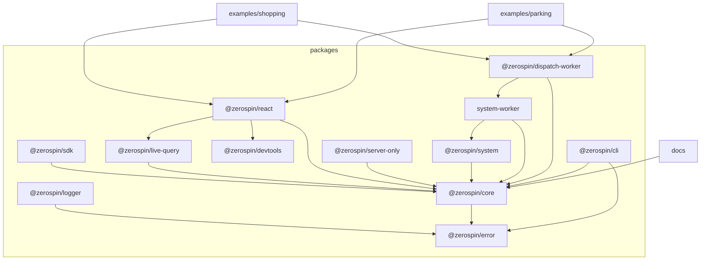

# Zerospin

## Vendor

`vendor/` contains external repositories vendored with `git subtree`:

| Prefix | Upstream |
| --- | --- |
| `vendor/effect` | `https://github.com/Effect-TS/effect.git` |
| `vendor/morgs32/llm-wiki` | `https://github.com/morgs32/llm-wiki.git` |

`llm-wiki/` is first-party Zerospin-domain guidance (not a subtree).

Each vendor README records its upstream and branch. Use the repository-local
`update-vendor` skill for occasional squashed pulls and pushes. Invoking it
without a target pulls every configured vendor. A push can target one vendor
or all vendors, but it must show the outgoing commits and receive confirmation
before publishing.

## Structure

The workspace contains the public documentation site, reusable packages, and
two runnable examples:



## Package exports and type resolution

- For workspace packages in `packages/` published as `@zerospin/*`, `types` should resolve to `src/*` files (not `dist/*`). This keeps TypeScript and Nx typecheck flows fast while still allowing runtime imports to target build outputs.
- Our `build` / `lib` task wiring already handles dependency ordering, so dependent package build/lib tasks run first before consumers.
- `@zerospin/cli` is intentionally different: it does not define package `exports` and is consumed through its `bin` entry.

## Development

Install the pinned workspace dependencies, then run the documentation site:

```bash
pnpm install
pnpm dev
```

`pnpm dev` delegates to `NX_DAEMON=false nx run docs:dev`. Run package and
example targets directly through Nx, for example `nx run shopping:dev` or
`nx run parking:ts`.

The example Workers require local environment files. Copy the value-free
templates before running them and supply your own credentials:

```bash
cp examples/parking/.env.example examples/parking/.env
cp examples/parking/.env.e2e.example examples/parking/.env.e2e
cp examples/shopping/.env.example examples/shopping/.env
cp examples/shopping/.env.e2e.example examples/shopping/.env.e2e
```

Never commit populated `.env` files. Any credential previously committed in an
environment file must be rotated before this repository is made public.
