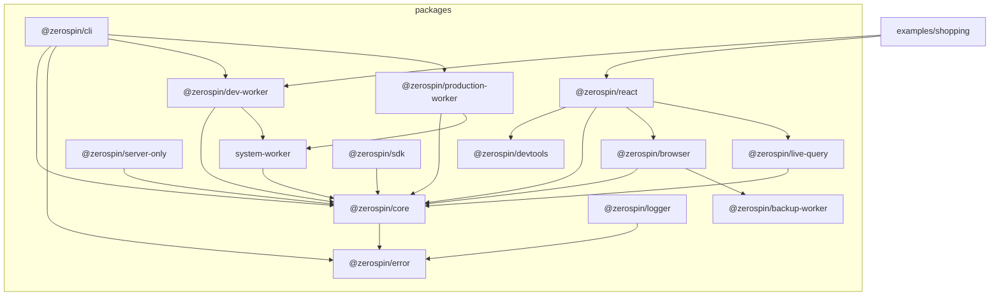

# Zerospin

## Vendor

`vendor/` contains external repositories vendored with `git subtree`. Consumer
origin of record is this README:

| Prefix          | Origin                                    | Branch |
| --------------- | ----------------------------------------- | ------ |
| `vendor/effect` | `https://github.com/Effect-TS/effect.git` | `main` |

Shared code-shape guidance is provided by the globally installed `$patterns`
skill. `wiki/` is first-party Zerospin-domain guidance (not a subtree).

Follow [update-vendor](../wip/skills/update-vendor/SKILL.md) for vendor
ownership and subtree operations.

## Structure

The workspace contains the public documentation site, reusable packages, and
the runnable Shopping example:


```mermaid
flowchart TD
  subgraph packagesLayer["packages"]
    errorPkg["@zerospin/error"]
    corePkg["@zerospin/core"]
    browserPkg["@zerospin/browser"]
    backupWorkerPkg["@zerospin/backup-worker"]
    systemWorkerPkg["system-worker"]
    devWorkerPkg["@zerospin/dev-worker"]
    productionWorkerPkg["@zerospin/production-worker"]
    loggerPkg["@zerospin/logger"]
    serverOnlyPkg["@zerospin/server-only"]
    devtoolsPkg["@zerospin/devtools"]
    liveQueryPkg["@zerospin/live-query"]
    cliPkg["@zerospin/cli"]
    reactPkg["@zerospin/react"]
    sdkPkg["@zerospin/sdk"]
  end

  shopping["examples/shopping"]

  shopping --> devWorkerPkg
  shopping --> reactPkg

  cliPkg --> corePkg
  cliPkg --> errorPkg
  corePkg --> errorPkg
  cliPkg --> devWorkerPkg
  cliPkg --> productionWorkerPkg
  devWorkerPkg --> corePkg
  devWorkerPkg --> systemWorkerPkg
  productionWorkerPkg --> corePkg
  productionWorkerPkg --> systemWorkerPkg
  systemWorkerPkg --> corePkg
  browserPkg --> corePkg
  browserPkg --> backupWorkerPkg
  loggerPkg --> errorPkg
  serverOnlyPkg --> corePkg
  reactPkg --> devtoolsPkg
  reactPkg --> corePkg
  reactPkg --> browserPkg
  reactPkg --> liveQueryPkg
  liveQueryPkg --> corePkg
  sdkPkg --> corePkg
```

### Workers and configuration

- `@zerospin/browser` owns the SharedWorker used by synchronized browser sessions.
  Applications create its entrypoint with `makeSharedWorker`.
- `@zerospin/backup-worker` provides the separate IndexedDB backup worker used by
  standalone browser sessions. Its Vite plugin serves the worker and SQLite WASM.
- `@zerospin/dev-worker` provides the CLI's local Worker entrypoint, generated
  Wrangler configuration, and public workerd testing helpers.
- `@zerospin/production-worker` provides the CLI's deployment entrypoint, including
  production key checks and Worker version response metadata.
- `system-worker` implements the server APIs and Durable Objects used by both
  backend entrypoints.

`config` is a build-time module alias to the selected application's configuration,
not a workspace package. Worker typechecks use the small configuration fixture in
`@zerospin/fixtures`; Wrangler resolves the alias to the application's module.

## Package exports and type resolution

- Package exports generally resolve declarations and runtime imports to `dist/*`.
  TypeScript project references and Nx build prerequisites provide those outputs.
- `@zerospin/dev-worker` and `@zerospin/production-worker` intentionally expose
  compiled `dist/*` entrypoints because the CLI passes their resolved Worker
  modules to Wrangler. Their Nx dependency graph builds those outputs before
  consumers run.
- Our `build` / `lib` task wiring already handles dependency ordering, so dependent package build/lib tasks run first before consumers.
- `@zerospin/cli` is intentionally different: it does not define package `exports` and is consumed through its `bin` entry.

## Development

Install the pinned workspace dependencies, then run an example target:

```bash
pnpm install
pnpm nx run shopping:dev
```

The documentation site lives in `zerospin-cloud/apps/docs`. Run package and
example targets directly through Nx, for example `nx run shopping:dev` or
`nx run parking:ts`.

The example Workers require local environment files. Copy the value-free
templates before running them and supply your own credentials:

```bash
cp examples/shopping/.env.example examples/shopping/.env
cp examples/shopping/.env.e2e.example examples/shopping/.env.e2e
```

Never commit populated `.env` files. Any credential previously committed in an
environment file must be rotated before this repository is made public.

## Browser persistence reset

Plan 056 starts a new browser-persistence epoch. If Zerospin reports
`browser-persistence-reset-required`, close every Zerospin page for that origin
and confirm its Zerospin SharedWorker has stopped. Then run this in DevTools for
that same origin:

```js
for (const { name } of await indexedDB.databases()) {
  if (name?.startsWith('zerospin/')) {
    await new Promise((resolve, reject) => {
      const request = indexedDB.deleteDatabase(name);
      request.onsuccess = () => resolve();
      request.onerror = () => reject(request.error);
      request.onblocked = () =>
        reject(new Error(`Close every old Zerospin page and worker: ${name}`));
    });
  }
}

for (const key of Object.keys(localStorage)) {
  if (key.startsWith('zerospin:')) localStorage.removeItem(key);
}
```

Reload and authenticate again. This deletes only origin-local IndexedDB
databases whose names begin with `zerospin/` and `localStorage` keys beginning
with `zerospin:`. It does not reset remote/server state or unrelated origin
storage.

## Production Durable Object cutover

The first deployment that consolidates lifecycle state into
`SystemRepo(systemId)` requires a fresh remote Worker lifecycle. Reset the
existing pre-cutover Worker or deploy under a new Worker name before running
`zerospin deploy`. `--clean` starts a detached, predecessor-free
generation inside SystemRepo; it does not reset Cloudflare's Durable Object
class-migration history.
