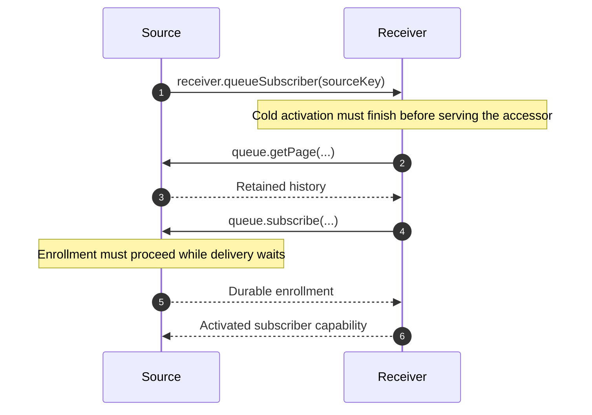

# makeFanoutQueue

`makeFanoutQueue` delivers one durable source history to independently tracked
subscribers. The source owns retained rows and delivery acknowledgements. Each
receiver owns its committed cursor and the state produced by replaying those
rows. See the [factory](./makeFanoutQueue.ts) and
[subscriber factory](../makeFanoutSubscriber/makeFanoutSubscriber.ts).

## Binding and interfaces

An owner supplies its database/schema, entries table and numeric index column,
subscriber table, receiver name utilities/lookup, owner key, concurrency, and
inherited alarm registry. Optional `subscribersWhere` predicates further restrict
eligible destinations, such as excluding invalidated materializers.

The owner exposes one queue through a prototype getter. Its RPC methods are
`getPage({ afterIndex, maxIndex? })` and
`subscribe(receiverKey & { currentIndex })`. Local `drain(): Promise<void>`
starts immediately; it is not a queue RPC or an enqueue API. The source retains
pending work in its own tables before asking the queue to deliver it.

Receiver identities are formatted from the supplied receiver key. Delivery
parses that persisted name, resolves the receiver, and calls its
`${queueName}Subscriber(sourceKey)` accessor with the source owner's key.
The accessor validates the source before returning a bound capability.

## Catch up, then enroll

The two `subscribe` methods do different work:

1. **`subscriber.subscribe(index?)`** catches up through the requested bound, or
   through the first observed source tip. It applies pages using the receiver's
   normal `receive` Effect, rereads durable progress, and then calls the source
   queue's enrollment RPC.
2. **`queue.subscribe(...)`** durably enrolls the receiver cursor and starts a
   drain. It returns after enrollment, without waiting for delivery.

An unbounded `catchup()` still captures one finite destination. Later page tips
cannot keep extending it. `getPage` returns at most 64 complete rows after the
exclusive cursor and through the optional inclusive bound; `lastIndex` reports
the whole retained source tip. The envelope tip is never an acknowledgement.

Retained source rows close the gap between catch-up and enrollment: a row
appended during that handoff remains available for the ensuing drain. Failed
catch-up does not enroll. Reconstructing a subscriber resumes committed progress.
See [handoff and interruption tests](../makeFanoutSubscriber/makeFanoutSubscriber.node.spec.ts).

Repos call `subscriber.subscribe()` during `onDOActivation()`. Subsequent reads
use `catchup()` when they need fresh or bounded state. Service dependencies come
from the selected aggregate snapshot; enrolling a resource later is distinct
from subscribing to its service feed. See [Repo activation](../makeDORepo/README.md).

## Why enrollment cannot take the drain semaphore

Drain serialization protects delivery scheduling while remote receipt is pending.
Sharing that semaphore with enrollment would introduce this cycle:

Enrollment instead uses a short local transaction, independently of the drain
semaphore. It checks retained failure and inserts or advances the cursor
atomically. Enrollment and delivery acknowledgements use monotonic cursor
updates: an older in-flight acknowledgement cannot overwrite newer catch-up
progress, and repeated subscription cannot rewind acknowledged history.

Delivery remains serialized. Pending receiver identities are excluded before
the concurrency limit; completed receivers free slots for the next oldest
unfailed destination. Every delivery keeps its own immutable page slice.
The [queue tests](./makeFanoutQueue.node.spec.ts) cover reentrant activation,
concurrent enrollment/acknowledgement, repeated enrollment, and serialized drains.

## Durable acknowledgement and failures

Successful `receive` acknowledges the last delivered row only after receiver
state commits. A crash after receipt but before acknowledgement can redeliver
that page; receiver replay must recognize committed occurrences. Registration
or a returned page tip does not prove receipt.

Lookup, accessor, delivery, decoding, and acknowledgement-write failures retain
a terminal failure for that subscriber. Healthy subscribers continue. Later
drains exclude failed subscribers, and enrollment rejects them without clearing
the failure. Failure to persist that terminal outcome aborts the drain with its
alarm lease retained. These rules also apply when a receiver's activation fails.

## Alarm ownership and interruption

Construction registers the internal lazy drain Effect with the inherited
registry and starts no delivery. Each dispatch reads the durable tip. Drain
holds its queue-specific lease after acquiring its semaphore, and releases it
when eligible delivery settles. The registry combines outcomes only after all
registered operations settle; it does not resubscribe receivers.

`drainAfter(() => effect)` schedules the recovery alarm before running a lazy,
synchronous producer Effect. It returns the producer result without starting or
waiting for delivery. AC admission uses this boundary around its existing atomic
batch transaction. Service admission and aggregate finalized-command receipt also use it.
Direct aggregate execution and service finalized-result publication retain their
existing scheduling paths.

The callback cannot require `Async` or return a Promise value. Synchronous runtime
execution also rejects suspension and cancels the suspended fiber, preventing later
continuation. This boundary does not roll back arbitrary side effects: the caller's
transaction owns rollback. Scheduling failure prevents callback invocation; callback
failure preserves the alarm and may cause a harmless empty wakeup.

A producer increments an active count before scheduling and advances a revision when
it settles. A drain captures that revision with its persisted-tip read and clears
its lease only if no producer is active and the revision is unchanged. Thus a drain
that read an older tip cannot clear a newer producer's recovery. Admission does not
wait for the delivery semaphore or remote receipts. Termination after commit needs
no finalizer: the alarm already exists, and a cold queue reads durable history.
See the [producer recovery tests](./makeFanoutQueue.node.spec.ts) and
[AC admission tests](../AggregateChain/AggregateChain.node.spec.ts).

Enrollment holds the queue wakeup before committing, then starts delivery. A
finished queue releases only its own lease; other queues may still need the shared
DO alarm.

The factory observes background Promise rejection while returning the original
Promise to awaiting callers. Interrupting an awaiting caller does not cancel
queue-owned delivery. Cold queues reconstruct progress from storage. An empty
eligible suffix waits for a later drain to reread the durable tip.

Further detail: [fanout architecture](../../../../wiki/architecture/server/admitCommands.md#fanout-scheduling-and-terminal-failures)
and [registry tests](../makeAlarmRegistry/makeAlarmRegistry.node.spec.ts).
