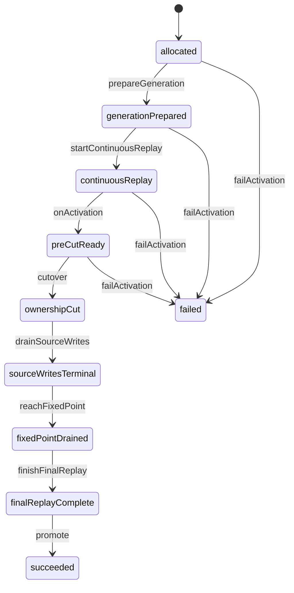

# Linked deploy activation benchmark

This fixture models the durable Zerospin linked-deploy workflow through the
public Machine and State Handle APIs. The durable store is deliberately
separate from the Actor so tests can model a process defect after ownership is
committed but before the State checkpoint advances.

Each scenario constructs a complete Machine with direct State descriptors, its
initial State, and sparse executable routes. It acquires an inert Actor with
`makeActor(machine, { runtime })`, then calls `actor.start()` before dispatching
a Handle command. `getHandle()` reads the current Handle once, while a filtered
`handleStream` subscription waits for a later State. `actor.ready()` confirms
that startup crossed the initial-Handle barrier and began the initial
activation.

## Route placements

| Placement                                            | Returned State         | Trigger                            | Inferred typed failure                                 |
| ---------------------------------------------------- | ---------------------- | ---------------------------------- | ------------------------------------------------------ |
| `allocated.commands.prepareGeneration`               | generation-prepared    | `prepareGeneration()`              | `stale-checkpoint`                                     |
| `generation-prepared.commands.startContinuousReplay` | continuous-replay      | `startContinuousReplay()`          | `stale-checkpoint`                                     |
| `continuous-replay.onActivation`                     | pre-cut-ready          | automatic                          | `never`; impossible stale checkpoints defect           |
| `pre-cut-ready.commands.cutover`                     | ownership-cut          | `cutover({ defectAfterCommit })`   | `stale-checkpoint`                                     |
| `ownership-cut.commands.drainSourceWrites`           | source-writes-terminal | `drainSourceWrites({ interrupt })` | `source-write-drain-interrupted` or `stale-checkpoint` |
| `source-writes-terminal.commands.reachFixedPoint`    | fixed-point-drained    | `reachFixedPoint()`                | `stale-checkpoint`                                     |
| `fixed-point-drained.commands.finishFinalReplay`     | final-replay-complete  | `finishFinalReplay()`              | `stale-checkpoint`                                     |
| `final-replay-complete.commands.promote`             | succeeded              | `promote()`                        | `stale-checkpoint`                                     |
| `*.commands.failActivation` before cutover           | failed                 | `failActivation()`                 | `cutover-already-committed`                            |

The four pre-cutover placements explicitly reuse the same compatible
`failActivation` command object. Each placement remains an ordinary Machine
command and each corresponding Handle exposes its own `failActivation` method.

## Scenarios

1. The happy path invokes Handle commands around
   `continuous-replay.onActivation` and verifies every durable operation in
   order.
2. Pre-cutover failure reaches `failed`; after cutover, the old pre-cut-ready
   Handle rejects with `StateInactive`, while a typed drain failure keeps the
   ownership-cut Handle available for retry.
3. A defect after durable cutover leaves the Actor at pre-cut-ready while the
   store records target ownership. A new Actor starts from the reconciled
   ownership-cut State and completes the workflow.

`makeDeployActivationMachine` returns a complete Machine whose route programs
yield the genuine `DeployStore` capability. Each test builds one
`ManagedRuntime` from `Layer.succeed(DeployStore, store)` and passes that runtime
to `makeActor`. The Actor's owner Fiber runs route invocations against those
shared runtime services; the test interrupts that Fiber before disposing the
runtime. The tests read current snapshots with `getHandle()`, await selected
future States through `handleStream`, and dispatch only through State Handles.
