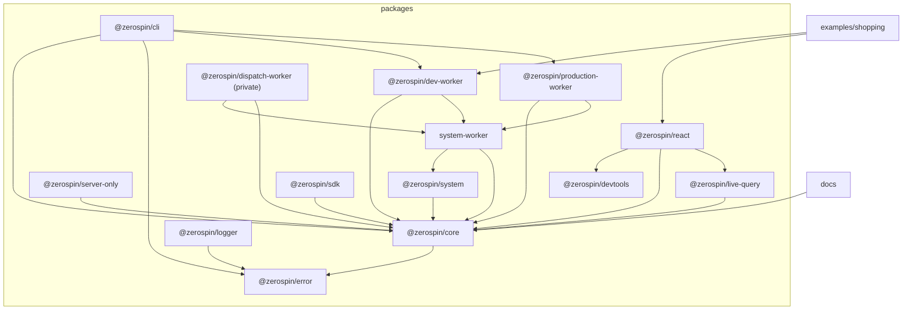

# Zerospin

## Vendor

`vendor/` contains external repositories vendored with `git subtree`:

| Prefix                    | Upstream                                  |
| ------------------------- | ----------------------------------------- |
| `vendor/effect`           | `https://github.com/Effect-TS/effect.git` |
| `vendor/morgs32/llm-wiki` | `https://github.com/morgs32/llm-wiki.git` |

`llm-wiki/` is first-party Zerospin-domain guidance (not a subtree).

Each vendor README records its upstream and branch. Use the repository-local
`update-vendor` skill for occasional squashed pulls and pushes. Invoking it
without a target pulls every configured vendor. A push can target one vendor
or all vendors, but it must show the outgoing commits and receive confirmation
before publishing.

## Structure

The workspace contains the public documentation site, reusable packages, and
the runnable Shopping example:



## Package exports and type resolution

- For ordinary workspace libraries in `packages/` published as `@zerospin/*`,
  `types` should resolve to `src/*` files (not `dist/*`). This keeps TypeScript
  and Nx typecheck flows fast while still allowing runtime imports to target
  build outputs.
- `@zerospin/dev-worker` and `@zerospin/production-worker` intentionally expose
  compiled `dist/*` entrypoints because the CLI passes their resolved Worker
  modules to Wrangler. Their Nx dependency graph builds those outputs before
  consumers run.
- Our `build` / `lib` task wiring already handles dependency ordering, so dependent package build/lib tasks run first before consumers.
- `@zerospin/cli` is intentionally different: it does not define package `exports` and is consumed through its `bin` entry.

## Development

Install the pinned workspace dependencies, then run the documentation site:

```bash
pnpm install
pnpm dev
```

`pnpm dev` delegates to `NX_DAEMON=false nx run docs:dev`. Run package and
example targets directly through Nx, for example `nx run shopping:dev` or
`nx run parking:ts`.

The example Workers require local environment files. Copy the value-free
templates before running them and supply your own credentials:

```bash
cp examples/shopping/.env.example examples/shopping/.env
cp examples/shopping/.env.e2e.example examples/shopping/.env.e2e
```

Never commit populated `.env` files. Any credential previously committed in an
environment file must be rotated before this repository is made public.

## Browser persistence reset

Plan 056 starts a new browser-persistence epoch. If Zerospin reports
`browser-persistence-reset-required`, close every Zerospin page for that origin
and confirm its Zerospin SharedWorker has stopped. Then run this in DevTools for
that same origin:

```js
for (const { name } of await indexedDB.databases()) {
  if (name?.startsWith('zerospin/')) {
    await new Promise((resolve, reject) => {
      const request = indexedDB.deleteDatabase(name);
      request.onsuccess = () => resolve();
      request.onerror = () => reject(request.error);
      request.onblocked = () =>
        reject(new Error(`Close every old Zerospin page and worker: ${name}`));
    });
  }
}

for (const key of Object.keys(localStorage)) {
  if (key.startsWith('zerospin:')) localStorage.removeItem(key);
}
```

Reload and authenticate again. This deletes only origin-local IndexedDB
databases whose names begin with `zerospin/` and `localStorage` keys beginning
with `zerospin:`. It does not reset remote/server state or unrelated origin
storage.

## Production Durable Object cutover

The first deployment that consolidates lifecycle state into
`SystemRepo(systemId)` requires a fresh remote Worker lifecycle. Reset the
existing pre-cutover Worker or deploy under a new Worker name before running
`zerospin deploy --wrangler`. `--clean` starts a detached, predecessor-free
generation inside SystemRepo; it does not reset Cloudflare's Durable Object
class-migration history.

## Zerospin subrepo metadata

- Upstream: https://github.com/morgs32/zerospin.git
- Branch: main
