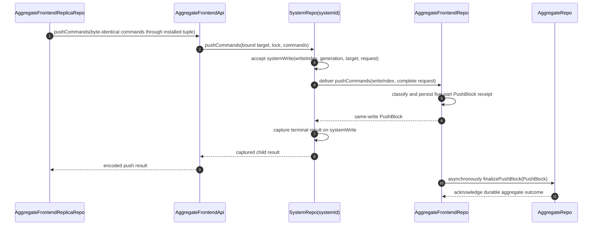

# AggregateFrontendApi

`AggregateFrontendApi` is the independently disposable server capability for
one admitted aggregate frontend. Its private constructor state is exactly
`{ actorRef: { aggregateName, aggregateId, userId }, aggregateFrontendLock,
frontendName, frontendSpec, generationId, systemId, systemVersion,
systemWorkerName }`
([`AggregateFrontendApi.ts:29-64`](../../packages/system-worker/src/AggregateFrontendApi/AggregateFrontendApi.ts#L29-L64)).

The SharedWorker owns the child after acquisition. Its flat public admission
receipt is exactly `{ actorRef, aggregateFrontendLock, frontendName,
frontendSpec, systemId, systemVersion }`; private generation and Worker routing
fields do not cross that receipt
([`AggregateFrontendApi.ts:66-84`](../../packages/system-worker/src/AggregateFrontendApi/AggregateFrontendApi.ts#L66-L84),
[`getAdmission.ts:8-31`](../../packages/system-worker/src/AggregateFrontendApi/getAdmission/getAdmission.ts#L8-L31)).

The child is not registration-owned. One exact
`AggregateFrontendReplicaRepo` owns one sticky runtime tuple
`{ registrationId, ownerToken, authenticatedApi, frontendApi }`:
`registrationId` comes from the Repo allocator, `ownerToken` from the owning
SharedWorker port, `authenticatedApi` from that port's current authentication
result, and `frontendApi` from exact child authorization plus admission. A
registration retains its sink, mode, owner token, and current-root callbacks,
but no child capability or authentication promise
([`AggregateFrontendReplicaRepo.ts:188-243`](../../packages/shared-worker/src/SharedWorker/AggregateFrontendReplicaRepo/AggregateFrontendReplicaRepo.ts#L188-L243),
[`AggregateFrontendReplicaRepo.ts:1651-1801`](../../packages/shared-worker/src/SharedWorker/AggregateFrontendReplicaRepo/AggregateFrontendReplicaRepo.ts#L1651-L1801)).

## Annotated workflow steps

1. The SharedWorker reads staged journal rows in `replicaIndex` order, requires
   an online registration, ensures that the Repo has one installed `{
registrationId, ownerToken, authenticatedApi, frontendApi }` tuple, captures
   it, and sends the complete encoded array through that child.
   The first call has the three-attempt default retry schedule. A
   non-definitive exhaustion refreshes only the child authority, preserves
   local state, and runs one further bounded schedule with the same command
   array
   ([`AggregateFrontendReplicaRepo.ts:2816-3008`](../../packages/shared-worker/src/SharedWorker/AggregateFrontendReplicaRepo/AggregateFrontendReplicaRepo.ts#L2816-L3008),
   [`AggregateFrontendReplicaRepo.ts:3013-3048`](../../packages/shared-worker/src/SharedWorker/AggregateFrontendReplicaRepo/AggregateFrontendReplicaRepo.ts#L3013-L3048),
   [`defaultRetrySchedule.ts:1-6`](../../packages/core/src/utils/defaultRetrySchedule.ts#L1-L6)).
2. `AggregateFrontendApi.pushCommands` validates that complete shape, resolves
   `SystemRepo` by bound `systemId`, and forwards `{ actorRef, frontendName,
aggregateFrontendLock, commands }`. It deliberately sends no acquired
   `generationId`
   ([`pushCommands.ts:18-72`](../../packages/system-worker/src/AggregateFrontendApi/pushCommands/pushCommands.ts#L18-L72)).
3. In one transaction, `SystemRepo` selects the current writable generation,
   allocates the next positive safe global `writeIndex`, advances both selection
   and generation frontiers, and inserts the complete target and request into
   `systemWrites` before delivery
   ([`pushCommands.ts:81-202`](../../packages/system-worker/src/SystemRepo/pushCommands/pushCommands.ts#L81-L202),
   [`SystemRepo.ts:314-349`](../../packages/system-worker/src/SystemRepo/SystemRepo.ts#L314-L349)).
4. The durable drain groups rows by the exact generation-qualified
   `AggregateFrontendRepo` target and delivers each lane in `writeIndex` order.
   A cold alarm reads the same unresolved rows, so lost result capture does not
   lose the accepted write
   ([`drainSystemWrites.ts:157-289`](../../packages/system-worker/src/SystemRepo/drainSystemWrites/drainSystemWrites.ts#L157-L289),
   [`drainSystemWrites.ts:357-417`](../../packages/system-worker/src/SystemRepo/drainSystemWrites/drainSystemWrites.ts#L357-L417),
   [`SystemRepo.ts:941-963`](../../packages/system-worker/src/SystemRepo/SystemRepo.ts#L941-L963)).
5. `AggregateFrontendRepo` validates target, lock, `writeIndex`, strict incoming
   replica order, and stable request bytes. It reuses an identical same-write
   receipt or classifies every command exactly once, then persists one
   `PushBlock` with `pendingCommands`, `pushedCommands`, `executedCommands`,
   `failedStagedCommands`, and `failedPushedCommands`
   ([`pushCommands.ts:80-223`](../../packages/system-worker/src/AggregateFrontendRepo/pushCommands/pushCommands.ts#L80-L223),
   [`pushCommands.ts:317-629`](../../packages/system-worker/src/AggregateFrontendRepo/pushCommands/pushCommands.ts#L317-L629)).
6. The child returns that complete same-write `PushBlock`; redelivery of the
   same `writeIndex` and request bytes returns the retained receipt without
   repeating command admission
   ([`pushCommands.ts:195-223`](../../packages/system-worker/src/AggregateFrontendRepo/pushCommands/pushCommands.ts#L195-L223),
   [`AggregateFrontendRepo.ts:529-560`](../../packages/system-worker/src/AggregateFrontendRepo/AggregateFrontendRepo.ts#L529-L560)).
7. `SystemRepo` records the encoded terminal success or domain failure on the
   unresolved journal row. A testable interruption between child commit and
   capture leaves the row unresolved for retry instead of acknowledging it
   ([`drainSystemWrites.ts:551-613`](../../packages/system-worker/src/SystemRepo/drainSystemWrites/drainSystemWrites.ts#L551-L613)).
8. The public call reads only the captured result for its accepted
   `writeIndex`; a captured failure is replayed as the public failure
   ([`pushCommands.ts:204-260`](../../packages/system-worker/src/SystemRepo/pushCommands/pushCommands.ts#L204-L260)).
9. The API re-encodes that settled result for the SharedWorker replica
   ([`pushCommands.ts:55-72`](../../packages/system-worker/src/AggregateFrontendApi/pushCommands/pushCommands.ts#L55-L72)).
10. Independently of the public response, `AggregateFrontendRepo` drains
    unfinalized `PushBlock` rows in `writeIndex` order to the exact
    generation-qualified `AggregateRepo.finalizePushBlock`
    ([`AggregateFrontendRepo.ts:553-558`](../../packages/system-worker/src/AggregateFrontendRepo/AggregateFrontendRepo.ts#L553-L558),
    [`drainPushBlockOutbox.ts:43-101`](../../packages/system-worker/src/AggregateFrontendRepo/drainPushBlockOutbox/drainPushBlockOutbox.ts#L43-L101)).
11. Only successful AggregateRepo acknowledgement stamps `finalizedAt`; an
    exhausted failure is retained on that row and blocks later PushBlocks for
    the same aggregate lane
    ([`drainPushBlockOutbox.ts:102-176`](../../packages/system-worker/src/AggregateFrontendRepo/drainPushBlockOutbox/drainPushBlockOutbox.ts#L102-L176),
    [`finalizePushBlock.ts:75-177`](../../packages/system-worker/src/AggregateRepo/finalizePushBlock/finalizePushBlock.ts#L75-L177)).

## Acquisition and exact admission

1. `AuthenticatedApi.getAggregateFrontendApi` accepts exactly `{ aggregateId,
aggregateName, frontendName, aggregateFrontendLock }`. Its private
   authentication supplies `generationId`, `systemId`, `systemWorkerName`, and
   `userId`
   ([`AuthenticatedApi.ts:75-90`](../../packages/system-worker/src/AuthenticatedApi/AuthenticatedApi.ts#L75-L90),
   [`getAggregateFrontendApi.ts:21-37`](../../packages/system-worker/src/AuthenticatedApi/getAggregateFrontendApi/getAggregateFrontendApi.ts#L21-L37)).
2. `SystemWorker.authorizeAggregateFrontend` lets `AggregateRepo` authorize the
   exact `{ aggregateName, aggregateId, userId, frontendName }` target and
   complete lock
   ([`getAggregateFrontendApi.ts:61-85`](../../packages/system-worker/src/AuthenticatedApi/getAggregateFrontendApi/getAggregateFrontendApi.ts#L61-L85),
   [`authorizeAggregateFrontend.ts:18-92`](../../packages/system-worker/src/authorizeAggregateFrontend/authorizeAggregateFrontend.ts#L18-L92)).
3. The parent rejects mismatched actor identity, spec kind/name, or canonical
   lock key before constructing the child. Acquisition failure instead returns
   `AggregateFrontendApiFailure`, whose leaves replay the captured error
   ([`getAggregateFrontendApi.ts:86-125`](../../packages/system-worker/src/AuthenticatedApi/getAggregateFrontendApi/getAggregateFrontendApi.ts#L86-L125),
   [`AggregateFrontendApiFailure.ts:15-61`](../../packages/system-worker/src/AggregateFrontendApi/AggregateFrontendApiFailure/AggregateFrontendApiFailure.ts#L15-L61)).
4. Before any child authorization, acquisition validates the requested spec
   target, byte-exact lock, and derived lock key, then serializes the exact
   locator and runtime lookup. An existing runtime acquires or promotes the
   registration before authority repair; an `existing-only` miss or activating
   runtime fails locally
   ([`acquireAggregateFrontendReplica.ts:101-145`](../../packages/shared-worker/src/SharedWorker/UserPartitionRepo/acquireAggregateFrontendReplica/acquireAggregateFrontendReplica.ts#L101-L145),
   [`acquireAggregateFrontendReplica.ts:146-277`](../../packages/shared-worker/src/SharedWorker/UserPartitionRepo/acquireAggregateFrontendReplica/acquireAggregateFrontendReplica.ts#L146-L277)).
5. With no runtime, `online` uses `create-or-open`, while `existing-only` uses
   `existing-only`, validates the exact physical schema and metadata, skips
   migration, and reads only the local snapshot. Missing local bytes map to
   `cached-aggregate-frontend-replica-unavailable`; incompatible non-empty
   bytes require a persistence reset
   ([`acquireAggregateFrontendReplica.ts:319-490`](../../packages/shared-worker/src/SharedWorker/UserPartitionRepo/acquireAggregateFrontendReplica/acquireAggregateFrontendReplica.ts#L319-L490),
   [`acquireAggregateFrontendReplica.ts:566-570`](../../packages/shared-worker/src/SharedWorker/UserPartitionRepo/acquireAggregateFrontendReplica/acquireAggregateFrontendReplica.ts#L566-L570)).
6. A first online open constructs an unpublished runtime in `activating`, adds
   its registration, and begins authority selection. After full admission
   validation, the Repo installs
   `{ registrationId, ownerToken, authenticatedApi, frontendApi }` before
   calling `getState()`. The same tuple, selection attempt, live registration,
   and current parent are checked before invocation, after the result, and on
   both sides of the initial resource-and-metadata transaction
   ([`acquireAggregateFrontendReplica.ts:492-567`](../../packages/shared-worker/src/SharedWorker/UserPartitionRepo/acquireAggregateFrontendReplica/acquireAggregateFrontendReplica.ts#L492-L567),
   [`AggregateFrontendReplicaRepo.ts:1651-1801`](../../packages/shared-worker/src/SharedWorker/AggregateFrontendReplicaRepo/AggregateFrontendReplicaRepo.ts#L1651-L1801),
   [`AggregateFrontendReplicaRepo.ts:1856-1979`](../../packages/shared-worker/src/SharedWorker/AggregateFrontendReplicaRepo/AggregateFrontendReplicaRepo.ts#L1856-L1979),
   [`AggregateFrontendReplicaRepo.ts:868-959`](../../packages/shared-worker/src/SharedWorker/AggregateFrontendReplicaRepo/AggregateFrontendReplicaRepo.ts#L868-L959)).
7. Only after activation commits does acquisition persist a new locator and
   publish the runtime. An unpublished failure releases only a newly appended
   registration and closes SQLite plus the VFS; it does not delete browser
   database bytes
   ([`acquireAggregateFrontendReplica.ts:571-610`](../../packages/shared-worker/src/SharedWorker/UserPartitionRepo/acquireAggregateFrontendReplica/acquireAggregateFrontendReplica.ts#L571-L610)).
8. A usable installed tuple remains sticky. With none installed, the Repo walks
   online registrations in allocator append order. A transient candidate
   failure excludes that owner for the current selection without releasing its
   sink; explicit transfer can require fresh authentication. An explicit
   unsupported lock or exact admission mismatch terminally fails only this
   exact Repo and does not probe a sibling registration
   ([`AggregateFrontendReplicaRepo.ts:1479-1644`](../../packages/shared-worker/src/SharedWorker/AggregateFrontendReplicaRepo/AggregateFrontendReplicaRepo.ts#L1479-L1644),
   [`AggregateFrontendReplicaRepo.ts:1812-1847`](../../packages/shared-worker/src/SharedWorker/AggregateFrontendReplicaRepo/AggregateFrontendReplicaRepo.ts#L1812-L1847),
   [`AggregateFrontendReplicaRepo.ts:1992-2026`](../../packages/shared-worker/src/SharedWorker/AggregateFrontendReplicaRepo/AggregateFrontendReplicaRepo.ts#L1992-L2026)).
9. State, ticket, socket, and push paths capture the installed tuple, selection
   attempt, live registration, current parent, and any operation-specific
   frontier or socket. Late callbacks cannot replace state, open a socket, or
   commit push results after any captured identity changes
   ([`AggregateFrontendReplicaRepo.ts:1856-1979`](../../packages/shared-worker/src/SharedWorker/AggregateFrontendReplicaRepo/AggregateFrontendReplicaRepo.ts#L1856-L1979),
   [`AggregateFrontendReplicaRepo.ts:2082-2474`](../../packages/shared-worker/src/SharedWorker/AggregateFrontendReplicaRepo/AggregateFrontendReplicaRepo.ts#L2082-L2474),
   [`AggregateFrontendReplicaRepo.ts:2931-3119`](../../packages/shared-worker/src/SharedWorker/AggregateFrontendReplicaRepo/AggregateFrontendReplicaRepo.ts#L2931-L3119)).
10. Reacquiring online from the same port promotes its existing registration in
    place and disposes only the temporary duplicate sink stub. Releasing the
    selected registration invalidates the tuple and socket immediately; a
    remaining online registration receives a forced-fresh replacement, while
    zero online registrations detach all server authority but preserve local
    availability
    ([`AggregateFrontendReplicaRepo.ts:1198-1280`](../../packages/shared-worker/src/SharedWorker/AggregateFrontendReplicaRepo/AggregateFrontendReplicaRepo.ts#L1198-L1280),
    [`AggregateFrontendReplicaRepo.ts:1332-1398`](../../packages/shared-worker/src/SharedWorker/AggregateFrontendReplicaRepo/AggregateFrontendReplicaRepo.ts#L1332-L1398)).

## Receiver-relative leaves

1. `getAdmission()` returns the flat admission receipt and performs no owner or
   transport work
   ([`getAdmission.ts:8-31`](../../packages/system-worker/src/AggregateFrontendApi/getAdmission/getAdmission.ts#L8-L31)).
2. `getState()` takes zero arguments and uses bound `{ generationId, actorRef,
frontendName, aggregateFrontendLock, systemWorkerName }`
   ([`getState.ts:19-66`](../../packages/system-worker/src/AggregateFrontendApi/getState/getState.ts#L19-L66)).
3. `createWebSocketTicket()` takes zero arguments and uses the same
   generation-specific read route
   ([`createWebSocketTicket.ts:19-70`](../../packages/system-worker/src/AggregateFrontendApi/createWebSocketTicket/createWebSocketTicket.ts#L19-L70)).
4. `executeAggregateQuery` and `executeServiceQuery` retain the admitted actor,
   lock, frontend, generation, and Worker route while accepting only query
   selection and parameters from the caller
   ([`executeAggregateQuery.ts:18-71`](../../packages/system-worker/src/AggregateFrontendApi/executeAggregateQuery/executeAggregateQuery.ts#L18-L71),
   [`executeServiceQuery.ts:18-77`](../../packages/system-worker/src/AggregateFrontendApi/executeServiceQuery/executeServiceQuery.ts#L18-L77)).
5. `pushCommands` alone targets the singleton current-write owner; all state,
   query, ticket, and telemetry work stays on the acquired generation route
   ([`AggregateFrontendApi.ts:83-133`](../../packages/system-worker/src/AggregateFrontendApi/AggregateFrontendApi.ts#L83-L133)).

## Trigger

1. `bootstrapBrowserSession` requests one exact aggregate replica with the
   current `online` or `existing-only` mode and one sink through the
   `{ systemId, userId }`-bound `UserPartitionRepo`, reads the returned local
   state, and opens the sink gate only after applying that state
   ([`bootstrapBrowserSession.ts:235-287`](../../packages/react/src/bootstrapBrowserSession.ts#L235-L287)).
2. Acquisition validates and resolves local catalog/runtime state before any
   child authorization. `existing-only` returns only a ready exact local
   replica; online first activation installs and fences the Repo-owned
   `{ registrationId, ownerToken, authenticatedApi, frontendApi }` tuple before
   state fetch and publishes the locator/runtime only after commit
   ([`acquireAggregateFrontendReplica.ts:101-277`](../../packages/shared-worker/src/SharedWorker/UserPartitionRepo/acquireAggregateFrontendReplica/acquireAggregateFrontendReplica.ts#L101-L277),
   [`acquireAggregateFrontendReplica.ts:492-594`](../../packages/shared-worker/src/SharedWorker/UserPartitionRepo/acquireAggregateFrontendReplica/acquireAggregateFrontendReplica.ts#L492-L594)).
3. When browser transport returns, React reacquires `online` with the same sink.
   The exact Repo promotes that existing registration in place, and React
   disposes only the temporary returned acquisition stub after the promotion
   succeeds
   ([`bootstrapBrowserSession.ts:318-360`](../../packages/react/src/bootstrapBrowserSession.ts#L318-L360),
   [`AggregateFrontendReplicaRepo.ts:1227-1249`](../../packages/shared-worker/src/SharedWorker/AggregateFrontendReplicaRepo/AggregateFrontendReplicaRepo.ts#L1227-L1249)).

## Callers

- [`Universal Authentication`](./Authentication.md)
- [`Frontend WebSocket`](./FrontendWebSocket.md)
- [`Browser Session Bootstrap`](./bootstrapBrowserSession.md)
