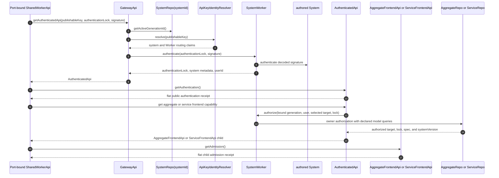

# Universal Authentication

Authentication is System-owned and target-independent. The authored System
authenticator returns `userId`; aggregate and service authorization happen only
afterward in their respective owners. The aggregate logical target is exactly
`{ aggregateName, aggregateId, userId, frontendName }`; the service logical
target is exactly `{ serviceName, userId, frontendName }`
([`authenticate.ts:23-73`](../../packages/system-worker/src/authenticate/authenticate.ts#L23-L73),
[`authorizeAggregateFrontend.ts:21-103`](../../packages/system-worker/src/authorizeAggregateFrontend/authorizeAggregateFrontend.ts#L21-L103),
[`authorizeServiceFrontend.ts:17-83`](../../packages/system-worker/src/authorizeServiceFrontend/authorizeServiceFrontend.ts#L17-L83)).

## Annotated workflow steps

1. The caller sends `{ publishableKey, authenticationLock, signature }` to the
   stable Worker-hosted root
   ([`GatewayApi.ts:71-87`](../../packages/system-worker/src/GatewayApi/GatewayApi.ts#L71-L87)).
2. The gateway asks `SystemRepo` for the active generation. This value is a
   private read/authorization route, not an authenticated identity field
   ([`getAuthenticatedApi.ts:48-58`](../../packages/system-worker/src/GatewayApi/getAuthenticatedApi/getAuthenticatedApi.ts#L48-L58)).
3. The gateway passes the publishable key to the deployment-provided identity
   resolver
   ([`getAuthenticatedApi.ts:59-61`](../../packages/system-worker/src/GatewayApi/getAuthenticatedApi/getAuthenticatedApi.ts#L59-L61)).
4. The resolver supplies `{ systemId, systemEnvironmentId, systemWorkerName,
keyType }`; the gateway rejects any non-publishable key
   ([`ApiKeyIdentityResolver.ts:6-17`](../../packages/system-worker/src/ApiKeyIdentityResolver/ApiKeyIdentityResolver.ts#L6-L17),
   [`getAuthenticatedApi.ts:62-67`](../../packages/system-worker/src/GatewayApi/getAuthenticatedApi/getAuthenticatedApi.ts#L62-L67)).
5. The gateway resolves `SystemWorker(systemWorkerName)` and forwards only the
   authentication lock and signature
   ([`getAuthenticatedApi.ts:68-88`](../../packages/system-worker/src/GatewayApi/getAuthenticatedApi/getAuthenticatedApi.ts#L68-L88)).
6. `SystemWorker.authenticate` validates the retained signature definition,
   adapts the payload when required, and invokes the statically imported
   authored authenticator
   ([`authenticate.ts:23-59`](../../packages/system-worker/src/authenticate/authenticate.ts#L23-L59)).
7. The authored authenticator contributes `userId`; the worker returns exactly
   `{ authenticationLock, systemName, systemVersion, userId }`
   ([`authenticate.ts:57-73`](../../packages/system-worker/src/authenticate/authenticate.ts#L57-L73)).
8. After validating non-empty `userId` and exact lock equality, the gateway
   constructs `AuthenticatedApi` with private `{ authenticationLock,
generationId, systemId, systemName, systemVersion, systemWorkerName,
userId }`
   ([`getAuthenticatedApi.ts:89-119`](../../packages/system-worker/src/GatewayApi/getAuthenticatedApi/getAuthenticatedApi.ts#L89-L119),
   [`AuthenticatedApi.ts:24-54`](../../packages/system-worker/src/AuthenticatedApi/AuthenticatedApi.ts#L24-L54)).
9. Worker-side authentication calls the receiver-relative
   `getAuthentication()` leaf after acquiring the root capability
   ([`authenticate.ts:60-89`](../../packages/frontend/src/authenticate.ts#L60-L89)).
10. The flat public receipt is exactly `{ authenticationLock, systemId,
systemName, systemVersion, userId }`; it excludes `generationId` and
    `systemWorkerName`
    ([`AuthenticatedApi.ts:56-73`](../../packages/system-worker/src/AuthenticatedApi/AuthenticatedApi.ts#L56-L73),
    [`getAuthentication.ts:7-23`](../../packages/system-worker/src/AuthenticatedApi/getAuthentication/getAuthentication.ts#L7-L23)).
11. Aggregate acquisition supplies `{ aggregateId, aggregateName, frontendName,
aggregateFrontendLock }`; service acquisition supplies `{ serviceName,
frontendName, serviceFrontendLock }`
    ([`AuthenticatedApi.ts:73-94`](../../packages/system-worker/src/AuthenticatedApi/AuthenticatedApi.ts#L73-L94)).
12. `AuthenticatedApi` adds its private `generationId`, `userId`, and
    `systemWorkerName` route before calling the matching SystemWorker owner
    authorization
    ([`getAggregateFrontendApi.ts:61-85`](../../packages/system-worker/src/AuthenticatedApi/getAggregateFrontendApi/getAggregateFrontendApi.ts#L61-L85),
    [`getServiceFrontendApi.ts:53-76`](../../packages/system-worker/src/AuthenticatedApi/getServiceFrontendApi/getServiceFrontendApi.ts#L53-L76)).
13. `AggregateRepo` or `ServiceRepo` invokes the authored owner callback with
    synchronous queries for only that owner's declared models
    ([`AggregateRepo/authorizeAggregateFrontend.ts:34-73`](../../packages/system-worker/src/AggregateRepo/authorizeAggregateFrontend/authorizeAggregateFrontend.ts#L34-L73),
    [`ServiceRepo/authorizeServiceFrontend.ts:23-61`](../../packages/system-worker/src/ServiceRepo/authorizeServiceFrontend/authorizeServiceFrontend.ts#L23-L61)).
14. Aggregate authorization returns `{ actorRef, aggregateFrontendLock,
frontendSpec, systemVersion }`; service authorization returns `{ userId,
serviceFrontendLock, frontendSpec, systemVersion }`
    ([`authorizeAggregateFrontend.ts:97-102`](../../packages/system-worker/src/authorizeAggregateFrontend/authorizeAggregateFrontend.ts#L97-L102),
    [`authorizeServiceFrontend.ts:77-82`](../../packages/system-worker/src/authorizeServiceFrontend/authorizeServiceFrontend.ts#L77-L82)).
15. `AuthenticatedApi` independently checks the returned target, spec kind, and
    canonical lock key before constructing the separately disposable child
    capability
    ([`getAggregateFrontendApi.ts:86-125`](../../packages/system-worker/src/AuthenticatedApi/getAggregateFrontendApi/getAggregateFrontendApi.ts#L86-L125),
    [`getServiceFrontendApi.ts:77-114`](../../packages/system-worker/src/AuthenticatedApi/getServiceFrontendApi/getServiceFrontendApi.ts#L77-L114)).
16. The exact aggregate or service Repo calls the returned child's
    receiver-relative `getAdmission()` leaf before installing its one selected
    child capability
    ([`AggregateFrontendReplicaRepo.ts:1686-1809`](../../packages/shared-worker/src/SharedWorker/AggregateFrontendReplicaRepo/AggregateFrontendReplicaRepo.ts#L1686-L1809),
    [`ServiceFrontendReplicaRepo.ts:716-830`](../../packages/shared-worker/src/SharedWorker/ServiceFrontendReplicaRepo/ServiceFrontendReplicaRepo.ts#L716-L830)).
17. Aggregate admission is exactly `{ actorRef, aggregateFrontendLock,
frontendName, frontendSpec, systemId, systemVersion }`; service admission is
    exactly `{ userId, serviceName, frontendName, serviceFrontendLock,
frontendSpec, systemId, systemVersion }`
    ([`AggregateFrontendApi.ts:66-84`](../../packages/system-worker/src/AggregateFrontendApi/AggregateFrontendApi.ts#L66-L84),
    [`ServiceFrontendApi.ts:56-75`](../../packages/system-worker/src/ServiceFrontendApi/ServiceFrontendApi.ts#L56-L75)).

## Exact boundary ownership

1. The source-selected frontend supplies aggregate/service names, the exact
   frontend spec, and the complete lock. Provider selection supplies
   `aggregateId` for an aggregate target. The port's worker-side authentication
   supplies `userId`
   ([`makeZerospinApp.tsx:269-324`](../../packages/react/src/makeZerospinApp.tsx#L269-L324),
   [`bootstrapBrowserSession.ts:56-81`](../../packages/react/src/bootstrapBrowserSession.ts#L56-L81),
   [`bootstrapBrowserServiceSession.ts:40-56`](../../packages/react/src/bootstrapBrowserServiceSession.ts#L40-L56)).
2. `{ systemId, userId }` belongs to the parent `UserPartitionRepo` binding.
   Neither value is caller-selectable in an aggregate/service replica
   acquisition request
   ([`acquireUserPartitionRepo.ts:59-101`](../../packages/shared-worker/src/acquireUserPartitionRepo.ts#L59-L101),
   [`UserPartitionRepo.ts:30-75`](../../packages/shared-worker/src/SharedWorker/UserPartitionRepo/UserPartitionRepo.ts#L30-L75)).
3. The SharedWorker checks returned `systemId`, exact logical target, lock key,
   and byte-exact spec. It disposes rejected children before reporting an
   admission mismatch
   ([`AggregateFrontendReplicaRepo.ts:1686-1827`](../../packages/shared-worker/src/SharedWorker/AggregateFrontendReplicaRepo/AggregateFrontendReplicaRepo.ts#L1686-L1827),
   [`ServiceFrontendReplicaRepo.ts:716-858`](../../packages/shared-worker/src/SharedWorker/ServiceFrontendReplicaRepo/ServiceFrontendReplicaRepo.ts#L716-L858)).
4. Child `systemVersion` is admitted metadata from the selected authored
   frontend. It is intentionally not required to equal the root authentication
   receipt's `systemVersion`
   ([`getAggregateFrontendApi.ts:107-119`](../../packages/system-worker/src/AuthenticatedApi/getAggregateFrontendApi/getAggregateFrontendApi.ts#L107-L119),
   [`getServiceFrontendApi.ts:95-108`](../../packages/system-worker/src/AuthenticatedApi/getServiceFrontendApi/getServiceFrontendApi.ts#L95-L108)).

## SharedWorker ownership

The production page supplies a callable signature capability, not an
`AuthenticatedApi`. Each accepted MessagePort receives its own initially
unbound `SharedWorkerApi` and `ownerToken`; the host URL contains only
`apiUrl`, `publishableKey`, and `wasmUrl`
([`makeZerospinApp.tsx:206-242`](../../packages/react/src/makeZerospinApp.tsx#L206-L242),
[`acquireUserPartitionRepo.ts:223-246`](../../packages/shared-worker/src/acquireUserPartitionRepo.ts#L223-L246),
[`startSharedWorker.ts:103-132`](../../packages/shared-worker/src/SharedWorker/startSharedWorker.ts#L103-L132)).

The port binds once to `{ systemName, authenticationLock, generateSignature }`
and owns `{ systemId, userId, systemName }`, its current root, one pending
authentication attempt, and its terminal error. The worker invokes the page
capability, performs universal authentication, installs a same-identity root,
and releases the prior root only after replacement succeeds
([`SharedWorkerApi.ts:28-61`](../../packages/shared-worker/src/SharedWorker/SharedWorkerApi/SharedWorkerApi.ts#L28-L61),
[`getUserPartitionRepo.ts:117-162`](../../packages/shared-worker/src/SharedWorker/SharedWorkerApi/getUserPartitionRepo/getUserPartitionRepo.ts#L117-L162),
[`getUserPartitionRepo.ts:164-379`](../../packages/shared-worker/src/SharedWorker/SharedWorkerApi/getUserPartitionRepo/getUserPartitionRepo.ts#L164-L379)).

Each exact Repo owns at most one selected authority with exact
`{ registrationId, ownerToken, authenticatedApi, frontendApi }`. It keeps a
healthy selection sticky, compares the selected root by object identity, and
replaces a stale or failed selection through an eligible port; sibling
registrations do not each retain a child
([`AggregateFrontendReplicaRepo.ts:188-243`](../../packages/shared-worker/src/SharedWorker/AggregateFrontendReplicaRepo/AggregateFrontendReplicaRepo.ts#L188-L243),
[`AggregateFrontendReplicaRepo.ts:1560-1809`](../../packages/shared-worker/src/SharedWorker/AggregateFrontendReplicaRepo/AggregateFrontendReplicaRepo.ts#L1560-L1809),
[`ServiceFrontendReplicaRepo.ts:87-133`](../../packages/shared-worker/src/SharedWorker/ServiceFrontendReplicaRepo/ServiceFrontendReplicaRepo.ts#L87-L133),
[`ServiceFrontendReplicaRepo.ts:579-830`](../../packages/shared-worker/src/SharedWorker/ServiceFrontendReplicaRepo/ServiceFrontendReplicaRepo.ts#L579-L830)).

Definitive authentication rejection or port release enters one ejection
lifecycle: mark the port terminal, clear installable authentication state,
release the current root and retained signature stub, then release every exact
Repo registration carrying that port's `ownerToken`
([`SharedWorkerApi.ts:121-131`](../../packages/shared-worker/src/SharedWorker/SharedWorkerApi/SharedWorkerApi.ts#L121-L131),
[`dispose.ts:26-45`](../../packages/shared-worker/src/SharedWorker/SharedWorkerApi/dispose/dispose.ts#L26-L45)).

## Trigger

1. `makeZerospinApp` resolves one authentication lock and exposes its current
   validated signature callback to the SharedWorker. The page does not call
   `authenticate` and owns no temporary `AuthenticatedApi`
   ([`makeZerospinApp.tsx:206-237`](../../packages/react/src/makeZerospinApp.tsx#L206-L237)).
2. `SharedWorkerApi.getUserPartitionRepo` attempts worker-side authentication
   first. Only the exact five transport/readiness codes may fall back to the
   native locator; callback, signature, configuration, and identity failures do
   not
   ([`getUserPartitionRepo.ts:227-291`](../../packages/shared-worker/src/SharedWorker/SharedWorkerApi/getUserPartitionRepo/getUserPartitionRepo.ts#L227-L291),
   [`getUserPartitionRepo.ts:381-469`](../../packages/shared-worker/src/SharedWorker/SharedWorkerApi/getUserPartitionRepo/getUserPartitionRepo.ts#L381-L469)).
3. The inner RPC returns `{ api, systemId, userId, mode }`; the main-thread
   boundary adds only the local idempotent `release` Effect and returns exact
   `{ api, release, systemId, userId, mode }`
   ([`getUserPartitionRepo.ts:717-737`](../../packages/shared-worker/src/SharedWorker/SharedWorkerApi/getUserPartitionRepo/getUserPartitionRepo.ts#L717-L737),
   [`acquireUserPartitionRepo.ts:328-372`](../../packages/shared-worker/src/acquireUserPartitionRepo.ts#L328-L372)).
4. Each online exact-replica acquisition selects one port-owned root, acquires
   and verifies one child, commits authoritative replacement before
   publication, and closes any still-unowned SQLite database and VFS on failure
   ([`acquireAggregateFrontendReplica.ts:537-610`](../../packages/shared-worker/src/SharedWorker/UserPartitionRepo/acquireAggregateFrontendReplica/acquireAggregateFrontendReplica.ts#L537-L610),
   [`acquireServiceFrontendReplica.ts:498-560`](../../packages/shared-worker/src/SharedWorker/UserPartitionRepo/acquireServiceFrontendReplica/acquireServiceFrontendReplica.ts#L498-L560)).

## Callers

- [`AggregateFrontendApi`](./AggregateFrontendApi.md)
- [`ServiceFrontendApi`](./ServiceFrontendApi.md)
- [`Browser Session Bootstrap`](./bootstrapBrowserSession.md)
