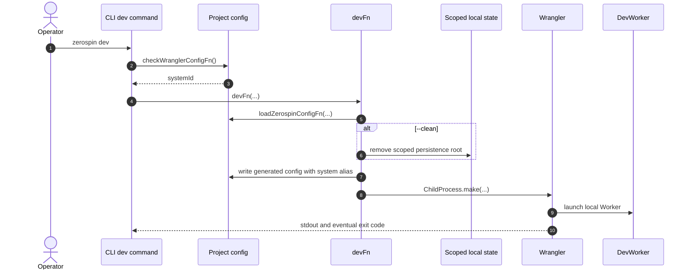

# Authored System and Static Worker

The consumer configuration names one authored System entry and optional seed
modules. It contains no schema-history or deployment-version input.

- [`types.ts:18-26`](../../packages/core/src/system/types.ts#L18-L26) — defines the complete authored configuration shape.
- [`ZerospinConfigSchema.ts:6-35`](../../packages/core/src/system/ZerospinConfigSchema.ts#L6-L35) — strictly decodes only the authored entry and seed paths.
- [`zerospin.jsonc:1-7`](../../examples/shopping/zerospin.jsonc#L1-L7) — Shopping supplies that minimal configuration.

## Deployment invariant

One `systemId` identifies one immutable application deployment into empty
storage. Its code, command contracts, resource models, and physical Repo
schemas do not change. New application code uses a new `systemId` and new
storage; Zerospin has no redeployment, schema-upgrade, or compatibility path
for an existing system.

Each production Repo provisions its current Drizzle schema on the first
activation. The retained `_isBootstrapped` marker makes later Durable Object
cold activations reopen the same unchanged database without performing schema
work.

- [`makeFixedDORepo.ts:23-96`](../../packages/system-worker/src/makeFixedDORepo/makeFixedDORepo.ts#L23-L96) — couples direct Repo identity to provision-once initialization.
- [`makeDORepo.ts:145-187`](../../packages/system-worker/src/makeDORepo/makeDORepo.ts#L145-L187) — owns the bootstrap marker and marks storage only after schema initialization and bootstrap succeed.
- [`SystemRepo.ts:90-119`](../../packages/system-worker/src/SystemRepo/SystemRepo.ts#L90-L119) — applies the same provision-once marker to the singleton SystemRepo.

## Authoring integrity

Factory construction, `makeSystem` assembly, and later lookup are separate
trust steps. A factory proves its own props. `makeSystem` proves factory
provenance of those leaves and snapshots the authored containers. Downstream
code looks up by stamped name and trusts that graph.

Factory integrity decoding runs inside `makeSignature`, `makeModel`,
`makeReplica`, `makeContract`, and `makeFrontendController`. Each factory
strictly decodes its props, then constructs a package-internal canonical class
instance whose fields stay enumerable own properties.

- [`makeSignature.ts:66-83`](../../packages/core/src/authentication/makeSignature.ts#L66-L83) — decodes current and historical signature props before constructing `Signature`.
- [`makeModel.ts:251-288`](../../packages/core/src/models/makeModel.ts#L251-L288) — defines the canonical `Model` class and the replica brand written only by `makeReplica`.
- [`makeReplica.ts:7-17`](../../packages/core/src/models/makeReplica.ts#L7-L17) — requires an authored `Model` instance and rejects nested replicas.
- [`makeContract.ts:256-273`](../../packages/core/src/contracts/makeContract.ts#L256-L273) — decodes contract props, including the mutations/program pairing, before constructing `Contract`.
- [`makeFrontendController.ts:160-163`](../../packages/core/src/frontendController/makeFrontendController.ts#L160-L163) — decodes service frontend props before constructing `ServiceFrontendController`.

`makeSystem` provenance checking does not reconstruct those leaves. It decodes
the complete authored container graph, uses `instanceof` predicates for the
five canonical classes, and resolves services then aggregates from that decoded
snapshot.

- [`decodeSystemProps.ts:38-58`](../../packages/core/src/system/decodeSystemProps.ts#L38-L58) — declares canonical leaf schemas that accept only factory-constructed class instances.
- [`decodeSystemProps.ts:160-170`](../../packages/core/src/system/decodeSystemProps.ts#L160-L170) — strictly decodes the authored system graph and defaults omitted `services` to an empty record.
- [`makeSystem.ts:610-635`](../../packages/core/src/system/makeSystem.ts#L610-L635) — decodes props, builds exclusive source-model ownership, resolves services, resolves aggregates, and returns `ISystem`.
- [`resolveSystemService.ts:73-81`](../../packages/core/src/system/resolveSystemService.ts#L73-L81) — rejects replica models in service ownership through Schema filters.
- [`resolveSystemAggregate.ts:99-124`](../../packages/core/src/system/resolveSystemAggregate.ts#L99-L124) — accepts branded replicas only when they replicate the owning service's exact source model.

Decoded container snapshots are the sole construction input. Returned
models, contracts, and frontends records are not the authored record
identities, so later mutation of those authored records cannot change
`ISystem`. Canonical leaf objects keep reference identity through
`makeSystem`. This is provenance, not tamper detection inside a leaf after
construction.

Downstream lookup-and-trust starts from the completed `ISystem`. DevWorker
and ProductionWorker bind the authored `system` alias and route to
`SystemRepo({ systemId })`. Command and query paths look up contracts,
models, and frontends by stamped name and treat factory-proven leaves as
authoritative.

- [`DevWorker.ts:7-37`](../../packages/dev-worker/src/DevWorker.ts#L7-L37) — exports the direct Repo topology from the consumer's authored System alias.
- [`ProductionWorker.ts:7-69`](../../packages/production-worker/src/ProductionWorker.ts#L7-L69) — applies the same topology after production key and ticket checks.

## Trigger: `zerospin dev`

1. The `dev` command parses `--clean` and `--port`, validates the project
   Wrangler contract, and waits for the validated `systemId` before mounting
   the long-running development step.
   - [`dev.tsx:9-43`](../../packages/cli/src/commands/dev.tsx#L9-L43) — declares both command options and gates `DevStep` behind `CheckWranglerConfig`.
2. The development step runs `devFn(...)` with the selected options and
   validated `systemId` under the required Node services.
   - [`Dev.tsx:16-37`](../../packages/cli/src/dev/Dev.tsx#L16-L37) — supplies filesystem, path, terminal, and child-process services to the development Effect.



## Annotated workflow steps

1. The operator invokes the `dev` command with optional clean-state and port
   inputs.
   - [`dev.tsx:9-28`](../../packages/cli/src/commands/dev.tsx#L9-L28) — defines the command's decoded option shape.
2. The CLI loads `wrangler.jsonc` and validates the compatibility date, flags,
   SystemRepo binding, declarative SQLite export, and `ZEROSPIN_SYSTEM_ID`.
   - [`checkWranglerConfigFn.ts:9-60`](../../packages/cli/src/dev/checkWranglerConfigFn.ts#L9-L60) — defines the complete development Wrangler contract.
3. The successful preflight returns the schema-validated system id.
   - [`checkWranglerConfigFn.ts:62-104`](../../packages/cli/src/dev/checkWranglerConfigFn.ts#L62-L104) — loads, decodes, and returns `ZEROSPIN_SYSTEM_ID`.
4. The Ink step invokes the named development Effect with the command inputs
   and validated system id.
   - [`Dev.tsx:16-37`](../../packages/cli/src/dev/Dev.tsx#L16-L37) — calls `devFn(...)` under its Node runtime layers.
5. `devFn` loads the consumer's authored System configuration.
   - [`devFn.ts:86-119`](../../packages/cli/src/dev/devFn.ts#L86-L119) — resolves the static DevWorker and loads both project configurations.
6. When explicitly requested, `--clean` removes only this system's disposable
   local persistence root. It is a destructive fresh start, not an upgrade or
   second-run compatibility mechanism.
   - [`devFn.ts:158-178`](../../packages/cli/src/dev/devFn.ts#L158-L178) — scopes deletion to the encoded `systemId` path.
7. The CLI writes a mode-0600 generated Wrangler config whose only generated
   authored alias is `system`.
   - [`devFn.ts:145-157`](../../packages/cli/src/dev/devFn.ts#L145-L157) — constructs the static Worker overlay.
   - [`devFn.ts:208-225`](../../packages/cli/src/dev/devFn.ts#L208-L225) — writes that overlay before launching Wrangler.
8. The CLI starts the project-resolved Wrangler binary with the static
   DevWorker, generated config, loopback address, scoped persistence root, and
   optional port.
   - [`devFn.ts:180-193`](../../packages/cli/src/dev/devFn.ts#L180-L193) — constructs the exact Wrangler argument vector.
   - [`devFn.ts:227-247`](../../packages/cli/src/dev/devFn.ts#L227-L247) — starts the child process in the consumer project.
9. Wrangler runs the static DevWorker bundle with the consumer's authored
   System alias.
   - [`DevWorker.ts:7-37`](../../packages/dev-worker/src/DevWorker.ts#L7-L37) — exports the direct Repo topology and routes WebSocket versus Gateway requests.
10. The CLI streams output, waits for the eventual exit code, removes the
    generated config on success, failure, or interruption, and rejects a
    non-zero exit.
    - [`devFn.ts:248-301`](../../packages/cli/src/dev/devFn.ts#L248-L301) — owns output streaming, process completion, cleanup, and exit validation.

## Trigger: `zerospin deploy`

1. `deploy` directly mounts the Wrangler-backed deployment step.
   - [`deploy.tsx:9-19`](../../packages/cli/src/commands/deploy.tsx#L9-L19) — declares the default command path.
2. The step runs `deployWranglerFn()` under the required Node services.
   - [`DeployWrangler.tsx:15-27`](../../packages/cli/src/deploy/DeployWrangler.tsx#L15-L27) — invokes the production deployment Effect.

```mermaid
sequenceDiagram
  actor Operator
  participant CLI as CLI deploy command
  participant Deploy as deployWranglerFn
  participant Project as Project config
  participant Temp as Scoped temporary files
  participant Wrangler
  participant Preview as Uploaded version preview
  participant Production as Production Worker

  autonumber 1
  Operator->>CLI: zerospin deploy
  autonumber 2
  CLI->>Deploy: deployWranglerFn()
  alt production keys absent
    autonumber 3
    Deploy-->>Operator: generated keys; stop before deployment
  else production keys configured
    autonumber 4
    Deploy->>Project: loadZerospinConfigFn(...)
    autonumber 5
    Deploy->>Temp: fs.writeFile(...)
    autonumber 6
    Deploy->>Wrangler: ChildProcess.make(... upload)
    autonumber 7
    Wrangler-->>Deploy: versionId and previewUrl
    autonumber 8
    Deploy->>Wrangler: ChildProcess.make(... deploy)
    autonumber 9
    Deploy->>Preview: systemApi.healthcheck(...)
    autonumber 10
    Deploy->>Production: systemApi.healthcheck(...)
    autonumber 11
    Deploy->>Temp: fs.rm(...)
    autonumber 12
    Deploy-->>Operator: worker URL and publishable key
  end
```

## Annotated workflow steps

1. The operator invokes the option-free default `deploy` command.
   - [`deploy.tsx:9-19`](../../packages/cli/src/commands/deploy.tsx#L9-L19) — exposes the direct Wrangler-backed production component.
2. The Ink step starts `deployWranglerFn()` and presents either generated keys
   or the deployed Worker result.
   - [`DeployWrangler.tsx:15-27`](../../packages/cli/src/deploy/DeployWrangler.tsx#L15-L27) — starts the Effect program.
   - [`DeployWrangler.tsx:35-63`](../../packages/cli/src/deploy/DeployWrangler.tsx#L35-L63) — renders both terminal outcomes.
3. If either production key is absent, the workflow generates both keys and
   returns before loading project configuration or invoking Wrangler.
   - [`deployWranglerFn.ts:50-68`](../../packages/cli/src/deploy/deployWranglerFn.ts#L50-L68) — implements the early key-generation result.
4. With both keys configured, the deployment loads the authored System and
   Wrangler configurations and derives one static ProductionWorker overlay.
   - [`deployWranglerFn.ts:70-116`](../../packages/cli/src/deploy/deployWranglerFn.ts#L70-L116) — resolves Wrangler and loads the two project inputs.
   - [`deployWranglerFn.ts:190-210`](../../packages/cli/src/deploy/deployWranglerFn.ts#L190-L210) — binds only the authored `system` alias and production variables.
5. The workflow writes the generated Worker configuration and production
   secrets to one scoped temporary directory as mode-0600 files.
   - [`deployWranglerFn.ts:212-261`](../../packages/cli/src/deploy/deployWranglerFn.ts#L212-L261) — creates the directory and writes both generated inputs.
6. Wrangler uploads the static Worker without making it current.
   - [`deployWranglerFn.ts:263-359`](../../packages/cli/src/deploy/deployWranglerFn.ts#L263-L359) — runs `wrangler versions upload` and requires a zero exit.
7. The workflow extracts the exact version ID and preview URL and derives the
   production URL from the version-qualified hostname.
   - [`deployWranglerFn.ts:361-393`](../../packages/cli/src/deploy/deployWranglerFn.ts#L361-L393) — validates the upload outputs.
8. Wrangler deploys the uploaded version at 100 percent immediately. There is
   no lock, drain, fence, reopen, or compatibility coordination because a
   second deployment for this `systemId` is unsupported.
   - [`deployWranglerFn.ts:395-481`](../../packages/cli/src/deploy/deployWranglerFn.ts#L395-L481) — runs the direct `versions deploy` command and checks its exit.
9. The uploaded preview must pass the SystemApi health check.
   - [`deployWranglerFn.ts:483-505`](../../packages/cli/src/deploy/deployWranglerFn.ts#L483-L505) — health-checks preview first through a fresh RPC session.
10. The production URL independently passes the same health check.
    - [`deployWranglerFn.ts:483-505`](../../packages/cli/src/deploy/deployWranglerFn.ts#L483-L505) — iterates both addresses instead of inferring production readiness.
11. The workflow removes temporary deployment files after success, failure, or
    interruption, preserving the deployment result over cleanup.
    - [`deployWranglerFn.ts:507-517`](../../packages/cli/src/deploy/deployWranglerFn.ts#L507-L517) — settles deployment and cleanup explicitly.
12. A successful workflow returns the production Worker URL and configured
    publishable key.
    - [`deployWranglerFn.ts:519-523`](../../packages/cli/src/deploy/deployWranglerFn.ts#L519-L523) — constructs the terminal deployed result.

## Static Worker entrypoints

DevWorker and ProductionWorker export SystemRepo, SystemLogRepo,
SystemLogAgent, five command chains, and four materialized Repos from one
static bundle. Both route frontend-command and system-log WebSockets through
SystemRepo and all other requests to GatewayApi.

- [`DevWorker.ts:7-37`](../../packages/dev-worker/src/DevWorker.ts#L7-L37) — exports and routes the development bundle.
- [`ProductionWorker.ts:7-69`](../../packages/production-worker/src/ProductionWorker.ts#L7-L69) — validates production keys and frontend socket tickets before applying the same topology.
- [`index.ts:1-12`](../../packages/system-worker/src/index.ts#L1-L12) — exports the complete System Worker Repo topology.
- [`wrangler.jsonc:10-75`](../../examples/shopping/wrangler.jsonc#L10-L75) — binds and declares the static Durable Object classes.

## Seeds

`zerospin seed --env` explicitly loads the selected module, validates and
encodes each command against the authored System, and submits each complete
command through the singular SystemApi method for its target.

- [`seedFn.ts:19-90`](../../packages/cli/src/seed/seedFn.ts#L19-L90) — selects and validates the configured seed module and resolves its command array.
- [`seedFn.ts:92-159`](../../packages/cli/src/seed/seedFn.ts#L92-L159) — validates every target and encodes each payload through its authored contract.
- [`executeRpc.ts:20-50`](../../packages/core/src/utils/executeRpc.ts#L20-L50) — gives the callback traceable child APIs in one held RPC session.
- [`seedFn.ts:161-189`](../../packages/cli/src/seed/seedFn.ts#L161-L189) — calls `finalizeAggregateCommand(command)` or `finalizeServiceCommand(command)` once per encoded command.

## Callers

- [System API](./SystemApi.md)
- [Command chains and materialization](./CommandChains.md)
- [Architecture overview](../overview.md)
