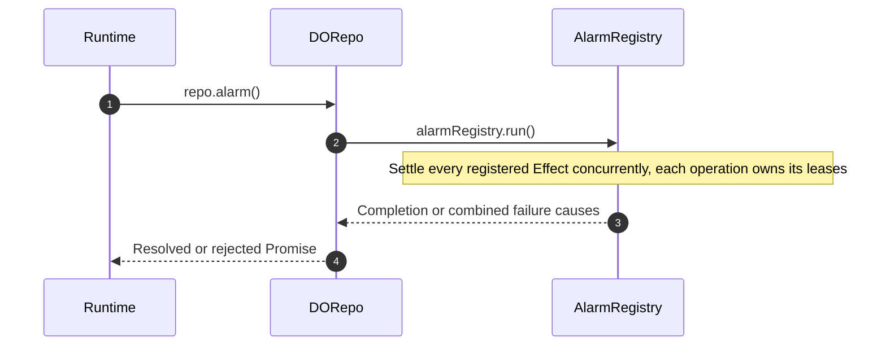
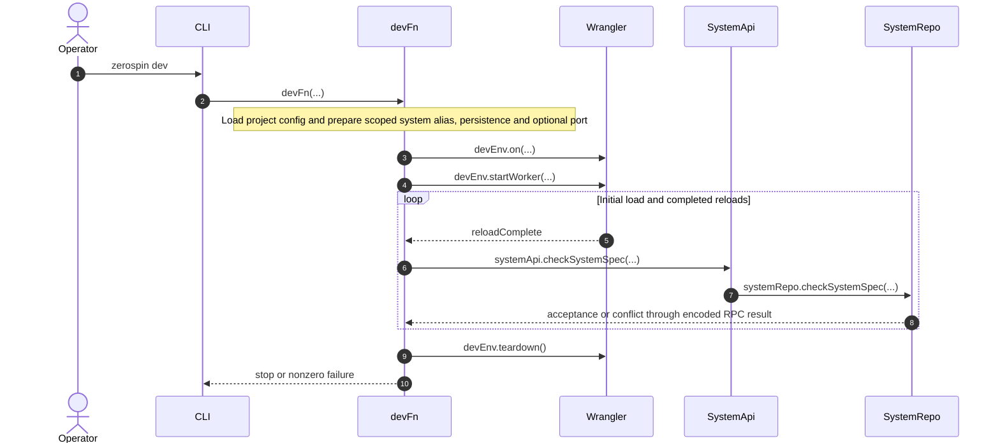

# Authored System and Static Worker

The root `zerospin.config.ts` imports an authored System and default-exports
`system.config({ systemId })`. Configuration retains the live System capability
and its explicit deployment identity. Seed modules
are selected separately by the seed CLI's file-path argument.

- [`makeSystem.ts`](../../packages/core/src/system/makeSystem.ts) — constructs configuration around the authored System.
- [`types.ts`](../../packages/core/src/system/types.ts) — preserves the concrete System in the configuration type.
- [`zerospin.config.ts`](../../examples/shopping/zerospin.config.ts) — Shopping exports its configuration without importing seed commands.

The CLI imports the exact root module without invoking a typechecker. Worker
builds use a scoped generated module exporting both `config` and `system`, with
`system === config.system`.
Configuration imports belong to both Node and Worker module graphs. The seed CLI
imports its selected command module separately.

- [`loadZerospinConfigFn.ts`](../../packages/cli/src/deploy/loadZerospinConfigFn.ts) — loads TypeScript with project aliases and validates live capabilities.
- [`makeSystemEntry.ts`](../../packages/cli/src/deploy/makeSystemEntry.ts) — owns the adapter through the caller's scope.
- [`makeSystemEntry.spec.ts`](../../packages/cli/src/deploy/makeSystemEntry.spec.ts) — verifies success, failure, and interruption cleanup.
- [`e2eFn.spec.ts`](../../packages/cli/src/e2e/e2eFn.spec.ts) — runs the shared fixture through the CLI and workerd using the generated adapter.

## Generated backend configuration

The CLI and workerd test setup share `makeWranglerConfig`. It derives
`zerospin-${system.name}`, validates the resulting Worker name, and owns the
entrypoint, system alias, compatibility settings, static DO bindings, SQLite
exports, observability defaults, environment, and production version metadata.
Project configuration exposes `systemId`; it has no Wrangler overrides.

- [`makeWranglerConfig.ts`](../../packages/dev-worker/src/makeWranglerConfig.ts) — produces the common backend configuration.
- [`ZerospinConfigSchema.ts`](../../packages/core/src/system/ZerospinConfigSchema.ts) — validates the explicit system ID and live System.

Generated configs and Worker adapters live in unique directories under
`.wrangler/zerospin/`. CLI scopes and the test plugin dispose generated files;
local dev persistence remains in `dev-worker/<systemId>` under that same root.
Dev and tests resolve `.env`/`.dev.vars` against the project root using Wrangler's
loader. Deployment continues to load project keys separately and writes a
scoped mode-0600 secrets file.

- [`makeSystemEntry.ts`](../../packages/cli/src/deploy/makeSystemEntry.ts) — owns the generated adapter directory through the calling scope.
- [`devFn.ts`](../../packages/cli/src/dev/devFn.ts) — preserves the selected system's persistence path and binds project-root local variables.
- [`deployWranglerFn.ts`](../../packages/cli/src/deploy/deployWranglerFn.ts) — generates production configuration and separate secrets with scoped cleanup.
- [`makeWorkerdVitestConfig.ts`](../../packages/dev-worker/src/vitest/makeWorkerdVitestConfig.ts) — generates test configuration, supports internal fixture entrypoints/bindings, and disposes its files.

Workerd tests explicitly receive the project `config` and need no prior CLI run.
Shopping owns its frontend hosting configuration, but has no backend Worker,
backend Wrangler files, or generated backend type declarations.

- [`vitest.zerospin.config.ts`](../../examples/shopping/vitest.zerospin.config.ts) — passes Shopping's configuration to the test helper.
- [`vite.config.ts`](../../examples/shopping/vite.config.ts) — retains the app-owned frontend Wrangler configuration.
- [`tsconfig.json`](../../examples/shopping/tsconfig.json) — checks application sources without generated backend declarations.

`makeSystem` collects authored definitions without a root version. Aggregate,
service, contract, model, and authentication versions remain attached
to their definitions. Inspection serializes the executing bundle on demand.

- [`makeSystem.ts`](../../packages/core/src/system/makeSystem.ts) — Constructs the authored System without a root version.
- [`makeSystemSpec.ts`](../../packages/core/src/system/makeSystemSpec.ts) — Serializes the authored definitions and their individual versions.
- [`getSystemSpec.ts`](../../packages/system-worker/src/getSystemSpec/getSystemSpec.ts) — Generates and validates the inspection spec from the executing bundle.

## Persistence invariant

Command chains retain history under their `systemId`.
An aggregate definition owns one exact version and its VAR schema; an upgrade
creates an independent definition. Changing an existing Repo's physical schema
requires empty storage, without a schema-upgrade or compatibility path.

Each production Repo, including SystemRepo, provisions its current Drizzle schema
on first activation. The retained `_isBootstrapped` marker makes later cold
activations reopen that database without performing schema work.

- [`VersionedAggregateRepo.ts`](../../packages/system-worker/src/VersionedAggregateRepo/VersionedAggregateRepo.ts) — Resolves the physical schema from the aggregateVersion carried in its name and declares its Repo type for common-base inspection registration.
- [`makeFixedDORepo.ts`](../../packages/system-worker/src/makeFixedDORepo/makeFixedDORepo.ts) — Skips provisioning for a marked database and supplies this policy to the common Repo base.
- [`SystemRepo.ts`](../../packages/system-worker/src/SystemRepo/SystemRepo.ts) — Uses the shared fixed-schema base while validating the exact configured singleton name.

SystemRepo retains immutable aggregate and service definition locks. Their
logical identity is `{ systemId, kind, name, version }`: the configured/authenticated
system selects the singleton SystemRepo; the executing Worker's serialized
candidate supplies kind, name, and version. Acceptance compares all candidates
in one transaction and inserts new versions only if every existing lock matches.
Removed definitions retain their locks. Structural equality ignores object-key
order and preserves array order. Executable bodies, root authentication definitions,
and framework-owned physical schemas are outside this comparison.

- [`checkSystemSpec.ts`](../../packages/system-worker/src/SystemRepo/checkSystemSpec/checkSystemSpec.ts) — validates the candidate and atomically compares or inserts its definitions.
- [`systemRepoDbConfig.ts`](../../packages/system-worker/src/SystemRepo/systemRepoDbConfig.ts) — stores aggregate and service locks independently of registration.
- [`makeSystemSpec.ts`](../../packages/core/src/system/makeSystemSpec.ts) — defines the serialized aggregate/service fields.

Every common Repo activation serializes its executing bundle and requests
`registerRepo({ registration, spec })` before accessing storage, provisioning,
bootstrap, or subscriptions. Registration requires existing matching locks;
it never accepts new definitions. A recorded instance remains known if later
initialization fails. SystemRepo is exempt from self-registration. Cold restarts
and alarms pass through the same guard. VAR initializes its execution head after
this guard and no longer stores an original spec in `head`.

- [`makeDORepo.ts`](../../packages/system-worker/src/makeDORepo/makeDORepo.ts) — guards the concurrency block before SQLite setup or marker reads.
- [`registerRepo.ts`](../../packages/system-worker/src/SystemRepo/registerRepo/registerRepo.ts) — checks accepted definitions before writing table metadata.
- [`registerReposTx.ts`](../../packages/system-worker/src/SystemRepo/registerRepos/registerReposTx.ts) — applies the same prerequisite to atomic bulk registration.
- [`onDOActivation.ts`](../../packages/system-worker/src/VersionedAggregateRepo/onDOActivation/onDOActivation.ts) — initializes the genesis execution head and then sources.
- [`activationGuard.node.spec.ts`](../../packages/system-worker/src/makeDORepo/activationGuard.node.spec.ts) — checks rejection before storage and bootstrap/restart recovery.

This is a hard cutover requiring fresh SystemRepo and affected VAR storage.
There is no adoption, fallback decoder, or translation migration for existing
physical databases. Shared or production state must be reset through a separate
explicitly approved operation.

- [`systemRepoDbConfig.ts`](../../packages/system-worker/src/SystemRepo/systemRepoDbConfig.ts) — adds required lock tables to the fixed physical schema.
- [`versionedAggregateRepoDbConfig.ts`](../../packages/system-worker/src/VersionedAggregateRepo/versionedAggregateRepoDbConfig.ts) — removes the obsolete spec column from the fixed VAR schema.

## Repo lookup

Each Repo supplies a namespace binding name to its fixed or versioned factory and
inherits `getRepo({ key })` from the common base. The lookup is an Effect: it
formats the route key and resolves the namespace stub when run. Passing the
static directly to a queue preserves its captured binding and name contract.

- [`makeDORepo.ts`](../../packages/system-worker/src/makeDORepo/makeDORepo.ts) — Declares the namespace type map and implements the captured static lookup.
- [`makeDORepo.node.spec.ts`](../../packages/system-worker/src/makeDORepo/makeDORepo.node.spec.ts) — Verifies lazy lookup, exact names, detached calls, and failure behavior without readiness or authorization calls.

SystemRepo uses the configured system ID as its unprefixed name. Its constructor
validates singleton identity before common Repo initialization; obtaining a stub
alone does not validate that identity.

- [`SystemRepo.ts`](../../packages/system-worker/src/SystemRepo/SystemRepo.ts) — Checks the configured name and system-ID schema before calling the common constructor.
- [`makeDORepo.workerd.spec.ts`](../../packages/system-worker/src/makeDORepo/makeDORepo.workerd.spec.ts) — Exercises configured singleton access and rejects other identities at activation.

## Shared alarm dispatch

Each Repo inherits one alarm registry and alarm entrypoint from the common base.
Queue factories register lazy drain Effects during construction; registration
reads no storage and starts no work. Subscriptions are awaited during activation.
Cold construction rebuilds these registrations before the activation gate opens.



## Annotated workflow steps

1. Cloudflare delivers the inherited alarm after activation completes. A registered custom superclass alarm preserves its own initialization and hook.
   - [`makeDORepo.ts`](../../packages/system-worker/src/makeDORepo/makeDORepo.ts) — Creates the registry before derived fields and registers a bound custom superclass alarm when present.
   - [`makeFixedDORepo.workerd.spec.ts`](../../packages/system-worker/src/makeFixedDORepo/makeFixedDORepo.workerd.spec.ts) — Exercises reconstructed registrations, retained work, activation ordering, and the PartyServer superclass hook.
2. The base dispatches every registered operation, even when no in-memory leases survived a cold activation. Drains read durable progress; subscriptions have already completed during activation.
   - [`makeFanoutQueue.ts`](../../packages/system-worker/src/makeFanoutQueue/makeFanoutQueue.ts) — Registers the internal serialized fanout drain without changing the public Promise-based drain.
   - [`makeOutboxQueue.ts`](../../packages/system-worker/src/makeOutboxQueue/makeOutboxQueue.ts) — Registers unbounded outbox recovery while retaining bounded explicit drains.
3. Dispatch captures each operation's full outcome without cancelling sibling operations, then combines failures. Hold and release continue to coordinate the shared scheduled wakeup.
   - [`makeAlarmRegistry.ts`](../../packages/system-worker/src/makeAlarmRegistry/makeAlarmRegistry.ts) — Maintains separate registrations and leases and combines failure causes after concurrent dispatch settles.
   - [`makeAlarmRegistry.node.spec.ts`](../../packages/system-worker/src/makeAlarmRegistry/makeAlarmRegistry.node.spec.ts) — Verifies inert registration, independent failures and defects, and release while another operation remains pending.
4. The inherited alarm resolves only after dispatch completes and rejects on failure without an RPC result envelope.
   - [`makeDORepo.ts`](../../packages/system-worker/src/makeDORepo/makeDORepo.ts) — Runs registry dispatch through the configured runtime with AsyncLive and propagates rejection.

## Deployed aggregate membership

AC binds `{ systemId, aggregateId, aggregateName }` from its physical name.
Activation reads the versions under `system.aggregates[aggregateName]` in the
executing bundle and reconciles its command destinations locally. Existing
cursors and failures survive reactivation; definitions absent from the bundle
become inactive. No System spec publication or subscription is involved.

- [`onDOActivation.ts`](../../packages/system-worker/src/AggregateChain/onDOActivation/onDOActivation.ts) — Retains the fanout alarm before atomically reconciling active destinations without resetting their progress.

## Recovery and inspection

VAR's activation initializes and subscribes every service declared by its selected
aggregate snapshot. Its alarm resumes result publication. AC owns its admitted-command destination; VAR has no automatic AC
catch-up-and-subscribe callback. Direct execution catches up explicitly through the requested admitted index.

- [`onDOActivation.ts`](../../packages/system-worker/src/VersionedAggregateRepo/onDOActivation/onDOActivation.ts) — Initializes declared source cursors and subscribes without an execution permit; existing progress survives reactivation.
- [`execute.ts`](../../packages/system-worker/src/VersionedAggregateRepo/execute/execute.ts) — Catches up through the requested admitted index and returns retained terminal results.
- [`onDOActivation.workerd.spec.ts`](../../packages/system-worker/src/VersionedAggregateRepo/onDOActivation/onDOActivation.workerd.spec.ts) — Verifies failed receipt and alarm recovery do not self-enroll with AC.

Inspection reads explicit Repo registrations, including their retained table
names. Definition locks are retained separately from these registrations; inspection does not infer unactivated instances from locks.

- [`getRepoRegistrations.ts`](../../packages/system-worker/src/SystemRepo/getRepoRegistrations/getRepoRegistrations.ts) — Filters registered Repos by kind and decodes their table names.

## Authoring integrity

The authored definition graph is validated during construction. Each factory
strictly decodes its own input and snapshots the arrays and plain records it owns.
Definitions and their snapshots are not frozen at runtime; callers are responsible
for mutations after construction.
Functions, Effect Schemas, Drizzle objects, and canonical definitions remain
foreign keyentity-bearing leaves. Caller-owned containers stay mutable but are
detached from the returned definition.

`makeTable` constructs nominal `Table` instances, copies the shape descriptors and
index containers, resolves self references, and retains the owned data on the instance.
External tables, schema objects, and opaque defaults retain their identity;
`primitives.ref` rejects structural table objects.

- [`makeTable.ts`](../../packages/schema/src/makeTable.ts) — constructs the table-owned graph after self-reference resolution.
- [`primitives.ts`](../../packages/schema/src/primitives.ts) — checks the target is a Table instance before inspecting its primary key.
- [`makeTable.node.spec.ts`](../../packages/schema/src/makeTable.node.spec.ts) — verifies ownership, self-reference identity, and rejection of structural targets.
- [`makeVersion.ts`](../../packages/core/src/authentication/makeVersion.ts) — validates independent authentication versions and builds their generated signature-schema specs.
- [`makeModel.ts`](../../packages/core/src/models/makeModel.ts) — resolves the Model-owned table, then attaches owned descriptors, shapes, indexes, and the table object.
- [`makeModel.ts`](../../packages/core/src/models/makeModel.ts) — builds the serializable model spec.

Seven authoring factories produce instances of seven canonical classes:
`Authentication`, `Model`, `Contract`, `ServiceFrontendController`,
`AggregateFrontendController`, `Service`, and `Aggregate`.
`makeFrontendController` chooses between the two controller classes, while
`makeReplica` creates another canonical `Model` and registers its provenance
after construction. The `Service` and `Aggregate` constructors stay private to
their factory modules.

- [`makeVersion.ts`](../../packages/core/src/authentication/makeVersion.ts) — declares and constructs canonical `Authentication` instances.
- [`makeModel.ts`](../../packages/core/src/models/makeModel.ts) — stores replica provenance in a module-private `WeakMap` outside the instance.
- [`makeModel.ts`](../../packages/core/src/models/makeModel.ts) — declares inherited non-enumerable getters, one-shot `markReplica`, and `Model.isReplica`.
- [`makeModel.ts`](../../packages/core/src/models/makeModel.ts) — constructs the canonical `Model` instance.
- [`makeReplica.ts`](../../packages/core/src/models/makeReplica.ts) — accepts only a canonical source `Model` and rejects nested replicas.
- [`makeReplica.ts`](../../packages/core/src/models/makeReplica.ts) — constructs the replica through `models.makeVersion`, then registers exact source and service name after the instance exists.
- [`makeFrontendController.ts`](../../packages/core/src/frontendController/makeFrontendController.ts) — declares the two owner-specific frontend-controller classes.
- [`makeFrontendController.ts`](../../packages/core/src/frontendController/makeFrontendController.ts) — snapshots service-frontend registries and returns a `ServiceFrontendController`.
- [`makeFrontendController.ts`](../../packages/core/src/frontendController/makeFrontendController.ts) — snapshots aggregate-frontend bindings and returns an `AggregateFrontendController`.
- [`makeService.ts`](../../packages/core/src/service/makeService.ts) — keeps `Service` private while exposing its internal canonical-instance schema.
- [`makeVersion.ts`](../../packages/core/src/aggregate/makeVersion.ts) — keeps `Aggregate` private while exposing its internal canonical-instance schema.

Aggregate frontend controllers declare `aggregateName`, `aggregateVersion`, and
`name`; service controllers declare `serviceName`, `serviceVersion`, and `name`. The browser
`IAggregateFrontend<typeof aggregate>` constraint checks an exact aggregate name
and version with compatible subsets of its models and contracts. A type-only
aggregate import keeps the server definition out of the browser module graph.
`IServiceFrontend<typeof service>` checks the service name, version, and compatible model
subsets. Controller specs
serialize `name` and the selected `aggregateVersion` or `serviceVersion`; locks retain their `frontendName` field. Model specs describe the exact selected version without historical-definition arrays.

- [`types.ts`](../../packages/core/src/frontendController/types.ts) — defines controller identity and the aggregate compatibility constraint.
- [`makeFrontendController.ts`](../../packages/core/src/frontendController/makeFrontendController.ts) — requires a nonempty aggregate or service version and preserves literal identity types.
- [`makeFrontendControllerSpec.ts`](../../packages/core/src/frontendController/makeFrontendControllerSpec.ts) — serializes controller identity and builds lock fields.

`makeService` owns service-local authorization, authoritative-model,
query stamping, frontend binding, projection-adapter, record
snapshot, and command-construction integrity. `aggregates.makeVersion` owns aggregate-local model, selection, guard,
service-pin, and command-construction checks. Its optional `authorize` callback
receives `{ userId, aggregateId, db }`, with `db` limited to model queries.
Omitting it allows access without an authored authorization check. Aggregate
definitions do not configure frontend bindings or adapters. Each constructs its decoded registries and
the binding, adapter, query, selection, and grant containers it owns.
Neither factory takes `systemName` as an owner-level prop.

- [`makeService.ts`](../../packages/core/src/service/makeService.ts) — constructs the decoded service registries it owns.
- [`makeService.ts`](../../packages/core/src/service/makeService.ts) — constructs the canonical `Service`.
- [`makeVersion.ts`](../../packages/core/src/aggregate/makeVersion.ts) — constructs the decoded aggregate registries it owns.
- [`makeVersion.ts`](../../packages/core/src/aggregate/makeVersion.ts) — constructs the canonical `Aggregate`.
- [`authorization.node.spec.ts`](../../packages/core/src/aggregate/authorization.node.spec.ts) — verifies optional authorization, supplied failures, and upgrade inheritance, replacement, and removal.
- [`authorizeAggregateFrontend.ts`](../../packages/system-worker/src/VersionedAggregateRepo/authorizeAggregateFrontend/authorizeAggregateFrontend.ts) — skips omitted checks and runs supplied authorization against owner-local model queries.

Declare a shared identity with `aggregates.makeAggregate({ name: 'shopper' })`, which
returns a `{ name, layer }` object with `Layer.empty` when no layer is supplied.
Pass `layer: Layer.mergeAll(...)` on this identity to provide guard services
shared by every version. Construct each version with
`aggregates.makeVersion(shopper, props)`; the version props do not repeat the name.

- [`makeAggregate.ts`](../../packages/core/src/aggregate/makeAggregate.ts) — validates the name and optional layer and constructs the shared identity.
- [`index.ts`](../../packages/core/src/aggregate/index.ts) — exposes the three aggregate authoring helpers.

Each aggregate owns one exact SemVer version and its service-version pins.
Author service dependencies with canonical definitions, for example
`services: { app: appV1 }`. `aggregates.makeVersion` validates each key against the service's
name and derives its version pin; runtime aggregates and serialized specs retain
string versions. Upgrades accept the same service definitions, or `null` to remove
a dependency.
`aggregates.upgradeVersion(previous, patch)` merges models, contracts, selections, and services by key. Omitted entries inherit,
supplied entries replace, and `null` removes existing entries. Authorization is
inherited unless explicitly replaced; `authorize: null` removes the check. The merged raw definition passes
through `aggregates.makeVersion` validation again. Earlier instances remain unchanged. A private WeakMap retains authored construction inputs, including canonical service definitions, for subsequent upgrades.
`getVersion` returns the same instance for its exact version and fails in the
Effect lane with `aggregate-version-unsupported` for any other version.
Service snapshot history remains owned by `makeService`.

- [`makeVersion.ts`](../../packages/core/src/aggregate/makeVersion.ts) — validates independent aggregate definitions, merges upgrades, and rejects other version lookups.
- [`makeVersion.ts`](../../packages/core/src/aggregate/makeVersion.ts) — infers inherited and replaced bindings and removes null-marked entries from the resulting types.
- [`makeSystemSpec.ts`](../../packages/core/src/system/makeSystemSpec.ts) — serializes each aggregate's exact version and service pins without aggregate history.
- [`upgrade.node.spec.ts`](../../packages/core/src/aggregate/upgrade.node.spec.ts) — checks independent upgrades, removals, validation and upgraded command construction.

`makeReplica` requires an explicit `modelVersion`. That version must equal `sourceModel.version`; the replica uses that exact source schema. Each aggregate definition pins every replicated service by version. System assembly requires the pinned service snapshot to exist and its corresponding model version to match the replica exactly.

- [`makeReplica.ts`](../../packages/core/src/models/makeReplica.ts) — Builds the replica from the exact source model and rejects a mismatched version.
- [`resolveSystemAggregate.ts`](../../packages/core/src/system/resolveSystemAggregate.ts) — Validates aggregate service pins and exact source-model version equality.
- [`service-model-ownership.node.spec.ts`](../../packages/core/src/system/tests/service-model-ownership.node.spec.ts) — Covers missing pins, unsupported service snapshots, and model-version mismatches.

Parent factories do not repeat their children's validation. `makeSystem` first
rejects structural owner copies by decoding only canonical `Service` and
`Aggregate` instances. Its thin resolvers enforce only graph relationships:
registry key equals owner name, every frontend controller has the system's
`systemName`, each source-model object has one service owner, every aggregate
replica points to the exact source object in its named service, aggregate code
does not directly reuse a service source, and every service pin resolves to
an existing service version. It assembles authentication, the owner registries,
and each resolved Aggregate snapshot into the final System graph. Runtime RPC,
persistence, and frontend inputs retain their normal boundary validation.

- [`decodeSystemProps.ts`](../../packages/core/src/system/decodeSystemProps.ts) — decodes canonical authentication and owner instances and defaults omitted services to an empty record.
- [`resolveSystemService.ts`](../../packages/core/src/system/resolveSystemService.ts) — checks service key/name, frontend `systemName`, and exclusive source-model ownership before returning the same `Service`.
- [`resolveSystemAggregate.ts`](../../packages/core/src/system/resolveSystemAggregate.ts) — checks aggregate key/name and source/replica provenance.
- [`resolveSystemAggregate.ts`](../../packages/core/src/system/resolveSystemAggregate.ts) — validates service pins and constructs the resolved Aggregate snapshot.
- [`makeSystem.ts`](../../packages/core/src/system/makeSystem.ts) — resolves services before aggregates and assembles authentication and owner registries into the completed `ISystem` graph.

Contracts own an optional synchronous `guard({ payload, db, userId })`. The
payload belongs to that contract version; the database exposes read-only
`query` access. Each upgrade explicitly supplies its guard alongside its new
program. Shopping's AddToCart upgrades reuse the prior guard because `cartId`
is unchanged. Aggregate frontend bindings contain only `{ contract }` and
reject binding-level guards. Aggregate bindings retain their separate optional
guard. Service command registries contain contracts directly.

- [`makeVersion.ts`](../../packages/core/src/contracts/makeVersion.ts) — validates and stores contract guards, including explicitly authored upgrade guards.
- [`types.ts`](../../packages/core/src/contracts/types.ts) — types contract guards and aggregate bindings.
- [`makeFrontendController.ts`](../../packages/core/src/frontendController/makeFrontendController.ts) — rejects frontend binding guards.
- [`addToCartV2.ts`](../../examples/shopping/src/zerospin/aggregates/shopper/contracts/addToCart/addToCartV2.ts) — explicitly reuses the cart existence check.

`aggregates.makeAggregate`, `makeService`, and aggregate `makeFrontendController`
accept optional local layers. Aggregate versions inherit their identity's layer.
Local layers may require application services; sibling local layers do not supply
one another. Application factories validate the remaining guard requirements and
local-layer inputs, including executable historical definitions. Layers and
initialized guards are executable configuration, excluded from specs and locks.

- [`makeVersion.ts`](../../packages/core/src/aggregate/makeVersion.ts) — retains the identity layer and initializes binding and contract guards together.
- [`makeService.ts`](../../packages/core/src/service/makeService.ts) — initializes current and historical contract guards against the service layer.
- [`makeFrontendController.ts`](../../packages/core/src/frontendController/makeFrontendController.ts) — initializes frontend contract guards; service frontends have no command guards.
- [`makeSystem.ts`](../../packages/core/src/system/makeSystem.ts) — validates application service coverage across registered definitions without acquiring services.
- [`makeSystemSpec.ts`](../../packages/core/src/system/makeSystemSpec.ts) and [`makeFrontendControllerSpec.ts`](../../packages/core/src/frontendController/makeFrontendControllerSpec.ts) — serialize authored specifications without executable layers.

`initializeGuards` acquires the local layer and binds each guard to its typed
application and local contexts before heterogeneous registry lookup. A local
service overrides the matching application tag for that execution. It does not
rebuild an application service that captured the original dependency during
application initialization. Invocation `db`, `userId`, and `payload` remain fresh
arguments to every guard call.

- [`initializeGuards.ts`](../../packages/core/src/guards/initializeGuards.ts) — builds a fresh local layer in the caller's scope and retains typed provision around synchronous guards.
- [`ownerLayers.node.spec.ts`](../../packages/core/src/guards/ownerLayers.node.spec.ts) — verifies sibling isolation and application dependencies captured before a local override.

`makeZerospinApp` accepts an application layer. Each mounted Provider owns one
managed runtime, with application services overriding framework ID/time defaults.
Sessions share those application instances. Session replacement reacquires local
services while retaining the Provider runtime; a separate mount creates a fresh
runtime. The Provider awaits frontend initialization and passes its initialized
guards and borrowed runtime into synchronous `makeAggregateSession`. That
constructor builds no layers and owns no disposal. Cleanup marks sessions
released before closing local scopes, then disposes the Provider runtime. Failed
initialization releases acquired resources without publishing the failed session.
Mock Providers follow the same ownership rules.

- [`makeAggregateSession.ts`](../../packages/core/src/session/makeAggregateSession.ts) — executes commands through the borrowed runtime and initialized frontend context.
- [`makeZerospinApp.tsx`](../../packages/react/src/makeZerospinApp.tsx) — owns application runtime, session initialization, publication, and ordered teardown.
- [`mock.ts`](../../packages/react/src/mock.ts) — owns application, local layer, and database resources through initialization failure, late completion, and unmount.

Server command batches acquire `makeSystem` application services and then the
selected aggregate or service layer before entering a synchronous transaction.
Frontend-local guards run in the browser; server execution uses the contract
and aggregate binding guards. Scoped resources close on success,
failure, or interruption, and the next batch acquires fresh instances. Acquisition
failure prevents transaction execution and remains retryable. Existing framework
runtimes remain at RPC entrypoints; Durable Object constructors acquire no
application layers. Authored rejection, savepoint rollback, and command ordering
retain their existing behavior.

- [`executeCommands.ts`](../../packages/system-worker/src/VersionedAggregateRepo/executeCommands/executeCommands.ts) — acquires application services and aggregate guards outside the transaction.
- [`executeCommands.ts`](../../packages/system-worker/src/VersionedServiceRepo/executeCommands/executeCommands.ts) — acquires application and service guards per batch before transaction execution.
- [`preparedPayload.node.spec.ts`](../../packages/system-worker/src/preparedPayload.node.spec.ts) — verifies defaults, overrides, fresh acquisition, rollback, and resource cleanup on failed acquisition or interruption.

Guards are synchronous read-only checks. `runGuard` reads its required services
from the enclosing Effect environment before entering its synchronous runner;
callers provide owner services around execution rather than passing a context
argument to each guard. `runGuard` preserves the guard's
typed failure and maps Effect suspension to `guard-must-be-synchronous`. They
execute in the local aggregate session and in VAR. VAR runs the aggregate binding and contract guards against its command transaction, then the originating frontend contract guard against the projected in-memory SQLite view. Service execution runs its contract guard in the command savepoint with `userId: null`; authored rejection becomes a terminal failure, while asynchronous guards remain execution failures. Authoritative replica copies and provisional enrollment are installed before guards; aggregate-owned mutations follow. Independent VSC updates do not run aggregate guards.

- [`executeCommandsTx.ts`](../../packages/system-worker/src/VersionedServiceRepo/executeCommands/executeCommandsTx.ts) — runs service guards inside the command savepoint and classifies authored failures.
- [`runGuard.ts`](../../packages/core/src/guards/runGuard.ts) — runs the guard to a synchronous exit, interrupts async fibers, and rethrows typed failures.
- [`makeAggregateSession.ts`](../../packages/core/src/session/makeAggregateSession.ts) — validates the bound contract version and runs the contract guard before command id, timestamp, or journal work.
- [`executeCommandsTx.ts`](../../packages/system-worker/src/VersionedAggregateRepo/executeCommands/executeCommandsTx.ts) — Runs existing guards after provisional replica initialization and before aggregate-owned mutations.

The React application factory accepts authored frontend controllers directly.
Configured name and system checks live in
[main-thread session bootstrap](./browser/bootstrapBrowserSession.md).

Factory-owned records are snapshots, while canonical Model,
Contract, controller, Service, and service-query leaves keep reference
identity. System assembly preserves the canonical `Service`, creates a resolved
Aggregate snapshot with a version lookup bound to system validation. Named
queries remain on their owning Service. Mutation after construction can invalidate validated decisions or diverge from
generated locks; factories do not enforce runtime immutability.

- [`makeService.node.spec.ts`](../../packages/core/src/service/makeService.node.spec.ts) — verifies service snapshots retain caller-input isolation.
- [`makeAggregate.node.spec.ts`](../../packages/core/src/aggregate/makeAggregate.node.spec.ts) — verifies aggregate leaf identity and owned registry snapshots.
- [`schema-validated.node.spec.ts`](../../packages/core/src/system/tests/schema-validated.node.spec.ts) — verifies Service identity, resolved Aggregate replacement, nested identity, and System registries.

Replica provenance is not an instance field. `Model` stores one
`{ sourceModel, serviceName }` tuple in a module-private `WeakMap`; inherited,
non-enumerable prototype getters preserve direct typed property access.
`Model.isReplica` is the canonical discriminator and `Model.markReplica` is
one-shot. Because every canonical Model inherits `sourceModel`, the `in`
operator is not a valid discriminator. Canonical metadata is deliberately
absent from own keys, object spread, and JSON serialization.

- [`makeModel.ts`](../../packages/core/src/models/makeModel.ts) — registers one-shot provenance and discriminates replicas from the WeakMap, not own fields.
- [`makeReplica.node.spec.ts`](../../packages/core/src/models/makeReplica.node.spec.ts) — verifies direct getters, non-enumerability, assignment resistance, one-shot registration, canonical discrimination, and spread/JSON omission.

UVAR replays against the exact version's canonical aggregate models and uses
`Model.isReplica` to recognize resources delivered independently from pinned VSC histories.

- [`execute.ts`](../../packages/system-worker/src/UserVersionedAggregateRepo/execute/execute.ts) — Uses canonical model provenance when replaying service resources.

Downstream lookup-and-trust starts from the completed `ISystem`. Development
and deployment bind the generated `config.system` entry as the `system` module alias. The
Worker entrypoints export the direct Repo topology, while server query paths
look up the named service, aggregate, and query from that authored graph.

- [`devFn.ts`](../../packages/cli/src/dev/devFn.ts) — binds the generated configuration entry to the development Worker's `system` alias.
- [`deployWranglerFn.ts`](../../packages/cli/src/deploy/deployWranglerFn.ts) — binds the generated configuration entry to the production Worker's `system` alias.
- [`DevWorker.ts`](../../packages/dev-worker/src/DevWorker.ts) — exports the direct Repo topology and routes development requests.
- [`ProductionWorker.ts`](../../packages/production-worker/src/ProductionWorker.ts) — exports the production topology and applies production request checks.
- [`executeServiceQuery.ts`](../../packages/system-worker/src/VersionedServiceRepo/executeServiceQuery/executeServiceQuery.ts) — resolves the named service and query from `system.services` before execution.
- [`executeServiceQuery.ts`](../../packages/system-worker/src/executeServiceQuery/executeServiceQuery.ts) — resolves the requested service using the aggregate version's service pin for frontend calls and dispatches the named service query.

## Trigger: `zerospin dev`

1. The `dev` command parses `--clean` and `--port` and mounts the development step.
   - [`dev.tsx`](../../packages/cli/src/commands/dev.tsx) — passes both options to `DevStep`.
2. The development step runs `devFn(...)` under Node services; the Effect loads and validates the project configuration before starting Wrangler.
   - [`Dev.tsx`](../../packages/cli/src/dev/Dev.tsx) — supplies filesystem, path, and terminal services.
   - [`devFn.ts`](../../packages/cli/src/dev/devFn.ts) — obtains `systemId` from the loaded configuration.



## Annotated workflow steps

1. The operator supplies optional `--clean` and `--port`.
   - [`dev.tsx`](../../packages/cli/src/commands/dev.tsx) — starts the development step with these options.
2. The CLI runs `devFn` under Node filesystem, path, and terminal services.
   - [`Dev.tsx`](../../packages/cli/src/dev/Dev.tsx) — starts the scoped Effect and presents failures.
3. The programmatic environment comes from the consumer's resolved Wrangler package; reload, error, and teardown listeners are attached before startup.
   - [`devFn.ts`](../../packages/cli/src/dev/devFn.ts) — resolves `unstable_DevEnv` and queues events.
4. Startup preserves the generated system alias, loopback address, port and system-scoped persistence path. Explicit `--clean` deletes only that local path.
   - [`devFn.ts`](../../packages/cli/src/dev/devFn.ts) — owns configuration generation, scoped deletion, and `startWorker` options.
5. Initial load and every completed reload queue a check after the proxy's update completes.
   - [`devFn.ts`](../../packages/cli/src/dev/devFn.ts) — consumes `reloadComplete` and waits for the proxy update mutex.
6. The CLI sends the existing empty argument tuple through Cap'n Web; it does not supply a candidate spec.
   - [`devFn.ts`](../../packages/cli/src/dev/devFn.ts) — opens the local authenticated SystemApi session and decodes acceptance.
7. The executing bundle generates the candidate and sends it to SystemRepo.
   - [`checkSystemSpec.ts`](../../packages/system-worker/src/SystemApi/checkSystemSpec/checkSystemSpec.ts) — uses the executing Worker's spec-generation path.
8. Only successful acceptance produces the accepted-ready message; conflicts retain their domain failure.
   - [`devFn.ts`](../../packages/cli/src/dev/devFn.ts) — displays readiness after decoding the check result.
9. Scope cleanup tears down Wrangler and removes generated configuration and the system adapter on success, failure, or interruption.
   - [`devFn.ts`](../../packages/cli/src/dev/devFn.ts) — registers environment, signal-handler, and generated-config finalizers.
   - [`makeSystemEntry.ts`](../../packages/cli/src/deploy/makeSystemEntry.ts) — removes the scoped adapter.
10. An incompatible definition ends the CLI with status 1.
    - [`Dev.tsx`](../../packages/cli/src/dev/Dev.tsx) — reports terminal failure through the command step.

## Trigger: `zerospin deploy`

1. `deploy` directly mounts the Wrangler-backed deployment step.
   - [`deploy.tsx`](../../packages/cli/src/commands/deploy.tsx) — declares the default command path.
2. The step runs `deployWranglerFn()` under the required Node services.
   - [`DeployWrangler.tsx`](../../packages/cli/src/deploy/DeployWrangler.tsx) — invokes the production deployment Effect.

```mermaid
sequenceDiagram
  actor Operator
  participant deployWranglerFn
  participant Wrangler
  participant Forwarder as Local forwarding Worker
  participant SystemApi as SystemApi in B
  participant SystemRepo as SystemRepo in A
  autonumber 1
  Operator->>deployWranglerFn: zerospin deploy
  autonumber 2
  deployWranglerFn->>Wrangler: runWrangler(...)
  Note over Wrangler: Read current deployment and upload candidate B
  Note over Wrangler: Require incumbent A alone at 100%, then stage A100/B0
  autonumber 3
  deployWranglerFn->>Wrangler: runWrangler(...)
  autonumber 4
  deployWranglerFn->>Forwarder: devEnv.startWorker(...)
  autonumber 5
  deployWranglerFn->>SystemApi: systemApi.checkSystemSpec(...)
  Note over Forwarder,SystemApi: Remote service binding forwards normal HTTP with B override; verify executing-version response header
  autonumber 6
  SystemApi->>SystemRepo: systemRepo.checkSystemSpec(...)
  autonumber 7
  SystemRepo-->>deployWranglerFn: accepted or rejected through encoded RPC response
  alt accepted and staged deployment unchanged
    autonumber 8
    deployWranglerFn->>Wrangler: runWrangler(...)
    Note over Wrangler: Promote the same B version ID to 100%
    autonumber 9
    deployWranglerFn->>SystemApi: systemApi.initialize(...)
  else rejected or interrupted while this command still owns staging
    autonumber 10
    deployWranglerFn->>Wrangler: runWrangler(...)
    Note over Wrangler: Restore A alone at 100%; preserve any intervening deployment
  end
  autonumber 11
  deployWranglerFn->>Forwarder: devEnv.teardown()
  autonumber 12
  deployWranglerFn-->>Operator: Worker name and version ID, or failure and recovery details
```

## Annotated workflow steps

1. The production command loads project keys and config. Missing keys produce a key-generation result before deployment begins.
   - [`deployWranglerFn.ts`](../../packages/cli/src/deploy/deployWranglerFn.ts) — validates project input and prepares scoped mode-0600 config and secrets.
2. Wrangler JSON identifies the current deployment; only a successful empty result or the explicit missing-script error indicates a new Worker. Upload records supply B's version ID.
   - [`deployWranglerFn.ts`](../../packages/cli/src/deploy/deployWranglerFn.ts) — reads deployment JSON and structured upload output; rejects an incumbent split rollout.
3. After rechecking the active deployment, the CLI stages A at 100% and B at 0%, retaining deployment identity and a command-specific marker for recovery.
   - [`deployWranglerFn.ts`](../../packages/cli/src/deploy/deployWranglerFn.ts) — sends the stage command and records `version-deploy` output. With no incumbent, `wrangler deploy` creates guarded B at 100% first; its returned version and actual deployment are verified before acceptance.
4. A scoped local Worker binds the configured production Worker through a remote service binding. Wrangler handles account authentication; no additional application Worker is deployed.
   - [`deployWranglerFn.ts`](../../packages/cli/src/deploy/deployWranglerFn.ts) — creates the distinct forwarding config and starts the project-resolved development environment.
5. The existing Cap'n Web client sends `args: []` and the project secret. The forwarder attaches B's override and rejects a missing or different version header after bounded propagation retries.
   - [`deployWranglerFn.ts`](../../packages/cli/src/deploy/deployWranglerFn.ts) — forwards cloned HTTP requests and validates the response before exposing RPC results.
   - [`ProductionWorker.ts`](../../packages/production-worker/src/ProductionWorker.ts) — adds `X-Zerospin-Worker-Version` from the version-metadata binding to HTTP RPC responses.
6. B serializes its own definitions; SystemRepo compares that supplied candidate even when its assigned Worker is A.
   - [`checkSystemSpec.ts`](../../packages/system-worker/src/SystemApi/checkSystemSpec/checkSystemSpec.ts) — generates B's spec at the public boundary and delegates atomic acceptance.
7. Spec acceptance is permanent. Newly accepted locks remain when promotion later fails; identical retries succeed.
   - [`checkSystemSpec.ts`](../../packages/system-worker/src/SystemRepo/checkSystemSpec/checkSystemSpec.ts) — commits additions without a deletion or rollback path.
8. Only verified acceptance and an unchanged staged deployment permit promotion of that same version ID.
   - [`deployWranglerFn.ts`](../../packages/cli/src/deploy/deployWranglerFn.ts) — rechecks deployment identity before `versions deploy B@100%`.
9. After promotion, the CLI waits until a checked response reports that SystemRepo itself executes B, then runs the existing health and initialization RPCs through the remote binding.
   - [`deployWranglerFn.ts`](../../packages/cli/src/deploy/deployWranglerFn.ts) — retries SystemRepo assignment within a bounded deadline, then awaits health and initialization before reporting success.
   - [`initialize.ts`](../../packages/system-worker/src/SystemRepo/initialize/initialize.ts) — awaits authored service-chain readiness; child activation still requires accepted definitions.
10. Failure cleanup restores A only while deployment identity/marker and A100/B0 still match this command. An intervening deployment is preserved; rollback failures report an explicit recovery command separately.
    - [`deployWranglerFn.ts`](../../packages/cli/src/deploy/deployWranglerFn.ts) — conditionally restores the incumbent in its scope finalizer.
11. Cleanup closes RPC sessions, tears down the local environment, and removes temporary config, secrets and adapter files.
    - [`deployWranglerFn.ts`](../../packages/cli/src/deploy/deployWranglerFn.ts) — registers finalizers on every acquired resource.
12. Deployment output contains the Worker name and deployed version ID, with no inferred production or preview URL.
    - [`DeployWrangler.tsx`](../../packages/cli/src/deploy/DeployWrangler.tsx) — presents the deployment result.

A candidate must belong to the active deployment for an HTTP override to select
it. Durable Object assignment is separate from HTTP request version selection;
the combined A100/B0 path was verified by the disposable live smoke test recorded in
[Plan 078](../dev/archived/078-plan-system-repo-spec-locks-and-production-preflight.md#implementation-and-verification-record). The smoke also observed that SystemRepo can temporarily remain on A
after B reaches 100%, which is why initialization waits for its reported version. Ordinary releases preserve DO class exports; class lifecycle changes
require a separate Cloudflare deployment procedure.

- [Cloudflare version overrides](https://developers.cloudflare.com/workers/versions-and-deployments/version-overrides/) — requires target-version membership in the active deployment.
- [Cloudflare deployments with Durable Objects](https://developers.cloudflare.com/workers/versions-and-deployments/gradual-deployments/with-durable-objects/) — defines per-object version assignment and restrictions on class lifecycle changes.

## Static Worker entrypoints

DevWorker and ProductionWorker export SystemRepo, SystemLogRepo,
SystemLogAgent, five command chains, and four Repos from one
static bundle. Both route frontend-command and system-log WebSockets through
SystemRepo and all other requests to GatewayApi.

- [`DevWorker.ts`](../../packages/dev-worker/src/DevWorker.ts) — exports and routes the development bundle.
- [`ProductionWorker.ts`](../../packages/production-worker/src/ProductionWorker.ts) — validates production keys and frontend socket tickets before applying the same topology.
- [`index.ts`](../../packages/system-worker/src/index.ts) — exports the complete System Worker Repo topology.
- [`makeWranglerConfig.ts`](../../packages/dev-worker/src/makeWranglerConfig.ts) — generates the static Durable Object bindings and SQLite exports for CLI and workerd tests.

## Seeds

After loading `.env.local` and `.env`, the seed CLI selects its endpoint from
`ZEROSPIN_API_URL`, then `VITE_ZEROSPIN_API_URL`, then
`NEXT_PUBLIC_ZEROSPIN_API_URL`, falling back to `https://api.zerospin.dev`.

- [`seedFn.ts`](../../packages/cli/src/seed/seedFn.ts) — applies seed endpoint precedence after configuration loading.
- [`loadConfigFn.ts`](../../packages/cli/src/deploy/loadConfigFn.ts) — loads environment files and supplies the hosted default.

`zerospin seed <file>` loads the specified TypeScript or JavaScript module using
project aliases. Relative paths resolve from the working directory. Named Effect
exports each resolve to one command; default and non-Effect exports are ignored.
All command envelopes, targets, and payloads are validated and encoded before any
submission. Missing files, import failures, empty modules, invalid commands, and
submission failures produce errors.

- [`seedFn.ts`](../../packages/cli/src/seed/seedFn.ts) — loads and resolves the module, validates its commands, and submits the complete encoded commands through `executeAggregateCommand` or `executeServiceCommand`.
- [`seedFn.spec.ts`](../../packages/cli/src/seed/seedFn.spec.ts) — covers relative and absolute paths, export discovery, owner versions, validation before submission, and failures.

Commands constructed by an aggregate or service definition retain that definition's
`aggregateVersion` or `serviceVersion`, independently of `contractVersion`. The CLI
uses the owner version to select the definition and populate the existing execution
request. Commands are submitted concurrently; the exported list is not a transaction
or a dependency ordering mechanism, and submission failure can leave partial work.

- [`makeAggregateCommand.ts`](../../packages/core/src/aggregate/makeAggregateCommand.ts) — retains the aggregate version with direct command provenance.
- [`makeServiceCommand.ts`](../../packages/core/src/service/makeServiceCommand.ts) — retains the service version with the constructed command.
- [`seedFn.ts`](../../packages/cli/src/seed/seedFn.ts) — validates all commands before concurrent RPC submission and reports the submitted count.
- [`seeds.ts`](../../examples/shopping/src/zerospin/seeds.ts) — Shopping exports twelve individual `appV1.makeCommand` Effects.

## Callers

- [System API](./SystemApi.md)
- [Command chains and materialization](./server/admitCommands.md)
- [Architecture overview](../overview.md)

## Model mutation versions

`models.makeModel({ name, abbreviation })` declares an identity with literal
name and abbreviation types. `models.makeVersion(model, props)` supplies its
attributes, indexes, and version separately.
`primitives.foreignKey({ abbreviation: model.abbreviation })` declares a caller-supplied
contract payload ID. Non-nullable IDs are required; decoding never generates them.
`primitives.primaryKey` remains the table identity descriptor. Foreign-key primitives
validate prefixed IDs without creating SQL relations; `primitives.ref` owns concrete
table relations.

- [`primitiveMaps.ts`](../../packages/schema/src/primitiveMaps.ts) — decodes required prefixed IDs and maps foreign-key primitives to text columns.
- [`makeVersion.ts`](../../packages/core/src/contracts/makeVersion.ts) — admits foreign-key payload descriptors and rejects raw table primary keys.
- [`index.ts`](../../packages/core/src/models/index.ts) — exposes model identity, version creation, and version upgrade operations.
- [`makeModel.ts`](../../packages/core/src/models/makeModel.ts) — validates and snapshots the identity and constructs each version.

Models have no historical definitions or resource adapters. `models.upgradeVersion(previous, props)`
authors a separate model version: omitted attributes are inherited,
descriptors add or replace attributes, and `null` removes an existing attribute.
Model name and abbreviation remain unchanged. Indexes are inherited unless
explicitly replaced; indexes referencing removed attributes are rejected. This
declaration does not migrate stored resources or retain historical adapters.
Contract versions declare `models: { cart: CartV1 }`. Their authored programs receive
`models.cart.create({ resourceId, attributes })` and the other mutation factories,
bound to that exact model definition. Model definitions themselves expose no mutation
constructors. `contracts.makeVersion` infers mutations from its optional program result;
it has no `mutations` schema property. Every mutation retains its bound model and version.

- [`makeModelMutations.ts`](../../packages/core/src/contracts/makeModelMutations.ts) — binds mutation construction, validation, and replica provenance to one model.
- [`types.ts`](../../packages/core/src/contracts/types.ts) — defines model-specific mutation utility arguments and results.

Contract upgrades inherit model bindings by key. A model value adds or replaces a
binding; `null` removes an existing binding, and unknown removals are rejected.
Each program receives its resolved bindings. Earlier versions retain their original
bindings. Contract specs include the resolved model specs under `models`, including
models that a particular execution does not mutate. System inspection specs carry
those same model specs.

- [`makeVersion.ts`](../../packages/core/src/contracts/makeVersion.ts) — snapshots model maps, binds programs, resolves upgrade patches, and emits model specs.
- [`makeSystemSpec.ts`](../../packages/core/src/system/makeSystemSpec.ts) — includes contract model specs for aggregates and services.

Frontend model locks must match the controller's model version exactly. Resource
encoding validates that exact version and does not adapt historical resources.

- [`makeFrontendControllerSpec.ts`](../../packages/core/src/frontendController/makeFrontendControllerSpec.ts) — builds model locks from the exact controller definitions.
- [`adaptFrontendResource.ts`](../../packages/system-worker/src/StaticSystem/adaptFrontendResource/adaptFrontendResource.ts) — Validates and encodes the selected model resource.

- [`makeVersion.ts`](../../packages/core/src/contracts/makeVersion.ts) — Infers the program result and rejects obsolete declaration properties.
- [`makeMutations.ts`](../../packages/core/src/contracts/makeMutations.ts) — Flattens the program result in return order and checks model ownership.
- [`prepareReplayAppliedMutation.ts`](../../packages/core/src/contracts/prepareReplayAppliedMutation.ts) — Uses operation codecs and model constructors during replay.

## Contract upgrades

`contracts.makeCommand(name)` declares a nominal Effect-branded command name,
retaining its string literal type and its unchanged runtime string value.
`contracts.makeVersion(command, props)` authors one contract version using that
identity; payload, guard, and program inference remain specific to the version.

- [`Command.ts`](../../packages/core/src/contracts/Command.ts) — preserves the literal name using Effect's nominal brand constructor.
- [`index.ts`](../../packages/core/src/contracts/index.ts) — exposes the three contract authoring operations together.
- [`makeVersion.ts`](../../packages/core/src/contracts/makeVersion.ts) — requires the branded name separately from the version definition.

`contracts.upgradeVersion(previous, props)` inherits omitted
payload fields, adds or replaces descriptors, and removes fields marked `null`.
Each edge requires an `up` adapter and a replacement program; `down` is optional.
Adapters receive decoded payloads and return Effects. Each result is validated
against its destination's decoded schema without generating new identities.
Contract objects are not frozen at runtime. Readonly `previous` and `next` getters expose
adjacent definitions, with `undefined` at either end. An upgrade links its parent
only after construction succeeds; a second child from the same parent is rejected.
The links are not included in the serializable contract spec.

`getVersion()` returns an actual ancestor. Validation and encoding use the requested
ancestor's codec. `decodePayload` finds the exact source through `previous` / `next`,
decodes with that source's codec, and adapts to the receiving contract through only
the required edges. Discovery follows object links rather than SemVer order. `adaptPayload({ fromVersion, toVersion, payload })` supports either
direction within that chain; downward traversal fails if an edge has no `down`.
Unknown versions, invalid output, and adapter failures are rejected.

Frontend contract locks use each bound contract's own version and payload schema.
Sessions validate and execute that same version, preserving its payload and version
in the encoded command; React has no separate contract-version selection. Contract specs describe their own
version, with no historical-definition arrays.

- [`makeVersion.ts`](../../packages/core/src/contracts/makeVersion.ts) — infers upgrade payloads and mutations, retains upgrade edges, validates adapter output, and resolves exact ancestor codecs.
- [`types.ts`](../../packages/core/src/contracts/types.ts) — describes contract payload histories and version-specific operations.
- [`makeAggregateSession.ts`](../../packages/core/src/session/makeAggregateSession.ts) — uses the bound contract version for validation, guards, and optimistic execution.
- [`makeFrontendControllerSpec.ts`](../../packages/core/src/frontendController/makeFrontendControllerSpec.ts) — derives contract locks directly from controller bindings.
- [`validateAggregateFrontendLock.ts`](../../packages/system-worker/src/StaticSystem/validateAggregateFrontendLock/validateAggregateFrontendLock.ts) — validates the requested ancestor's payload schema.
- [`makeVersion.node.spec.ts`](../../packages/core/src/contracts/makeVersion.node.spec.ts) — verifies both directions, generated identities, adapter failures, and default frontend bindings.

## Authentication versions

`authentication.makeVersion({ version, signature, authenticate })` binds one stable
SemVer version to its signature schema and authentication callback. `makeSystem`
accepts an array of independent definitions, rejects duplicate versions, and retains
the supplied order. Authentication has no upgrade or signature-adaptation chain.
The generated System spec serializes every authentication version in version order.

- [`makeVersion.ts`](../../packages/core/src/authentication/makeVersion.ts) — validates each independent definition without executing its callback.
- [`decodeSystemProps.ts`](../../packages/core/src/system/decodeSystemProps.ts) — requires canonical authentication definitions and rejects duplicate versions.
- [`makeSystem.ts`](../../packages/core/src/system/makeSystem.ts) — constructs the owned authentication array.
- [`makeSystemSpec.ts`](../../packages/core/src/system/makeSystemSpec.ts) — serializes version and signature JSON Schema for every definition.

Frontends author their own `{ version, signature }`. The browser sends a
`{ version, signatureJsonSchema }` authentication lock; the Worker selects exactly
that version, compares its schema, decodes the signature, and executes that version's
callback. Unsupported versions and mismatches fail without trying another version.

- [`makeZerospinApp.tsx`](../../packages/react/src/makeZerospinApp.tsx) — accepts independently authored frontend authentication and encodes generated signatures.
- [`makeAuthenticationLock.ts`](../../packages/core/src/authentication/makeAuthenticationLock.ts) — constructs the frontend lock.
- [`authenticate.ts`](../../packages/system-worker/src/authenticate/authenticate.ts) — performs exact-version validation, decoding, and authentication.

Mutation replay requires the exact registered model name and version. Aggregate and service definitions do not accept mutation adapter registries.

- [`prepareReplayAppliedMutation.ts`](../../packages/core/src/contracts/prepareReplayAppliedMutation.ts) — rejects unavailable model versions and validates replay against the exact model.
