# Blockchain

Zerospin persists one authoritative block stream per aggregate and one
user/frontend projection stream. The aggregate path is
`AggregateRepo` -> `AggregateBlockRepo` -> `AggregateFrontendRepo` ->
`AggregateFrontendBlockRepo`. The service projection path is `ServiceRepo` ->
`ServiceBlockRepo` -> `ServiceFrontendRepo` ->
`ServiceFrontendBlockRepo`
([`types.ts:51-61`](../../packages/core/src/system/types.ts#L51-L61)).

`Repo` is the architectural role for a keyed authority over durable state,
ordering, invariants, and lifecycle transitions; it does not imply one base
class. `BoundDORepo` is narrower: a path-named Durable Object built by
`makeBoundDORepo` whose schema and optional domain bootstrap are provisioned
once behind `_isBootstrapped`, with optional registration reasserted outside
that one-time branch. `SystemRepo` remains a Repo while directly extending
`DurableObject` and owning its separate migration and registration lifecycle
([`makeBoundDORepo.ts:28-210`](../../packages/system-worker/src/makeBoundDORepo/makeBoundDORepo.ts#L28-L210),
[`SystemRepo.ts:355-462`](../../packages/system-worker/src/SystemRepo/SystemRepo.ts#L355-L462)).

The aggregate browser target is the exact field set
`{ aggregateName, aggregateId, userId, frontendName }`. Its acquisition request
is `{ aggregateName, aggregateId, frontendName, aggregateFrontendLock,
aggregateFrontendLockKey, frontendSpec, mode, sink }`: the source controller
supplies both names, the lock, and the spec; the Provider caller supplies
`aggregateId`; and `bootstrapBrowserSession` supplies `mode` and `sink`. The `{
systemId, userId }`-bound `UserPartitionRepo` supplies the expected `userId` and
`systemId` without putting either in that request. Its worker-owned
`AuthenticatedApi` supplies authoritative `userId` plus the private generation
route, and the accepted capability is additionally bound to the complete
`aggregateFrontendLock`. The service target is exactly `{ serviceName, userId,
frontendName }` plus the complete `serviceFrontendLock`. Its acquisition request
is `{ serviceName, frontendName, serviceFrontendLock, serviceFrontendLockKey,
frontendSpec, mode, sink }`: the source controller supplies both names, the
lock, and the spec; `bootstrapBrowserServiceSession` supplies `mode` and `sink`;
the same partition binding supplies expected `userId` and `systemId`; and the
private `AuthenticatedApi` supplies authoritative `userId` plus generation
routing.

Each exact SharedWorker replica Repo owns one installed runtime tuple
`{ registrationId, ownerToken, authenticatedApi, frontendApi }` rather than one
server child per registration. `registrationId` is allocated when the Repo
appends a registration; `ownerToken` comes from the bound port; `authenticatedApi`
is the current result from that port's authentication callback; and `frontendApi`
is the child returned by that parent and accepted by the Repo's complete
admission check. Registrations retain their sink, mode, owner token,
current-parent callbacks, and delivery gates, but not a child. The tuple
identity, current-parent object, selection attempt, live registration, and
operation-specific frontier together fence state, ticket, socket, push, and
commit results. Private server routing context remains outside either browser
target
([`types.ts:23-27`](../../packages/core/src/aggregate/types.ts#L23-L27),
[`bootstrapBrowserSession.ts:72-102`](../../packages/react/src/bootstrapBrowserSession.ts#L72-L102),
[`bootstrapBrowserSession.ts:268-287`](../../packages/react/src/bootstrapBrowserSession.ts#L268-L287),
[`acquireAggregateFrontendReplica.ts:40-98`](../../packages/shared-worker/src/SharedWorker/UserPartitionRepo/acquireAggregateFrontendReplica/acquireAggregateFrontendReplica.ts#L40-L98),
[`bootstrapBrowserServiceSession.ts:41-56`](../../packages/react/src/bootstrapBrowserServiceSession.ts#L41-L56),
[`bootstrapBrowserServiceSession.ts:218-236`](../../packages/react/src/bootstrapBrowserServiceSession.ts#L218-L236),
[`acquireServiceFrontendReplica.ts:39-97`](../../packages/shared-worker/src/SharedWorker/UserPartitionRepo/acquireServiceFrontendReplica/acquireServiceFrontendReplica.ts#L39-L97),
[`AggregateFrontendReplicaRepo.ts:188-243`](../../packages/shared-worker/src/SharedWorker/AggregateFrontendReplicaRepo/AggregateFrontendReplicaRepo.ts#L188-L243),
[`AggregateFrontendReplicaRepo.ts:1651-1801`](../../packages/shared-worker/src/SharedWorker/AggregateFrontendReplicaRepo/AggregateFrontendReplicaRepo.ts#L1651-L1801),
[`ServiceFrontendReplicaRepo.ts:87-133`](../../packages/shared-worker/src/SharedWorker/ServiceFrontendReplicaRepo/ServiceFrontendReplicaRepo.ts#L87-L133),
[`ServiceFrontendReplicaRepo.ts:675-830`](../../packages/shared-worker/src/SharedWorker/ServiceFrontendReplicaRepo/ServiceFrontendReplicaRepo.ts#L675-L830)).

```mermaid
flowchart LR
  Browser["browser UI"] -->|"synchronous stageCommand"| MainThread["main-thread aggregate session SQLite"]
  MainThread -->|"asynchronous handoff"| SharedWorker
  SharedWorker -->|"installed-tuple, byte-identical bounded push"| AggregateFrontendApi
  AggregateFrontendApi -->|"no lifecycle identity"| SystemRepo
  SystemRepo -->|"durably accept writeIndex in current write generation"| AggregateFrontendRepo
  AggregateFrontendRepo -->|"retain PushBlock, then async finalizePushBlock"| AggregateRepo
  AggregateRepo -->|"immutable aggregate block"| AggregateBlockRepo
  AggregateBlockRepo -->|"batched history pull, then direct live delivery"| AggregateFrontendRepo
  AggregateFrontendRepo -->|"canonical current frontend block"| AggregateFrontendBlockRepo
  AggregateFrontendBlockRepo -->|"shape by admitted complete lock"| SharedWorker
  SharedWorker -->|"fan-out"| MainThread

  ServiceRepo --> ServiceBlockRepo
  ServiceBlockRepo -->|"durable aggregate delivery"| AggregateRepo
  ServiceBlockRepo --> ServiceFrontendRepo
  ServiceFrontendRepo --> ServiceFrontendBlockRepo
  ServiceFrontendBlockRepo -->|"shape by admitted complete lock"| ServiceBrowser["read-only service replica"]
```

## Durable delivery queues

Each delivery-owning Durable Object constructs one internal
`makeDeliveryQueue`. The coordinator serializes active drains, owns the
object's single alarm, protects a newer alarm request from an older drain, and
uses `defaultRetrySchedule` for three target-RPC attempts at 0, 250, and 750 ms.
It persists exhausted attempt span identities solely to attach `retryOf` links
on the next alarm wake; it does not persist attempt counts or retry deadlines
([`makeDeliveryQueue.ts:6-44`](../../packages/system-worker/src/makeDeliveryQueue/makeDeliveryQueue.ts#L6-L44),
[`makeDeliveryQueue.ts:46-105`](../../packages/system-worker/src/makeDeliveryQueue/makeDeliveryQueue.ts#L46-L105),
[`makeDeliveryQueue.ts:107-177`](../../packages/system-worker/src/makeDeliveryQueue/makeDeliveryQueue.ts#L107-L177)).

`makeOutboxQueue` groups rows by exact target, processes each target's rows in
order, and lets unrelated target lanes proceed concurrently. An exhausted row
records its domain diagnostic and blocks only later rows for that target
([`makeOutboxQueue.ts:27-63`](../../packages/system-worker/src/makeOutboxQueue/makeOutboxQueue.ts#L27-L63)).
`makeFanoutQueue` processes at most 100 subscribers concurrently, refreshes
progress between waves, and excludes only subscribers that exhausted the
current wake
([`makeFanoutQueue.ts:19-56`](../../packages/system-worker/src/makeFanoutQueue/makeFanoutQueue.ts#L19-L56)).

## Authoritative aggregate path

`AggregateRepo` is server-internally keyed by
`/:generationId/:aggregateId/:aggregateName`. It owns aggregate resource state,
retained command outcomes, service-subscription watermarks, and a persisted
aggregate-block outbox
([`AggregateRepo.ts:112-207`](../../packages/system-worker/src/AggregateRepo/AggregateRepo.ts#L112-L207)).
SystemApi direct finalization and AggregateFrontendApi push first enter the
system-id-addressed SystemRepo. In one acceptance transaction, SystemRepo picks
the writable generation, allocates the next global `writeIndex`, advances both
selection and generation write frontiers, and inserts the complete operation,
target, and command bytes in `systemWrites` before child delivery. Exact-target
FIFO lanes deliver direct writes to `AggregateRepo.finalizeAggregateCommands`
and browser writes to `AggregateFrontendRepo.pushCommands`; the latter persists
a five-part `PushBlock` receipt and asynchronously delivers it to
`AggregateRepo.finalizePushBlock`. Both AggregateRepo methods finalize behind
the coarse concurrency gate and drain aggregate outboxes only after it releases
([`finalizeAggregateCommands.ts:87-237`](../../packages/system-worker/src/SystemRepo/finalizeAggregateCommands/finalizeAggregateCommands.ts#L87-L237),
[`pushCommands.ts:81-220`](../../packages/system-worker/src/SystemRepo/pushCommands/pushCommands.ts#L81-L220),
[`drainSystemWrites.ts:157-289`](../../packages/system-worker/src/SystemRepo/drainSystemWrites/drainSystemWrites.ts#L157-L289),
[`drainSystemWrites.ts:357-550`](../../packages/system-worker/src/SystemRepo/drainSystemWrites/drainSystemWrites.ts#L357-L550),
[`AggregateRepo.ts:343-496`](../../packages/system-worker/src/AggregateRepo/AggregateRepo.ts#L343-L496),
[`drainPushBlockOutbox.ts:43-176`](../../packages/system-worker/src/AggregateFrontendRepo/drainPushBlockOutbox/drainPushBlockOutbox.ts#L43-L176)).

Replication preparation scans the complete command batch, retains duplicate
resource positions, groups one request per service in first-appearance order,
and settles those ServiceRepo requests concurrently. A missing, deleted,
invalid, or failed resource fails its complete owning command while unrelated
commands remain eligible
([`prepareAggregateCommands.ts:124-288`](../../packages/system-worker/src/AggregateRepo/finalizeAggregateCommands/prepareAggregateCommands.ts#L124-L288),
[`prepareAggregateCommands.ts:289-406`](../../packages/system-worker/src/AggregateRepo/finalizeAggregateCommands/prepareAggregateCommands.ts#L289-L406)).

For one service, AggregateRepo persists the subscription watermark
`C = { currentServiceCursor, currentServiceIndex }` but sends only
`C.currentServiceIndex` to ServiceRepo. In one transaction, ServiceRepo captures
`W = { lastServiceCursor, serviceIndex }`, reads the requested resource rows in
request order, and returns retained ServiceBlocks in
`(C.currentServiceIndex, W.serviceIndex]`; a first subscription with a null
index returns no retained suffix
([`getReplicatedResources.ts:71-90`](../../packages/system-worker/src/ServiceRepo/getReplicatedResources/getReplicatedResources.ts#L71-L90),
[`getReplicatedResources.ts:105-168`](../../packages/system-worker/src/ServiceRepo/getReplicatedResources/getReplicatedResources.ts#L105-L168),
[`getReplicatedResources.ts:170-212`](../../packages/system-worker/src/ServiceRepo/getReplicatedResources/getReplicatedResources.ts#L170-L212)).

Before installing successful snapshots at `W`, AggregateRepo aligns each
existing projection through the retained suffix. Existence of the exact
service-owned model row is replication membership. Relevant source blocks emit
one ordered commandless AggregateBlock each; irrelevant blocks only advance
the service subscription. Service groups retain first-appearance order, and
all alignment blocks precede the final authoritative or pushed command block
([`finalizeCommandsTx.ts:96-208`](../../packages/system-worker/src/AggregateRepo/finalizeAggregateCommands/finalizeCommandsTx.ts#L96-L208),
[`finalizeCommandsTx.ts:210-254`](../../packages/system-worker/src/AggregateRepo/finalizeAggregateCommands/finalizeCommandsTx.ts#L210-L254)).

The AggregateRepo gate spans the read of `C`, grouped ServiceRepo snapshot RPCs,
and the local transaction commit. Downstream subscription and block outboxes
drain only after the gate releases. ServiceBlockRepo remains the durable owner
of aggregate subscriber delivery: after alignment commits `W`, ordinary
delivery skips blocks at or below `W` and applies the first later block once.
Its fanout persists the aggregate target fields, current service watermark, and
`lastDeliveryError`; retry attempts and deadlines remain coordinator memory
([`AggregateRepo.ts:343-419`](../../packages/system-worker/src/AggregateRepo/AggregateRepo.ts#L343-L419),
[`drainAggregateSubscribers.ts:26-74`](../../packages/system-worker/src/ServiceBlockRepo/drainAggregateSubscribers/drainAggregateSubscribers.ts#L26-L74),
[`handleServiceBlocks.ts:91-188`](../../packages/system-worker/src/AggregateRepo/handleServiceBlocks/handleServiceBlocks.ts#L91-L188)).

`AggregateBlockRepo` archives immutable aggregate blocks. History acquisition
is pull-based: `getReplayBlocks` returns at most 100 full blocks after the
caller's paired cursor/index watermark and includes
`lastAvailableAggregateCursor`, selected from the terminal archived row in the
same SQLite statement. That statement also proves that a non-null continuation
cursor is the cursor archived at the supplied index, including when no later
block exists. Direct fanout begins only after an AggregateFrontendRepo
subscribes. A subscription records `userId`, `frontendName`,
`aggregateFrontendRepoName`, and its paired aggregate cursor/index watermark. That
watermark advances only after `AggregateFrontendRepo.handleAggregateBlocks` succeeds;
exhaustion records `lastDeliveryError` and leaves the subscriber behind for the
coordinator's next 250 ms alarm
([`getReplayBlocks.ts:17-194`](../../packages/system-worker/src/AggregateBlockRepo/getReplayBlocks/getReplayBlocks.ts#L17-L194),
[`AggregateBlockRepo.ts:47-47`](../../packages/system-worker/src/AggregateBlockRepo/AggregateBlockRepo.ts#L47-L47),
[`AggregateBlockRepo.ts:125-156`](../../packages/system-worker/src/AggregateBlockRepo/AggregateBlockRepo.ts#L125-L156),
[`processSubscriber.ts:24-241`](../../packages/system-worker/src/AggregateBlockRepo/processSubscriber/processSubscriber.ts#L24-L241)).

## Canonical frontend projection and archive

`AggregateFrontendRepo` is server-internally keyed by
`/:generationId/:aggregateId/:aggregateName/:userId/:frontendName`. It owns a
private authoritative aggregate replica, user-scoped selection, current
frontend projection tables, pushed-command terminal state, and its frontend
block outbox
([`AggregateFrontendRepo.ts:89-270`](../../packages/system-worker/src/AggregateFrontendRepo/AggregateFrontendRepo.ts#L89-L270),
[`AggregateFrontendRepo.ts:275-280`](../../packages/system-worker/src/AggregateFrontendRepo/AggregateFrontendRepo.ts#L275-L280),
[`AggregateFrontendRepo.ts:357-438`](../../packages/system-worker/src/AggregateFrontendRepo/AggregateFrontendRepo.ts#L357-L438)).

A fresh AggregateFrontendRepo initializes only its lineage, emission mode, and logical
`frontendIndex`; its aggregate source and projection tables begin empty
([`bootstrap.ts:9-111`](../../packages/system-worker/src/AggregateFrontendRepo/bootstrap/bootstrap.ts#L9-L111)).
Before opening an aggregate or service projection repo, SystemWorker asks the
system-id-addressed SystemRepo to read-admit the acquired generation. Frontend
archive segments are not generation replay authority: the resolver accepts only
`open` or `draining`, rejects `retired`, and returns `{ predecessor: null }` for
the current projection read
([`resolveFrontendProjectionLineage.ts:16-99`](../../packages/system-worker/src/SystemRepo/resolveFrontendProjectionLineage/resolveFrontendProjectionLineage.ts#L16-L99),
[`getState.ts:63-84`](../../packages/system-worker/src/getAggregateFrontendState/getAggregateFrontendState.ts#L63-L84),
[`getServiceFrontendState.ts:60-79`](../../packages/system-worker/src/getServiceFrontendState/getServiceFrontendState.ts#L60-L79)).
An admitted aggregate state acquisition then runs behind the AggregateFrontendRepo
concurrency gate. While
`no-emission` is active, `catchup` repeatedly pulls the next archive batch after
the durable local cursor/index and applies it through the ordinary aggregate
block handler. Catch-up is complete when the last block's cursor equals that
batch's `lastAvailableAggregateCursor`. The repo then switches to `live`,
subscribes from the applied block's exact cursor/index pair, records archive
lineage, registers the projection and archive, and returns canonical current
state. A block appended after the terminal batch read but before subscription
is not missed: the post-subscription drain sees the lower subscriber index and
delivers the retained suffix
([`AggregateFrontendRepo.ts:562-599`](../../packages/system-worker/src/AggregateFrontendRepo/AggregateFrontendRepo.ts#L562-L599),
[`catchup.ts:21-145`](../../packages/system-worker/src/AggregateFrontendRepo/catchup/catchup.ts#L21-L145),
[`getState.ts:115-335`](../../packages/system-worker/src/AggregateFrontendRepo/getState/getState.ts#L115-L335),
[`handleAggregateBlocks.ts:934-1042`](../../packages/system-worker/src/AggregateFrontendRepo/handleAggregateBlocks/handleAggregateBlocks.ts#L934-L1042),
[`AggregateBlockRepo.ts:125-148`](../../packages/system-worker/src/AggregateBlockRepo/AggregateBlockRepo.ts#L125-L148),
[`subscribeAggregateFrontend.ts:157-203`](../../packages/system-worker/src/AggregateBlockRepo/subscribeAggregateFrontend/subscribeAggregateFrontend.ts#L157-L203),
[`refreshQueue.ts:24-170`](../../packages/system-worker/src/AggregateBlockRepo/refreshQueue/refreshQueue.ts#L24-L170)).

The first push has the same lazy catch-up gate as the first state read. After
the immutable same-write receipt check, `AggregateFrontendRepo.pushCommands`
calls `getState` unless the repo is initialized, live, and subscribed;
`getState` replays the retained `AggregateBlockRepo` history through `catchup`
before it subscribes and the push classifies new work
([`pushCommands.ts:197-245`](../../packages/system-worker/src/AggregateFrontendRepo/pushCommands/pushCommands.ts#L197-L245),
[`getState.ts:220-257`](../../packages/system-worker/src/AggregateFrontendRepo/getState/getState.ts#L220-L257),
[`catchup.ts:44-145`](../../packages/system-worker/src/AggregateFrontendRepo/catchup/catchup.ts#L44-L145)).

Successor preparation uses the same history path instead of transporting a
AggregateFrontendRepo or AggregateRepo snapshot. It initializes an empty inherited
projection at the predecessor's terminal `frontendIndex`, replays the target
AggregateBlockRepo without emitting frontend blocks, requires the applied
cursor/index to equal the frozen bound, then subscribes and registers. During
historical replay, exact-target executed and failed pushed commands reconstruct
terminal outcome tables and each affected session's terminal staged cursor from
the full archived command objects
([`prepareSuccessor.ts:123-357`](../../packages/system-worker/src/AggregateFrontendRepo/prepareSuccessor/prepareSuccessor.ts#L123-L357),
[`handleAggregateBlocks.ts:702-824`](../../packages/system-worker/src/AggregateFrontendRepo/handleAggregateBlocks/handleAggregateBlocks.ts#L702-L824),
[`handleAggregateBlocks.ts:934-958`](../../packages/system-worker/src/AggregateFrontendRepo/handleAggregateBlocks/handleAggregateBlocks.ts#L934-L958)).

`AggregateFrontendRepo.pushCommands` validates positive `writeIndex`, exact
target and lock, strictly increasing unique command-owned `replicaIndex` values,
and stable complete request bytes. Same-write redelivery returns the retained
receipt. First delivery classifies every request command exactly once across
pending, newly pushed, executed, failed-staged, and failed-pushed partitions,
isolates unseen admission in per-command savepoints, and persists the complete
`PushBlock` keyed by `writeIndex`. Failed-staged and terminal pushed outcomes
remain canonical rows
([`pushCommands.ts:80-223`](../../packages/system-worker/src/AggregateFrontendRepo/pushCommands/pushCommands.ts#L80-L223),
[`pushCommands.ts:245-627`](../../packages/system-worker/src/AggregateFrontendRepo/pushCommands/pushCommands.ts#L245-L627)).

The projection outbox sends unpublished canonical blocks to
`AggregateFrontendBlockRepo` in `frontendIndex` order and records failures for the
shared coordinator's next alarm. The archive has the same server-internal
logical key as AggregateFrontendRepo and
uses named owner-local resource adapter Effects from the statically imported
System to persist each canonical block,
every current and retained model-version resource materialization, and coverage
floors atomically
([`drainAggregateFrontendBlockOutbox.ts:19-98`](../../packages/system-worker/src/AggregateFrontendRepo/drainAggregateFrontendBlockOutbox/drainAggregateFrontendBlockOutbox.ts#L19-L98),
[`storeAggregateFrontendBlocks.ts:58-106`](../../packages/system-worker/src/AggregateFrontendBlockRepo/storeAggregateFrontendBlocks/storeAggregateFrontendBlocks.ts#L58-L106),
[`storeAggregateFrontendBlocks.ts:137-330`](../../packages/system-worker/src/AggregateFrontendBlockRepo/storeAggregateFrontendBlocks/storeAggregateFrontendBlocks.ts#L137-L330),
[`storeAggregateFrontendBlocks.ts:332-454`](../../packages/system-worker/src/AggregateFrontendBlockRepo/storeAggregateFrontendBlocks/storeAggregateFrontendBlocks.ts#L332-L454)).

Each physical archive segment also owns a lineage replay floor. Successor
segments begin at the predecessor terminal index
([`recordPredecessor.ts:101-150`](../../packages/system-worker/src/AggregateFrontendBlockRepo/recordPredecessor/recordPredecessor.ts#L101-L150),
[`recordPredecessor.ts:95-142`](../../packages/system-worker/src/ServiceFrontendBlockRepo/recordPredecessor/recordPredecessor.ts#L95-L142)).

## Exact-lock browser delivery

Canonical server projection storage is not duplicated for each selected
browser model set. Admission validates the complete aggregate or service lock;
the socket stores that lock in connection state and selects its model versions
from already-persisted materializations. Models absent from the lock and their
deletes are omitted, missing coverage or corrupt bytes require full state, and
an otherwise empty block still advances `frontendIndex`
([`onConnect.ts:5-64`](../../packages/system-worker/src/AggregateFrontendBlockRepo/onConnect/onConnect.ts#L5-L64),
[`getArchivedBlocks.ts:45-370`](../../packages/system-worker/src/AggregateFrontendBlockRepo/getArchivedBlocks/getArchivedBlocks.ts#L45-L370),
[`onConnect.ts:5-55`](../../packages/system-worker/src/ServiceFrontendBlockRepo/onConnect/onConnect.ts#L5-L55),
[`getArchivedBlocks.ts:45-391`](../../packages/system-worker/src/ServiceFrontendBlockRepo/getArchivedBlocks/getArchivedBlocks.ts#L45-L391)).

The SharedWorker exact replica Repos resume both aggregate and service streams with exactly
`{ frontendIndex }`. Server archives may traverse predecessor segments
internally, but the wire emits only ordinary frontend blocks followed by
`replay-complete`. An invalid cursor, a missing predecessor detected after the
active descriptor read, or a non-contiguous archive produces `state-required`;
the owning exact replica Repo then fetches and replaces complete state
([`onMessage.ts:71-233`](../../packages/system-worker/src/AggregateFrontendBlockRepo/onMessage/onMessage.ts#L71-L233),
[`onMessage.ts:236-303`](../../packages/system-worker/src/AggregateFrontendBlockRepo/onMessage/onMessage.ts#L236-L303),
[`onMessage.ts:69-233`](../../packages/system-worker/src/ServiceFrontendBlockRepo/onMessage/onMessage.ts#L69-L233),
[`onMessage.ts:235-305`](../../packages/system-worker/src/ServiceFrontendBlockRepo/onMessage/onMessage.ts#L235-L305),
[`AggregateFrontendReplicaRepo.ts:1856-1979`](../../packages/shared-worker/src/SharedWorker/AggregateFrontendReplicaRepo/AggregateFrontendReplicaRepo.ts#L1856-L1979),
[`ServiceFrontendReplicaRepo.ts:862-1007`](../../packages/shared-worker/src/SharedWorker/ServiceFrontendReplicaRepo/ServiceFrontendReplicaRepo.ts#L862-L1007)).

## SharedWorker command ownership

The SharedWorker `UserPartitionRepo` root is `{ systemId, userId }` and stores
immutable locators only. Aggregate locator rows add
`{ aggregateId, aggregateName, frontendName, aggregateFrontendLockKey }`;
service locator rows add `{ serviceName, frontendName,
serviceFrontendLockKey }`. Every locator records the canonical complete lock,
canonical frontend spec, and physical exact-database name
([`makeVfsName.ts:3-10`](../../packages/shared-worker/src/SharedWorker/makeVfsName.ts#L3-L10),
[`userReplicaSchemas.ts:176-247`](../../packages/shared-worker/src/SharedWorker/userReplicaSchemas.ts#L176-L247)).

Acquisition validates the complete local target, lock key, lock bytes, and spec
before entering the serialized locator/runtime lookup and before requesting a
server child. `existing-only` resolves only an existing locator and runtime or
opens the exact database in existing-only mode, verifies its exact current
schema and metadata, skips migration, and returns local state without server
work. First online activation keeps the runtime, registration, installed
`{ registrationId, ownerToken, authenticatedApi, frontendApi }` tuple, and new
locator unpublished until the tuple-fenced state replacement commits. A failed
unpublished activation closes the SQLite and VFS handles without deleting the
browser bytes. Reacquiring online with the same sink promotes the existing
registration in place; the temporary returned RPC stub is disposed
([`acquireAggregateFrontendReplica.ts:101-277`](../../packages/shared-worker/src/SharedWorker/UserPartitionRepo/acquireAggregateFrontendReplica/acquireAggregateFrontendReplica.ts#L101-L277),
[`acquireAggregateFrontendReplica.ts:319-490`](../../packages/shared-worker/src/SharedWorker/UserPartitionRepo/acquireAggregateFrontendReplica/acquireAggregateFrontendReplica.ts#L319-L490),
[`acquireAggregateFrontendReplica.ts:492-610`](../../packages/shared-worker/src/SharedWorker/UserPartitionRepo/acquireAggregateFrontendReplica/acquireAggregateFrontendReplica.ts#L492-L610),
[`acquireServiceFrontendReplica.ts:99-277`](../../packages/shared-worker/src/SharedWorker/UserPartitionRepo/acquireServiceFrontendReplica/acquireServiceFrontendReplica.ts#L99-L277),
[`acquireServiceFrontendReplica.ts:316-492`](../../packages/shared-worker/src/SharedWorker/UserPartitionRepo/acquireServiceFrontendReplica/acquireServiceFrontendReplica.ts#L316-L492),
[`acquireServiceFrontendReplica.ts:494-560`](../../packages/shared-worker/src/SharedWorker/UserPartitionRepo/acquireServiceFrontendReplica/acquireServiceFrontendReplica.ts#L494-L560),
[`bootstrapBrowserSession.ts:318-367`](../../packages/react/src/bootstrapBrowserSession.ts#L318-L367),
[`bootstrapBrowserServiceSession.ts:293-340`](../../packages/react/src/bootstrapBrowserServiceSession.ts#L293-L340)).

Each port root owns one runtime-only current `AuthenticatedApi` object and a
single-flight callback with `current`, `refresh-if-current`, and `force`
freshness. Each exact replica Repo keeps one usable installed tuple sticky,
otherwise tries live online registrations in allocator append order. A
transiently unusable owner is excluded from that selection attempt without
detaching its sink delivery. Fresh explicit unsupported-lock evidence or exact
admission mismatch terminally fails only that exact Repo and does not probe a
sibling registration. Releasing a non-selected registration leaves the tuple
installed; releasing the selected registration invalidates its tuple and socket
and forces fresh transfer when another online registration remains; zero online
registrations detach server authority while preserving the local replica
([`getUserPartitionRepo.ts:164-190`](../../packages/shared-worker/src/SharedWorker/SharedWorkerApi/getUserPartitionRepo/getUserPartitionRepo.ts#L164-L190),
[`AggregateFrontendReplicaRepo.ts:1332-1398`](../../packages/shared-worker/src/SharedWorker/AggregateFrontendReplicaRepo/AggregateFrontendReplicaRepo.ts#L1332-L1398),
[`AggregateFrontendReplicaRepo.ts:1479-1847`](../../packages/shared-worker/src/SharedWorker/AggregateFrontendReplicaRepo/AggregateFrontendReplicaRepo.ts#L1479-L1847),
[`AggregateFrontendReplicaRepo.ts:1992-2026`](../../packages/shared-worker/src/SharedWorker/AggregateFrontendReplicaRepo/AggregateFrontendReplicaRepo.ts#L1992-L2026),
[`ServiceFrontendReplicaRepo.ts:531-857`](../../packages/shared-worker/src/SharedWorker/ServiceFrontendReplicaRepo/ServiceFrontendReplicaRepo.ts#L531-L857),
[`ServiceFrontendReplicaRepo.ts:1043-1078`](../../packages/shared-worker/src/SharedWorker/ServiceFrontendReplicaRepo/ServiceFrontendReplicaRepo.ts#L1043-L1078),
[`ServiceFrontendReplicaRepo.ts:1636-1715`](../../packages/shared-worker/src/SharedWorker/ServiceFrontendReplicaRepo/ServiceFrontendReplicaRepo.ts#L1636-L1715)).

That root has one current baseline containing only the two locator tables. The
async initializer accepts an empty database or that exact two-table,
one-receipt baseline; any other non-empty state fails with
`browser-persistence-reset-required` before a schema transaction begins. Only
the empty case applies and records the baseline
([`migrations.ts:2-14`](../../packages/shared-worker/src/SharedWorker/drizzle/userReplica/migrations.ts#L2-L14),
[`migrateUserReplicaDbAsync.ts:20-80`](../../packages/shared-worker/src/SharedWorker/migrateUserReplicaDbAsync.ts#L20-L80),
[`migrateUserReplicaDbAsync.ts:82-137`](../../packages/shared-worker/src/SharedWorker/migrateUserReplicaDbAsync.ts#L82-L137)).

Main-thread `stageCommand` owns the first durable boundary: in one synchronous
transaction it stores the complete staged command, applies optimistic
mutations, stores their inverses, and returns the encoded Either. A successful
commit then starts one asynchronous **handoff** carrying the complete command,
mutations, and session-local `sessionIndex`; handoff latency is not part of the
public result
([`makeSession.ts:250-337`](../../packages/core/src/session/makeSession.ts#L250-L337),
[`makeSession.ts:340-480`](../../packages/core/src/session/makeSession.ts#L340-L480)).

Each `AggregateFrontendReplicaRepo` owns one physical database for exact
`{ systemId, userId, aggregateName, aggregateId, frontendName,
aggregateFrontendLockKey }`. Its exact database has generated resource tables,
`aggregateFrontendReplicaMetadata { id, systemVersion, frontendIndex,
replicaIndex }`, and `aggregateFrontendCommandJournal { commandId, sessionId,
sessionIndex, command, mutations, appliedMutationInverses }`. The command field
is the complete staged-or-pushed replica command, whose own `replicaIndex`
orders active intent. Snapshot rows, previous blocks, target duplication,
generation, runtime status, socket state, retry state, and terminal outcomes are
not persisted in this database
([`AggregateFrontendReplicaRepo.ts:90-132`](../../packages/shared-worker/src/SharedWorker/AggregateFrontendReplicaRepo/AggregateFrontendReplicaRepo.ts#L90-L132),
[`AggregateFrontendReplicaRepo.ts:2862-2881`](../../packages/shared-worker/src/SharedWorker/AggregateFrontendReplicaRepo/AggregateFrontendReplicaRepo.ts#L2862-L2881)).

The handoff transaction validates the unindexed session command and mutation
bytes, enforces command-ID and `(sessionId, sessionIndex)` idempotency, allocates
`metadata.replicaIndex + 1`, applies optimism into the resource tables, stores
the staged replica command and inverses, and advances metadata before returning
`{ commandId }`. **Fan-out** and push scheduling begin only after commit and
deliver only to live registrations for that exact lock
([`AggregateFrontendReplicaRepo.ts:3515-3793`](../../packages/shared-worker/src/SharedWorker/AggregateFrontendReplicaRepo/AggregateFrontendReplicaRepo.ts#L3515-L3793)).

Push selects only staged-form journal rows in command-owned `replicaIndex`
order and captures the installed tuple, its live registration, the current
parent object, and the selection attempt. It runs one three-attempt retry
schedule against the same command array; if that schedule exhausts, it refreshes
only the child authority with `replaceState: false` and runs exactly one second
three-attempt schedule with the same bytes. The returned `PushBlock` must
classify every submitted command exactly once without changing stable command
bytes, and the tuple fences validation and commit. Fresh explicit
unsupported-lock or admission-mismatch evidence terminally fails this exact Repo.
Only failed-staged entries settle immediately: one tuple-fenced transaction
rewinds all active optimism, deletes those rows, reapplies surviving intent, and
advances `replicaIndex` once before replacement fan-out. Canonical exact-next
blocks or authoritative repair later promote staged rows to pushed, delete
terminal executed or failed-pushed rows, and reapply remaining intent. The
journal therefore retains active staged or pushed intent, not terminal receipts.
**Convergence** is the combined push, server execution, canonical block or
replacement, exact-lock materialization, and post-commit fan-out path
([`AggregateFrontendReplicaRepo.ts:2477-2809`](../../packages/shared-worker/src/SharedWorker/AggregateFrontendReplicaRepo/AggregateFrontendReplicaRepo.ts#L2477-L2809),
[`AggregateFrontendReplicaRepo.ts:2816-3105`](../../packages/shared-worker/src/SharedWorker/AggregateFrontendReplicaRepo/AggregateFrontendReplicaRepo.ts#L2816-L3105),
[`AggregateFrontendReplicaRepo.ts:3107-3191`](../../packages/shared-worker/src/SharedWorker/AggregateFrontendReplicaRepo/AggregateFrontendReplicaRepo.ts#L3107-L3191),
[`AggregateFrontendReplicaRepo.ts:3194-3429`](../../packages/shared-worker/src/SharedWorker/AggregateFrontendReplicaRepo/AggregateFrontendReplicaRepo.ts#L3194-L3429),
[`AggregateFrontendReplicaRepo.ts:875-1195`](../../packages/shared-worker/src/SharedWorker/AggregateFrontendReplicaRepo/AggregateFrontendReplicaRepo.ts#L875-L1195)).

## Adapter directions

Adapters are direct, explicit edges:

1. Historical selected contract payloads adapt up to the controller's current
   frontend contract payload and are validated before current command logic
   runs
   ([`makeContract.ts:442-551`](../../packages/core/src/contracts/makeContract.ts#L442-L551)).
2. Current frontend contracts adapt up to authoritative aggregate contracts at
   the binding boundary; an omitted binding adapter is the identity edge
   ([`types.ts:174-193`](../../packages/core/src/frontendBinding/types.ts#L174-L193),
   [`makeSystem.ts:1486-1523`](../../packages/core/src/system/makeSystem.ts#L1486-L1523)).
3. Historical persisted mutations adapt up to current aggregate/service
   mutations during server-internal replay. A null destination explicitly
   discards a historical mutation
   ([`replayAppliedMutationTx.ts:88-167`](../../packages/core/src/contracts/replayAppliedMutationTx.ts#L88-L167),
   [`replayAppliedMutationTx.ts:323-345`](../../packages/core/src/contracts/replayAppliedMutationTx.ts#L323-L345)).
4. Canonical current frontend resources adapt down to the model definitions in
   the admitted complete lock during state reads or archive-write
   materialization. WebSocket replay and live delivery then select the persisted
   version bytes without runtime adaptation
   ([`makeModel.ts:719-852`](../../packages/core/src/models/makeModel.ts#L719-L852),
   [`storeAggregateFrontendBlocks.ts:137-330`](../../packages/system-worker/src/AggregateFrontendBlockRepo/storeAggregateFrontendBlocks/storeAggregateFrontendBlocks.ts#L137-L330),
   [`getArchivedBlocks.ts:125-370`](../../packages/system-worker/src/AggregateFrontendBlockRepo/getArchivedBlocks/getArchivedBlocks.ts#L125-L370)).

Projection adapters are separate: they map current aggregate or service
resources to current frontend resources. They are required only when bound
source and frontend model names differ; equal names require identical specs
([`types.ts:75-172`](../../packages/core/src/frontendBinding/types.ts#L75-L172),
[`makeSystem.ts:1452-1484`](../../packages/core/src/system/makeSystem.ts#L1452-L1484)).

These server-authority directions do not imply that a historical model
selection rewrites mutations produced by browser-local contract programs.
Local staging validates the authored program output against the mounted model
set and rejects an out-of-scope mutation
([`makeSession.ts:235-266`](../../packages/core/src/session/makeSession.ts#L235-L266),
[`makeMutations.ts:23-58`](../../packages/core/src/contracts/makeMutations.ts#L23-L58)).

## Service path

Service state remains authoritative in `ServiceRepo` and immutable
`ServiceBlockRepo` blocks. `ServiceFrontendRepo` is read-only, owns a private
service source replica and current projected models, and publishes through its
persistent outbox to `ServiceFrontendBlockRepo`
([`ServiceFrontendRepo.ts:97-165`](../../packages/system-worker/src/ServiceFrontendRepo/ServiceFrontendRepo.ts#L97-L165),
[`getState.ts:175-347`](../../packages/system-worker/src/ServiceFrontendRepo/getState/getState.ts#L175-L347),
[`drainServiceFrontendBlockOutbox.ts:19-109`](../../packages/system-worker/src/ServiceFrontendRepo/drainServiceFrontendBlockOutbox/drainServiceFrontendBlockOutbox.ts#L19-L109)).
The service browser path has no command journal. Its exact database contains
generated resource tables plus only `serviceFrontendReplicaMetadata { id,
systemVersion, frontendIndex, replicaIndex }`; socket, reconnect, registration,
failure, and installed `{ registrationId, ownerToken, authenticatedApi,
frontendApi }` tuple state stays in memory
([`ServiceFrontendReplicaRepo.ts:55-71`](../../packages/shared-worker/src/SharedWorker/ServiceFrontendReplicaRepo/ServiceFrontendReplicaRepo.ts#L55-L71),
[`ServiceFrontendReplicaRepo.ts:87-133`](../../packages/shared-worker/src/SharedWorker/ServiceFrontendReplicaRepo/ServiceFrontendReplicaRepo.ts#L87-L133)).

Service-owned resources selected into an aggregate use the distinct durable
route `ServiceRepo -> ServiceBlockRepo -> AggregateRepo -> AggregateBlockRepo ->
AggregateFrontendRepo`. Internal service cursors, service indexes, subscriptions, and
replication membership do not enter frontend state; AggregateFrontendRepo receives only
ordinary aggregate blocks and projects service-owned model rows like any other
selected aggregate resource
([`drainServiceBlockOutbox.ts:20-109`](../../packages/system-worker/src/ServiceRepo/drainServiceBlockOutbox/drainServiceBlockOutbox.ts#L20-L109),
[`drainAggregateSubscribers.ts:41-129`](../../packages/system-worker/src/ServiceBlockRepo/drainAggregateSubscribers/drainAggregateSubscribers.ts#L41-L129),
[`handleServiceBlocks.ts:100-188`](../../packages/system-worker/src/AggregateRepo/handleServiceBlocks/handleServiceBlocks.ts#L100-L188),
[`processSubscriber.ts:24-241`](../../packages/system-worker/src/AggregateBlockRepo/processSubscriber/processSubscriber.ts#L24-L241),
[`handleAggregateBlocks.ts:60-208`](../../packages/system-worker/src/AggregateFrontendRepo/handleAggregateBlocks/handleAggregateBlocks.ts#L60-L208)).

## Trigger

1. A direct aggregate command enters through `SystemApi`, or a browser pushes a
   full encoded staged command through its target-and-lock-bound `AggregateFrontendApi`.
   Both gateway leaves resolve `SystemRepo` by `systemId`; neither forwards its
   acquired generation or any deploy/Worker-version identity
   ([`finalizeAggregateCommands.ts:19-83`](../../packages/system-worker/src/SystemApi/finalizeAggregateCommands/finalizeAggregateCommands.ts#L19-L83),
   [`AggregateFrontendApi.ts:63-91`](../../packages/system-worker/src/AggregateFrontendApi/AggregateFrontendApi.ts#L63-L91),
   [`pushCommands.ts:32-72`](../../packages/system-worker/src/AggregateFrontendApi/pushCommands/pushCommands.ts#L32-L72),
   [`SystemApi/finalizeAggregateCommands.ts:41-51`](../../packages/system-worker/src/SystemApi/finalizeAggregateCommands/finalizeAggregateCommands.ts#L41-L51)).
2. SystemRepo atomically accepts the complete target and command bytes into a
   global `writeIndex` row for the selected write generation, then drains the
   exact child lane in order. Direct writes reach
   `AggregateRepo.finalizeAggregateCommands`; browser writes first retain a
   `PushBlock` in AggregateFrontendRepo and its outbox invokes
   `AggregateRepo.finalizePushBlock`. AggregateRepo resolves each
   `commandName@contractVersion`, decodes or adapts retained payloads, and commits
   command outcomes, mutations, cursor/index, and the immutable aggregate block
   to its outbox before publication. Replication commands group ServiceRepo
   snapshots, align retained blocks through `W`, and fail only the commands that
   own invalid refs
   ([`finalizeAggregateCommands.ts:91-241`](../../packages/system-worker/src/SystemRepo/finalizeAggregateCommands/finalizeAggregateCommands.ts#L91-L241),
   [`pushCommands.ts:85-223`](../../packages/system-worker/src/SystemRepo/pushCommands/pushCommands.ts#L85-L223),
   [`drainSystemWrites.ts:376-503`](../../packages/system-worker/src/SystemRepo/drainSystemWrites/drainSystemWrites.ts#L376-L503),
   [`drainPushBlockOutbox.ts:43-176`](../../packages/system-worker/src/AggregateFrontendRepo/drainPushBlockOutbox/drainPushBlockOutbox.ts#L43-L176),
   [`prepareAggregateCommands.ts:74-121`](../../packages/system-worker/src/AggregateRepo/finalizeAggregateCommands/prepareAggregateCommands.ts#L74-L121),
   [`prepareAggregateCommands.ts:142-385`](../../packages/system-worker/src/AggregateRepo/finalizeAggregateCommands/prepareAggregateCommands.ts#L142-L385),
   [`finalizeCommandsTx.ts:96-254`](../../packages/system-worker/src/AggregateRepo/finalizeAggregateCommands/finalizeCommandsTx.ts#L96-L254)).
3. `AggregateBlockRepo` archives the block and drains it directly to every
   already-subscribed live AggregateFrontendRepo, retaining subscriber watermarks and
   the latest delivery diagnostic until acknowledgement
   ([`AggregateBlockRepo.ts:94-156`](../../packages/system-worker/src/AggregateBlockRepo/AggregateBlockRepo.ts#L94-L156),
   [`AggregateBlockRepo.ts:203-249`](../../packages/system-worker/src/AggregateBlockRepo/AggregateBlockRepo.ts#L203-L249),
   [`getState.ts:238-249`](../../packages/system-worker/src/AggregateFrontendRepo/getState/getState.ts#L238-L249),
   [`prepareSuccessor.ts:315-333`](../../packages/system-worker/src/AggregateFrontendRepo/prepareSuccessor/prepareSuccessor.ts#L315-L333),
   [`processSubscriber.ts:24-241`](../../packages/system-worker/src/AggregateBlockRepo/processSubscriber/processSubscriber.ts#L24-L241)).
4. Each AggregateFrontendRepo updates its authoritative source replica, recomputes
   user-scoped selection and current projection, and enqueues the next
   canonical frontend block
   ([`AggregateFrontendRepo.ts:503-541`](../../packages/system-worker/src/AggregateFrontendRepo/AggregateFrontendRepo.ts#L503-L541),
   [`handleAggregateBlocks.ts:934-1042`](../../packages/system-worker/src/AggregateFrontendRepo/handleAggregateBlocks/handleAggregateBlocks.ts#L934-L1042)).
5. `AggregateFrontendBlockRepo` archives the canonical block plus all supported
   model-version resource bytes once, then both replay and live delivery select
   the persisted rows for each connection's complete admitted lock
   ([`storeAggregateFrontendBlocks.ts:58-106`](../../packages/system-worker/src/AggregateFrontendBlockRepo/storeAggregateFrontendBlocks/storeAggregateFrontendBlocks.ts#L58-L106),
   [`storeAggregateFrontendBlocks.ts:137-454`](../../packages/system-worker/src/AggregateFrontendBlockRepo/storeAggregateFrontendBlocks/storeAggregateFrontendBlocks.ts#L137-L454),
   [`AggregateFrontendBlockRepo.ts:163-257`](../../packages/system-worker/src/AggregateFrontendBlockRepo/AggregateFrontendBlockRepo.ts#L163-L257)).

## Annotated workflow steps

1. **Acquire locally, then install one exact Repo authority.** Aggregate
   acquisition sends `{ aggregateName, aggregateId, frontendName,
aggregateFrontendLock, aggregateFrontendLockKey, frontendSpec, mode, sink }`;
   service acquisition analogously sends `{ serviceName, frontendName,
serviceFrontendLock, serviceFrontendLockKey, frontendSpec, mode, sink }`.
   The `{ systemId, userId }`-bound `UserPartitionRepo` validates those local
   fields, then resolves the serialized locator/runtime boundary before any
   child request. `existing-only` verifies and returns existing local state with
   no server work. Online activation asks the port root for a current parent,
   obtains a child, decodes full admission, and installs exactly `{
registrationId, ownerToken, authenticatedApi, frontendApi }` before fetching
   state. The activation runtime, registration, tuple, and new locator stay
   unpublished until the tuple- and frontier-fenced replacement commits. State,
   ticket, socket, push, repair, and failed-stage commits all require the same
   installed tuple, live registration, selection attempt, and current parent
   object. These admitted locks govern state and socket shaping
   ([`bootstrapBrowserSession.ts:235-287`](../../packages/react/src/bootstrapBrowserSession.ts#L235-L287),
   [`acquireAggregateFrontendReplica.ts:101-277`](../../packages/shared-worker/src/SharedWorker/UserPartitionRepo/acquireAggregateFrontendReplica/acquireAggregateFrontendReplica.ts#L101-L277),
   [`acquireAggregateFrontendReplica.ts:319-610`](../../packages/shared-worker/src/SharedWorker/UserPartitionRepo/acquireAggregateFrontendReplica/acquireAggregateFrontendReplica.ts#L319-L610),
   [`bootstrapBrowserServiceSession.ts:215-264`](../../packages/react/src/bootstrapBrowserServiceSession.ts#L215-L264),
   [`acquireServiceFrontendReplica.ts:99-277`](../../packages/shared-worker/src/SharedWorker/UserPartitionRepo/acquireServiceFrontendReplica/acquireServiceFrontendReplica.ts#L99-L277),
   [`acquireServiceFrontendReplica.ts:316-560`](../../packages/shared-worker/src/SharedWorker/UserPartitionRepo/acquireServiceFrontendReplica/acquireServiceFrontendReplica.ts#L316-L560),
   [`AggregateFrontendReplicaRepo.ts:1651-1979`](../../packages/shared-worker/src/SharedWorker/AggregateFrontendReplicaRepo/AggregateFrontendReplicaRepo.ts#L1651-L1979),
   [`AggregateFrontendReplicaRepo.ts:2082-2474`](../../packages/shared-worker/src/SharedWorker/AggregateFrontendReplicaRepo/AggregateFrontendReplicaRepo.ts#L2082-L2474),
   [`AggregateFrontendReplicaRepo.ts:2816-3429`](../../packages/shared-worker/src/SharedWorker/AggregateFrontendReplicaRepo/AggregateFrontendReplicaRepo.ts#L2816-L3429),
   [`ServiceFrontendReplicaRepo.ts:675-1007`](../../packages/shared-worker/src/SharedWorker/ServiceFrontendReplicaRepo/ServiceFrontendReplicaRepo.ts#L675-L1007),
   [`ServiceFrontendReplicaRepo.ts:1126-1495`](../../packages/shared-worker/src/SharedWorker/ServiceFrontendReplicaRepo/ServiceFrontendReplicaRepo.ts#L1126-L1495)).
2. **Preserve full command objects and separate outcomes.** SystemRepo and the
   aggregate block/outbox paths carry the
   complete encoded executed and failed command shapes plus mutations and
   provenance; they do not rebuild pushed/session-only subsets.
   `commandName@contractVersion` decides only whether a retained protocol can be
   decoded/adapted. Authorization, payload validation, guards, and current
   program outcome remain separate decisions
   ([`types.ts:45-64`](../../packages/system-worker/src/types.ts#L45-L64),
   [`prepareAggregateFrontendCommand.ts:28-100`](../../packages/system-worker/src/AggregateFrontendRepo/prepareAggregateFrontendCommand/prepareAggregateFrontendCommand.ts#L28-L100),
   [`makeContract.ts:442-551`](../../packages/core/src/contracts/makeContract.ts#L442-L551),
   [`adaptAggregateFrontendCommand.ts:11-65`](../../packages/system-worker/src/AggregateRepo/adaptAggregateFrontendCommand/adaptAggregateFrontendCommand.ts#L11-L65),
   [`authoredCommandRevisions.workerd.spec.ts:31-215`](../../packages/system-worker/src/authoredCommandRevisions.workerd.spec.ts#L31-L215)).
3. **Align service projections before snapshots join.** AggregateRepo groups
   refs in first-appearance service order, holds its coarse gate while reading
   `C` and committing `W`, treats exact model-row existence as replication
   membership, and emits relevant retained blocks as ordered commandless
   AggregateBlocks before the final command block
   ([`AggregateRepo.ts:343-419`](../../packages/system-worker/src/AggregateRepo/AggregateRepo.ts#L343-L419),
   [`finalizeCommandsTx.ts:96-254`](../../packages/system-worker/src/AggregateRepo/finalizeAggregateCommands/finalizeCommandsTx.ts#L96-L254)).
4. **Commit before fanout.** AggregateRepo and AggregateFrontendRepo each persist an
   outbox before downstream delivery. The coordinator retries only the
   idempotent target RPC and decoded RPC result; stored canonical bytes and
   monotonic indexes remain the durable source for the next alarm wake
   ([`AggregateRepo.ts:343-496`](../../packages/system-worker/src/AggregateRepo/AggregateRepo.ts#L343-L496),
   [`drainAggregateFrontendBlockOutbox.ts:19-98`](../../packages/system-worker/src/AggregateFrontendRepo/drainAggregateFrontendBlockOutbox/drainAggregateFrontendBlockOutbox.ts#L19-L98)).
5. **Keep server lineage private.** Server repo names and archive descriptors
   may carry generation identifiers to locate internal segments. Public
   admission identities, browser replica keys, and socket resume frames do not
   expose those routing fields
   ([`AggregateFrontendRepo.ts:275-280`](../../packages/system-worker/src/AggregateFrontendRepo/AggregateFrontendRepo.ts#L275-L280),
   [`types.ts:75-145`](../../packages/core/src/session/types.ts#L75-L145),
   [`types.ts:18-52`](../../packages/core/src/serviceSession/types.ts#L18-L52)).
6. **Fail closed on replay gaps.** Archive discontinuity never becomes a
   partial patch. `state-required` closes the socket and the SharedWorker exact
   replica Repo replaces full state before resuming from the returned
   `frontendIndex`
   ([`onMessage.ts:71-233`](../../packages/system-worker/src/AggregateFrontendBlockRepo/onMessage/onMessage.ts#L71-L233),
   [`AggregateFrontendReplicaRepo.ts:2316-2319`](../../packages/shared-worker/src/SharedWorker/AggregateFrontendReplicaRepo/AggregateFrontendReplicaRepo.ts#L2316-L2319),
   [`AggregateFrontendReplicaRepo.ts:1856-1979`](../../packages/shared-worker/src/SharedWorker/AggregateFrontendReplicaRepo/AggregateFrontendReplicaRepo.ts#L1856-L1979),
   [`ServiceFrontendReplicaRepo.ts:1357-1362`](../../packages/shared-worker/src/SharedWorker/ServiceFrontendReplicaRepo/ServiceFrontendReplicaRepo.ts#L1357-L1362),
   [`ServiceFrontendReplicaRepo.ts:862-1007`](../../packages/shared-worker/src/SharedWorker/ServiceFrontendReplicaRepo/ServiceFrontendReplicaRepo.ts#L862-L1007)).

## Callers

Direct aggregate finalization and AggregateFrontendApi push both enter the
current-write SystemRepo durable `systemWrites` acceptance boundary. Direct
writes deliver to AggregateRepo; browser writes return the retained child
`PushBlock` and its AggregateFrontendRepo outbox finalizes the same complete
block into AggregateRepo. Both use the same grouped replication and alignment
semantics. Later canonical service changes enter only through ServiceBlockRepo
and continue through the ordinary aggregate-to-frontend fanout route
([`finalizeAggregateCommands.ts:91-241`](../../packages/system-worker/src/SystemRepo/finalizeAggregateCommands/finalizeAggregateCommands.ts#L91-L241),
[`pushCommands.ts:85-223`](../../packages/system-worker/src/SystemRepo/pushCommands/pushCommands.ts#L85-L223),
[`drainPushBlockOutbox.ts:43-176`](../../packages/system-worker/src/AggregateFrontendRepo/drainPushBlockOutbox/drainPushBlockOutbox.ts#L43-L176),
[`AggregateRepo.ts:343-496`](../../packages/system-worker/src/AggregateRepo/AggregateRepo.ts#L343-L496),
[`handleServiceBlocks.ts:35-192`](../../packages/system-worker/src/AggregateRepo/handleServiceBlocks/handleServiceBlocks.ts#L35-L192)).

- [`AggregateFrontendApi`](./AggregateFrontendApi.md)
- [`ServiceFrontendApi`](./ServiceFrontendApi.md)
- [`StaticSystemWorker`](./StaticSystemWorker.md)
- [`FrontendWebSocket`](./FrontendWebSocket.md)
- [`SystemLifecycle`](./SystemLifecycle.md)
