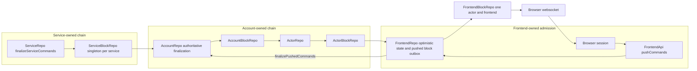
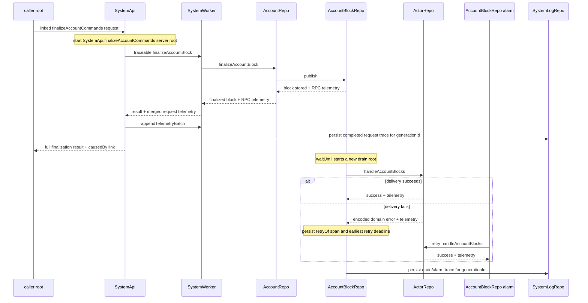
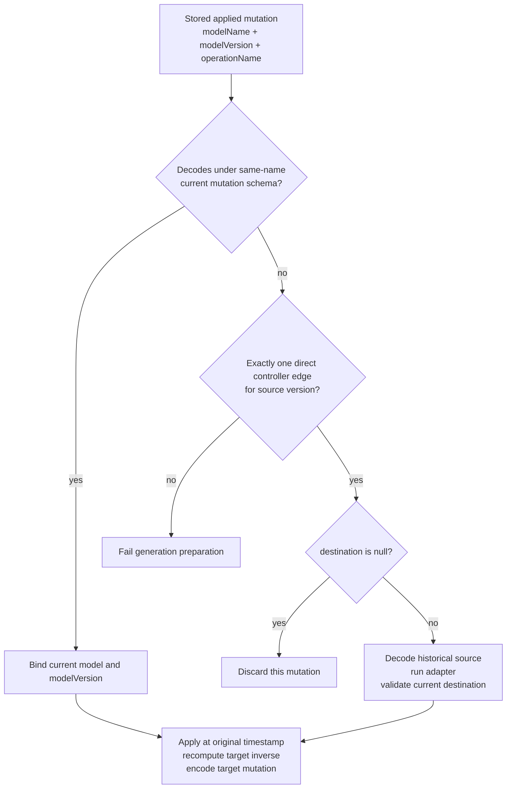
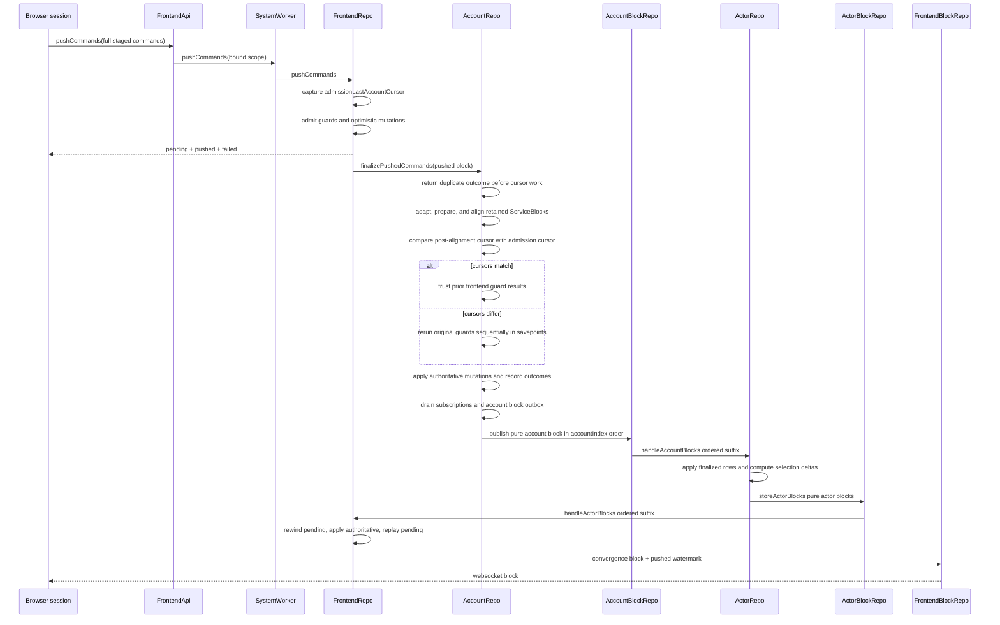
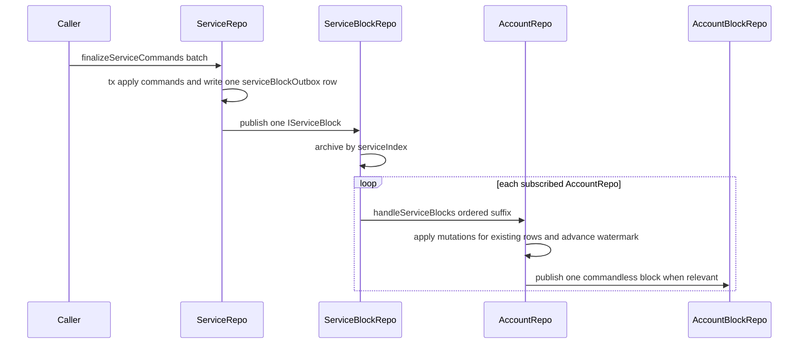

# Blockchain

Zerospin has two authoritative durable block chains that converge in AccountRepo before continuing through the ordinary actor/frontend projection, plus a FrontendRepo-owned admission path that feeds frontend pushes into the account chain:

1. Account changes flow `AccountRepo` → `AccountBlockRepo` → `ActorRepo` →
   `ActorBlockRepo` → `FrontendRepo`.
2. Service changes flow `ServiceRepo` → the singleton `ServiceBlockRepo` for
   that service → every subscribed `AccountRepo` → `AccountBlockRepo` and the
   same actor chain.
3. Frontend pushes flow `Browser session` → `FrontendApi` → `FrontendRepo`, where admission updates an optimistic frontend projection and creates an immutable pushed block; FrontendRepo then drains that block to `AccountRepo.finalizePushedCommands` (../../packages/dispatch-worker/src/FrontendApi/FrontendApi.ts:171-203, ../../packages/dispatch-worker/src/FrontendApi/FrontendApi.ts:382-405, ../../packages/system-worker/src/FrontendRepo/pushCommands/pushCommands.ts:301-461, ../../packages/system-worker/src/FrontendRepo/drainPushedBlockOutbox/drainPushedBlockOutbox.ts:33-133).
4. `FrontendRepo` receives authoritative convergence only from ActorBlockRepo delivery, converts actor deltas into one monotonic `frontendIndex`, then publishes `IFrontendBlock` values through its one-to-one `FrontendBlockRepo` websocket/archive (../../packages/system-worker/src/FrontendRepo/FrontendRepo.ts:166-187,
   ../../packages/system-worker/src/FrontendBlockRepo/FrontendBlockRepo.ts:20-76).

AccountRepo owns canonical service replicas, including retained deleted rows,
and one subscription watermark per service. The service-model table itself is
the replication record; no separate membership or deletion registry exists.
FrontendRepo has no service subscription, service watermark, or separate
replicated-resource registry (../../packages/system-worker/src/AccountRepo/AccountRepo.ts:140-175,
../../packages/system-worker/src/FrontendRepo/FrontendRepo.ts:62-116).

## Replica chain



Every Durable Object database belongs to one explicit data lineage. The locked
names are `sysrepo_{generationId}`,
`acctrepo_{generationId}/{accountId}/{accountName}`,
`atzrepo_{generationId}/{accountId}/{accountName}`,
`actrrepo_{generationId}/{accountId}/{accountName}/{actorName}/{actorId}`,
`frtrepo_{generationId}/{accountId}/{accountName}/{actorName}/{actorId}/{frontendName}`,
`svcrepo_{generationId}/{serviceName}`,
`acctbrepo_{generationId}/{accountId}/{accountName}`,
`actrbrepo_{generationId}/{accountId}/{accountName}/{actorName}/{actorId}`,
`frtbrepo_{generationId}/{accountId}/{accountName}/{actorName}/{actorId}/{frontendName}`,
`svcbrepo_{generationId}/{serviceName}`, and `syslogrepo_{generationId}`.
`makeRepoNameUtils` rejects a missing or wrong exact prefix before matching the
route, and repo bootstrap registers against the `generationId` parsed from its
own name so reading a predecessor during replay cannot register that source
repo into the target SystemRepo
(../../packages/core/src/utils/coreAbbreviations.ts:5-24,
../../packages/system-worker/src/makeRepo/makeRepoNameUtils.ts:33-79,
../../packages/system-worker/src/makeRepo/makeRepo.ts:180-207,
../../packages/system-worker/src/SystemRepo/SystemRepo.ts:167-223,
../../packages/system-worker/src/AccountRepo/AccountRepo.ts:218-223,
../../packages/system-worker/src/AuthorizationRepo/AuthorizationRepo.ts:79-84,
../../packages/system-worker/src/ActorRepo/ActorRepo.ts:130-137,
../../packages/system-worker/src/FrontendRepo/FrontendRepo.ts:143-150,
../../packages/system-worker/src/ServiceRepo/ServiceRepo.ts:191-196,
../../packages/system-worker/src/AccountBlockRepo/AccountBlockRepo.ts:49-54,
../../packages/system-worker/src/ActorBlockRepo/ActorBlockRepo.ts:112-119,
../../packages/system-worker/src/FrontendBlockRepo/FrontendBlockRepo.ts:36-43,
../../packages/system-worker/src/ServiceBlockRepo/ServiceBlockRepo.ts:65-70,
../../packages/system-worker/src/SystemLogRepo/SystemLogRepo.ts:263-279).

## Telemetry continuity

The account-finalize request trace starts with a caller-owned root. `makeTraceableApiTarget` captures that root and sends its identity in the linked SystemApi request; `SystemApi.finalizeAccountCommands` runs as a separate server root, while its inner `makeTraceableRpcTarget` / `makeRpcHandler` calls merge the SystemWorker and AccountRepo child telemetry into that server batch (../../packages/logger/src/makeTraceableApiTarget.ts:40-127, ../../packages/dispatch-worker/src/SystemApi/SystemApi.ts:218-282, ../../packages/logger/src/makeTraceableRpcTarget.ts:13-113, ../../packages/logger/src/makeRpcHandler.ts:11-75).

After account finalization settles, the common SystemApi boundary completes and flushes the server root, persists that batch through the same unwrapped SystemWorker stub used by the leaf, and can return a server-owned `causedBy` link pointing to the caller span. Persistence failure preserves the finalization result and returns `link: null` (../../packages/dispatch-worker/src/SystemApi/SystemApi.ts:72-154).



The shopping SystemApi e2e uses one explicit HTTP-batch session per sequential leaf, keeps two caller roots and their returned links, reads persisted SystemLogRepo span rows through separate raw public RepoExplorer sessions, and checks the cross-store relationship: each link's owned `traceId`/`spanId` identifies the completed server root, while its prior ids identify the originating caller span (../../examples/shopping/e2e/system.e2e.spec.ts:25-199).

`AccountBlockRepo.publish` stores only the completed publish span identity needed to link the separate `waitUntil` drain root with `kind: causedBy`. The drain reads and removes that durable context best-effort, captures the current Effect runtime once, and uses it for the existing concurrent queue so refresh and subscriber Effects retain the drain span without a raw context argument (../../packages/system-worker/src/AccountBlockRepo/publish/publish.ts:90-96, ../../packages/system-worker/src/AccountBlockRepo/drainActorOutbox/drainActorOutbox.ts:11-66, ../../packages/system-worker/src/AccountBlockRepo/drainActorOutbox/drainActorOutbox.ts:68-181).

Failed ActorRepo delivery stores the failing span identity as `retryOf`, records the subscriber's next retry deadline, and returns that deadline to the queue. The queue schedules the earliest deadline across the completed concurrent wave; the alarm consumes the stored identity and links its new root before re-entering the same drain Effect (../../packages/system-worker/src/AccountBlockRepo/processSubscriber/processSubscriber.ts:138-190, ../../packages/system-worker/src/AccountBlockRepo/drainActorOutbox/drainActorOutbox.ts:124-207, ../../packages/system-worker/src/AccountBlockRepo/alarm/alarm.ts:9-36). Request, drain, and alarm collectors flush separately into the generation-scoped SystemLogRepo; stable record ids make retries idempotent and retention deletes span, log, and link rows for traces beyond the newest 1,000 (../../packages/dispatch-worker/src/SystemApi/SystemApi.ts:72-154, ../../packages/system-worker/src/SystemWorker.ts:246-273, ../../packages/system-worker/src/AccountBlockRepo/AccountBlockRepo.ts:153-203, ../../packages/system-worker/src/AccountBlockRepo/AccountBlockRepo.ts:223-277, ../../packages/system-worker/src/SystemLogRepo/appendTelemetryBatch/appendTelemetryBatch.ts:21-155).

## Block and delta types

1. `IAccountBlock` is the canonical account batch: it carries nullable `pushedBlockId`, executed and failed command unions, encoded applied mutations, `lastAccountCursor`, and `accountIndex`. A pushed transaction stores full `IExecutedPushedCommand` or `IFailedPushedCommand` outcomes; ordinary account and service-origin blocks use `pushedBlockId: null` (../../packages/system-worker/src/types.ts:117-136, ../../packages/system-worker/src/AccountRepo/finalizeAccountBlock/finalizeAccountBlock.ts:42-70, ../../packages/system-worker/src/AccountRepo/handleServiceBlocks/handleServiceBlocks.ts:144-162).
2. `IActorBlock` adds actor-selection deltas without replacing any account-block provenance or command outcomes. ActorRepo applies the account block and spreads it unchanged into its actor-block outbox record, so `pushedBlockId` and full terminal pushed commands continue downstream (../../packages/system-worker/src/types.ts:151-164, ../../packages/system-worker/src/ActorRepo/handleAccountBlocks/handleAccountBlocks.ts:156-177).
3. `IServiceBlock` is one finalized ServiceRepo command batch with executed and
   failed commands, applied mutations, `lastServiceCursor`, and
   `serviceIndex` (../../packages/system-worker/src/types.ts:140-147,
   ../../packages/system-worker/src/ServiceRepo/finalizeServiceCommands/finalizeServiceCommands.ts:202-248).
4. `IPushedBlock` is one FrontendRepo-assigned `pblk_*` containing a session id, a required nullable `admissionLastAccountCursor`, and full encoded pushed commands. `null` represents the initial account frontier. `IPushedCommand` retains the frontend payload/version, command type, staged cursor/time, and adds pushed time/cursor (../../packages/core/src/contracts/types.ts:250-321, ../../packages/core/src/contracts/CommandSchema.ts:155-162).
5. `IFrontendBlock` is the browser-facing convergence stream. Its delta has ordinary `inserted`, `updated`, and `deleted` entries plus a complete pending pushed snapshot, pushed terminal outcomes, and `lastRebasedPushedCursor`; service replicas use the same ordinary delta paths (../../packages/core/src/session/types.ts:70-87, ../../packages/core/src/session/FrontendBlockSchema.ts:17-35).

## Client-safe service models and actor selections

`makeServiceModel` is a client-safe model factory: it calls `makeModel`, adds an
enumerable immutable `serviceName`, and imports no server-only marker. The
server-only `makeServiceController` accepts only service models whose ownership
matches its controller name and rejects plain or wrong-service models at
runtime (../../packages/core/src/models/makeServiceModel.ts:1-39,
../../packages/core/src/service/makeServiceController.ts:97-153).

Actor controllers declare an explicit complete `models` registry. The type and
runtime checks require one selection per model, under the same key, referencing
the exact same model object (../../packages/core/src/actorController/makeActorController.ts:87-202).
Selection compilation receives that full registry, supports both forward refs
and inverse relation names, and starts from a distinct root selection so
inverse-many joins cannot duplicate root resources
(../../packages/core/src/models/makeSelection.ts:280-381,
../../packages/core/src/models/makeSelection.ts:388-466).

`makeModel` now owns and exposes the concrete table containing its synthesized
primary-key `id` and declared attributes. A model ref names that table plus
mandatory forward and inverse relation names; `makeDbConfig({ tables })` and
`makeResourceDbConfig` derive schema and Drizzle relations from the same table
graph. `primitives.self` resolves a relation to the current table before config
construction; cross-table ref cycles remain invalid. Every ref becomes a
forward `one`; a unique ref produces an inverse `one`, while a non-unique ref
produces an inverse `many`
(../../packages/core/src/models/makeModel.ts:186-305,
../../packages/core/src/models/primitives.ts:539-722,
../../packages/core/src/drizzle/makeDbConfig.ts:13-61,
../../packages/core/src/drizzle/makeDrizzleRelations.ts:19-385).

Shopping declares models in dependency order: Cart references `User.table`, and
CartItem references `Cart.table` and `Product.table`. The Product selection can
therefore walk the derived inverse `cartItems` relation through Cart and User,
so only Products referenced by active actor CartItems enter the actor graph
(../../examples/shopping/src/zerospin/models.ts:5-65,
../../examples/shopping/src/zerospin/system.ts:33-68).

## SemVer model history and model-owned mutations

`makeModel` accepts one complete current definition and an array of complete
historical definitions. Every definition carries the same `modelName` and
abbreviation plus its own SemVer, complete attributes, and indexes. Construction
rejects an invalid SemVer, a historical identity mismatch, and duplicate
versions; the historical array is definition data, not a migration chain.
`makeModel` supplies explicit framework metadata through
`makeModelAndMetadata`; `makeServiceModel` supplies the same metadata plus its
nullable `deletedAt` deletion marker before attaching the immutable service
owner (../../packages/core/src/models/makeModel.ts:230-340,
../../packages/core/src/models/makeServiceModel.ts:22-120).

## Persisted reference enforcement

Every persisted `primitives.ref` is both a Drizzle relation and an immediate
SQLite foreign key. Database configuration combines resource-model and other
tables into one graph, records each logical table identity, and resolves lazy
Drizzle reference closures against that graph. Migration SQL emits concrete
`FOREIGN KEY (...) REFERENCES ... (...)` clauses without cascade, set-null, or
deferred options, leaving SQLite's default `NO ACTION` behavior
(../../packages/core/src/drizzle/makeDbConfig.ts:26-61,
../../packages/core/src/drizzle/makeDrizzleSchemas.ts:16-53,
../../packages/core/src/drizzle/makeTableMigrationSQL.ts:43-60).

Every database-opening boundary explicitly enables `PRAGMA foreign_keys = ON`
before transactions begin. A create, update, delete, move, or replicated-row
write that violates a reference becomes
`mutation-referential-integrity-failed` with model, resource, and operation
context; inverse replay maps the same write failure instead of exposing a raw
SQLite defect (../../packages/core/src/drizzle/makeInMemorySqlJsDatabase.ts:7-12,
../../packages/core/src/drizzle/makeInMemorySQLite3.ts:18-25,
../../packages/system-worker/src/makeDurableDb.ts:11-20,
../../packages/core/src/contracts/applyMutationTx.ts:93-118,
../../packages/core/src/contracts/applyMutationInverseTx.ts:27-303).

The returned model owns both sides of every versioned mutation operation:
`createMutation(version)` / `create(version, props)`,
`updateMutation(version)` / `update(version, props)`,
`deleteMutation(version)` / `delete(version, props)`,
`moveMutation(version)` / `move(version, props)`, and, for service models,
`replicateResourceMutation(version)` / `replicateResource(version, props)`.
Every method rejects a version absent from the current or historical definition
set. The schema side encodes `modelName`, `modelVersion`, `operationName`,
`resourceId`, and the version-specific operation shape; the constructor side
returns the decoded mutation bound to that exact model definition
(../../packages/core/src/models/makeModel.ts:363-838).

## Contract-declared mutation shapes and order

Every contract declares `mutations` as an Effect Schema or `null`. A schema
requires a program whose Effect result has that exact shape; `null` forbids a
program and supplies the internal empty result. Contracts do not carry
historical definitions or payload adapters (../../packages/core/src/contracts/makeContract.ts:91-166).

`makeMutations` validates the payload, runs the program once, validates its
complete result against the declared schema, and flattens only at this boundary.
`Schema.Tuple` and `Schema.Array` retain array order; `Schema.Struct` retains
declaration/property order; a single mutation becomes one element; and
`mutations: null` becomes an empty mutation list. Ownership validation runs only
after that ordered flattening (../../packages/core/src/contracts/makeMutations.ts:10-64).

Shopping's `addToCart` demonstrates a structural declaration whose order is
part of the command: the CartItem create mutation precedes the Product replica
mutation, and the program returns the matching keyed Effect result
(../../examples/shopping/src/zerospin/contracts.ts:98-123).

## Controller-owned direct mutation adapters

Account controllers own mutation adapters for account models; service
controllers own adapters for service models, including `replicateResource`.
Each `mutationAdapters[modelName][operationName]` entry is an array of direct
historical-source edges. A non-null edge must name a current destination schema
for the same operation and provide a requirement-free Effect callback. A
`destination: null` edge omits the callback and deliberately retires that
historical mutation. Destinations cannot point to historical versions, so
adapter chains are not followed
(../../packages/core/src/accountController/makeAccountController.ts:228-490,
../../packages/core/src/service/makeServiceController.ts:240-508).

Removing a model requires exhaustive retirement coverage rather than dropping
its table definition alone. An account model must cover `create`, `update`,
`delete`, and `move` for the same historical version set; a service model must
also cover `replicateResource`. Every edge may adapt into a current model or
explicitly discard to `null`
(../../packages/core/src/accountController/makeAccountController.ts:493-517,
../../packages/core/src/service/makeServiceController.ts:511-548).



During generation replay, `replayAppliedMutationTx` first attempts the automatic
same-name current-schema promotion. Incompatible or renamed mutations must
match exactly one direct source edge. A null destination returns no target
mutation; a non-null adapter result is validated before application. The target
application preserves the source command id, mutation index, and timestamp but
recomputes inverse state from the new generation's rows
(../../packages/core/src/contracts/replayAppliedMutationTx.ts:33-174,
../../packages/core/src/contracts/replayAppliedMutationTx.ts:176-399).

## Model-owned `replicateResource`

`ServiceModel.replicateResource(version, { resource })` validates the complete
resource against that model version and verifies both `modelName` and resource
version. Its matching `replicateResourceMutation(version)` schema carries the
whole resource, derived `serviceName`, model identity, version, operation, and
resource id. There is no release operation
(../../packages/core/src/models/makeModel.ts:698-838).

The same mutation has runtime-specific write behavior:

1. Browser sessions and FrontendRepo use
   [`applyFrontendMutationTx`](../../packages/core/src/contracts/applyFrontendMutationTx.ts).
   It immediately upserts the complete resource and captures the prior complete
   row for optimistic rollback (../../packages/core/src/contracts/applyFrontendMutationTx.ts:14-114).
2. AccountRepo and ActorRepo use
   [`applyAccountMutationTx`](../../packages/core/src/contracts/applyAccountMutationTx.ts).
   It upserts the complete canonical service row into the account/actor model
   table while preserving applied-mutation metadata
   (../../packages/core/src/contracts/applyAccountMutationTx.ts:10-91).
3. Authoritative service changes reach the browser as ordinary actor-selected
   inserted or updated rows; a service delete is an update carrying
   `deletedAt`. A failed optimistic command still
   restores or deletes its previous local replica through the saved inverse
   (../../packages/core/src/session/applyFrontendBlock.ts:43-153,
   ../../packages/core/src/contracts/applyMutationInverseTx.ts:20-92).

AccountRepo has no per-resource registry or watermark. A service-model row joins
replication when a canonical snapshot is inserted. An authoritative service
delete retains that row with `deletedAt`, and ActorRepo, FrontendRepo, and the
session receive the retained resource through the ordinary updated-resource
path. ActorRepo and FrontendRepo store the rows selected into their graphs
(../../packages/system-worker/src/AccountRepo/AccountRepo.ts:140-175,
../../packages/system-worker/src/AccountRepo/handleServiceBlocks/handleServiceBlocks.ts:105-171,
../../packages/system-worker/src/ActorRepo/handleAccountBlocks/handleAccountBlocks.ts:84-153).

## Model-owned delete mutations

`Model.deleteMutation(version)` and `Model.delete(version, { resourceId })`
remain the single encoded/decoded delete operation. Ownership is the ordinary
mutation rule enforced by
`assertMutationsUseModels`: service contracts delete their own service models,
account contracts delete plain account models, and an account contract emitting
delete for a service model is rejected
(../../packages/core/src/models/makeModel.ts:557-622,
../../packages/core/src/contracts/assertMutationsUseModels.ts:29-69).

For a plain model, delete still physically removes the row. For a service model,
the same delete preserves every attribute and sets both `deletedAt` and
`updatedAt` to the mutation's `appliedAt`. The applied mutation still stores the
complete prior resource as its `{ resource }` inverse
(../../packages/core/src/contracts/applyMutationTx.ts:48-119,
../../packages/core/src/contracts/applyMutationInverseTx.ts:1-306).

Deletion is terminal. An exact same-timestamp service-delete replay succeeds as
a no-op; a differently timestamped delete, create, update, move, or replication
against the deleted id fails with `service-resource-deleted`. ServiceRepo also
returns that failure instead of a live canonical row for new replication
(../../packages/core/src/contracts/applyMutationTx.ts:48-80,
../../packages/core/src/contracts/applyMutationTx.ts:121-331,
../../packages/core/src/contracts/commitAppliedMutationTx.ts:40-320,
../../packages/system-worker/src/ServiceRepo/getReplicatedResources/getReplicatedResources.ts:122-172).

When AccountRepo applies a relevant service delete, it retains the same row and
advances the service subscription watermark. Downstream projections therefore
carry one identical deletion timestamp without transforming the encoded delete
mutation or its inverse
(../../packages/system-worker/src/AccountRepo/handleServiceBlocks/handleServiceBlocks.ts:105-171,
../../packages/core/src/contracts/commitAppliedMutationTx.ts:40-320).

Queries receive no implicit `deletedAt` predicate. A service query can return a
deleted row unless its caller explicitly excludes it.

## Account validation and canonical replacement

[`prepareAccountCommands`](../../packages/system-worker/src/AccountRepo/finalizeAccountBlock/prepareAccountCommands.ts)
runs before the AccountRepo SQLite transaction. It verifies ownership, groups
replication refs by exact `serviceRepoName`, reads each persisted subscription
watermark, and issues one concurrent `getReplicatedResources` request per
service. ServiceRepo returns the requested rows in request order together with
the retained ServiceBlock suffix and one cursor/index watermark from the same
SQLite transaction; preparation maps missing or failed results back to their
owning commands and replaces successful client seeds with decoded canonical
rows
(../../packages/system-worker/src/AccountRepo/finalizeAccountBlock/prepareAccountCommands.ts:33-393,
../../packages/system-worker/src/ServiceRepo/getReplicatedResources/getReplicatedResources.ts:22-221).

Both ordinary and pushed finalization run grouped snapshot preparation and the
local AccountRepo transaction inside one coarse `blockConcurrencyWhile` gate,
so a queued `handleServiceBlocks` delivery cannot advance the subscription
between reading C and committing W. Outbox subscription and publication drain
only after the gate releases
(../../packages/system-worker/src/AccountRepo/AccountRepo.ts:331-469).

If the service, model, resource, or resource schema is invalid, that command's
prepared mutations are `Either.Left`; `finalizeCommandsTx` emits a failed
account command and performs no mutation writes for it. Before applying each
successful canonical mutation, the transaction advances an existing service
projection through the returned block suffix, emits commandless AccountBlocks
for relevant retained blocks, and inserts or updates the exact-name service
subscription at the snapshot watermark. Successful commands retain the full
command and full canonical replication mutation in the final account block
(../../packages/system-worker/src/AccountRepo/finalizeAccountBlock/prepareAccountCommands.ts:279-393,
../../packages/system-worker/src/AccountRepo/finalizeAccountBlock/finalizeCommandsTx.ts:40-239,
../../packages/system-worker/src/AccountRepo/finalizeAccountBlock/finalizeCommandsTx.ts:241-313).

Ordinary AccountRepo and ServiceRepo commands apply inside one savepoint per
command. A referential-integrity or terminal-deletion failure rolls back every
mutation from that command, records the normal failed command, and leaves later
sibling commands eligible to execute; pushed-command savepoints are unchanged
(../../packages/system-worker/src/AccountRepo/finalizeAccountBlock/finalizeCommandsTx.ts:242-313,
../../packages/system-worker/src/ServiceRepo/finalizeServiceCommands/finalizeServiceCommands.ts:101-230).

## Account and actor delivery



ActorRepo commits every registered actor model mutation, including complete
service replicas, recomputes every selection using the actor's full model
registry, stores pure actor blocks in its outbox, and publishes them to
ActorBlockRepo
(../../packages/system-worker/src/ActorRepo/handleAccountBlocks/handleAccountBlocks.ts:62-230).

ActorBlockRepo stores each actor block once and identifies each subscriber by
its exact prefixed `frontendRepoName`, while keeping `frontendName` separately.
The drain calls `FRONTEND_REPO.getByName(frontendRepoName)` directly, advances
the subscriber watermark on success, and on failure persists retry state plus
the exact future deadline used to retain the earliest alarm across wake and
resume (../../packages/system-worker/src/ActorBlockRepo/ActorBlockRepo.ts:78-124,
../../packages/system-worker/src/ActorBlockRepo/drainFrontendSubscribers/drainFrontendSubscribers.ts:25-199).

FrontendRepo bootstrap snapshots the frontend binding's selected actor models, including selected service-model rows and graph refs, records ActorRepo's account cursor/index, initializes its frontend index, and subscribes itself to ActorBlockRepo from that watermark. Pushed state is not imported from ActorRepo because FrontendRepo owns it (../../packages/system-worker/src/FrontendRepo/bootstrap/bootstrap.ts:23-123, ../../packages/system-worker/src/FrontendRepo/FrontendRepo.ts:80-123).

`handleActorBlocks` first rewinds every pending pushed mutation in reverse pushed/mutation order, applies the authoritative actor deltas and encoded mutations, removes terminal pushed commands, and deletes a matching pushed-block outbox row. It then rebuilds optimistic state by replaying remaining commands in pushed order, each inside a savepoint. A failed server-side optimistic replay silently removes that pending command, records an annotated warning, and does not invent an authoritative failure outcome. After the transaction, any replay-warning batch is appended best-effort to the generation-scoped SystemLogRepo (../../packages/system-worker/src/FrontendRepo/handleActorBlocks/handleActorBlocks.ts:95-288, ../../packages/system-worker/src/FrontendRepo/handleActorBlocks/handleActorBlocks.ts:290-384, ../../packages/system-worker/src/FrontendRepo/handleActorBlocks/handleActorBlocks.ts:509-531).

After terminal cleanup, FrontendRepo advances each affected session's terminal staged cursor to the processed cursor when no open pushed block remains. It emits one idempotent convergence block containing the final optimistic rows/deletes for every affected reference, the complete pending snapshot, terminal pushed outcomes, and the current pushed watermark (../../packages/system-worker/src/FrontendRepo/handleActorBlocks/handleActorBlocks.ts:386-418, ../../packages/system-worker/src/FrontendRepo/handleActorBlocks/handleActorBlocks.ts:420-505).

## Service delivery



ServiceRepo assigns one service cursor/index per command, applies all successful
service-owned mutations, records command failures, builds one `IServiceBlock`
for the whole finalization batch, and writes the service resource changes,
cursors, and block outbox atomically
(../../packages/system-worker/src/ServiceRepo/finalizeServiceCommands/finalizeServiceCommands.ts:34-260).

`drainServiceBlockOutbox` publishes pending rows in service-index order to the
single ServiceBlockRepo named by `{ generationId, serviceName }`, records
publish failures durably, and uses a Durable Object alarm for retry
(../../packages/system-worker/src/ServiceRepo/drainServiceBlockOutbox/drainServiceBlockOutbox.ts:20-76).

ServiceBlockRepo remains the only durable subscriber-delivery queue. The
grouped replication snapshot reads retained blocks from ServiceRepo's source
outbox in `(C, W]`; it does not consume, acknowledge, or replace the
ServiceBlockRepo delivery path
(../../packages/system-worker/src/ServiceRepo/getReplicatedResources/getReplicatedResources.ts:71-196,
../../packages/system-worker/src/ServiceBlockRepo/ServiceBlockRepo.ts:29-130).

ServiceBlockRepo archives every service block and identifies each subscriber by
its exact prefixed `accountRepoName`, while keeping account id/name separately.
Its drain calls `ACCOUNT_REPO.getByName(accountRepoName)` directly, advances the
service cursor/index on success, and on failure persists exponential retry
metadata plus the exact earliest future alarm deadline so a premature wake does
not discard pending work
(../../packages/system-worker/src/ServiceBlockRepo/ServiceBlockRepo.ts:29-130,
../../packages/system-worker/src/ServiceBlockRepo/drainAccountSubscribers/drainAccountSubscribers.ts:18-143).

AccountRepo likewise identifies each service subscription by the exact
prefixed `serviceRepoName` while retaining `serviceName` as a separate routing
invariant. AccountBlockRepo identifies actor subscribers by exact
`actorRepoName`, and its delivery boundary passes that stored name directly to
`ACTOR_REPO.getByName`
(../../packages/system-worker/src/AccountRepo/AccountRepo.ts:140-198,
../../packages/system-worker/src/AccountRepo/handleServiceBlocks/handleServiceBlocks.ts:21-80,
../../packages/system-worker/src/AccountBlockRepo/accountBlockDrizzleSchemas.ts:184-214,
../../packages/system-worker/src/AccountBlockRepo/processSubscriber/processSubscriber.ts:122-185).

AccountRepo processes blocks explicitly by `serviceIndex`, applies mutations
only when the addressed service-model row already exists, and advances the one
service subscription watermark even when every mutation is irrelevant. A
relevant ServiceBlock enqueues one AccountBlock with a fresh account
cursor/index and empty executed/failed command arrays; a service delete updates
the retained row with its deletion marker
(../../packages/system-worker/src/AccountRepo/handleServiceBlocks/handleServiceBlocks.ts:72-171).

`drainAccountOutboxes` retries pending account subscriptions, then publishes
pending AccountBlocks strictly by `accountIndex`. It records publication state,
stops after the first block failure, and schedules the AccountRepo alarm for
retry; account finalization, service handling, and `alarm` all invoke this drain
(../../packages/system-worker/src/AccountRepo/drainAccountOutboxes/drainAccountOutboxes.ts:25-148,
../../packages/system-worker/src/AccountRepo/AccountRepo.ts:352-435).

## Generation ledger replay and watermarks

A migrated generation is rebuilt from the predecessor's immutable service and
account block ledgers, not by re-running historical contract programs. Before
preparation, `SystemRepo.drainGeneration` closes writes, drains FrontendRepo,
ServiceRepo, ServiceBlockRepo, AccountRepo, and AccountBlockRepo in dependency
order, then captures a paired terminal cursor/index for every registered
ServiceBlockRepo and AccountBlockRepo. A drain retry must observe the same
bounds, and the generation becomes `drained` only after every registered block
repo has one durable bound (../../packages/system-worker/src/SystemRepo/drainGeneration/drainGeneration.ts:69-288,
../../packages/system-worker/src/SystemRepo/drainGeneration/drainGeneration.ts:290-525,
../../packages/system-worker/src/ServiceBlockRepo/getReplayBound/getReplayBound.ts:9-53,
../../packages/system-worker/src/AccountBlockRepo/getReplayBound/getReplayBound.ts:9-55).

```mermaid
sequenceDiagram
  participant Caller as deployment coordinator
  participant Worker as candidate SystemWorker
  participant TargetSystem as target SystemRepo
  participant SourceSystem as predecessor SystemRepo
  participant SourceServiceLedger as predecessor ServiceBlockRepo
  participant TargetService as target ServiceRepo
  participant TargetServiceLedger as target ServiceBlockRepo
  participant SourceAccountLedger as predecessor AccountBlockRepo
  participant TargetAccount as target AccountRepo
  participant TargetAccountLedger as target AccountBlockRepo

  Caller->>Worker: prepareGeneration(deployId, generationId, prevGenerationId, systemSpec, seeds=[])
  Worker->>TargetSystem: prepareGeneration
  TargetSystem->>SourceSystem: require ready + drained; read immutable bounds
  loop each source ServiceRepo, then each serviceIndex through captured bound
    TargetSystem->>SourceServiceLedger: getReplayBlock(after, through)
    TargetSystem->>TargetService: replayServiceBlock(full source block)
    TargetService->>TargetService: adapt or discard stored mutations; preserve commands and watermark
    TargetService->>TargetServiceLedger: publish exact target block
    TargetServiceLedger-->>TargetService: verify serviceIndex + lastServiceCursor
  end
  loop each source AccountRepo, then each accountIndex through captured bound
    TargetSystem->>SourceAccountLedger: getReplayBlock(after, through)
    TargetSystem->>TargetAccount: replayAccountBlock(full source block)
    TargetAccount->>TargetAccount: adapt or discard stored mutations; preserve commands and watermark
    TargetAccount->>TargetAccountLedger: publish exact target block
    TargetAccountLedger-->>TargetAccount: verify accountIndex + lastAccountCursor
  end
  TargetSystem->>TargetAccount: restore each service subscription cursor/index
  TargetSystem->>TargetSystem: verify source/target owner-repo counts; mark ready
  TargetSystem-->>Worker: readiness = ready
  Worker-->>Caller: prepared identity
```

Service ledgers replay first, one source ServiceRepo and one strictly ascending
block at a time through its captured service bound. Every target ServiceRepo is
instantiated even when its source ledger is empty. Each replay receipt is keyed
to the deploy, predecessor, source index, and cursor; publication is blocking,
and the target ServiceBlockRepo must contain the exact terminal watermark before
the repo completion is stored
(../../packages/system-worker/src/SystemRepo/prepareGeneration/prepareGeneration.ts:518-857,
../../packages/system-worker/src/ServiceRepo/replayServiceBlock/replayServiceBlock.ts:27-198,
../../packages/system-worker/src/ServiceRepo/replayServiceBlock/replayServiceBlock.ts:200-354).

Account ledgers replay only after all service completions. Account mutation
ownership remains split: service-origin and replica mutations use the owning
service controller's adapters; account mutations use the account controller.
The target block spreads the complete source block and replaces only its
adapted applied-mutation array, preserving full encoded commands, pushed-block
provenance, cursor/index, and timestamps. Each replay then publishes and verifies
the exact target AccountBlockRepo block
(../../packages/system-worker/src/SystemRepo/prepareGeneration/prepareGeneration.ts:859-1132,
../../packages/system-worker/src/AccountRepo/replayAccountBlock/replayAccountBlock.ts:85-194,
../../packages/system-worker/src/AccountRepo/replayAccountBlock/replayAccountBlock.ts:195-370,
../../packages/system-worker/src/AccountRepo/replayAccountBlock/replayAccountBlock.ts:375-438).

After one account ledger reaches its bound, preparation copies each source
service subscription's exact `currentServiceCursor` and `currentServiceIndex`
into the target AccountRepo, but only after proving that watermark is not beyond
the captured service-ledger bound. This preserves the account's position in the
service chain without copying ActorRepo or FrontendRepo projection databases.
Preparation finally requires equal source/target ServiceRepo and AccountRepo
counts before committing target readiness
(../../packages/system-worker/src/SystemRepo/prepareGeneration/prepareGeneration.ts:1134-1283,
../../packages/system-worker/src/SystemRepo/prepareGeneration/prepareGeneration.ts:1285-1393).

## Generation replay trigger

1. [`SystemWorker.prepareGeneration`](../../packages/system-worker/src/prepareGeneration/prepareGeneration.ts) receives the candidate `deployId`, target `generationId`, nullable `prevGenerationId`, complete `systemSpec`, and seeds.
   1. It delegates to the target generation's SystemRepo and returns only an exact `{ deployId, generationId, readiness: 'ready' }` result (../../packages/system-worker/src/prepareGeneration/prepareGeneration.ts:17-82).
2. Preparation is blocking but is not activation. It builds or validates a closed target lineage; opening generation admission happens later.

## Annotated generation replay steps

1. [`SystemRepo.prepareGeneration`](../../packages/system-worker/src/SystemRepo/prepareGeneration/prepareGeneration.ts) verifies that the supplied SystemSpec encodes identically to the candidate Worker's runtime system and establishes exclusive preparation ownership (../../packages/system-worker/src/SystemRepo/prepareGeneration/prepareGeneration.ts:91-214).
2. A compatible reuse has `prevGenerationId: null`, no seeds, and no ledger replay. It rechecks compatibility against the generation's active SystemSpec and records the candidate as the preparing deploy (../../packages/system-worker/src/SystemRepo/prepareGeneration/prepareGeneration.ts:216-320).
3. A detached initial or clean generation has `prevGenerationId: null`; its ordered seeds run through ordinary account/service finalization so it begins with normal authoritative ledgers (../../packages/system-worker/src/SystemRepo/prepareGeneration/prepareGeneration.ts:323-445).
4. A migration has a non-null predecessor, forbids seeds, and requires the predecessor to be ready and drained with an active SystemSpec. It must actually require a new generation and have complete adapter coverage (../../packages/system-worker/src/SystemRepo/prepareGeneration/prepareGeneration.ts:446-516).
5. Services replay to their captured bounds before accounts. Every target block is published and verified, and per-repo completion rows make a same-deploy retry idempotent (../../packages/system-worker/src/SystemRepo/prepareGeneration/prepareGeneration.ts:518-857).
6. Accounts then replay to their bounds, restore exact service-subscription watermarks, and store verified per-repo completions (../../packages/system-worker/src/SystemRepo/prepareGeneration/prepareGeneration.ts:859-1283).
7. Readiness commits only after clean seeding or all migration postconditions. Any failure permanently marks the target generation `failed` and keeps admission closed (../../packages/system-worker/src/SystemRepo/prepareGeneration/prepareGeneration.ts:1316-1421).

## Pushed commands and optimistic replication

Browser staging runs the frontend contract immediately with frontend models,
so `replicateResource` inserts the whole service row optimistically and saves
its inverse before any network request (../../packages/core/src/session/makeSession.ts:163-269).

For nonempty staging, the browser obtains a signature from the session and sends the full encoded staged rows through one linked `FrontendApi.pushCommands` call. The gateway validates that wire shape, binds account/actor/frontend scope plus its pinned deploy/generation pair, and SystemWorker write-admits that pair before delegating to the corresponding generation-scoped FrontendRepo (../../packages/frontend/src/pushStagedCommands.ts:63-105, ../../packages/dispatch-worker/src/FrontendApi/FrontendApi.ts:171-203, ../../packages/dispatch-worker/src/FrontendApi/FrontendApi.ts:408-431, ../../packages/system-worker/src/SystemWorker.ts:1581-1653).

FrontendRepo classifies each session in staged-cursor order. An exact command still in an open pushed block returns as pending; a reused cursor with different command content fails as a conflict; cursors at or below the terminal and processed SQLite-KV watermarks fail with distinct terminal/processed codes; only higher cursors enter new admission (../../packages/system-worker/src/FrontendRepo/pushCommands/pushCommands.ts:75-299).

After bootstrap, FrontendRepo reads its repo-local last account cursor once at the start of the admission transaction. New admission then uses that same optimistic SQLite frontier: it decodes and validates the frontend payload, runs frontend guards, makes mutations, and isolates the command inside `withSavepoint`. Each success receives a global pushed cursor and persists its complete pushed command plus one encoded applied-mutation row per command/mutation index; each failure rolls back that command while successful siblings continue (../../packages/system-worker/src/FrontendRepo/pushCommands/pushCommands.ts:121-144, ../../packages/system-worker/src/FrontendRepo/pushCommands/pushCommands.ts:301-420, ../../packages/system-worker/src/FrontendRepo/FrontendRepo.ts:41-106).

All successes from one RPC form one immutable FrontendRepo-assigned pushed block stamped with that single `admissionLastAccountCursor`. The transaction commits optimistic resource rows, pushed lifecycle rows, mutation inverses, the pushed-block outbox row, staged-cursor watermarks, and `lastRebasedPushedCursor` before returning. Acceptance is visible immediately only through the origin response and later `getFrontendState`; it does not emit a frontend block (../../packages/core/src/contracts/types.ts:282-297, ../../packages/core/src/contracts/CommandSchema.ts:155-162, ../../packages/system-worker/src/FrontendRepo/pushCommands/pushCommands.ts:395-471, ../../packages/system-worker/src/FrontendRepo/getFrontendState/getFrontendState.ts:47-84).

Pushed-block delivery selects unfinalized rows by first pushed cursor. Each row gets three total attempts using an exponential schedule; a failed row stores its failure and ends the drain before later blocks can overtake it. There is no pushed-block retry alarm: `pushCommands`, `getFrontendState`, and actor-block handling start a later drain. A successful row is marked finalized but retained until the matching actor block returns (../../packages/system-worker/src/FrontendRepo/drainPushedBlockOutbox/drainPushedBlockOutbox.ts:33-133, ../../packages/system-worker/src/FrontendRepo/FrontendRepo.ts:166-247, ../../packages/system-worker/src/FrontendRepo/FrontendRepo.ts:262-275).

`AccountRepo.finalizePushedCommands` checks command scope and first looks up the account-block outbox by the unique nullable `pushedBlockId`; a duplicate returns the stored result before reading a cursor or resolving a guard. A new block always re-runs frontend-to-account adaptation and authoritative preparation from the full pushed commands, then applies retained ServiceBlocks and tracks the cursor of each relevant intermediate AccountBlock. Only after alignment does it compare the current cursor once with the block's admission cursor (../../packages/system-worker/src/AccountRepo/AccountRepo.ts:103-165, ../../packages/system-worker/src/AccountRepo/finalizePushedCommands/finalizePushedCommands.ts:85-292, ../../packages/system-worker/src/AccountRepo/finalizePushedCommands/finalizePushedCommands.ts:294-472).

Exact cursor equality, including `null === null`, trusts the frontend guard results. A mismatch makes AccountRepo resolve the original frontend contract and guard array, decode and validate each original frontend payload, and rerun those guards in declared order inside each command's existing savepoint. Both modes still apply the prepared authoritative mutations, allocate normal account cursor/index outcomes, and continue after an isolated command failure. The admission cursor certifies only prior frontend guard evaluation; adaptation, preparation, alignment, authoritative application, ledger assignment, publication, and fanout always remain AccountRepo work (../../packages/system-worker/src/AccountRepo/finalizePushedCommands/finalizePushedCommands.ts:470-615).

The resulting immutable account block preserves full pushed-command provenance in every terminal outcome and carries its `pushedBlockId`. ActorRepo is projection-only: it applies finalized mutations, computes actor selections, and forwards that provenance and those outcomes unchanged in the actor block (../../packages/system-worker/src/AccountRepo/finalizePushedCommands/finalizePushedCommands.ts:556-615, ../../packages/system-worker/src/types.ts:117-164, ../../packages/system-worker/src/ActorRepo/handleAccountBlocks/handleAccountBlocks.ts:90-177).

## Frontend block archive and websocket

FrontendRepo drains unpublished frontend outbox rows in `frontendIndex` order to
the matching FrontendBlockRepo, marks them published on success, and records a
failure plus alarm on delivery error
(../../packages/system-worker/src/FrontendRepo/drainFrontendBlockOutbox/drainFrontendBlockOutbox.ts:17-80).

FrontendBlockRepo is a hibernating PartyServer with one archive and websocket
room per actor/frontend key. `storeFrontendBlocks` ignores an already archived
frontend index, stores the encoded block, and broadcasts
`{ type: "frontendBlock", sync }` to every socket in that room
(../../packages/system-worker/src/FrontendBlockRepo/FrontendBlockRepo.ts:20-76,
../../packages/system-worker/src/FrontendBlockRepo/storeFrontendBlocks/storeFrontendBlocks.ts:10-49).

React obtains a one-use ticket through the authenticated FrontendApi and opens
the fixed `/ws-frontend-blocks` route with only `publishableKey` and `ticket`.
The browser never constructs or transmits the FrontendBlockRepo name. Duplicate
or older frontend indexes are ignored. A newer block is applied with the
session's prior `lastRebasedPushedCursor`, then the store advances both the
frontend index and pushed watermark
(../../packages/react/src/acquireFrontendWebSocket.ts:38-117).

Session block application rewinds staged overlays and only pushed overlays newer than the prior watermark, applies the convergence patch, reconciles pending and terminal lifecycle rows at the new watermark, then replays newer pushed commands before staged commands. A staged replay failure becomes a local failed command; a pushed replay failure also stays locally failed. A later authoritative execution is suppressed by that local failure, while a later authoritative failure replaces its details (../../packages/core/src/session/applyFrontendBlock.ts:50-165, ../../packages/core/src/session/applyFrontendBlock.ts:167-299, ../../packages/core/src/session/applyFrontendBlock.ts:301-480).

The public dispatch Worker validates the fixed request shape and forwards the
unchanged upgrade to SystemWorker. SystemWorker consumes the generation-local
ticket, receives its server-derived repo name, and only then forwards directly
to `FRONTEND_BLOCK_REPO`. The spent ticket is not restored if the final forward
fails (../../packages/dispatch-worker/src/Worker.ts:21-55,
../../packages/system-worker/src/SystemWorker.ts:2086-2162). See
[[FrontendWebSocket]] for the admission and hibernation boundary.

## Recovery guarantees

1. AccountRepo, ActorRepo, ServiceRepo, and FrontendRepo write their outbox row before downstream delivery; downstream archives use unique cursor/index keys for idempotence. AccountRepo additionally enforces a unique nullable `pushedBlockId`, so retrying the same FrontendRepo block returns the existing authoritative account block (../../packages/system-worker/src/AccountRepo/AccountRepo.ts:112-167, ../../packages/system-worker/src/AccountRepo/finalizePushedCommands/finalizePushedCommands.ts:83-169).
2. AccountBlockRepo, ActorBlockRepo, and ServiceBlockRepo persist exact prefixed
   downstream repo names with subscriber watermarks and retry metadata, so a
   failed delivery resumes against the same Durable Object from the durable
   cursor rather than reconstructing an unprefixed name or relying on process
   memory (../../packages/system-worker/src/AccountBlockRepo/accountBlockDrizzleSchemas.ts:184-214,
   ../../packages/system-worker/src/ActorBlockRepo/ActorBlockRepo.ts:90-106,
   ../../packages/system-worker/src/ServiceBlockRepo/ServiceBlockRepo.ts:40-56).
3. AccountRepo owns each service cursor; FrontendRepo exposes its account cursor, browser `frontendIndex`, and pushed rebase watermark, so the browser receives one ordinary convergence stream without replaying optimistic commands already represented by server state (../../packages/system-worker/src/FrontendRepo/getFrontendState/getFrontendState.ts:58-84, ../../packages/core/src/session/types.ts:76-104).
4. Canonical snapshot insertion creates the replicated row; the owning
   service's delete mutation terminally marks and retains it. There is no
   account-initiated release or undelete API
   (../../packages/system-worker/src/AccountRepo/finalizeAccountBlock/finalizeCommandsTx.ts:137-169,
   ../../packages/system-worker/src/AccountRepo/handleServiceBlocks/handleServiceBlocks.ts:112-171).
5. FrontendRepo pushed-block failures remain durable on the first failed row, preserve strict pushed-cursor order, and resume only when later FrontendRepo activity starts another drain; the pushed-block path deliberately has no retry alarm (../../packages/system-worker/src/FrontendRepo/drainPushedBlockOutbox/drainPushedBlockOutbox.ts:47-133, ../../packages/system-worker/src/FrontendRepo/FrontendRepo.ts:166-275).
