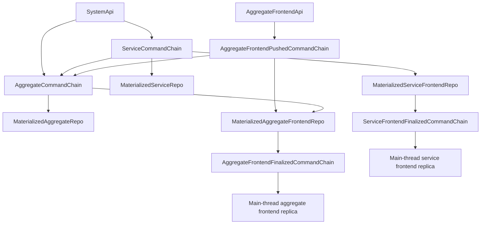
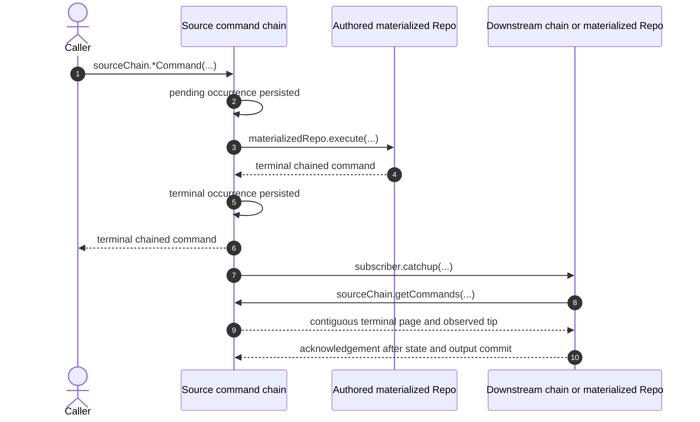

# Command Chains and Materialization

The static System Worker contains five durable command chains and four
materialized domain Repos. The chains store complete encoded occurrences at
`aggregateIndex`, `serviceIndex`, `pushIndex`, `frontendIndex`, or
`serviceFrontendIndex`; a materialized Repo pulls contiguous terminal history,
owns current state, and commits any durable output before acknowledging its
source tip.

- [`types.ts:35-52`](../../packages/core/src/system/types.ts#L35-L52) — enumerates the five command-chain and four materializer Repo kinds without a deployment-version or schema-target layer.
- [`index.ts:1-12`](../../packages/system-worker/src/index.ts#L1-L12) — exports the complete static durable topology.

## Trigger

1. SystemApi routes one direct aggregate or service command to the exact source
   chain derived from authenticated `systemId` and command target fields.
   - [`finalizeAggregateCommand.ts:27-39`](../../packages/system-worker/src/SystemApi/finalizeAggregateCommand/finalizeAggregateCommand.ts#L27-L39) — resolves and invokes one AggregateCommandChain.
   - [`finalizeServiceCommand.ts:25-36`](../../packages/system-worker/src/SystemApi/finalizeServiceCommand/finalizeServiceCommand.ts#L25-L36) — resolves and invokes one ServiceCommandChain.
2. AggregateFrontendApi routes one complete session command to the exact pushed
   chain bound by `{ systemId, aggregateId, aggregateName, userId,
frontendName }`.
   - [`pushCommand.ts:24-48`](../../packages/system-worker/src/AggregateFrontendApi/pushCommand/pushCommand.ts#L24-L48) — validates the singular request and derives the pushed-chain key from the bound capability.

## Annotated workflow steps

1. A public boundary submits one complete encoded command to its source chain.
   - [`AggregateCommandChain.ts:55-86`](../../packages/system-worker/src/AggregateCommandChain/AggregateCommandChain.ts#L55-L86) — the aggregate RpcTarget delegates singular admission and schedules retained work.
   - [`ServiceCommandChain.ts:50-82`](../../packages/system-worker/src/ServiceCommandChain/ServiceCommandChain.ts#L50-L82) — the service RpcTarget applies the same method-folder boundary.
   - [`AggregateFrontendPushedCommandChain.ts:60-94`](../../packages/system-worker/src/AggregateFrontendPushedCommandChain/AggregateFrontendPushedCommandChain.ts#L60-L94) — the pushed RpcTarget accepts only `{ command }` and schedules its durable lanes.
2. Under its admission semaphore, the source returns an exact retained command,
   rejects changed canonical bytes, or assigns the next chain-owned index and
   durably stores the complete command plus retained materializer name.
   - [`finalizeAggregateCommand.ts:64-177`](../../packages/system-worker/src/AggregateCommandChain/finalizeAggregateCommand/finalizeAggregateCommand.ts#L64-L177) — persists direct aggregate admission at the next `aggregateIndex`.
   - [`finalizeServiceCommand.ts:61-147`](../../packages/system-worker/src/ServiceCommandChain/finalizeServiceCommand/finalizeServiceCommand.ts#L61-L147) — persists service admission at the next `serviceIndex`.
   - [`pushCommand.ts:83-210`](../../packages/system-worker/src/AggregateFrontendPushedCommandChain/pushCommand/pushCommand.ts#L83-L210) — persists pushed admission at the next `pushIndex`.
3. Scheduled work dispatches only the lowest pending index to the retained
   materialized Repo.
   - [`runScheduledWork.ts:51-117`](../../packages/system-worker/src/AggregateCommandChain/runScheduledWork/runScheduledWork.ts#L51-L117) — selects one lowest pending aggregate occurrence and invokes `execute`.
   - [`runScheduledWork.ts:50-97`](../../packages/system-worker/src/ServiceCommandChain/runScheduledWork/runScheduledWork.ts#L50-L97) — serializes service execution the same way.
   - [`runScheduledWork.ts:62-105`](../../packages/system-worker/src/AggregateFrontendPushedCommandChain/runScheduledWork/runScheduledWork.ts#L62-L105) — dispatches the lowest pushed occurrence to its retained frontend materializer.
4. The materializer returns a terminal chained command whose identity,
   `aggregateIndex`, `serviceIndex`, or `pushIndex`, `chainedAt`, and canonical
   command bytes must match admission.
   - [`runScheduledWork.ts:118-174`](../../packages/system-worker/src/AggregateCommandChain/runScheduledWork/runScheduledWork.ts#L118-L174) — validates aggregate terminal identity and halts the chain on execution-in-doubt.
   - [`runScheduledWork.ts:98-150`](../../packages/system-worker/src/ServiceCommandChain/runScheduledWork/runScheduledWork.ts#L98-L150) — validates the equivalent service result.
   - [`runScheduledWork.ts:106-197`](../../packages/system-worker/src/AggregateFrontendPushedCommandChain/runScheduledWork/runScheduledWork.ts#L106-L197) — validates pushed identity and prepares the complete aggregate-forward occurrence.
5. The source chain stores the exact terminal bytes before it advances any
   subscriber work.
   - [`runScheduledWork.ts:175-228`](../../packages/system-worker/src/AggregateCommandChain/runScheduledWork/runScheduledWork.ts#L175-L228) — commits the terminal aggregate occurrence and queues subscriber tips.
   - [`runScheduledWork.ts:151-205`](../../packages/system-worker/src/ServiceCommandChain/runScheduledWork/runScheduledWork.ts#L151-L205) — commits the terminal service occurrence and queues subscriber tips.
   - [`runScheduledWork.ts:198-261`](../../packages/system-worker/src/AggregateFrontendPushedCommandChain/runScheduledWork/runScheduledWork.ts#L198-L261) — commits pushed terminal bytes and its aggregate-forward outbox row atomically.
6. The public source method returns only a retained terminal occurrence.
   - [`finalizeAggregateCommand.ts:184-214`](../../packages/system-worker/src/AggregateCommandChain/finalizeAggregateCommand/finalizeAggregateCommand.ts#L184-L214) — returns retained terminal aggregate bytes or a pending-result infrastructure error.
   - [`finalizeServiceCommand.ts:155-183`](../../packages/system-worker/src/ServiceCommandChain/finalizeServiceCommand/finalizeServiceCommand.ts#L155-L183) — returns the equivalent service result.
   - [`pushCommand.ts:218-251`](../../packages/system-worker/src/AggregateFrontendPushedCommandChain/pushCommand/pushCommand.ts#L218-L251) — returns the retained pushed terminal occurrence.
7. Source chains queue the latest terminal tip for each registered subscriber.
   - [`runScheduledWork.ts:247-425`](../../packages/system-worker/src/AggregateCommandChain/runScheduledWork/runScheduledWork.ts#L247-L425) — fans aggregate history to materialized aggregate and aggregate-frontend subscribers.
   - [`runScheduledWork.ts:223-480`](../../packages/system-worker/src/ServiceCommandChain/runScheduledWork/runScheduledWork.ts#L223-L480) — fans service history to aggregate, materialized service, and service-frontend subscribers.
8. A subscriber pulls terminal history after its independently persisted
   source frontier.
   - [`getCommands.ts:11-28`](../../packages/system-worker/src/AggregateCommandChain/getCommands/getCommands.ts#L11-L28) — returns at most 64 terminal aggregate occurrences after the requested index.
   - [`getCommands.ts:11-27`](../../packages/system-worker/src/ServiceCommandChain/getCommands/getCommands.ts#L11-L27) — applies the same terminal-before-limit service query.

9. The source returns a contiguous page plus the observed terminal tip; pending
   rows are excluded.
   - [`getCommands.ts:29-64`](../../packages/system-worker/src/AggregateCommandChain/getCommands/getCommands.ts#L29-L64) — validates aggregate contiguity and returns the page with its terminal tip.
   - [`getCommands.ts:28-59`](../../packages/system-worker/src/ServiceCommandChain/getCommands/getCommands.ts#L28-L59) — validates the service page.

10. The subscriber acknowledges only after its source frontier, materialized
    state, execution result, and any durable output outbox commit atomically.
    Aggregate frontend projection first commits an exact execution claim: a
    completed claim reuses retained terminal bytes, while an unfinished
    `{ completedAt: null, result: null }` claim halts in-doubt rather than
    rerunning authored projection. A known projection failure completes as a
    failed finalized occurrence with empty delta.
    - [`catchup.ts:284-390`](../../packages/system-worker/src/MaterializedAggregateFrontendRepo/catchup/catchup.ts#L284-L390) — reuses an exact completed claim, halts an unfinished claim, or durably inserts the new claim before authored projection.
    - [`catchup.ts:392-917`](../../packages/system-worker/src/MaterializedAggregateFrontendRepo/catchup/catchup.ts#L392-L917) — atomically commits aggregate/frontend materialized state, known-failure terminal output, outbox, claim completion and result, and both frontiers.
    - [`catchup.ts:94-128`](../../packages/system-worker/src/MaterializedServiceFrontendRepo/catchup/catchup.ts#L94-L128) — applies every contiguous occurrence through the notified service tip before returning.
    - [`execute.ts:305-516`](../../packages/system-worker/src/MaterializedServiceFrontendRepo/execute/execute.ts#L305-L516) — atomically commits projected state, the source frontier, the execution receipt, and relevant finalized output.

## Service-to-aggregate ordering

ServiceCommandChain notifies AggregateCommandChain directly. The aggregate
chain advances its retained `serviceIndex` for every terminal service
occurrence. An irrelevant occurrence consumes no `aggregateIndex`; a relevant
one is admitted as a full service-derived aggregate occurrence before later
direct aggregate work.

- [`receiveServiceCommand.ts:40-93`](../../packages/system-worker/src/AggregateCommandChain/receiveServiceCommand/receiveServiceCommand.ts#L40-L93) — validates consecutive service delivery and tests relevance against the materialized aggregate.
- [`receiveServiceCommand.ts:94-180`](../../packages/system-worker/src/AggregateCommandChain/receiveServiceCommand/receiveServiceCommand.ts#L94-L180) — advances only `serviceIndex` for irrelevance or appends the full derived occurrence at the next `aggregateIndex`.

## Frontend finalized output

Materialized aggregate and service frontends publish their durable output rows
to separate finalized chains. Each finalized chain enforces exact bytes and a
contiguous frontend-owned index, serves paginated history, and broadcasts one
singular command to live sockets.

- [`runScheduledWork.ts:38-106`](../../packages/system-worker/src/MaterializedAggregateFrontendRepo/runScheduledWork/runScheduledWork.ts#L38-L106) — publishes aggregate frontend outbox rows in `frontendIndex` order and stamps acknowledgement.
- [`publishFinalizedCommands.ts:20-89`](../../packages/system-worker/src/MaterializedServiceFrontendRepo/publishFinalizedCommands/publishFinalizedCommands.ts#L20-L89) — publishes service frontend output in `serviceFrontendIndex` order.
- [`publishCommand.ts:22-123`](../../packages/system-worker/src/AggregateFrontendFinalizedCommandChain/publishCommand/publishCommand.ts#L22-L123) — enforces terminal target, canonical-byte idempotency, contiguous index, persistence, and singular broadcast.
- [`getCommands.ts:11-70`](../../packages/system-worker/src/AggregateFrontendFinalizedCommandChain/getCommands/getCommands.ts#L11-L70) — serves contiguous finalized aggregate frontend pages of at most 64 occurrences.

## Callers

- [System API](./SystemApi.md)
- [Aggregate command finalization](./server/finalizeAggregateCommand.md)
- [Aggregate frontend push](./browser/PushSequence.md)
- [Frontend WebSocket](./browser/FrontendWebSocket.md)
