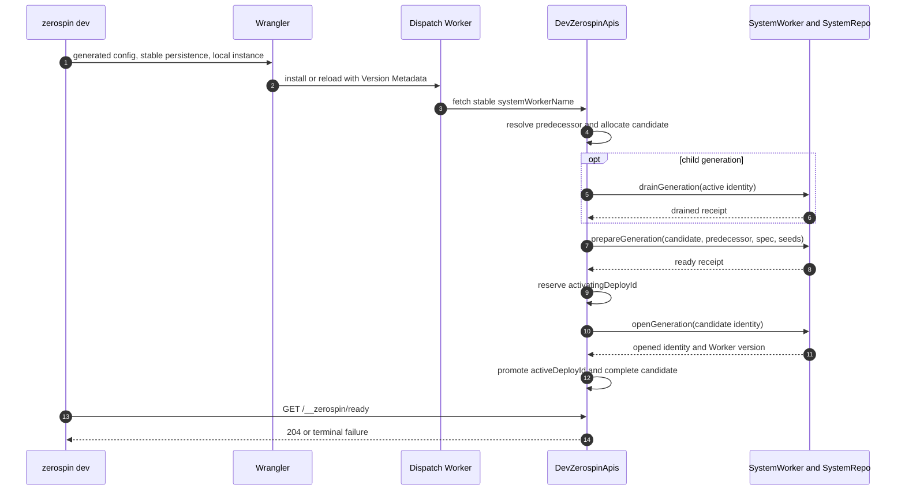

# DeploySystem

The public deployment architecture is the local `zerospin dev` lifecycle. The
CLI generates a temporary Wrangler configuration, the dispatch Worker routes
one stable local instance to `DevZerospinApis`, and that Durable Object owns
candidate allocation, generation selection, lifecycle receipts, final
promotion, and the readiness gate
(../../packages/cli/src/dev/devFn.ts:131-179,
../../packages/cli/src/dev/devFn.ts:248-358,
../../packages/dispatch-worker/src/Worker.ts:36-55,
../../packages/dispatch-worker/src/DevZerospinApis/DevZerospinApis.ts:227-235).

## Identity model

| Identity | Public local meaning |
| --- | --- |
| `systemId` | Authored system identity read from `wrangler.jsonc`. The CLI requires the expected `sys_`-prefixed shape (../../packages/cli/src/dev/devFn.ts:106-130). |
| `instanceId` | Stable environment selector. Local development fixes it to `local` and derives `systemWorkerName` from `{ systemId, instanceId }` (../../packages/cli/src/dev/devFn.ts:131-143). |
| `workerVersionId` | Wrangler Version Metadata identity for one concrete code reload. It is the only reload identity supplied to local control state (../../packages/dispatch-worker/src/DevZerospinApis/DevZerospinApis.ts:276-309). |
| `deployId` | Identity allocated by `DevZerospinApis` for one Worker-version candidate (../../packages/dispatch-worker/src/DevZerospinApis/DevZerospinApis.ts:600-626). |
| `deployIndex` | Instance-local integer order assigned when the candidate row is inserted; it is ordering, not identity (../../packages/dispatch-worker/src/DevZerospinApis/DevZerospinApis.ts:731-758). |
| `prevDeployId` | Snapshot of the stable `activeDeployId` at candidate allocation. Final promotion rechecks this predecessor (../../packages/dispatch-worker/src/DevZerospinApis/DevZerospinApis.ts:741-758, ../../packages/dispatch-worker/src/DevZerospinApis/DevZerospinApis.ts:1269-1289). |
| `generationId` | Namespace for one persistent repo graph. Compatible code can reuse it; a detached clean start or model change creates a new one (../../packages/dispatch-worker/src/DevZerospinApis/DevZerospinApis.ts:600-630). |
| `prevGenerationId` | Replay source for a new child generation. Initial and explicit clean roots use `null` (../../packages/dispatch-worker/src/DevZerospinApis/DevZerospinApis.ts:616-630). |
| `cleanRequestId` | One CLI-process receipt consumed exactly once to request a detached root and its configured seeds (../../packages/cli/src/dev/devFn.ts:131-143, ../../packages/dispatch-worker/src/DevZerospinApis/DevZerospinApis.ts:527-598). |
| `activeDeployId` | Stable local instance pointer changed only by the final promotion transaction (../../packages/dispatch-worker/src/DevZerospinApis/DevZerospinApis.ts:1234-1320). |
| `activatingDeployId` | Exclusive reservation held between successful preparation and final promotion (../../packages/dispatch-worker/src/DevZerospinApis/DevZerospinApis.ts:1083-1170). |

## Core invariants

1. Wrangler code installation is not readiness. The CLI accepts Wrangler's
   listening address and separately calls `/__zerospin/ready`; only a completed
   `DevZerospinApis` initialization returns 204
   (../../packages/cli/src/dev/devFn.ts:400-457,
   ../../packages/dispatch-worker/src/DevZerospinApis/DevZerospinApis.ts:1503-1520).
2. One Worker version maps to one deploy attempt. A failed or interrupted
   mapping stays failed closed rather than allocating a second deploy ID for the
   same code version
   (../../packages/dispatch-worker/src/DevZerospinApis/DevZerospinApis.ts:307-378).
3. The stable active pointer does not move during checking, drain, preparation,
   or opening. Promotion rechecks both the captured predecessor and exclusive
   activation reservation
   (../../packages/dispatch-worker/src/DevZerospinApis/DevZerospinApis.ts:1083-1232,
   ../../packages/dispatch-worker/src/DevZerospinApis/DevZerospinApis.ts:1234-1320).
4. A clean start creates a detached lineage; it does not delete the stable
   Wrangler persistence directory or old generations
   (../../packages/cli/src/dev/devFn.ts:277-307,
   ../../packages/cli/src/dev/devFn.ts:342-358,
   ../../packages/dispatch-worker/src/DevZerospinApis/DevZerospinApis.ts:597-630).
5. Ordinary APIs are constructed only after promotion and are pinned to the
   selected deploy/generation pair
   (../../packages/dispatch-worker/src/DevZerospinApis/DevZerospinApis.ts:1234-1359,
   ../../packages/dispatch-worker/src/ZerospinApis/ZerospinApis.ts:136-230).

## Generation selection

The first local version creates a root generation. The first consumption of an
explicit clean receipt also creates a detached root and evaluates configured
seeds. Otherwise `DevZerospinApis` compares the active and current SystemSpecs:
compatible code reuses the active generation; a model-definition change that
requires migration creates a child whose `prevGenerationId` points at the
active generation
(../../packages/dispatch-worker/src/DevZerospinApis/DevZerospinApis.ts:527-630,
../../packages/dispatch-worker/src/DevZerospinApis/DevZerospinApis.ts:1049-1058).

An existing clean receipt selects its already-associated deploy/generation
instead of applying clean semantics again. Consequently later hot reloads in
the same `zerospin dev --clean` process follow normal compatibility selection
(../../packages/dispatch-worker/src/DevZerospinApis/DevZerospinApis.ts:527-598).

## Local lifecycle

### Trigger

1. The `dev` command parses `--clean` and invokes `devFn`
   (../../packages/cli/src/commands/dev.tsx:12-35).
2. `devFn` loads the project configuration, validates the system identity,
   resolves the shared dispatch Worker and optional seed module, and removes
   caller-supplied deployment/generation variables from the generated Wrangler
   inputs (../../packages/cli/src/dev/devFn.ts:76-179).
3. The generated config preserves project settings outside fields owned by
   local Zerospin, adds `DevZerospinApis` plus Version Metadata, and starts
   Wrangler against the stable encoded persistence root
   (../../packages/cli/src/dev/devFn.ts:181-307).
4. The dispatch Worker resolves the stable local Durable Object and forwards
   requests to it (../../packages/dispatch-worker/src/Worker.ts:36-55).

### Annotated workflow steps

1. `DevZerospinApis` validates its exact local key and constructs the public
   dispatch runtime from the static local identity resolver and same-isolate
   SystemWorker resolver
   (../../packages/dispatch-worker/src/DevZerospinApis/DevZerospinApis.ts:240-285).
2. It either reopens a valid completed Worker-version mapping or resolves the
   current stable predecessor for a new candidate
   (../../packages/dispatch-worker/src/DevZerospinApis/DevZerospinApis.ts:287-525).
3. It consumes clean state, computes compatibility, allocates the candidate and
   generation identities, and persists the candidate plus first lifecycle event
   atomically
   (../../packages/dispatch-worker/src/DevZerospinApis/DevZerospinApis.ts:527-826).
4. An ordinary child migration inspects the active generation through
   `drainGeneration`; initial, clean, and reused generations skip that drain
   (../../packages/dispatch-worker/src/DevZerospinApis/DevZerospinApis.ts:847-966).
5. It calls `prepareGeneration` with seeds only for a newly consumed clean
   receipt and validates the returned identity, readiness, and reuse flag
   (../../packages/dispatch-worker/src/DevZerospinApis/DevZerospinApis.ts:968-1081).
6. It reserves activation, calls `openGeneration`, validates the opened
   identity and Version Metadata, then atomically completes and promotes the
   candidate
   (../../packages/dispatch-worker/src/DevZerospinApis/DevZerospinApis.ts:1083-1359).
7. Any terminal error records the failed phase, clears only this candidate's
   reservation, retains the Worker-version mapping, and rejects readiness
   (../../packages/dispatch-worker/src/DevZerospinApis/DevZerospinApis.ts:1360-1520).

## Durable generation lifecycle

The SystemWorker lifecycle methods are thin boundaries over the selected
generation's SystemRepo. `drainGeneration`, `prepareGeneration`, and
`openGeneration` decode the repo result and reject an identity mismatch before
returning it to local control
(../../packages/system-worker/src/drainGeneration/drainGeneration.ts:15-65,
../../packages/system-worker/src/prepareGeneration/prepareGeneration.ts:17-84,
../../packages/system-worker/src/openGeneration/openGeneration.ts:16-67).

1. Drain closes new writes, drains registered work in dependency order, captures
   immutable service/account replay bounds, and reaches `drained` only after all
   bounds exist
   (../../packages/system-worker/src/SystemRepo/drainGeneration/drainGeneration.ts:69-525).
2. Reuse preparation accepts neither a predecessor nor seeds and verifies that
   the candidate can remain on the current generation
   (../../packages/system-worker/src/SystemRepo/prepareGeneration/prepareGeneration.ts:216-320).
3. Root preparation has no predecessor and runs its supplied seeds through
   ordinary finalization. Migration preparation requires the predecessor to be
   ready and drained, rejects seeds, and replays service ledgers before account
   ledgers
   (../../packages/system-worker/src/SystemRepo/prepareGeneration/prepareGeneration.ts:323-516,
   ../../packages/system-worker/src/SystemRepo/prepareGeneration/prepareGeneration.ts:518-1314).
4. Readiness commits only after all root or replay postconditions. New-generation
   failure is persisted as failed/closed
   (../../packages/system-worker/src/SystemRepo/prepareGeneration/prepareGeneration.ts:1316-1421).
5. Open atomically moves the prepared deploy/spec into active admission and
   returns the generation identity
   (../../packages/system-worker/src/SystemRepo/openGeneration/openGeneration.ts:72-191).

## Admission and failure behavior

SystemRepo admission requires a ready generation and a deploy equal to the
generation-local active deploy. Reads are allowed while admission is `open` or
`draining`; writes require `open`
(../../packages/system-worker/src/SystemRepo/assertGenerationAdmission/assertGenerationAdmission.ts:34-138).

A local candidate failure never implies rollback of the stable active pointer.
The failure remains attached to its Worker version at the last durable phase;
edited code creates a new Worker version and therefore a new candidate. A new
`--clean` process supplies a new detached-root receipt
(../../packages/dispatch-worker/src/DevZerospinApis/DevZerospinApis.ts:287-425,
../../packages/dispatch-worker/src/DevZerospinApis/DevZerospinApis.ts:1360-1520).

## Local deploy logs and runtime logs

`DevZerospinApis` stores an instance-local append-only `deployLog`. Each row has
an integer event index plus deploy, generation, phase, level, message, payload,
and timestamp. These events are operator history; `systemInstance`, `deploy`,
and `generation` rows remain the local lifecycle state
(../../packages/dispatch-worker/src/DevZerospinApis/DevZerospinApis.ts:35-196,
../../packages/dispatch-worker/src/DevZerospinApis/DevZerospinApis.ts:785-826).

`SystemLogRepo` is separate generation-scoped runtime observability. Its Durable
Object key is the generation, and its rows preserve the emitting deploy identity
inside that generation
(../../packages/system-worker/src/SystemLogRepo/SystemLogRepo.ts:40-110,
../../packages/system-worker/src/SystemLogRepo/SystemLogRepo.ts:205-327).

## Public caller boundary

The complete public chain is `zerospin dev` → generated Wrangler dispatch
Worker → stable `DevZerospinApis` → lifecycle RPCs on SystemWorker/SystemRepo →
pinned `ZerospinApis`. There is no environment-specific remote control-plane
implementation in this repository
(../../packages/cli/src/commands/dev.tsx:26-35,
../../packages/dispatch-worker/src/Worker.ts:36-55,
../../packages/dispatch-worker/src/DevZerospinApis/DevZerospinApis.ts:1234-1359).
