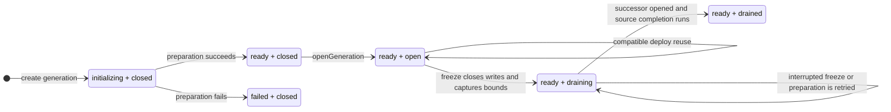

# DeploySystem

Zerospin has two project-owned Wrangler deployment paths with separate durable
control namespaces. `zerospin dev` exports the historical local-only
`DevZerospinApis` class through `LocalWorker`; `zerospin deploy --wrangler`
creates a production-only `SelfHostedZerospinApis` namespace. The shared
dispatch Worker routes `instanceId === 'local'` only to the former and every
production request only to the latter. Neither path falls back to the other
(../../packages/dispatch-worker/src/LocalWorker.ts:22-33,
../../packages/dispatch-worker/src/Worker.ts:106-148,
../../packages/dispatch-worker/src/DevZerospinApis/DevZerospinApis.ts:233-280,
../../packages/dispatch-worker/src/SelfHostedZerospinApis/SelfHostedZerospinApis.ts:235-344).

Both controllers own candidate allocation, generation selection, lifecycle
receipts, final promotion, and an HTTP readiness gate. They use the same
continuous generation-lineage protocol; the production controller additionally
validates project-owned publishable and secret keys and marks the SystemWorker
runtime as self-hosted
(../../packages/dispatch-worker/src/SelfHostedZerospinApis/SelfHostedZerospinApis.ts:255-344,
../../packages/cli/src/deploy/deployWranglerFn.ts:235-281).

## Identity model

| Identity             | Local and production meaning                                                                                                                                                                                                                                                                                                                                                                                 |
| -------------------- | ------------------------------------------------------------------------------------------------------------------------------------------------------------------------------------------------------------------------------------------------------------------------------------------------------------------------------------------------------------------------------------------------------------ |
| `systemId`           | Authored system identity read from `wrangler.jsonc`. Both CLI paths validate it before generating the effective configuration (../../packages/cli/src/dev/devFn.ts:106-130, ../../packages/cli/src/deploy/deployWranglerFn.ts:71-117).                                                                                                                                                                          |
| `instanceId`         | Stable environment selector. Local development fixes it to `local`; Wrangler production fixes it to `production`. The dispatch Worker uses this value to select the non-interchangeable controller namespace (../../packages/cli/src/dev/devFn.ts:131-143, ../../packages/cli/src/deploy/deployWranglerFn.ts:235-248, ../../packages/dispatch-worker/src/Worker.ts:106-148).                                         |
| `workerVersionId`    | Wrangler Version Metadata identity for one concrete code reload. It is the only reload identity supplied to either controller (../../packages/dispatch-worker/src/DevZerospinApis/DevZerospinApis.ts:282-309, ../../packages/dispatch-worker/src/SelfHostedZerospinApis/SelfHostedZerospinApis.ts:346-377).                                                                       |
| `deployId`           | Identity allocated by the selected controller for one Worker-version candidate (../../packages/dispatch-worker/src/DevZerospinApis/DevZerospinApis.ts:1050-1127, ../../packages/dispatch-worker/src/SelfHostedZerospinApis/SelfHostedZerospinApis.ts:1082-1220).                                                                                                                                                |
| `deployIndex`        | Instance-local integer order assigned when the candidate row is inserted; it is ordering, not identity (../../packages/dispatch-worker/src/DevZerospinApis/DevZerospinApis.ts:1100-1127, ../../packages/dispatch-worker/src/SelfHostedZerospinApis/SelfHostedZerospinApis.ts:1168-1220).                                                                                                                           |
| `prevDeployId`       | Snapshot of stable `activeDeployId` at candidate allocation. Final promotion rechecks this predecessor (../../packages/dispatch-worker/src/DevZerospinApis/DevZerospinApis.ts:1110-1127, ../../packages/dispatch-worker/src/DevZerospinApis/DevZerospinApis.ts:1658-1750, ../../packages/dispatch-worker/src/SelfHostedZerospinApis/SelfHostedZerospinApis.ts:1761-1829).                                                |
| `generationId`       | Namespace for one persistent repo graph. Compatible code can reuse it; a detached clean start or model change creates a new one (../../packages/dispatch-worker/src/DevZerospinApis/DevZerospinApis.ts:949-1098, ../../packages/dispatch-worker/src/SelfHostedZerospinApis/SelfHostedZerospinApis.ts:1014-1166).                                                                                                  |
| `prevGenerationId`   | Replay source for a new child generation. Initial and explicit clean roots use `null` (../../packages/dispatch-worker/src/DevZerospinApis/DevZerospinApis.ts:949-996, ../../packages/dispatch-worker/src/SelfHostedZerospinApis/SelfHostedZerospinApis.ts:1014-1063).                                                                                                                                             |
| `cleanRequestId`     | One CLI-process receipt consumed exactly once to request a detached root. Local dev can pass configured seeds during its lifecycle; production deploy aliases the empty seed module, so production data seeding is a separate command (../../packages/cli/src/dev/devFn.ts:131-143, ../../packages/cli/src/deploy/deployWranglerFn.ts:235-264, ../../packages/dispatch-worker/src/SelfHostedZerospinApis/SelfHostedZerospinApis.ts:944-1014). |
| `activeDeployId`     | Stable instance pointer changed only by the final promotion transaction (../../packages/dispatch-worker/src/DevZerospinApis/DevZerospinApis.ts:1699-1750, ../../packages/dispatch-worker/src/SelfHostedZerospinApis/SelfHostedZerospinApis.ts:1774-1829).                                                                                                                                                          |
| `activatingDeployId` | Exclusive reservation held between successful preparation and final promotion (../../packages/dispatch-worker/src/DevZerospinApis/DevZerospinApis.ts:1540-1632, ../../packages/dispatch-worker/src/SelfHostedZerospinApis/SelfHostedZerospinApis.ts:1612-1705).                                                                                                                                                   |

## Core invariants

1. Authored system, account-controller, actor-controller,
   frontend-controller, and service-controller factories reject a missing or
   empty runtime `version` before their downstream maps, models, selections,
   guards, contracts, or adapters are validated. TypeScript still requires the
   same properties at each factory call site, but consumer project typechecking
   remains a consumer build concern rather than a `zerospin dev` phase
   (../../packages/core/src/system/makeSystem.ts:67-84,
   ../../packages/core/src/accountController/makeAccountController.ts:232-247,
   ../../packages/core/src/actorController/makeActorController.ts:196-210,
   ../../packages/core/src/frontendController/makeFrontendController.ts:143-164,
   ../../packages/core/src/service/makeServiceController.ts:238-253).
2. Wrangler code installation is not readiness. Each CLI path separately calls
   `/__zerospin/ready`; only a completed controller initialization returns 204
   (../../packages/cli/src/dev/devFn.ts:400-457,
   ../../packages/cli/src/deploy/deployWranglerFn.ts:446-489,
   ../../packages/dispatch-worker/src/DevZerospinApis/DevZerospinApis.ts:2064-2080,
   ../../packages/dispatch-worker/src/SelfHostedZerospinApis/SelfHostedZerospinApis.ts:2140-2158).
3. One Worker version maps to one deploy attempt. A failed or interrupted
   mapping stays failed closed rather than allocating a second deploy ID for the
   same code version
   (../../packages/dispatch-worker/src/DevZerospinApis/DevZerospinApis.ts:314-385,
   ../../packages/dispatch-worker/src/SelfHostedZerospinApis/SelfHostedZerospinApis.ts:380-451).
4. The stable active pointer does not move during checking, drain, preparation,
   or opening. Promotion rechecks both the captured predecessor and exclusive
   activation reservation
   (../../packages/dispatch-worker/src/DevZerospinApis/DevZerospinApis.ts:1490-1750,
   ../../packages/dispatch-worker/src/SelfHostedZerospinApis/SelfHostedZerospinApis.ts:1562-1829).
5. A clean start creates a detached lineage; it does not delete the stable
   Wrangler persistence directory or old generations
   (../../packages/cli/src/dev/devFn.ts:277-307,
   ../../packages/cli/src/dev/devFn.ts:342-358,
   ../../packages/dispatch-worker/src/DevZerospinApis/DevZerospinApis.ts:878-996).
6. Ordinary APIs are constructed only after promotion and are pinned to the
   selected deploy/generation pair
   (../../packages/dispatch-worker/src/DevZerospinApis/DevZerospinApis.ts:1658-1922,
   ../../packages/dispatch-worker/src/SelfHostedZerospinApis/SelfHostedZerospinApis.ts:1733-1997,
   ../../packages/dispatch-worker/src/ZerospinApis/ZerospinApis.ts:136-230).

## Generation selection

The first Worker version for either instance creates a root generation. The
first consumption of an explicit clean receipt also creates a detached root.
Local development can evaluate configured seeds during preparation; production
deployment deliberately aliases the empty seed module, with production seeding
performed later by the explicit seed command. Otherwise the selected
controller compares the active and current SystemSpecs: compatible code reuses
the active generation; a model-definition change creates a child whose
`prevGenerationId` points at the active generation
(../../packages/cli/src/deploy/deployWranglerFn.ts:257-281,
../../packages/dispatch-worker/src/DevZerospinApis/DevZerospinApis.ts:878-996,
../../packages/dispatch-worker/src/SelfHostedZerospinApis/SelfHostedZerospinApis.ts:944-1063).

Serialized contract definitions contain command identity, authored version, and
payload JSON Schema. Runtime mutation-result schemas are omitted, so contract
compatibility compares payload directionality and does not derive diffs or
generation selection from mutation membership, order, operation, or model
version
(../../packages/core/src/system/makeSystemSpec.ts:15-19,
../../packages/core/src/system/makeSystemSpec.ts:58-62,
../../packages/core/src/system/makeSystemSpec.ts:242-250,
../../packages/core/src/system/makeSystemSpec.ts:285-290,
../../packages/core/src/system/checkSystemCompatibility.ts:998-1060,
../../packages/core/src/system/checkSystemCompatibility.ts:1232-1236).

An existing clean receipt selects its already-associated deploy/generation
instead of applying clean semantics again. Consequently later reloads in the
same clean CLI process follow normal compatibility selection
(../../packages/dispatch-worker/src/DevZerospinApis/DevZerospinApis.ts:878-947,
../../packages/dispatch-worker/src/SelfHostedZerospinApis/SelfHostedZerospinApis.ts:944-1014).

## Local and production self-hosted lifecycle

```mermaid
sequenceDiagram
  autonumber
  participant CLI as Zerospin CLI
  participant Wrangler
  participant Dispatch as Dispatch Worker
  participant Control as Selected deployment controller
  participant System as SystemWorker and SystemRepo

  CLI->>Wrangler: generated config and stable instance
  Wrangler->>Dispatch: install or reload with Version Metadata
  alt local instance
    Dispatch->>Control: DevZerospinApis at systemId:local
  else production instance
    Dispatch->>Control: SelfHostedZerospinApis at systemId:production
  end
  Control->>Control: resolve predecessor and allocate candidate
  opt replacement generation
    Control->>System: drainGeneration(active, freeze)
    System-->>Control: draining with frozen bounds
  end
  Control->>System: prepareGeneration(candidate, predecessor, spec, seeds)
  System-->>Control: ready receipt
  Control->>Control: reserve activatingDeployId
  Control->>System: openGeneration(candidate identity)
  System-->>Control: opened identity and Worker version
  Control->>Control: promote activeDeployId and complete candidate
  opt replaced source generation
    Control->>System: drainGeneration(source, complete, successor)
    System-->>Control: drained; predecessor rooms superseded
  end
  CLI->>Control: GET /__zerospin/ready
  Control-->>CLI: 204 or terminal failure
```

### Local development trigger

1. The `dev` command parses `--clean` and invokes `devFn`
   (../../packages/cli/src/commands/dev.tsx:12-35).
2. `devFn` loads the project configuration, validates the system identity,
   resolves the shared dispatch Worker and optional seed module, and removes
   caller-supplied deployment/generation variables from the generated Wrangler
   inputs (../../packages/cli/src/dev/devFn.ts:76-179).
3. The generated config preserves project settings outside fields owned by
   local Zerospin, selects `LocalWorker`, adds `DevZerospinApis` plus Version
   Metadata, and starts Wrangler against the stable encoded persistence root
   (../../packages/cli/src/dev/devFn.ts:181-307,
   ../../packages/dispatch-worker/src/LocalWorker.ts:3-33).
4. The dispatch Worker resolves the stable local Durable Object and forwards
   requests only to `DevZerospinApis`
   (../../packages/dispatch-worker/src/Worker.ts:106-128).

### Production Wrangler trigger

1. `deploy --wrangler` branches before the hosted config/API path, so it never
   loads a hosted Zerospin endpoint or credential
   (../../packages/cli/src/commands/deploy.tsx:17-55).
2. `deployWranglerFn` validates project-owned production keys and the authored
   Wrangler configuration, then generates `ZEROSPIN_INSTANCE_ID=production`,
   `ZEROSPIN_SELF_HOSTED=true`, Version Metadata, an empty deployment seed
   module, and the first `SelfHostedZerospinApis` SQLite migration
   (../../packages/cli/src/deploy/deployWranglerFn.ts:22-70,
   ../../packages/cli/src/deploy/deployWranglerFn.ts:180-281).
3. It writes the generated configuration and secrets to mode-0600 temporary
   files, invokes Wrangler with the operator's Cloudflare authentication, then
   removes those files
   (../../packages/cli/src/deploy/deployWranglerFn.ts:283-445).
4. After Wrangler reports a `workers.dev` URL, the command polls
   `/__zerospin/ready` until it receives 204 or a terminal 500
   (../../packages/cli/src/deploy/deployWranglerFn.ts:446-489).

### Production seed trigger

1. `seed --wrangler --env production` is the only admitted seed invocation;
   other environment and transport combinations fail before submission
   (../../packages/cli/src/commands/seed.tsx:13-62,
   ../../packages/cli/src/seed/seedWranglerFn.ts:17-36).
2. The command reads the project-owned secret key and the deployed
   `workers.dev` URL, loads configured production seeds, and requires one
   non-empty batch of service commands for one service
   (../../packages/cli/src/seed/seedWranglerFn.ts:38-128).
3. It submits that full batch once through `SystemApi.finalizeServiceCommands`
   and fails the command if any encoded service command failed
   (../../packages/cli/src/seed/seedWranglerFn.ts:130-169).

### Annotated workflow steps

1. The selected controller validates its exact instance key and constructs the
   dispatch runtime. Local control uses its static local identity; production
   requires the project-owned secret and publishable keys
   (../../packages/dispatch-worker/src/DevZerospinApis/DevZerospinApis.ts:242-280,
   ../../packages/dispatch-worker/src/SelfHostedZerospinApis/SelfHostedZerospinApis.ts:245-344).
2. Each controller builds and runtime-decodes the current `SystemSpec` before reading an
   existing Worker-version mapping, comparing compatibility, or allocating any
   candidate state
   (../../packages/dispatch-worker/src/DevZerospinApis/DevZerospinApis.ts:294-308,
   ../../packages/dispatch-worker/src/SelfHostedZerospinApis/SelfHostedZerospinApis.ts:355-377).
3. Each controller either reopens a valid completed Worker-version mapping or resolves the
   current stable predecessor for a new candidate
   (../../packages/dispatch-worker/src/DevZerospinApis/DevZerospinApis.ts:314-657,
   ../../packages/dispatch-worker/src/SelfHostedZerospinApis/SelfHostedZerospinApis.ts:380-680).
4. It consumes clean state, computes compatibility, allocates the candidate and
   generation identities, and persists the candidate plus first lifecycle event
   atomically
   (../../packages/dispatch-worker/src/DevZerospinApis/DevZerospinApis.ts:878-1195,
   ../../packages/dispatch-worker/src/SelfHostedZerospinApis/SelfHostedZerospinApis.ts:944-1265).
5. Every replacement generation first freezes the active source through
   `drainGeneration({ mode: 'freeze' })`; initial and compatible reused
   generations skip that freeze. A clean target remains a detached root even
   though its source routing generation is frozen
   (../../packages/dispatch-worker/src/DevZerospinApis/DevZerospinApis.ts:1216-1374,
   ../../packages/dispatch-worker/src/SelfHostedZerospinApis/SelfHostedZerospinApis.ts:1287-1445).
6. It calls `prepareGeneration` with seeds only for a newly consumed clean
   receipt and validates the returned identity, readiness, and reuse flag
   (../../packages/dispatch-worker/src/DevZerospinApis/DevZerospinApis.ts:1376-1488,
   ../../packages/dispatch-worker/src/SelfHostedZerospinApis/SelfHostedZerospinApis.ts:1447-1560).
7. It reserves activation, calls `openGeneration`, validates the opened
   identity and Version Metadata, then atomically completes and promotes the
   candidate. Only after that routing switch does it complete the frozen source
   with the successor generation identity
   (../../packages/dispatch-worker/src/DevZerospinApis/DevZerospinApis.ts:1490-1916,
   ../../packages/dispatch-worker/src/SelfHostedZerospinApis/SelfHostedZerospinApis.ts:1562-1990).
8. Any terminal error records the failed phase, clears only this candidate's
   reservation, retains the Worker-version mapping, and rejects readiness
   (../../packages/dispatch-worker/src/DevZerospinApis/DevZerospinApis.ts:1923-2056,
   ../../packages/dispatch-worker/src/SelfHostedZerospinApis/SelfHostedZerospinApis.ts:2001-2131).

## Durable generation lifecycle

The SystemWorker lifecycle methods are thin boundaries over the selected
generation's SystemRepo. `drainGeneration`, `prepareGeneration`, and
`openGeneration` decode the repo result and reject an identity mismatch before
returning it to local control
(../../packages/system-worker/src/drainGeneration/drainGeneration.ts:15-65,
../../packages/system-worker/src/prepareGeneration/prepareGeneration.ts:17-80,
../../packages/system-worker/src/openGeneration/openGeneration.ts:16-65).

`readiness` and `admission` are separate axes in the generation-local
`generationState` row. Preparation establishes whether the durable graph can
serve; opening and draining determine which ordinary operations may enter that
already-prepared graph
(../../packages/system-worker/src/SystemRepo/SystemRepo.ts:59-105,
../../packages/system-worker/src/SystemRepo/prepareGeneration/prepareGeneration.ts:1765-1836,
../../packages/system-worker/src/SystemRepo/openGeneration/openGeneration.ts:83-141).



“Opening” means atomically installing the prepared deploy and SystemSpec as the
generation-local active pair and changing admission to `open`. It is not the
creation of a WebSocket or the start of a Worker process. A repeated open for
the same already-active deploy is idempotent
(../../packages/system-worker/src/SystemRepo/openGeneration/openGeneration.ts:72-141,
../../packages/system-worker/src/SystemRepo/openGeneration/openGeneration.ts:143-191).

“Draining” is a durable frozen-but-readable state. Freeze closes new write
admission, waits for the finite set of already-reserved writes to settle, drains
their downstream work, and captures immutable ledger and projection bounds.
Reads remain admitted while the successor is prepared. Completion happens only
after successor routing opens and then changes the source to `drained`; neither
state deletes the generation
(../../packages/system-worker/src/SystemRepo/drainGeneration/drainGeneration.ts:384-585,
../../packages/system-worker/src/SystemRepo/drainGeneration/drainGeneration.ts:1536-1689,
../../packages/system-worker/src/SystemRepo/assertGenerationAdmission/assertGenerationAdmission.ts:84-137).

The self-hosted marker changes how the finite downstream set is proved, not the
freeze/prepare/open/complete lineage protocol. A hosted Worker version may run
the predecessor's retry/drain work. A self-hosted upload has only newly uploaded
code, so repo drain methods are inspection-only and fail closed if predecessor
work remains. `ServiceBlockRepo` proves terminality for both account subscribers
and service-frontend subscribers; neither subscriber class is advanced by the
new upload
(../../packages/system-worker/src/drainGeneration/drainGeneration.ts:25-76,
../../packages/system-worker/src/ServiceBlockRepo/drainGeneration/drainGeneration.ts:11-86,
../../packages/system-worker/src/ServiceBlockRepo/drainGeneration/drainGeneration.ts:88-220,
../../packages/system-worker/src/ServiceFrontendRepo/drainGeneration/drainGeneration.ts:10-65,
../../packages/system-worker/src/ActorRepo/drainGeneration/drainGeneration.ts:10-94,
../../packages/system-worker/src/ActorBlockRepo/drainFrontendSubscribers/drainFrontendSubscribers.ts:12-145).

One narrow inspection seam allows an already-bootstrapped self-hosted
`FrontendRepo` to open after its actor or frontend was intentionally retired.
It reuses only the retained account model graph and the stable FrontendRepo
tables needed for inspection. Hosted access, an unbootstrapped invalid key, a
removed account, and unrelated controller failures still fail normally
(../../packages/system-worker/src/FrontendRepo/FrontendRepo.ts:223-274,
../../packages/system-worker/src/FrontendRepo/drainGeneration/drainGeneration.ts:11-90).

1. Freeze closes new writes, waits for every admitted write reservation,
   drains registered work in dependency order, captures immutable service,
   account, account-frontend, and service-frontend bounds, and persists
   `drainFrozenAt` only when the final reservation/count transaction proves the
   set complete
   (../../packages/system-worker/src/SystemRepo/drainGeneration/drainGeneration.ts:384-585,
   ../../packages/system-worker/src/SystemRepo/drainGeneration/drainGeneration.ts:587-834,
   ../../packages/system-worker/src/SystemRepo/drainGeneration/drainGeneration.ts:836-1689).
2. Reuse preparation accepts neither a predecessor nor seeds and verifies that
   the candidate can remain on the current generation
   (../../packages/system-worker/src/SystemRepo/prepareGeneration/prepareGeneration.ts:216-320).
3. Root preparation has no predecessor and runs its supplied seeds through
   ordinary finalization. Migration preparation requires the predecessor to be
   ready, draining, and frozen, rejects seeds, replays service ledgers before
   account ledgers, then prepares every frozen account/service frontend
   projection in the successor
   (../../packages/system-worker/src/SystemRepo/prepareGeneration/prepareGeneration.ts:343-541,
   ../../packages/system-worker/src/SystemRepo/prepareGeneration/prepareGeneration.ts:544-1323,
   ../../packages/system-worker/src/SystemRepo/prepareGeneration/prepareGeneration.ts:1325-1731).
4. Readiness commits only after all root or replay postconditions. New-generation
   failure is persisted as failed/closed
   (../../packages/system-worker/src/SystemRepo/prepareGeneration/prepareGeneration.ts:1765-1870).
5. Open atomically moves the prepared deploy/spec into active admission and
   returns the generation identity
   (../../packages/system-worker/src/SystemRepo/openGeneration/openGeneration.ts:72-191).
6. Source completion requires that prior freeze, changes admission to `drained`,
   signals every frozen archive room with the successor identity, and purges
   both account and service frontend ticket tables
   (../../packages/system-worker/src/SystemRepo/drainGeneration/drainGeneration.ts:176-381).

### Normal drain order and retries

Freeze and write reservation serialize through the same SystemRepo SQLite
owner. Every admitted write inserts a reservation before the domain RPC and
releases it after success or failure; release remains legal while draining so a
successful write cannot be stranded by admission closure. Freeze polls the
finite pre-closure set and reports a 30-second-old reservation as abandoned
instead of expiring or deleting it
(../../packages/system-worker/src/SystemRepo/reserveGenerationWrite/reserveGenerationWrite.ts:13-59,
../../packages/system-worker/src/SystemRepo/releaseGenerationWrite/releaseGenerationWrite.ts:13-55,
../../packages/system-worker/src/SystemRepo/drainGeneration/drainGeneration.ts:502-585).

After write settlement, SystemRepo visits dependency levels in order:
FrontendRepo, ServiceRepo, ServiceBlockRepo including both AccountRepo and
ServiceFrontendRepo subscribers, ServiceFrontendRepo archive outboxes,
AccountRepo, AccountBlockRepo, ActorRepo, then FrontendRepo again for projection
work created during upstream drain. Hosted versions may finish work at these
boundaries; self-hosted versions only inspect it. Every reported pending count
must be zero, including both ServiceBlockRepo subscriber counts
(../../packages/system-worker/src/SystemRepo/drainGeneration/drainGeneration.ts:585-834,
../../packages/system-worker/src/ServiceBlockRepo/drainGeneration/drainGeneration.ts:198-220).

Freeze then captures source ledger bounds and one finite lineage receipt for
every admitted account and service projection. A projection-state read races
against this step by first reserving its repo name in SystemRepo; the final
transaction requires every registration/reservation to have one complete bound
before writing `drainFrozenAt`, so a projection cannot escape both admission and
freeze
(../../packages/system-worker/src/SystemRepo/resolveFrontendProjectionLineage/resolveFrontendProjectionLineage.ts:410-625,
../../packages/system-worker/src/SystemRepo/drainGeneration/drainGeneration.ts:836-1534,
../../packages/system-worker/src/SystemRepo/drainGeneration/drainGeneration.ts:1536-1689).

Successor preparation reads only those frozen projection receipts. It installs
target-generation authoritative snapshots at the frozen causal watermarks,
catches up without emitting logical frontend blocks, archives exactly one
boundary per real predecessor segment, verifies archive readiness, and exposes
the target projection/archive pair together
(../../packages/system-worker/src/SystemRepo/prepareGeneration/prepareGeneration.ts:1325-1731,
../../packages/system-worker/src/FrontendRepo/prepareSuccessor/prepareSuccessor.ts:41-431,
../../packages/system-worker/src/ServiceFrontendRepo/prepareSuccessor/prepareSuccessor.ts:33-394).

An interrupted freeze remains `draining` with no `drainFrozenAt` until all
bounds commit; retry repeats idempotent drains and requires stored bounds to
match. Once frozen, repeat freeze returns the existing receipt. Completion is a
separate idempotent call after routing switches; it marks the source drained,
signals superseded rooms, and retries ticket cleanup without reopening
admission
(../../packages/system-worker/src/SystemRepo/drainGeneration/drainGeneration.ts:176-381,
../../packages/system-worker/src/SystemRepo/drainGeneration/drainGeneration.ts:384-500,
../../packages/system-worker/src/SystemRepo/drainGeneration/drainGeneration.ts:836-1689).

## Admission and failure behavior

SystemRepo admission requires a ready generation and a deploy equal to the
generation-local active deploy. Reads are allowed while admission is `open` or
`draining`; writes require `open`
(../../packages/system-worker/src/SystemRepo/assertGenerationAdmission/assertGenerationAdmission.ts:34-138).

| Generation state        | Ordinary reads | Ordinary writes | Ticket mint | Ticket consume |
| ----------------------- | -------------: | --------------: | ----------: | -------------: |
| `initializing + closed` |             No |              No |          No |             No |
| `ready + closed`        |             No |              No |          No |             No |
| `ready + open`          |            Yes |             Yes |         Yes |            Yes |
| `ready + draining`      |            Yes |              No |         Yes |            Yes |
| `ready + drained`       |             No |              No |          No |             No |
| `failed + closed`       |             No |              No |          No |             No |

Both account and service frontend ticket minting and consumption use read
admission with the active deploy persisted in the ticket row. Each mint checks
lifecycle state, removes expired rows, and inserts the new hash in one
SystemRepo transaction. Fresh reconnect capabilities therefore remain
available from the source archive throughout `draining`, while command writes
stay closed; completion changes admission to `drained` and rejects any later
mint or consumption
(../../packages/system-worker/src/SystemRepo/createFrontendWebSocketTicket/createFrontendWebSocketTicket.ts:75-164,
../../packages/system-worker/src/SystemRepo/consumeFrontendWebSocketTicket/consumeFrontendWebSocketTicket.ts:131-195,
../../packages/system-worker/src/SystemRepo/createServiceFrontendWebSocketTicket/createServiceFrontendWebSocketTicket.ts:79-171,
../../packages/system-worker/src/SystemRepo/consumeServiceFrontendWebSocketTicket/consumeServiceFrontendWebSocketTicket.ts:151-234).

### Generation readiness versus HTTP readiness

`generationState.readiness` belongs to one durable generation. `ready` means
that root preparation or replay finished and its postconditions were committed;
it does not by itself select that generation as the stable deployment or open
ordinary admission
(../../packages/system-worker/src/SystemRepo/prepareGeneration/prepareGeneration.ts:1765-1836,
../../packages/system-worker/src/SystemRepo/openGeneration/openGeneration.ts:83-141).

`GET /__zerospin/ready` is instead the process-facing gate on the selected
controller's API-readiness promise. It returns 204 only after candidate
lifecycle, opening, stable-pointer promotion, and public API construction have
all completed; a terminal initialization failure returns 500
(../../packages/dispatch-worker/src/DevZerospinApis/DevZerospinApis.ts:1658-1922,
../../packages/dispatch-worker/src/DevZerospinApis/DevZerospinApis.ts:2064-2080,
../../packages/dispatch-worker/src/SelfHostedZerospinApis/SelfHostedZerospinApis.ts:1733-1997,
../../packages/dispatch-worker/src/SelfHostedZerospinApis/SelfHostedZerospinApis.ts:2140-2158).

A local candidate failure never implies rollback of the stable active pointer.
The failure remains attached to its Worker version at the last durable phase;
edited code creates a new Worker version and therefore a new candidate. A new
`--clean` process supplies a new detached-root receipt
(../../packages/dispatch-worker/src/DevZerospinApis/DevZerospinApis.ts:314-385,
../../packages/dispatch-worker/src/DevZerospinApis/DevZerospinApis.ts:878-947,
../../packages/dispatch-worker/src/DevZerospinApis/DevZerospinApis.ts:1923-2056).

## Deploy logs and runtime logs

Each controller stores an instance-local append-only `deployLog`. Each row has
an integer event index plus deploy, generation, phase, level, message, payload,
and timestamp. These events are operator history; `systemInstance`, `deploy`,
and `generation` rows remain lifecycle state
(../../packages/dispatch-worker/src/DevZerospinApis/DevZerospinApis.ts:35-196,
../../packages/dispatch-worker/src/DevZerospinApis/DevZerospinApis.ts:1154-1181,
../../packages/dispatch-worker/src/SelfHostedZerospinApis/SelfHostedZerospinApis.ts:35-198,
../../packages/dispatch-worker/src/SelfHostedZerospinApis/SelfHostedZerospinApis.ts:1223-1252).

`SystemLogRepo` is separate generation-scoped runtime observability. Its Durable
Object key is the generation, and its rows preserve the emitting deploy identity
inside that generation
(../../packages/system-worker/src/SystemLogRepo/SystemLogRepo.ts:40-110,
../../packages/system-worker/src/SystemLogRepo/SystemLogRepo.ts:205-327).

## Public caller boundary

The public local chain is `zerospin dev` → generated `LocalWorker` → stable
`DevZerospinApis`. The public project-owned production chain is
`zerospin deploy --wrangler` → generated dispatch Worker → stable
`SelfHostedZerospinApis`. Both then call lifecycle RPCs on
SystemWorker/SystemRepo and expose APIs pinned to the promoted deploy/generation
pair. Production `seed --wrangler` is a later one-shot API client; it is not part
of deployment generation preparation
(../../packages/cli/src/commands/dev.tsx:26-35,
../../packages/cli/src/commands/deploy.tsx:44-55,
../../packages/cli/src/commands/seed.tsx:45-62,
../../packages/dispatch-worker/src/Worker.ts:106-148,
../../packages/dispatch-worker/src/DevZerospinApis/DevZerospinApis.ts:1658-1922,
../../packages/dispatch-worker/src/SelfHostedZerospinApis/SelfHostedZerospinApis.ts:1733-1997).
