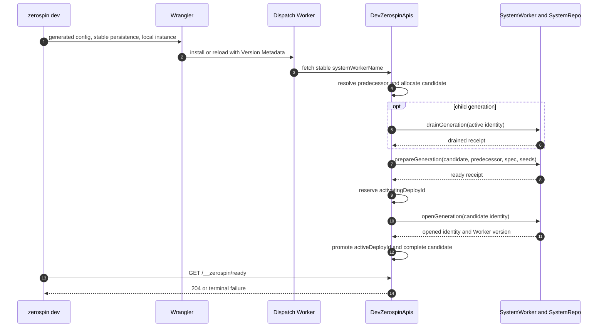
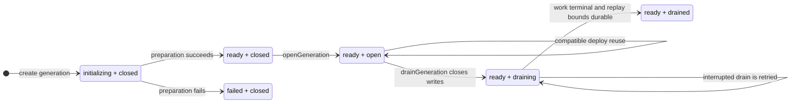

# DeploySystem

The public deployment architecture is the local `zerospin dev` lifecycle. The
CLI generates a temporary Wrangler configuration, the dispatch Worker routes
one stable local instance to `DevZerospinApis`, and that Durable Object owns
candidate allocation, generation selection, lifecycle receipts, final
promotion, and the readiness gate
(../../packages/cli/src/dev/devFn.ts:131-179,
../../packages/cli/src/dev/devFn.ts:248-358,
../../packages/dispatch-worker/src/Worker.ts:36-55,
../../packages/dispatch-worker/src/DevZerospinApis/DevZerospinApis.ts:227-235).

## Identity model

| Identity             | Public local meaning                                                                                                                                                                                                                                                         |
| -------------------- | ---------------------------------------------------------------------------------------------------------------------------------------------------------------------------------------------------------------------------------------------------------------------------- |
| `systemId`           | Authored system identity read from `wrangler.jsonc`. The CLI requires the expected `sys_`-prefixed shape (../../packages/cli/src/dev/devFn.ts:106-130).                                                                                                                      |
| `instanceId`         | Stable environment selector. Local development fixes it to `local` and derives `systemWorkerName` from `{ systemId, instanceId }` (../../packages/cli/src/dev/devFn.ts:131-143).                                                                                             |
| `workerVersionId`    | Wrangler Version Metadata identity for one concrete code reload. It is the only reload identity supplied to local control state (../../packages/dispatch-worker/src/DevZerospinApis/DevZerospinApis.ts:276-309).                                                             |
| `deployId`           | Identity allocated by `DevZerospinApis` for one Worker-version candidate (../../packages/dispatch-worker/src/DevZerospinApis/DevZerospinApis.ts:600-626).                                                                                                                    |
| `deployIndex`        | Instance-local integer order assigned when the candidate row is inserted; it is ordering, not identity (../../packages/dispatch-worker/src/DevZerospinApis/DevZerospinApis.ts:731-758).                                                                                      |
| `prevDeployId`       | Snapshot of the stable `activeDeployId` at candidate allocation. Final promotion rechecks this predecessor (../../packages/dispatch-worker/src/DevZerospinApis/DevZerospinApis.ts:741-758, ../../packages/dispatch-worker/src/DevZerospinApis/DevZerospinApis.ts:1269-1289). |
| `generationId`       | Namespace for one persistent repo graph. Compatible code can reuse it; a detached clean start or model change creates a new one (../../packages/dispatch-worker/src/DevZerospinApis/DevZerospinApis.ts:600-630).                                                             |
| `prevGenerationId`   | Replay source for a new child generation. Initial and explicit clean roots use `null` (../../packages/dispatch-worker/src/DevZerospinApis/DevZerospinApis.ts:616-630).                                                                                                       |
| `cleanRequestId`     | One CLI-process receipt consumed exactly once to request a detached root and its configured seeds (../../packages/cli/src/dev/devFn.ts:131-143, ../../packages/dispatch-worker/src/DevZerospinApis/DevZerospinApis.ts:527-598).                                              |
| `activeDeployId`     | Stable local instance pointer changed only by the final promotion transaction (../../packages/dispatch-worker/src/DevZerospinApis/DevZerospinApis.ts:1234-1320).                                                                                                             |
| `activatingDeployId` | Exclusive reservation held between successful preparation and final promotion (../../packages/dispatch-worker/src/DevZerospinApis/DevZerospinApis.ts:1083-1170).                                                                                                             |

## Core invariants

1. Authored system, account-controller, actor-controller,
   frontend-controller, and service-controller factories reject a missing or
   empty runtime `version` before their downstream maps, models, selections,
   guards, contracts, or adapters are validated. TypeScript still requires the
   same properties at each factory call site, but consumer project typechecking
   remains a consumer build concern rather than a `zerospin dev` phase
   (../../packages/core/src/system/makeSystem.ts:67-84,
   ../../packages/core/src/accountController/makeAccountController.ts:232-247,
   ../../packages/core/src/actorController/makeActorController.ts:196-210,
   ../../packages/core/src/frontendController/makeFrontendController.ts:143-164,
   ../../packages/core/src/service/makeServiceController.ts:238-253).
2. Wrangler code installation is not readiness. The CLI accepts Wrangler's
   listening address and separately calls `/__zerospin/ready`; only a completed
   `DevZerospinApis` initialization returns 204
   (../../packages/cli/src/dev/devFn.ts:400-457,
   ../../packages/dispatch-worker/src/DevZerospinApis/DevZerospinApis.ts:1503-1520).
3. One Worker version maps to one deploy attempt. A failed or interrupted
   mapping stays failed closed rather than allocating a second deploy ID for the
   same code version
   (../../packages/dispatch-worker/src/DevZerospinApis/DevZerospinApis.ts:307-378).
4. The stable active pointer does not move during checking, drain, preparation,
   or opening. Promotion rechecks both the captured predecessor and exclusive
   activation reservation
   (../../packages/dispatch-worker/src/DevZerospinApis/DevZerospinApis.ts:1083-1232,
   ../../packages/dispatch-worker/src/DevZerospinApis/DevZerospinApis.ts:1234-1320).
5. A clean start creates a detached lineage; it does not delete the stable
   Wrangler persistence directory or old generations
   (../../packages/cli/src/dev/devFn.ts:277-307,
   ../../packages/cli/src/dev/devFn.ts:342-358,
   ../../packages/dispatch-worker/src/DevZerospinApis/DevZerospinApis.ts:597-630).
6. Ordinary APIs are constructed only after promotion and are pinned to the
   selected deploy/generation pair
   (../../packages/dispatch-worker/src/DevZerospinApis/DevZerospinApis.ts:1234-1359,
   ../../packages/dispatch-worker/src/ZerospinApis/ZerospinApis.ts:136-230).

## Generation selection

The first local version creates a root generation. The first consumption of an
explicit clean receipt also creates a detached root and evaluates configured
seeds. Otherwise `DevZerospinApis` compares the active and current SystemSpecs:
compatible code reuses the active generation; a model-definition change that
requires migration creates a child whose `prevGenerationId` points at the
active generation
(../../packages/dispatch-worker/src/DevZerospinApis/DevZerospinApis.ts:527-630,
../../packages/dispatch-worker/src/DevZerospinApis/DevZerospinApis.ts:1049-1058).

An existing clean receipt selects its already-associated deploy/generation
instead of applying clean semantics again. Consequently later hot reloads in
the same `zerospin dev --clean` process follow normal compatibility selection
(../../packages/dispatch-worker/src/DevZerospinApis/DevZerospinApis.ts:527-598).

## Local lifecycle

### Trigger

1. The `dev` command parses `--clean` and invokes `devFn`
   (../../packages/cli/src/commands/dev.tsx:12-35).
2. `devFn` loads the project configuration, validates the system identity,
   resolves the shared dispatch Worker and optional seed module, and removes
   caller-supplied deployment/generation variables from the generated Wrangler
   inputs (../../packages/cli/src/dev/devFn.ts:76-179).
3. The generated config preserves project settings outside fields owned by
   local Zerospin, adds `DevZerospinApis` plus Version Metadata, and starts
   Wrangler against the stable encoded persistence root
   (../../packages/cli/src/dev/devFn.ts:181-307).
4. The dispatch Worker resolves the stable local Durable Object and forwards
   requests to it (../../packages/dispatch-worker/src/Worker.ts:36-55).

### Annotated workflow steps

1. `DevZerospinApis` validates its exact local key and constructs the public
   dispatch runtime from the static local identity resolver and same-isolate
   SystemWorker resolver
   (../../packages/dispatch-worker/src/DevZerospinApis/DevZerospinApis.ts:240-285).
2. It builds and runtime-decodes the current `SystemSpec` before reading an
   existing Worker-version mapping, comparing compatibility, or allocating any
   candidate state. Production deployment performs the same decode before the
   deploy RPC payload crosses the CLI boundary
   (../../packages/dispatch-worker/src/DevZerospinApis/DevZerospinApis.ts:294-308,
   ../../packages/cli/src/deploy/deploySystemFn.ts:48-67).
3. It either reopens a valid completed Worker-version mapping or resolves the
   current stable predecessor for a new candidate
   (../../packages/dispatch-worker/src/DevZerospinApis/DevZerospinApis.ts:287-525).
4. It consumes clean state, computes compatibility, allocates the candidate and
   generation identities, and persists the candidate plus first lifecycle event
   atomically
   (../../packages/dispatch-worker/src/DevZerospinApis/DevZerospinApis.ts:527-826).
5. An ordinary child migration inspects the active generation through
   `drainGeneration`; initial, clean, and reused generations skip that drain
   (../../packages/dispatch-worker/src/DevZerospinApis/DevZerospinApis.ts:847-966).
6. It calls `prepareGeneration` with seeds only for a newly consumed clean
   receipt and validates the returned identity, readiness, and reuse flag
   (../../packages/dispatch-worker/src/DevZerospinApis/DevZerospinApis.ts:968-1081).
7. It reserves activation, calls `openGeneration`, validates the opened
   identity and Version Metadata, then atomically completes and promotes the
   candidate
   (../../packages/dispatch-worker/src/DevZerospinApis/DevZerospinApis.ts:1083-1359).
8. Any terminal error records the failed phase, clears only this candidate's
   reservation, retains the Worker-version mapping, and rejects readiness
   (../../packages/dispatch-worker/src/DevZerospinApis/DevZerospinApis.ts:1360-1520).

## Durable generation lifecycle

The SystemWorker lifecycle methods are thin boundaries over the selected
generation's SystemRepo. `drainGeneration`, `prepareGeneration`, and
`openGeneration` decode the repo result and reject an identity mismatch before
returning it to local control
(../../packages/system-worker/src/drainGeneration/drainGeneration.ts:15-65,
../../packages/system-worker/src/prepareGeneration/prepareGeneration.ts:17-84,
../../packages/system-worker/src/openGeneration/openGeneration.ts:16-67).

`readiness` and `admission` are separate axes in the generation-local
`generationState` row. Preparation establishes whether the durable graph can
serve; opening and draining determine which ordinary operations may enter that
already-prepared graph
(../../packages/system-worker/src/SystemRepo/SystemRepo.ts:51-93,
../../packages/system-worker/src/SystemRepo/prepareGeneration/prepareGeneration.ts:1316-1387,
../../packages/system-worker/src/SystemRepo/openGeneration/openGeneration.ts:83-141).

“Opening” means atomically installing the prepared deploy and SystemSpec as the
generation-local active pair and changing admission to `open`. It is not the
creation of a WebSocket or the start of a Worker process. A repeated open for
the same already-active deploy is idempotent
(../../packages/system-worker/src/SystemRepo/openGeneration/openGeneration.ts:72-141,
../../packages/system-worker/src/SystemRepo/openGeneration/openGeneration.ts:143-191).

“Draining” means writes are closed before accepted work is driven to terminal
storage. Reads remain admitted so already-accepted operations and already-minted
credentials can finish. It does not delete the generation: `ready + drained`
is a valid terminal admission state
(../../packages/system-worker/src/SystemRepo/drainGeneration/drainGeneration.ts:92-173,
../../packages/system-worker/src/SystemRepo/assertGenerationAdmission/assertGenerationAdmission.ts:84-137).

1. Drain closes new writes, drains registered work in dependency order, captures
   immutable service/account replay bounds, and reaches `drained` only after all
   bounds exist
   (../../packages/system-worker/src/SystemRepo/drainGeneration/drainGeneration.ts:69-525).
2. Reuse preparation accepts neither a predecessor nor seeds and verifies that
   the candidate can remain on the current generation
   (../../packages/system-worker/src/SystemRepo/prepareGeneration/prepareGeneration.ts:216-320).
3. Root preparation has no predecessor and runs its supplied seeds through
   ordinary finalization. Migration preparation requires the predecessor to be
   ready and drained, rejects seeds, and replays service ledgers before account
   ledgers
   (../../packages/system-worker/src/SystemRepo/prepareGeneration/prepareGeneration.ts:323-516,
   ../../packages/system-worker/src/SystemRepo/prepareGeneration/prepareGeneration.ts:518-1314).
4. Readiness commits only after all root or replay postconditions. New-generation
   failure is persisted as failed/closed
   (../../packages/system-worker/src/SystemRepo/prepareGeneration/prepareGeneration.ts:1316-1421).
5. Open atomically moves the prepared deploy/spec into active admission and
   returns the generation identity
   (../../packages/system-worker/src/SystemRepo/openGeneration/openGeneration.ts:72-191).

### Normal drain order and retries

After the `open` to `draining` transition, SystemRepo drains registered repos
in dependency order: FrontendRepo, ServiceRepo, ServiceBlockRepo, AccountRepo,
then AccountBlockRepo. Only after those postconditions hold does it re-read the
block-repo registrations and persist immutable service and account replay bounds
(../../packages/system-worker/src/SystemRepo/drainGeneration/drainGeneration.ts:153-298,
../../packages/system-worker/src/SystemRepo/drainGeneration/drainGeneration.ts:300-480).

The final transition to `drained` occurs only when the stored-bound count
matches the complete re-read registration set. Remaining frontend WebSocket
tickets are purged after that durable transition
(../../packages/system-worker/src/SystemRepo/drainGeneration/drainGeneration.ts:482-547).

An interrupted drain remains in `draining`; the next call skips the initial
write-closing transition and repeats the idempotent repo drains. Existing replay
bounds must match values observed by a retry. If the lifecycle transition
succeeded but ticket cleanup failed, the already-`drained` branch retries that
cleanup without reopening admission
(../../packages/system-worker/src/SystemRepo/drainGeneration/drainGeneration.ts:127-173,
../../packages/system-worker/src/SystemRepo/drainGeneration/drainGeneration.ts:300-480,
../../packages/system-worker/src/SystemRepo/drainGeneration/drainGeneration.ts:515-547).

## Admission and failure behavior

SystemRepo admission requires a ready generation and a deploy equal to the
generation-local active deploy. Reads are allowed while admission is `open` or
`draining`; writes require `open`
(../../packages/system-worker/src/SystemRepo/assertGenerationAdmission/assertGenerationAdmission.ts:34-138).

| Generation state        | Ordinary reads | Ordinary writes | Ticket mint | Ticket consume |
| ----------------------- | -------------: | --------------: | ----------: | -------------: |
| `initializing + closed` |             No |              No |          No |             No |
| `ready + closed`        |             No |              No |          No |             No |
| `ready + open`          |            Yes |             Yes |         Yes |            Yes |
| `ready + draining`      |            Yes |              No |          No |            Yes |
| `ready + drained`       |             No |              No |          No |             No |
| `failed + closed`       |             No |              No |          No |             No |

Ticket mint uses write admission, while consumption uses read admission with
the deploy stored in the ticket row. This makes an already-minted ticket usable
during `draining` but prevents issuance of a new credential after writes close
(../../packages/system-worker/src/SystemRepo/createFrontendWebSocketTicket/createFrontendWebSocketTicket.ts:42-51,
../../packages/system-worker/src/SystemRepo/consumeFrontendWebSocketTicket/consumeFrontendWebSocketTicket.ts:123-151).

### Generation readiness versus local HTTP readiness

`generationState.readiness` belongs to one durable generation. `ready` means
that root preparation or replay finished and its postconditions were committed;
it does not by itself select that generation as the stable local deployment or
open ordinary admission
(../../packages/system-worker/src/SystemRepo/prepareGeneration/prepareGeneration.ts:1316-1387,
../../packages/system-worker/src/SystemRepo/openGeneration/openGeneration.ts:83-141).

`GET /__zerospin/ready` is instead the process-facing local CLI gate on
`DevZerospinApis.#apisReadiness`. It returns 204 only after candidate lifecycle,
opening, stable-pointer promotion, and public API construction have all
completed; a terminal initialization failure returns 500
(../../packages/dispatch-worker/src/DevZerospinApis/DevZerospinApis.ts:1234-1359,
../../packages/dispatch-worker/src/DevZerospinApis/DevZerospinApis.ts:1503-1520).

A local candidate failure never implies rollback of the stable active pointer.
The failure remains attached to its Worker version at the last durable phase;
edited code creates a new Worker version and therefore a new candidate. A new
`--clean` process supplies a new detached-root receipt
(../../packages/dispatch-worker/src/DevZerospinApis/DevZerospinApis.ts:287-425,
../../packages/dispatch-worker/src/DevZerospinApis/DevZerospinApis.ts:1360-1520).

## Local deploy logs and runtime logs

`DevZerospinApis` stores an instance-local append-only `deployLog`. Each row has
an integer event index plus deploy, generation, phase, level, message, payload,
and timestamp. These events are operator history; `systemInstance`, `deploy`,
and `generation` rows remain the local lifecycle state
(../../packages/dispatch-worker/src/DevZerospinApis/DevZerospinApis.ts:35-196,
../../packages/dispatch-worker/src/DevZerospinApis/DevZerospinApis.ts:785-826).

`SystemLogRepo` is separate generation-scoped runtime observability. Its Durable
Object key is the generation, and its rows preserve the emitting deploy identity
inside that generation
(../../packages/system-worker/src/SystemLogRepo/SystemLogRepo.ts:40-110,
../../packages/system-worker/src/SystemLogRepo/SystemLogRepo.ts:205-327).

## Public caller boundary

The complete public chain is `zerospin dev` → generated Wrangler dispatch
Worker → stable `DevZerospinApis` → lifecycle RPCs on SystemWorker/SystemRepo →
pinned `ZerospinApis`. There is no environment-specific remote control-plane
implementation in this repository
(../../packages/cli/src/commands/dev.tsx:26-35,
../../packages/dispatch-worker/src/Worker.ts:36-55,
../../packages/dispatch-worker/src/DevZerospinApis/DevZerospinApis.ts:1234-1359).
