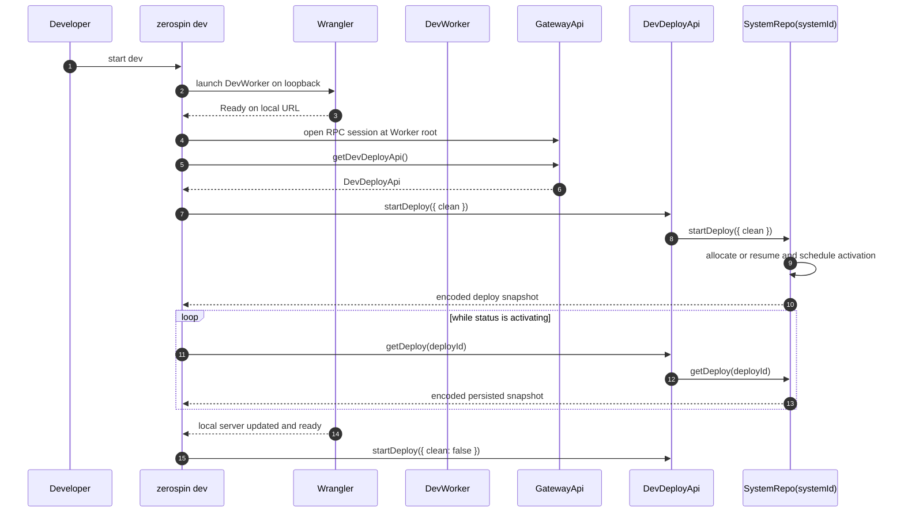

# Development Lifecycle

`zerospin dev` launches `DevWorker` on loopback with local Durable Object
persistence. `DevWorker` exposes a Worker-hosted `GatewayApi` for deploy,
readiness, authentication, and system RPCs. It forwards only
`/ws-system-logs/{generationId}`, `/ws-aggregate-frontend-blocks`, and
`/ws-service-frontend-blocks` to the singleton `SystemRepo(systemId)` fetch
boundary
([`devFn.ts:131-192`](../../packages/cli/src/dev/devFn.ts#L131-L192),
[`DevWorker.ts:31-50`](../../packages/dev-worker/src/DevWorker.ts#L31-L50)).

## Annotated workflow steps

1. The developer starts the `dev` command with `systemId`, `clean`, and an
   optional port
   ([`dev.tsx:9-46`](../../packages/cli/src/commands/dev.tsx#L9-L46)).
2. `devFn` resolves the dedicated entrypoint, writes the ignored derived
   Wrangler config, and starts Wrangler with encoded local persistence
   ([`devFn.ts:131-224`](../../packages/cli/src/dev/devFn.ts#L131-L224),
   [`devFn.ts:226-245`](../../packages/cli/src/dev/devFn.ts#L226-L245)).
3. The CLI derives the base URL only from Wrangler's actual `Ready on` output
   and queues the first activation
   ([`devFn.ts:261-290`](../../packages/cli/src/dev/devFn.ts#L261-L290)).
4. The base URL is the RPC endpoint; the CLI opens a `GatewayApi` session at
   that Worker root
   ([`devFn.ts:318-336`](../../packages/cli/src/dev/devFn.ts#L318-L336)).
5. The CLI selects the environment-specific child through
   `GatewayApi.getDevDeployApi()`
   ([`GatewayApi.ts:57-64`](../../packages/system-worker/src/GatewayApi/GatewayApi.ts#L57-L64),
   [`devFn.ts:333-340`](../../packages/cli/src/dev/devFn.ts#L333-L340)).
6. The gateway returns `DevDeployApi`; no lifecycle operation is an HTTP route
   ([`getDevDeployApi.ts:8-24`](../../packages/system-worker/src/GatewayApi/getDevDeployApi/getDevDeployApi.ts#L8-L24)).
7. The first `startDeploy` preserves `--clean`; later reloads submit
   `clean: false`. The CLI does not supply deploy identity
   ([`devFn.ts:327-340`](../../packages/cli/src/dev/devFn.ts#L327-L340),
   [`devFn.ts:400-429`](../../packages/cli/src/dev/devFn.ts#L400-L429)).
8. `DevDeployApi.startDeploy` delegates directly to the matching SystemRepo
   RPC
   ([`DevDeployApi.ts:27-48`](../../packages/system-worker/src/DevDeployApi/DevDeployApi.ts#L27-L48),
   [`startDeploy.ts:8-24`](../../packages/system-worker/src/DevDeployApi/startDeploy/startDeploy.ts#L8-L24)).
9. `SystemRepo.startDeploy` combines the executing Worker metadata with
   `clean`, resumes an existing `{ workerVersionId, clean }` deploy or allocates
   it once, and schedules resumable activation; its in-memory activation
   promise is only a wakeup optimization
   ([`SystemRepo.ts:452-500`](../../packages/system-worker/src/SystemRepo/SystemRepo.ts#L452-L500),
   [`SystemRepo.ts:573-606`](../../packages/system-worker/src/SystemRepo/SystemRepo.ts#L573-L606),
   [`allocateDeploy.ts:96-185`](../../packages/system-worker/src/SystemRepo/allocateDeploy/allocateDeploy.ts#L96-L185)).
10. The caller receives the encoded persisted deploy snapshot with deploy,
    generation, checkpoint, status, failure, and executing Worker-version
    fields
    ([`DevDeployApi.ts:27-48`](../../packages/system-worker/src/DevDeployApi/DevDeployApi.ts#L27-L48)).
11. While activation remains nonterminal, the CLI polls the same child
    capability by `deployId`
    ([`devFn.ts:327-397`](../../packages/cli/src/dev/devFn.ts#L327-L397),
    [`devFn.ts:400-418`](../../packages/cli/src/dev/devFn.ts#L400-L418)).
12. `DevDeployApi.getDeploy` delegates to `SystemRepo.getDeploy`
    ([`DevDeployApi.ts:50-70`](../../packages/system-worker/src/DevDeployApi/DevDeployApi.ts#L50-L70),
    [`SystemRepo.ts:608-637`](../../packages/system-worker/src/SystemRepo/SystemRepo.ts#L608-L637)).
13. The same stored snapshot resumes polling; a persisted failure terminates the
    CLI with that domain error
    ([`devFn.ts:361-415`](../../packages/cli/src/dev/devFn.ts#L361-L415)).
14. Wrangler's actual reload marker queues another activation signal
    ([`devFn.ts:261-301`](../../packages/cli/src/dev/devFn.ts#L261-L301)).
15. A reload interrupts only the local polling delay and calls
    `startDeploy({ clean: false })` again. A changed Worker version allocates a
    new tuple; the same Worker version resumes its existing non-clean deploy
    ([`devFn.ts:418-429`](../../packages/cli/src/dev/devFn.ts#L418-L429)).

## Readiness and ingress

1. Dev readiness is `GatewayApi.getDevDeployApi().getReadiness()`. The child
   delegates to `SystemRepo.getReadiness`, which checks the executing Worker
   against the selected deploy
   ([`DevDeployApi.ts:73-75`](../../packages/system-worker/src/DevDeployApi/DevDeployApi.ts#L73-L75),
   [`SystemRepo.ts:639-654`](../../packages/system-worker/src/SystemRepo/SystemRepo.ts#L639-L654)).
2. Ordinary HTTP(S)/WebSocket RPC traffic terminates at `GatewayApi`. Only the
   three ticket-or-generation-bound WebSocket routes enter `SystemRepo.fetch`
   ([`DevWorker.ts:31-50`](../../packages/dev-worker/src/DevWorker.ts#L31-L50),
   [`fetch.ts:53-71`](../../packages/system-worker/src/SystemRepo/fetch/fetch.ts#L53-L71)).
3. `SystemRepo.fetch` rejects every non-reserved path; it is not a parallel
   lifecycle or API surface
   ([`fetch.ts:233-236`](../../packages/system-worker/src/SystemRepo/fetch/fetch.ts#L233-L236)).
4. Browser persistence remains separate. Plan 056 stores its native
   configuration-keyed last-user locator at
   `zerospin/056/last-user-partition-store` and user-root VFS bytes at
   `zerospin/056/{systemId}/users/{userId}`. A non-empty pre-056 Zerospin
   database, incompatible locator/VFS layout, or incompatible user-root schema
   fails with `browser-persistence-reset-required` before mutation
   ([`lastUserPartitionStore.ts:13-27`](../../packages/shared-worker/src/SharedWorker/lastUserPartitionStore.ts#L13-L27),
   [`lastUserPartitionStore.ts:29-303`](../../packages/shared-worker/src/SharedWorker/lastUserPartitionStore.ts#L29-L303),
   [`makeVfsName.ts:3-10`](../../packages/shared-worker/src/SharedWorker/makeVfsName.ts#L3-L10),
   [`makeIdbSQLite3.ts:30-155`](../../packages/shared-worker/src/drizzle/makeIdbSQLite3.ts#L30-L155),
   [`migrateUserReplicaDbAsync.ts:214-251`](../../packages/shared-worker/src/SharedWorker/migrateUserReplicaDbAsync.ts#L214-L251)).

## Browser persistence reset

`browser-persistence-reset-required` is a fail-closed acquisition error. Close
every Zerospin page for the affected origin and confirm its SharedWorker has
stopped, delete only IndexedDB databases whose names begin with `zerospin/` and
`localStorage` keys beginning with `zerospin:`, then reload and authenticate.
This reset is origin-local; it does not reset remote state or unrelated origin
storage
([`README.md:111-139`](../../README.md#L111-L139),
[`lastUserPartitionStore.ts:148-169`](../../packages/shared-worker/src/SharedWorker/lastUserPartitionStore.ts#L148-L169),
[`makeIdbSQLite3.ts:37-155`](../../packages/shared-worker/src/drizzle/makeIdbSQLite3.ts#L37-L155),
[`migrateUserReplicaDbAsync.ts:237-251`](../../packages/shared-worker/src/SharedWorker/migrateUserReplicaDbAsync.ts#L237-L251)).

## Trigger

1. The `dev` command starts Wrangler and drives `DevDeployApi` until one deploy
   succeeds or fails
   ([`devFn.ts:226-455`](../../packages/cli/src/dev/devFn.ts#L226-L455)).
2. Browser and CLI clients use the same Worker-hosted `GatewayApi`; aggregate,
   service, and system-log sockets alone use reserved `SystemRepo.fetch` routes
   ([`DevWorker.ts:31-50`](../../packages/dev-worker/src/DevWorker.ts#L31-L50)).

## Callers

- `zerospin dev`
- [`System Lifecycle`](./SystemLifecycle.md)
