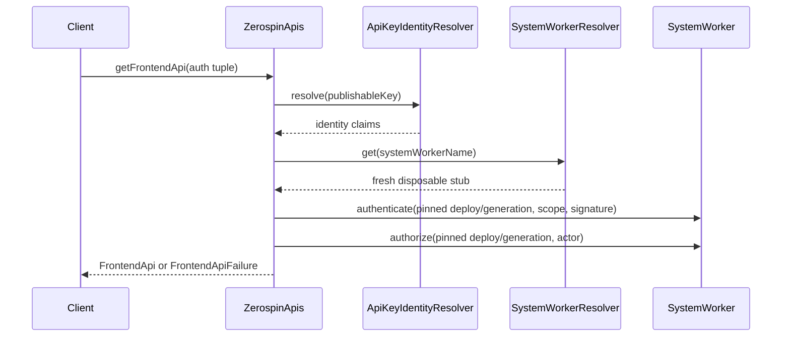
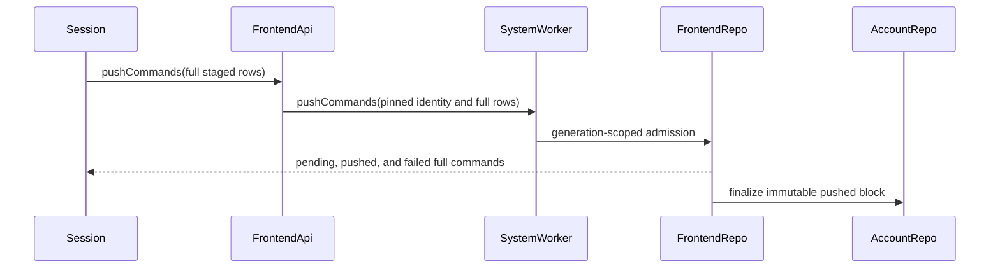

# FrontendApi

`FrontendApi` is the concrete per-frontend RPC capability exposed by
`ZerospinApis`. It serves actor identity, command admission, service and actor
queries, frontend specifications, and frontend state. The capability stores the
authenticated actor/frontend scope plus its constructor-pinned `deployId` and
`generationId`; callers cannot replace those values on individual leaves
(../../packages/dispatch-worker/src/FrontendApi/FrontendApi.ts:324-454).

## Public construction boundary

`ZerospinApis` is environment-independent. Its runtime receives an
`ApiKeyIdentityResolver` and a `SystemWorkerResolver`; the first maps an API key
to identity claims, while the second resolves a fresh disposable
`SystemWorker` stub for one `systemWorkerName`
(../../packages/dispatch-worker/src/ApiKeyIdentityResolver/ApiKeyIdentityResolver.ts:7-17,
../../packages/dispatch-worker/src/SystemWorkerResolver/SystemWorkerResolver.ts:4-17,
../../packages/dispatch-worker/src/makeDispatchRuntime.ts:12-35).

`ZerospinApis.getFrontendApi` validates the exact frontend-auth tuple, resolves
the API-key identity, derives `systemWorkerName`, and invokes
`SystemWorker.authenticate` followed by `SystemWorker.authorize`. Both calls
receive the gateway's pinned deploy/generation pair. Success produces a
`FrontendApi`; any domain failure produces `FrontendApiFailure`
(../../packages/dispatch-worker/src/ZerospinApis/ZerospinApis.ts:18-127,
../../packages/dispatch-worker/src/ZerospinApis/ZerospinApis.ts:204-230).

Standalone Workers can use the same capability without a dispatch namespace.
The shopping example constructs a runtime from a static identity resolver and
`WorkerExportsSystemWorkerResolver`, which resolves the co-located
`exports.SystemWorker` binding for every call
(../../examples/shopping/src/Worker.ts:26-41,
../../packages/dispatch-worker/src/SystemWorkerResolver/WorkerExportsSystemWorkerResolver.ts:7-30).

## Common leaf boundary

Each leaf validates its request tuple with excess properties rejected. A valid
call resolves a fresh `SystemWorker`, runs the named Effect with the stored
scope, collects server telemetry, persists the batch through
`appendTelemetryBatch`, and returns an encoded result plus a nullable span link.
Invalid arguments are returned in that same envelope shape without invoking the
domain handler. Telemetry persistence failure does not replace the domain
result; it makes the returned link `null`
(../../packages/dispatch-worker/src/FrontendApi/FrontendApi.ts:59-140).

The six public leaves are:

1. `fetchActor` reads the current system spec and returns actor identity plus
   deployment, generation, system, environment, and authored system-version
   metadata (../../packages/dispatch-worker/src/FrontendApi/FrontendApi.ts:142-169,
   ../../packages/dispatch-worker/src/FrontendApi/FrontendApi.ts:359-380).
2. `pushCommands` validates full encoded staged commands and delegates the
   complete objects with the authenticated account/actor/frontend scope
   (../../packages/dispatch-worker/src/FrontendApi/FrontendApi.ts:171-203,
   ../../packages/dispatch-worker/src/FrontendApi/FrontendApi.ts:382-405).
3. `executeServiceQuery` delegates a service name, query name, and unknown
   parameters under the pinned generation
   (../../packages/dispatch-worker/src/FrontendApi/FrontendApi.ts:205-240,
   ../../packages/dispatch-worker/src/FrontendApi/FrontendApi.ts:407-423).
4. `executeActorQuery` binds the authenticated actor/frontend scope before
   delegation (../../packages/dispatch-worker/src/FrontendApi/FrontendApi.ts:242-273,
   ../../packages/dispatch-worker/src/FrontendApi/FrontendApi.ts:425-433).
5. `makeFrontendSpec` reads the frontend controller spec for the authenticated
   account, actor, and frontend names
   (../../packages/dispatch-worker/src/FrontendApi/FrontendApi.ts:275-296,
   ../../packages/dispatch-worker/src/FrontendApi/FrontendApi.ts:435-443).
6. `getFrontendState` reads the generation-scoped projection used for browser
   bootstrap (../../packages/dispatch-worker/src/FrontendApi/FrontendApi.ts:298-322,
   ../../packages/dispatch-worker/src/FrontendApi/FrontendApi.ts:445-453).

## Command admission

The browser-side `pushStagedCommands` Effect reads staged rows in staged-cursor
order, opens a typed `ZerospinApis` session using `ZerospinApisUrl`, constructs
the frontend capability from the session scope, and sends the full encoded rows
through one `pushCommands` call
(../../packages/frontend/src/pushStagedCommands.ts:45-107).

`FrontendApi` does not rebuild or narrow the command objects. Its handler passes
the validated full encoded command array directly to `SystemWorker.pushCommands`
(../../packages/dispatch-worker/src/FrontendApi/FrontendApi.ts:171-203).

## Actor queries

The public frontend package owns the client Effect. `executeActorQuery` reads
the publishable key and API URL services, creates a typed Cap'n Web session,
resolves the frontend capability, wraps it with linked telemetry, and delegates
the query name and parameters. Domain or transport failures remain in the
existing Zerospin error channel
(../../packages/frontend/src/executeActorQuery.ts:18-84).

## Websocket boundary

Frontend block delivery is a Worker fetch route rather than a FrontendApi leaf.
The browser builds the exact generation/account/actor/frontend Durable Object
name, converts the configured API URL to `ws:` or `wss:`, and subscribes at
`/ws-subscriber/{encoded-name}`. Newer decoded frontend blocks apply to the
session with the prior pushed-command rebase watermark; stale indexes are
ignored (../../packages/react/src/acquireFrontendWebSocket.ts:16-143).

The standalone shopping Worker forwards that route directly to the named
FrontendBlockRepo and serves all other requests through its concrete
`ZerospinApis` root (../../examples/shopping/src/Worker.ts:43-61).

## Callers

1. Browser session bootstrap and command/query Effects consume the concrete
   `ZerospinApis` RPC type from `packages/dispatch-worker`
   (../../packages/frontend/src/pushStagedCommands.ts:33-41,
   ../../packages/frontend/src/executeActorQuery.ts:7-15).
2. Standalone example Workers construct the same public root from deployment
   bindings and public resolver implementations
   (../../examples/shopping/src/Worker.ts:26-41).
