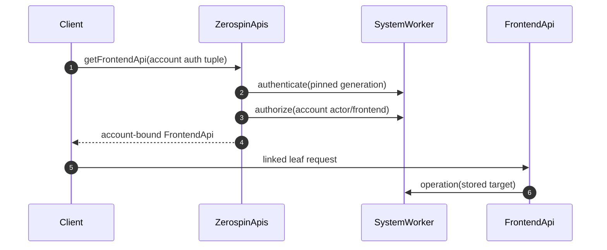

# FrontendApi

`FrontendApi` is the account-owned frontend capability. It is distinct from
`ServiceFrontendApi`: account admission authenticates and authorizes an account
actor, and the returned capability includes command push plus service/actor
queries. Service admission never passes through this class and exposes none of
those writable/query leaves
(../../packages/dispatch-worker/src/ZerospinApis/ZerospinApis.ts:30-134,
../../packages/dispatch-worker/src/ZerospinApis/ZerospinApis.ts:206-239).

## Public construction boundary

`ZerospinApis.getFrontendApi` validates the exact
`publishableKey/accountName/actorName/frontendName/signature` tuple, resolves a
fresh SystemWorker, authenticates, authorizes, and constructs a capability
pinned to that deploy, generation, account, actor, and frontend. A leaf caller
cannot replace any part of that target
(../../packages/dispatch-worker/src/ZerospinApis/ZerospinApis.ts:30-134,
../../packages/dispatch-worker/src/ZerospinApis/ZerospinApis.ts:206-233).

The browser-facing `fetchFrontend` program owns the Cap'n Web transport. It
generates the Config-provided signature, acquires the account capability, reads
actor identity and the complete frontend spec, checks the compiled account,
actor, frontend, and version, and returns one idempotent release that disposes
both leaf and root RPC targets
(../../packages/frontend/src/fetchFrontend.ts:30-103,
../../packages/frontend/src/fetchFrontend.ts:103-193).

The separate public `@zerospin/frontend/authenticate` program is a one-shot
caller of that same admission path: it accepts an already-generated signature,
returns only actor/deploy/generation/system metadata, and releases the admitted
capability immediately. It does not add an `authenticate` method to
`FrontendApi`; the gateway leaf that returns actor identity remains
`fetchActor()`
(../../packages/frontend/src/authenticate.ts:19-54,
../../packages/dispatch-worker/src/FrontendApi/FrontendApi.ts:138-165,
../../packages/dispatch-worker/src/FrontendApi/FrontendApi.ts:379-398).

## Common leaf boundary

Every leaf rejects excess arguments, resolves a fresh SystemWorker from the
stored worker name, runs a named root Effect with the stored auth target,
persists its telemetry batch, and returns the encoded domain result plus a
nullable cross-trace link. Invalid arguments do not invoke the handler, while a
telemetry-persistence failure preserves the domain result and returns no link
(../../packages/dispatch-worker/src/FrontendApi/FrontendApi.ts:59-136).

## Annotated leaves

1. `fetchActor()` returns the authenticated actor plus deploy, generation,
   system, environment, worker, and authored system-version identity
   (../../packages/dispatch-worker/src/FrontendApi/FrontendApi.ts:138-165,
   ../../packages/dispatch-worker/src/FrontendApi/FrontendApi.ts:379-398).
2. `pushCommands({ commands })` forwards the complete encoded staged command
   objects and returns complete pending, pushed, and failed command collections
   (../../packages/dispatch-worker/src/FrontendApi/FrontendApi.ts:167-199,
   ../../packages/dispatch-worker/src/FrontendApi/FrontendApi.ts:400-423).
3. `executeServiceQuery(...)` and `executeActorQuery(...)` preserve the account
   capability's pinned generation and bind actor queries to its stored actor
   target
   (../../packages/dispatch-worker/src/FrontendApi/FrontendApi.ts:201-267,
   ../../packages/dispatch-worker/src/FrontendApi/FrontendApi.ts:425-451).
4. `makeFrontendSpec()` returns the complete account frontend controller spec
   used for compiled-code comparison
   (../../packages/dispatch-worker/src/FrontendApi/FrontendApi.ts:269-290,
   ../../packages/dispatch-worker/src/FrontendApi/FrontendApi.ts:453-461).
5. `getFrontendState()` returns the account projection resources, pending pushed
   commands, complete executed and failed terminal rows, logical
   `frontendIndex`, and pushed-rebase watermark only while the capability's bound
   generation and frontend binding remain authoritative. FrontendRepo ensures a
   live segment's archive covers the captured state before exposing it; a
   post-freeze `no-local-segment` remains snapshot-only and has no archive or
   ticket path
   (../../packages/dispatch-worker/src/FrontendApi/FrontendApi.ts:292-316,
   ../../packages/system-worker/src/SystemWorker.ts:436-697,
   ../../packages/system-worker/src/FrontendRepo/getFrontendState/getFrontendState.ts:139-179,
   ../../packages/system-worker/src/FrontendRepo/getFrontendState/getFrontendState.ts:292-379).
6. `createFrontendWebSocketTicket()` resolves the current ticket authority,
   mints a one-use account archive ticket there, and returns the complete target,
   including authoritative generation and frontend version; the browser still
   cannot select the underlying FrontendBlockRepo
   (../../packages/dispatch-worker/src/FrontendApi/FrontendApi.ts:318-342,
   ../../packages/dispatch-worker/src/FrontendApi/FrontendApi.ts:473-494,
   ../../packages/system-worker/src/createFrontendWebSocketTicket/createFrontendWebSocketTicket.ts:25-240,
   ../../packages/system-worker/src/createFrontendWebSocketTicket/createFrontendWebSocketTicket.ts:243-418).

## Provider authority

State and command push remain bound to the source capability. A drained source
returns `frontend-generation-changed`, a removed target returns
`frontend-identity-changed`, and a same-generation controller version or spec
change returns `frontend-version-changed`; neither method applies successor
state to the source projection
(../../packages/system-worker/src/SystemWorker.ts:436-697,
../../packages/system-worker/src/SystemWorker.ts:1960-2186).

Ticket minting is the deliberate exception. It walks only a complete recorded
chain of drained generations, verifies every successor's inverse predecessor,
and stops at a ready generation with open admission. It then checks the exact
account/actor/frontend identity, requires the target projection and immutable
archive to exist and cover the advertised index, and stores the one-use ticket
only in that target SystemRepo. A same-generation frontend-version change may
therefore return the newer version while preserving the same version-independent
archive; a model or projection-schema change cannot reuse the generation
(../../packages/system-worker/src/createFrontendWebSocketTicket/createFrontendWebSocketTicket.ts:38-240,
../../packages/system-worker/src/createFrontendWebSocketTicket/createFrontendWebSocketTicket.ts:243-418).

## Command preservation

The standalone `pushFrontendCommands` program sends full encoded staged
commands through an already-admitted capability and returns the three full
command partitions. The gateway does not rebuild commands field by field, and
service frontends have no corresponding push program or leaf
(../../packages/frontend/src/pushFrontendCommands.ts:17-45,
../../packages/dispatch-worker/src/FrontendApi/FrontendApi.ts:167-199).

## Callers

1. Config-owned account bootstrap retains the admitted identity/spec/capability
   returned by `fetchFrontend`; it does not share that capability with a service
   session (../../packages/frontend/src/fetchFrontend.ts:147-193).
2. Direct mode and SharedWorker account providers consume state, ticket, and
   push leaves. Service providers consume the separate two-leaf
   `ServiceFrontendApi` documented in [[ServiceFrontendApi]].
3. See [[FrontendWebSocket]] for the account archive resume protocol and
   [[bootstrapBrowserSession]] for persistent command-journal ownership.
