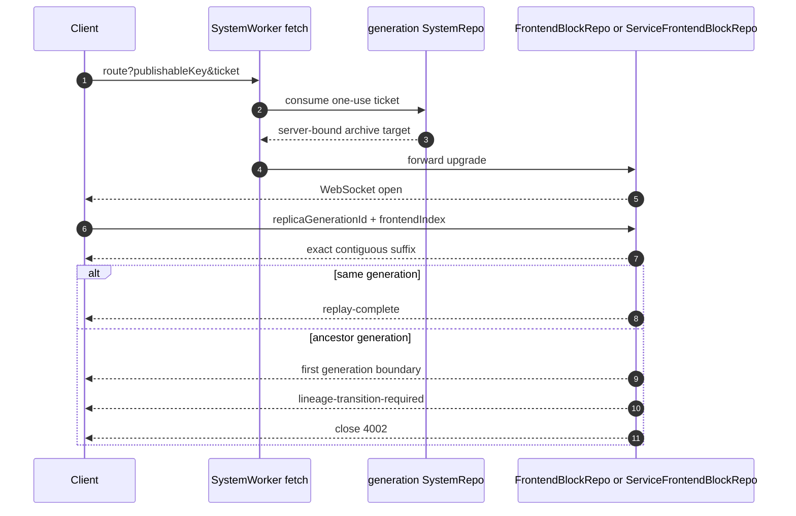

# Frontend WebSocket

Account and service replicas use parallel but distinct native WebSocket routes:
`/ws-frontend-blocks` terminates in `FrontendBlockRepo`, while
`/ws-service-frontend-blocks` terminates in `ServiceFrontendBlockRepo`. Both
routes accept exactly one `publishableKey` and one generation-prefixed one-use
ticket; neither accepts a caller-selected repository name
(../../packages/system-worker/src/SystemWorker.ts:2584-2685,
../../packages/system-worker/src/SystemWorker.ts:2688-2807).

The ticket transfers admission to a hibernating archive room. The stateless
gateway and SystemRepo are not part of the socket lifetime, and spending a
ticket before the final Durable Object fetch means a forwarding failure never
restores that credential
(../../packages/system-worker/src/SystemWorker.ts:2628-2685,
../../packages/system-worker/src/SystemWorker.ts:2732-2807).

Ticket consumption also returns the frontend version persisted when the ticket
was minted. The public worker forwards that value in a private header, and the
archive stores it in hibernation state so every `state-required` response is
bound to the ticket's version without making the archive key version-specific.
An archive connection without that server-supplied value closes with code 4004
and reason `frontend-version-required`
(../../packages/system-worker/src/SystemWorker.ts:2628-2673,
../../packages/system-worker/src/SystemWorker.ts:2732-2788,
../../packages/system-worker/src/FrontendBlockRepo/onConnect/onConnect.ts:4-30,
../../packages/system-worker/src/ServiceFrontendBlockRepo/onConnect/onConnect.ts:4-30).

## Trigger

1. An admitted account `FrontendApi` or service `ServiceFrontendApi` resolves the
   current authoritative archive and mints a short-lived ticket there. A ready
   source with `open` or `draining` read admission remains that authority, so a
   reconnect during frozen pre-switch preparation mints against the source
   archive while writes stay closed. Only a `drained` source can advance through
   a complete recorded successor chain whose inverse predecessor links all match
   (../../packages/system-worker/src/createFrontendWebSocketTicket/createFrontendWebSocketTicket.ts:38-240,
   ../../packages/system-worker/src/createServiceFrontendWebSocketTicket/createServiceFrontendWebSocketTicket.ts:82-265).
2. Direct mode or the SharedWorker opens the target-specific route with only
   `publishableKey` and `ticket`. In SharedWorker mode the stable Config provider
   callback generates a fresh signature, obtains and validates a one-shot
   admitted capability, mints the ticket, and releases that capability before
   returning the result
   (../../packages/react/src/bootstrapBrowserSession.ts:1231-1486,
   ../../packages/react/src/bootstrapBrowserServiceSession.ts:961-1211).
3. On `open`, the client sends the first and only resume frame:
   `{ replicaGenerationId, frontendIndex }`. The archive does not broadcast new
   live blocks to that connection until replay finishes
   (../../packages/system-worker/src/FrontendBlockRepo/onMessage/onMessage.ts:20-121,
   ../../packages/system-worker/src/ServiceFrontendBlockRepo/onMessage/onMessage.ts:19-116).

## Same-generation replay

For a same-generation resume, the archive repeatedly captures its current
terminal index, returns the strict `(clientIndex, terminal]` suffix, and rechecks
the terminal. Only a stable terminal emits `replay-complete` and changes the
connection phase to `live`; a client index beyond the archive, an invalid
suffix, or another resume frame emits `state-required` and closes with 4003
(../../packages/system-worker/src/FrontendBlockRepo/onMessage/onMessage.ts:65-166,
../../packages/system-worker/src/ServiceFrontendBlockRepo/onMessage/onMessage.ts:68-161).

The client treats `replay-complete` as the online barrier. Direct and worker
clients validate the returned generation/index against their current replica,
reset reconnect attempts only after that barrier, and apply every ordinary
lineage block at the exact next frontend index
(../../packages/react/src/acquireFrontendWebSocket.ts:315-417,
../../packages/react/src/acquireServiceFrontendWebSocket.ts:330-433,
../../packages/shared-worker/src/SharedWorker/makeSharedWorkerHost.ts:2347-2460,
../../packages/shared-worker/src/SharedWorker/makeSharedWorkerHost.ts:4974-5084).

A frontend version change inside the same generation does not discard the old
replica or stop archive consumption. The fresh ticket identifies the newer
authoritative version, while the old account or service replica keeps its own
identity, opens the same version-independent archive, applies compatible blocks,
and reports `update-required`. Account mode also durably suspends writes and
makes staged, pushing, or transport-uncertain journal rows dormant; the service
replica was already read-only
(../../packages/react/src/acquireFrontendWebSocket.ts:274-417,
../../packages/react/src/acquireServiceFrontendWebSocket.ts:290-433,
../../packages/shared-worker/src/SharedWorker/makeSharedWorkerHost.ts:2198-2305,
../../packages/shared-worker/src/SharedWorker/makeSharedWorkerHost.ts:3170-3369,
../../packages/shared-worker/src/SharedWorker/makeSharedWorkerHost.ts:4908-4934).

## Cross-generation transition

When the resume generation is an ancestor, the target archive walks immutable
predecessor descriptors and rejects cycles or any target mismatch. It replays
only the source generation's remaining indexed suffix, sends the first exact
generation-boundary block, then emits `lineage-transition-required` containing
the final target identity and informational later boundaries before closing
(../../packages/system-worker/src/FrontendBlockRepo/onMessage/onMessage.ts:168-377,
../../packages/system-worker/src/ServiceFrontendBlockRepo/onMessage/onMessage.ts:164-371).

Direct clients accept the control only when its applied index matches the first
boundary just committed. The SharedWorker additionally rereads the persisted
previous block and requires it to prove that exact source-to-first-successor
edge before it stores the transition. Both validate the remaining boundary
chain and authenticate the final target separately. A matching target replaces
or activates the target replica; absent matching code retains the readable
source as `update-required`. Intermediate descriptors never cause the source
database to be repointed
(../../packages/react/src/acquireFrontendWebSocket.ts:418-559,
../../packages/react/src/acquireServiceFrontendWebSocket.ts:434-566,
../../packages/shared-worker/src/SharedWorker/makeSharedWorkerHost.ts:2481-2607,
../../packages/shared-worker/src/SharedWorker/makeSharedWorkerHost.ts:5104-5226).

A matching-code direct account transition preflights every live staged command
before replacing state. After target state commits, it removes old optimistic
overlays newest-first and reverses each mutation program, then installs adapted
commands oldest-first and applies each current program in declaration order.
Compatibility failure leaves the source state and commands readable as
`update-required`; identity changes only after the replacement and adaptation
transactions both succeed
(../../packages/react/src/bootstrapBrowserSession.ts:2770-3221).

For a SharedWorker replica, transport regain first reauthenticates through the
current Config authenticator. Exact-generation recovery keeps the existing
acquisition. A different authenticated generation starts a separately bound
active target acquisition with fresh one-shot state, ticket, and account-push
callbacks; the source replica and journal remain untouched unless the target
lineage handoff completes
(../../packages/react/src/bootstrapBrowserSession.ts:1627-2206,
../../packages/react/src/bootstrapBrowserServiceSession.ts:1215-1633,
../../packages/react/src/makeBrowserPartitionController.ts:2974-3716,
../../packages/react/src/makeBrowserPartitionController.ts:4928-5180).

## Repair and reconnect

`state-required`, an index gap, a conflicting equal-index block, target mismatch,
decode failure, or application failure moves the replica to repair. Full state
is fetched through the current provider proxy and replaces the same logical
replica only after validation. In SharedWorker mode every state, ticket, and
account-push call uses a fresh admitted capability and releases it after that
single operation. Ordinary operational and repair failures preserve cached
authority. Authentication or signature-schema rejection, or an independently
resolved identity change, removes matching locators and main-thread sessions,
returns the encoded provider rejection, and only then schedules the worker
acquisition release
(../../packages/react/src/makeBrowserPartitionController.ts:949-1227,
../../packages/react/src/makeBrowserPartitionController.ts:1403-1586,
../../packages/react/src/makeBrowserPartitionController.ts:2014-2218).

Ticket or connect transport failure is handled separately: direct mode
reauthenticates through Config, atomically swaps an exact target/version/spec
capability, reports `update-required` for a same-target version change, and
fails closed for signature-schema or other authority mismatch. Every reconnect
mints a fresh one-use ticket, and exponential backoff remains capped at 30
seconds
(../../packages/react/src/acquireFrontendWebSocket.ts:583-830,
../../packages/react/src/acquireServiceFrontendWebSocket.ts:609-852,
../../packages/react/src/bootstrapBrowserSession.ts:2673-3221,
../../packages/react/src/bootstrapBrowserServiceSession.ts:2064-2255,
../../packages/shared-worker/src/SharedWorker/makeSharedWorkerHost.ts:1992-2131,
../../packages/shared-worker/src/SharedWorker/makeSharedWorkerHost.ts:4739-4843).

## Superseded rooms

After the successor is ready and routing has switched, generation completion
signals every frozen account and service archive room. Each room validates that
the successor differs from its own generation and closes live sockets with code
4001 and reason `generation-superseded`; retained archive bytes and predecessor
descriptors are not deleted
(../../packages/system-worker/src/FrontendBlockRepo/generationSuperseded/generationSuperseded.ts:6-29,
../../packages/system-worker/src/ServiceFrontendBlockRepo/generationSuperseded/generationSuperseded.ts:6-30).

See [[DeploySystem]] for freeze/prepare/open/complete ordering and
[[bootstrapBrowserSession]] for direct and SharedWorker ownership.
