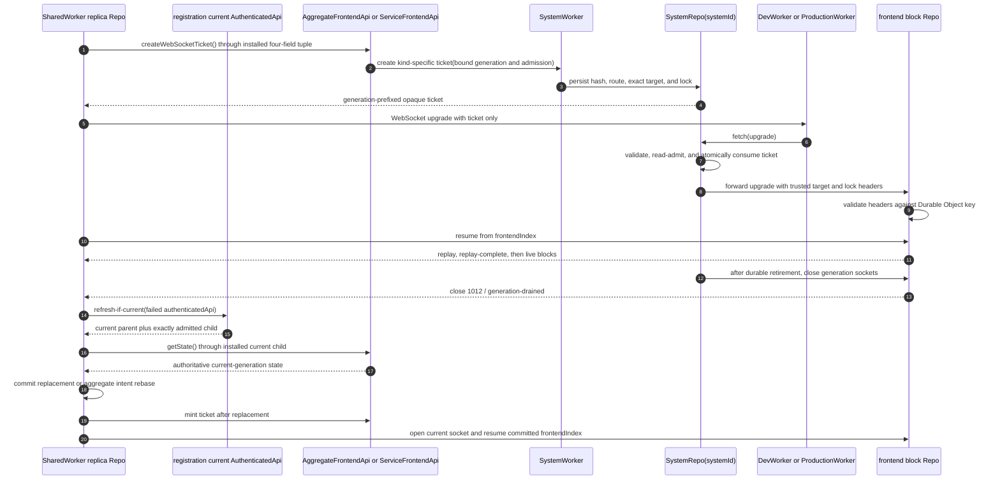

# Frontend WebSocket

Aggregate and service frontend sockets are ticket-only Worker routes:
`/ws-aggregate-frontend-blocks?ticket={opaque}` and
`/ws-service-frontend-blocks?ticket={opaque}`. The URL carries no publishable
key, target fields, lock, user identity, or Repo name. `SystemRepo` recovers
that authority from the short-lived single-use ticket row and forwards trusted
headers to the exact archive Repo
([`fetch.ts:69-98`](../../packages/system-worker/src/SystemRepo/fetch/fetch.ts#L69-L98),
[`fetch.ts:100-230`](../../packages/system-worker/src/SystemRepo/fetch/fetch.ts#L100-L230)).

The socket is owned by the exact SharedWorker replica Repo, not by one page
registration. That Repo mints and consumes a ticket through its one installed
`{ registrationId, ownerToken, authenticatedApi, frontendApi }` tuple. It also
captures the authority-selection attempt, matching live registration, current
parent, and exact socket for every callback
([`AggregateFrontendReplicaRepo.ts:188-243`](../../packages/shared-worker/src/SharedWorker/AggregateFrontendReplicaRepo/AggregateFrontendReplicaRepo.ts#L188-L243),
[`AggregateFrontendReplicaRepo.ts:2082-2264`](../../packages/shared-worker/src/SharedWorker/AggregateFrontendReplicaRepo/AggregateFrontendReplicaRepo.ts#L2082-L2264),
[`ServiceFrontendReplicaRepo.ts:87-133`](../../packages/shared-worker/src/SharedWorker/ServiceFrontendReplicaRepo/ServiceFrontendReplicaRepo.ts#L87-L133),
[`ServiceFrontendReplicaRepo.ts:1126-1309`](../../packages/shared-worker/src/SharedWorker/ServiceFrontendReplicaRepo/ServiceFrontendReplicaRepo.ts#L1126-L1309)).

## Annotated workflow steps

1. The SharedWorker exact replica Repo captures its installed
   `{ registrationId, ownerToken, authenticatedApi, frontendApi }` tuple, the
   authority-selection attempt, and the matching live online registration
   before calling the receiver-relative `createWebSocketTicket()` leaf. The
   same tuple and current parent must still be installed before the ticket can
   be used
   ([`createAggregateFrontendWebSocketTicket.ts:11-37`](../../packages/frontend/src/createAggregateFrontendWebSocketTicket.ts#L11-L37),
   [`createServiceFrontendWebSocketTicket.ts:11-37`](../../packages/frontend/src/createServiceFrontendWebSocketTicket.ts#L11-L37),
   [`AggregateFrontendReplicaRepo.ts:2101-2204`](../../packages/shared-worker/src/SharedWorker/AggregateFrontendReplicaRepo/AggregateFrontendReplicaRepo.ts#L2101-L2204),
   [`ServiceFrontendReplicaRepo.ts:1150-1260`](../../packages/shared-worker/src/SharedWorker/ServiceFrontendReplicaRepo/ServiceFrontendReplicaRepo.ts#L1150-L1260)).
2. The child validates zero arguments and supplies its bound generation, exact
   target, complete lock, and private SystemWorker route
   ([`createWebSocketTicket.ts:19-70`](../../packages/system-worker/src/AggregateFrontendApi/createWebSocketTicket/createWebSocketTicket.ts#L19-L70),
   [`createWebSocketTicket.ts:17-69`](../../packages/system-worker/src/ServiceFrontendApi/createWebSocketTicket/createWebSocketTicket.ts#L17-L69)).
3. `SystemWorker` verifies the selected lock and initialized projection/archive,
   then asks `SystemRepo` to store only the ticket hash with
   `{ generationId, repoName, exact target, complete lock, expiresAt }`
   ([`createAggregateFrontendWebSocketTicket.ts:18-118`](../../packages/system-worker/src/createAggregateFrontendWebSocketTicket/createAggregateFrontendWebSocketTicket.ts#L18-L118),
   [`createAggregateFrontendWebSocketTicket.ts:130-209`](../../packages/system-worker/src/createAggregateFrontendWebSocketTicket/createAggregateFrontendWebSocketTicket.ts#L130-L209),
   [`SystemRepo.ts:249-299`](../../packages/system-worker/src/SystemRepo/SystemRepo.ts#L249-L299)).
4. The returned ticket is `{generationId}.{256-bit base64url random suffix}`;
   the raw credential is never persisted
   ([`createAggregateFrontendWebSocketTicket.ts:50-79`](../../packages/system-worker/src/SystemRepo/createAggregateFrontendWebSocketTicket/createAggregateFrontendWebSocketTicket.ts#L50-L79),
   [`createServiceFrontendWebSocketTicket.ts:50-74`](../../packages/system-worker/src/SystemRepo/createServiceFrontendWebSocketTicket/createServiceFrontendWebSocketTicket.ts#L50-L74)).
5. The aggregate replica builds `/ws-aggregate-frontend-blocks` and the service
   replica builds `/ws-service-frontend-blocks`; each sets exactly one `ticket`
   query parameter
   ([`AggregateFrontendReplicaRepo.ts:2206-2224`](../../packages/shared-worker/src/SharedWorker/AggregateFrontendReplicaRepo/AggregateFrontendReplicaRepo.ts#L2206-L2224),
   [`ServiceFrontendReplicaRepo.ts:1230-1264`](../../packages/shared-worker/src/SharedWorker/ServiceFrontendReplicaRepo/ServiceFrontendReplicaRepo.ts#L1230-L1264)).
6. The conventional Worker entrypoint forwards only reserved socket routes to
   `SystemRepo.fetch`. Production additionally rejects malformed ticket syntax
   before forwarding
   ([`DevWorker.ts:31-40`](../../packages/dev-worker/src/DevWorker.ts#L31-L40),
   [`ProductionWorker.ts:67-105`](../../packages/production-worker/src/ProductionWorker.ts#L67-L105)).
7. `SystemRepo` hashes the ticket, loads the exact stored row, checks expiry and
   generation read admission, and conditionally deletes the row as the atomic
   single-use boundary
   ([`consumeAggregateFrontendWebSocketTicket.ts:48-168`](../../packages/system-worker/src/SystemRepo/consumeAggregateFrontendWebSocketTicket/consumeAggregateFrontendWebSocketTicket.ts#L48-L168),
   [`consumeAggregateFrontendWebSocketTicket.ts:170-248`](../../packages/system-worker/src/SystemRepo/consumeAggregateFrontendWebSocketTicket/consumeAggregateFrontendWebSocketTicket.ts#L170-L248)).
8. After consumption, `SystemRepo.fetch` forwards the upgrade to the stored Repo
   name with trusted target and serialized lock headers
   ([`fetch.ts:129-162`](../../packages/system-worker/src/SystemRepo/fetch/fetch.ts#L129-L162),
   [`fetch.ts:193-230`](../../packages/system-worker/src/SystemRepo/fetch/fetch.ts#L193-L230)).
9. The archive validates forwarded headers against its Durable Object key and
   stores the complete lock in connection state
   ([`AggregateFrontendBlockRepo/onConnect.ts:28-64`](../../packages/system-worker/src/AggregateFrontendBlockRepo/onConnect/onConnect.ts#L28-L64),
   [`ServiceFrontendBlockRepo/onConnect.ts:24-55`](../../packages/system-worker/src/ServiceFrontendBlockRepo/onConnect/onConnect.ts#L24-L55)).
10. The replica sends its current `frontendIndex` as the only resume message
    ([`AggregateFrontendBlockRepo/onMessage.ts:68-108`](../../packages/system-worker/src/AggregateFrontendBlockRepo/onMessage/onMessage.ts#L68-L108),
    [`ServiceFrontendBlockRepo/onMessage.ts:68-108`](../../packages/system-worker/src/ServiceFrontendBlockRepo/onMessage/onMessage.ts#L68-L108)).
11. The archive traverses predecessor segments, emits ordered kind-specific
    block messages, sends `replay-complete`, and then marks the connection live
    ([`AggregateFrontendBlockRepo/onMessage.ts:178-304`](../../packages/system-worker/src/AggregateFrontendBlockRepo/onMessage/onMessage.ts#L178-L304),
    [`ServiceFrontendBlockRepo/onMessage.ts:177-306`](../../packages/system-worker/src/ServiceFrontendBlockRepo/onMessage/onMessage.ts#L177-L306)).
12. After the generation phase is durably `retired`, `SystemRepo` invokes every
    registered aggregate and service archive's `drainGeneration`; socket closure
    is cleanup after the read fence, not the fence itself
    ([`retireGeneration.ts:54-113`](../../packages/system-worker/src/SystemRepo/retireGeneration/retireGeneration.ts#L54-L113)).
13. Each archive closes its sockets with exact code `1012` and reason
    `generation-drained`
    ([`AggregateFrontendBlockRepo/drainGeneration.ts:3-8`](../../packages/system-worker/src/AggregateFrontendBlockRepo/drainGeneration/drainGeneration.ts#L3-L8),
    [`ServiceFrontendBlockRepo/drainGeneration.ts:3-8`](../../packages/system-worker/src/ServiceFrontendBlockRepo/drainGeneration/drainGeneration.ts#L3-L8)).
14. A `1012 / generation-drained` close suppresses ordinary reconnect and marks
    full authoritative replacement required. Authority repair passes the
    installed tuple's failed `authenticatedApi` to the port's
    `refresh-if-current` boundary; that boundary refreshes only when the same
    parent is still current and otherwise returns the already newer parent
    ([`AggregateFrontendReplicaRepo.ts:2386-2422`](../../packages/shared-worker/src/SharedWorker/AggregateFrontendReplicaRepo/AggregateFrontendReplicaRepo.ts#L2386-L2422),
    [`ServiceFrontendReplicaRepo.ts:1436-1474`](../../packages/shared-worker/src/SharedWorker/ServiceFrontendReplicaRepo/ServiceFrontendReplicaRepo.ts#L1436-L1474),
    [`getUserPartitionRepo.ts:164-190`](../../packages/shared-worker/src/SharedWorker/SharedWorkerApi/getUserPartitionRepo/getUserPartitionRepo.ts#L164-L190)).
15. The current parent authorizes a generation-bound child for the same exact
    target and complete lock. After full admission decoding and comparison, the
    exact Repo installs a new
    `{ registrationId, ownerToken, authenticatedApi, frontendApi }` tuple only
    while the selected registration remains live and that parent remains
    current
    ([`AggregateFrontendReplicaRepo.ts:1651-1801`](../../packages/shared-worker/src/SharedWorker/AggregateFrontendReplicaRepo/AggregateFrontendReplicaRepo.ts#L1651-L1801),
    [`ServiceFrontendReplicaRepo.ts:675-830`](../../packages/shared-worker/src/SharedWorker/ServiceFrontendReplicaRepo/ServiceFrontendReplicaRepo.ts#L675-L830)).
16. Before reconnect after a generation transition or `state-required`, the
    replacement path invokes `getState()` through the installed tuple and
    fences the late result by tuple identity, selection attempt, registration
    liveness, current parent, and captured local frontiers
    ([`AggregateFrontendReplicaRepo.ts:1856-1979`](../../packages/shared-worker/src/SharedWorker/AggregateFrontendReplicaRepo/AggregateFrontendReplicaRepo.ts#L1856-L1979),
    [`ServiceFrontendReplicaRepo.ts:862-1007`](../../packages/shared-worker/src/SharedWorker/ServiceFrontendReplicaRepo/ServiceFrontendReplicaRepo.ts#L862-L1007)).
17. The current child returns authoritative state from its bound generation;
    retired children fail read admission instead of routing that read current
    ([`assertGenerationAdmission.ts:86-105`](../../packages/system-worker/src/SystemRepo/assertGenerationAdmission/assertGenerationAdmission.ts#L86-L105),
    [`getState.ts:19-66`](../../packages/system-worker/src/AggregateFrontendApi/getState/getState.ts#L19-L66),
    [`getState.ts:17-70`](../../packages/system-worker/src/ServiceFrontendApi/getState/getState.ts#L17-L70)).
18. Service replacement deletes and reinstalls canonical resources; aggregate
    replacement first rewinds local optimism, reconciles every active staged or
    pushed command against authoritative classifications, and reapplies the
    remaining intent. Both commit `systemVersion`, `frontendIndex`, and exactly
    one next `replicaIndex` before fan-out
    ([`AggregateFrontendReplicaRepo.ts:961-1195`](../../packages/shared-worker/src/SharedWorker/AggregateFrontendReplicaRepo/AggregateFrontendReplicaRepo.ts#L961-L1195),
    [`ServiceFrontendReplicaRepo.ts:190-341`](../../packages/shared-worker/src/SharedWorker/ServiceFrontendReplicaRepo/ServiceFrontendReplicaRepo.ts#L190-L341)).
19. A generation transition mints the next ticket only after full replacement
    commits. By contrast, a refreshable ticket RPC or parent failure repairs
    only the child authority with `replaceState: false` and retries the ticket
    against the unchanged local frontier. Aggregate ticket recovery excludes
    the selected owner and forces transfer only after that retried ticket also
    fails
    ([`AggregateFrontendReplicaRepo.ts:2143-2189`](../../packages/shared-worker/src/SharedWorker/AggregateFrontendReplicaRepo/AggregateFrontendReplicaRepo.ts#L2143-L2189),
    [`AggregateFrontendReplicaRepo.ts:2442-2470`](../../packages/shared-worker/src/SharedWorker/AggregateFrontendReplicaRepo/AggregateFrontendReplicaRepo.ts#L2442-L2470),
    [`ServiceFrontendReplicaRepo.ts:1150-1227`](../../packages/shared-worker/src/SharedWorker/ServiceFrontendReplicaRepo/ServiceFrontendReplicaRepo.ts#L1150-L1227)).
20. Only after the required replacement or child-only repair completes does the
    replica mint/open the socket and resume from the committed `frontendIndex`.
    Every open, message, replay-complete, block-commit, and close callback is
    fenced by the exact socket, installed tuple, selection attempt,
    registration, and current parent
    ([`AggregateFrontendReplicaRepo.ts:2191-2424`](../../packages/shared-worker/src/SharedWorker/AggregateFrontendReplicaRepo/AggregateFrontendReplicaRepo.ts#L2191-L2424),
    [`ServiceFrontendReplicaRepo.ts:1245-1477`](../../packages/shared-worker/src/SharedWorker/ServiceFrontendReplicaRepo/ServiceFrontendReplicaRepo.ts#L1245-L1477)).

## Ticket lifecycle

1. Minting and consumption require an `open` or `draining` generation. The
   durable `retired` transition is the read fence; archive socket closure happens
   only after that phase is visible
   ([`createAggregateFrontendWebSocketTicket.ts:90-176`](../../packages/system-worker/src/SystemRepo/createAggregateFrontendWebSocketTicket/createAggregateFrontendWebSocketTicket.ts#L90-L176),
   [`assertGenerationAdmission.ts:86-105`](../../packages/system-worker/src/SystemRepo/assertGenerationAdmission/assertGenerationAdmission.ts#L86-L105),
   [`retireGeneration.ts:54-113`](../../packages/system-worker/src/SystemRepo/retireGeneration/retireGeneration.ts#L54-L113)).
2. Tickets expire after 30 seconds and are spent once. Malformed, missing,
   expired, and reused aggregate tickets share the same public invalid-ticket
   failure
   ([`createAggregateFrontendWebSocketTicket.ts:150-176`](../../packages/system-worker/src/SystemRepo/createAggregateFrontendWebSocketTicket/createAggregateFrontendWebSocketTicket.ts#L150-L176),
   [`consumeAggregateFrontendWebSocketTicket.ts:48-63`](../../packages/system-worker/src/SystemRepo/consumeAggregateFrontendWebSocketTicket/consumeAggregateFrontendWebSocketTicket.ts#L48-L63),
   [`consumeAggregateFrontendWebSocketTicket.ts:104-158`](../../packages/system-worker/src/SystemRepo/consumeAggregateFrontendWebSocketTicket/consumeAggregateFrontendWebSocketTicket.ts#L104-L158)).
3. A `state-required` message closes the socket when replay cannot prove a
   contiguous archive path. The SharedWorker fetches and commits authoritative
   state before another ticket
   ([`AggregateFrontendBlockRepo/onMessage.ts:68-108`](../../packages/system-worker/src/AggregateFrontendBlockRepo/onMessage/onMessage.ts#L68-L108),
   [`AggregateFrontendReplicaRepo.ts:2291-2319`](../../packages/shared-worker/src/SharedWorker/AggregateFrontendReplicaRepo/AggregateFrontendReplicaRepo.ts#L2291-L2319),
   [`ServiceFrontendReplicaRepo.ts:1331-1362`](../../packages/shared-worker/src/SharedWorker/ServiceFrontendReplicaRepo/ServiceFrontendReplicaRepo.ts#L1331-L1362)).
4. A `1012 / generation-drained` close requires child refresh plus full state
   replacement before reconnect. A refreshable ticket RPC or parent failure is
   operation-local instead: child-only repair, no state replacement, then one
   ticket retry against the same committed frontier
   ([`AggregateFrontendReplicaRepo.ts:2386-2422`](../../packages/shared-worker/src/SharedWorker/AggregateFrontendReplicaRepo/AggregateFrontendReplicaRepo.ts#L2386-L2422),
   [`AggregateFrontendReplicaRepo.ts:2143-2189`](../../packages/shared-worker/src/SharedWorker/AggregateFrontendReplicaRepo/AggregateFrontendReplicaRepo.ts#L2143-L2189),
   [`ServiceFrontendReplicaRepo.ts:1150-1227`](../../packages/shared-worker/src/SharedWorker/ServiceFrontendReplicaRepo/ServiceFrontendReplicaRepo.ts#L1150-L1227),
   [`ServiceFrontendReplicaRepo.ts:1436-1474`](../../packages/shared-worker/src/SharedWorker/ServiceFrontendReplicaRepo/ServiceFrontendReplicaRepo.ts#L1436-L1474)).
5. A fresh explicit unsupported-lock result or exact admission mismatch is not
   a transport retry. It terminally fences only the owning exact replica Repo,
   disposes its installed child, closes its socket, and notifies that Repo's
   still-live sinks without probing a sibling registration
   ([`AggregateFrontendReplicaRepo.ts:2153-2168`](../../packages/shared-worker/src/SharedWorker/AggregateFrontendReplicaRepo/AggregateFrontendReplicaRepo.ts#L2153-L2168),
   [`AggregateFrontendReplicaRepo.ts:1992-2026`](../../packages/shared-worker/src/SharedWorker/AggregateFrontendReplicaRepo/AggregateFrontendReplicaRepo.ts#L1992-L2026),
   [`ServiceFrontendReplicaRepo.ts:531-639`](../../packages/shared-worker/src/SharedWorker/ServiceFrontendReplicaRepo/ServiceFrontendReplicaRepo.ts#L531-L639),
   [`ServiceFrontendReplicaRepo.ts:1043-1078`](../../packages/shared-worker/src/SharedWorker/ServiceFrontendReplicaRepo/ServiceFrontendReplicaRepo.ts#L1043-L1078)).

## Trigger

1. An exact aggregate or service replica Repo with at least one live online
   registration owns one socket. It mints tickets only through its installed
   `{ registrationId, ownerToken, authenticatedApi, frontendApi }` tuple and
   fans state, blocks, and failures to registration sinks
   ([`AggregateFrontendReplicaRepo.ts:2082-2474`](../../packages/shared-worker/src/SharedWorker/AggregateFrontendReplicaRepo/AggregateFrontendReplicaRepo.ts#L2082-L2474),
   [`ServiceFrontendReplicaRepo.ts:1126-1495`](../../packages/shared-worker/src/SharedWorker/ServiceFrontendReplicaRepo/ServiceFrontendReplicaRepo.ts#L1126-L1495)).
2. `SystemRepo.fetch` accepts no lifecycle, authentication, or general API
   paths
   ([`fetch.ts:53-71`](../../packages/system-worker/src/SystemRepo/fetch/fetch.ts#L53-L71),
   [`fetch.ts:233-236`](../../packages/system-worker/src/SystemRepo/fetch/fetch.ts#L233-L236)).

## Callers

- [`AggregateFrontendApi`](./AggregateFrontendApi.md)
- [`ServiceFrontendApi`](./ServiceFrontendApi.md)
- [`Browser Frontend Lifecycle`](../dev/diagrams/BrowserFrontendLifecycle.md)
