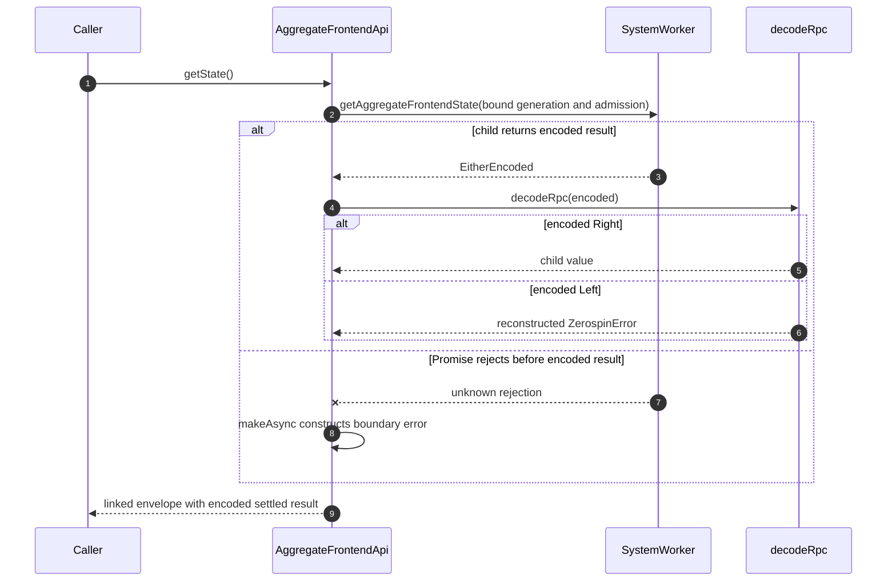

# RPC Error Boundaries

Zerospin transports domain results as an encoded `Either`. `encodeRpc` settles
an Effect and encodes either its value or its existing `ZerospinError`;
`decodeRpc` reconstructs that error. It creates `failed-to-decode-rpc` only when
the outer `Either` or encoded error shape is invalid. The `Right` payload remains
owned by the operation-specific boundary
([`encodeRpc.ts:8-26`](../../packages/core/src/utils/encodeRpc.ts#L8-L26),
[`decodeRpc.ts:10-34`](../../packages/core/src/utils/decodeRpc.ts#L10-L34)).

## Annotated workflow steps

1. `AggregateFrontendApi.getState` is a public Promise/RPC method delegating to
   the same-named Effect
   ([`AggregateFrontendApi.ts:125-131`](../../packages/system-worker/src/AggregateFrontendApi/AggregateFrontendApi.ts#L125-L131)).
2. The Effect sends bound `{ generationId, actorRef, frontendName,
aggregateFrontendLock }` to `SystemWorker.getAggregateFrontendState`
   ([`getState.ts:49-60`](../../packages/system-worker/src/AggregateFrontendApi/getState/getState.ts#L49-L60)).
3. `SystemWorker` settles domain success or failure with `encodeRpc`
   ([`SystemWorker.ts:119-132`](../../packages/system-worker/src/SystemWorker.ts#L119-L132)).
4. The API passes the child envelope through `decodeRpc`
   ([`getState.ts:54-66`](../../packages/system-worker/src/AggregateFrontendApi/getState/getState.ts#L54-L66)).
5. An encoded `Right` becomes the child value; payload-specific validation, when
   required, belongs at the operation boundary
   ([`decodeRpc.ts:26-31`](../../packages/core/src/utils/decodeRpc.ts#L26-L31)).
6. An encoded `Left` becomes the reconstructed child `ZerospinError`; its code
   is not replaced
   ([`decodeRpc.ts:17-31`](../../packages/core/src/utils/decodeRpc.ts#L17-L31)).
7. A rejected Promise before an encoded result is a distinct transport/runtime
   boundary failure
   ([`getState.ts:54-66`](../../packages/system-worker/src/AggregateFrontendApi/getState/getState.ts#L54-L66),
   [`makeAsync.ts:8-26`](../../packages/core/src/async/makeAsync.ts#L8-L26)).
8. `makeAsync` preserves a call-site mapping when supplied; its default maps an
   unknown rejection once to `async-failed`
   ([`makeAsync.ts:6-26`](../../packages/core/src/async/makeAsync.ts#L6-L26)).
9. The API re-encodes the settled value or error and returns one linked outer
   envelope
   ([`getState.ts:67-95`](../../packages/system-worker/src/AggregateFrontendApi/getState/getState.ts#L67-L95)).

## Boundary decision table

| Boundary input                                    | Result                                                                                                                                                                                                                                                                                                                                                          |
| ------------------------------------------------- | --------------------------------------------------------------------------------------------------------------------------------------------------------------------------------------------------------------------------------------------------------------------------------------------------------------------------------------------------------------- |
| Encoded `Right`                                   | Return the decoded value ([`decodeRpc.ts:26-31`](../../packages/core/src/utils/decodeRpc.ts#L26-L31)).                                                                                                                                                                                                                                                          |
| Encoded `Left`                                    | Fail with the reconstructed child `ZerospinError` ([`decodeRpc.ts:26-31`](../../packages/core/src/utils/decodeRpc.ts#L26-L31)).                                                                                                                                                                                                                                 |
| Invalid outer `Either` or encoded error           | Create `failed-to-decode-rpc` ([`decodeRpc.ts:17-25`](../../packages/core/src/utils/decodeRpc.ts#L17-L25)).                                                                                                                                                                                                                                                     |
| Rejected Promise already carrying `ZerospinError` | Preserve it when the boundary catch checks `ZerospinError.isZerospinError` ([`AggregateFrontendReplicaApi/getState.ts:14-16`](../../packages/shared-worker/src/SharedWorker/AggregateFrontendReplicaApi/getState/getState.ts#L14-L16)).                                                                                                                         |
| Unknown Promise rejection                         | Construct one boundary-specific error and record the formatted unknown cause ([`makeAsync.ts:6-26`](../../packages/core/src/async/makeAsync.ts#L6-L26), [`ZerospinError.ts:79-124`](../../packages/error/src/ZerospinError.ts#L79-L124)).                                                                                                                       |
| Capability acquisition failure                    | Return the matching same-shaped failure target with the captured error ([`getAuthenticatedApi.ts:120-124`](../../packages/system-worker/src/GatewayApi/getAuthenticatedApi/getAuthenticatedApi.ts#L120-L124), [`getSystemApi.ts:55-57`](../../packages/system-worker/src/GatewayApi/getSystemApi/getSystemApi.ts#L55-L57)).                                     |
| Call to a failure-target leaf                     | Return `encodeLeft(capturedError)` without resolver, owner, or telemetry work ([`getAdmission.ts:4-7`](../../packages/system-worker/src/AggregateFrontendApi/AggregateFrontendApiFailure/getAdmission/getAdmission.ts#L4-L7), [`getState.ts:7-12`](../../packages/system-worker/src/ServiceFrontendApi/ServiceFrontendApiFailure/getState/getState.ts#L7-L12)). |

## Failure target chain

1. `AuthenticatedApiFailure` exposes `getAuthentication`,
   `getAggregateFrontendApi`, and `getServiceFrontendApi`. Child acquisition
   returns the matching child failure target carrying the same root error
   ([`AuthenticatedApiFailure.ts:17-50`](../../packages/system-worker/src/AuthenticatedApi/AuthenticatedApiFailure/AuthenticatedApiFailure.ts#L17-L50)).
2. `AggregateFrontendApiFailure` mirrors all six aggregate leaves, including
   flat `getAdmission()`; `ServiceFrontendApiFailure` mirrors all three service
   leaves
   ([`AggregateFrontendApiFailure.ts:15-61`](../../packages/system-worker/src/AggregateFrontendApi/AggregateFrontendApiFailure/AggregateFrontendApiFailure.ts#L15-L61),
   [`ServiceFrontendApiFailure.ts:12-36`](../../packages/system-worker/src/ServiceFrontendApi/ServiceFrontendApiFailure/ServiceFrontendApiFailure.ts#L12-L36)).
3. `SystemApiFailure` mirrors the complete administrative surface. Acquisition
   returns it only after preserving the concrete gateway error
   ([`SystemApiFailure.ts:36-87`](../../packages/system-worker/src/SystemApi/SystemApiFailure/SystemApiFailure.ts#L36-L87),
   [`getSystemApi.ts:55-57`](../../packages/system-worker/src/GatewayApi/getSystemApi/getSystemApi.ts#L55-L57)).

## SystemRepo HTTP boundary

`SystemRepo.fetch` is not a general RPC or lifecycle endpoint. It accepts only
the system-log socket and aggregate/service frontend socket routes. Its Effect
failure handler serializes the existing `ZerospinError`; the terminal Promise
catch preserves an already thrown `ZerospinError` and constructs
`system-fetch-failed` only for an unknown thrown value
([`fetch.ts:53-71`](../../packages/system-worker/src/SystemRepo/fetch/fetch.ts#L53-L71),
[`SystemRepo.ts:503-566`](../../packages/system-worker/src/SystemRepo/SystemRepo.ts#L503-L566)).

Ticket validation deliberately maps malformed, missing, expired, and reused
credentials to the concrete aggregate/service invalid-ticket failure rather
than exposing storage state
([`consumeAggregateFrontendWebSocketTicket.ts:48-63`](../../packages/system-worker/src/SystemRepo/consumeAggregateFrontendWebSocketTicket/consumeAggregateFrontendWebSocketTicket.ts#L48-L63),
[`consumeAggregateFrontendWebSocketTicket.ts:104-158`](../../packages/system-worker/src/SystemRepo/consumeAggregateFrontendWebSocketTicket/consumeAggregateFrontendWebSocketTicket.ts#L104-L158)).

## SharedWorker port authentication boundary

1. One `SharedWorkerApi` port binds exactly one `{ systemName,
authenticationLock, generateSignature }` configuration. Rebinding that port
   to another system or lock is definitive: the worker records
   `shared-worker-port-authentication-configuration-mismatch` and synchronously
   disposes the complete port-owned capability graph
   ([`getUserPartitionRepo.ts:117-159`](../../packages/shared-worker/src/SharedWorker/SharedWorkerApi/getUserPartitionRepo/getUserPartitionRepo.ts#L117-L159),
   [`dispose.ts:13-46`](../../packages/shared-worker/src/SharedWorker/SharedWorkerApi/dispose/dispose.ts#L13-L46)).
2. Worker authentication distinguishes three failure sources. Page capability
   invocation failures are transient; decoded callback failures are transient
   except `authentication-signature-invalid` and `failed-to-decode-rpc`; remote
   authentication failures are transient only for the five explicit transport
   or deploy-readiness codes. Every other failure is definitive and ejects the
   port instead of opening persisted state
   ([`getUserPartitionRepo.ts:193-287`](../../packages/shared-worker/src/SharedWorker/SharedWorkerApi/getUserPartitionRepo/getUserPartitionRepo.ts#L193-L287)).
3. Initial `existing-only` fallback is narrower than transient retry: it is
   available only when the failure came from remote authentication and carried
   one of those five codes. A signature-capability or callback failure remains
   retryable for a later operation but cannot select an offline user identity
   ([`getUserPartitionRepo.ts:380-410`](../../packages/shared-worker/src/SharedWorker/SharedWorkerApi/getUserPartitionRepo/getUserPartitionRepo.ts#L380-L410),
   [`getUserPartitionRepo.ts:432-492`](../../packages/shared-worker/src/SharedWorker/SharedWorkerApi/getUserPartitionRepo/getUserPartitionRepo.ts#L432-L492)).
4. Repo authority repair requests `{ freshness, failedAuthenticatedApi }`.
   `current` reuses the installed port parent, `refresh-if-current` authenticates
   only while the failed parent remains current, and `force` requires a new
   authentication attempt. All three join one port-local pending attempt, so a
   stale sibling failure cannot replace a newer parent
   ([`getUserPartitionRepo.ts:164-225`](../../packages/shared-worker/src/SharedWorker/SharedWorkerApi/getUserPartitionRepo/getUserPartitionRepo.ts#L164-L225),
   [`getUserPartitionRepo.ts:298-376`](../../packages/shared-worker/src/SharedWorker/SharedWorkerApi/getUserPartitionRepo/getUserPartitionRepo.ts#L298-L376)).
5. Persistence acquisition keeps boundary-specific failures distinct. Locator
   enumeration or open, read, and write failures use
   `open-last-user-partition-store-failed`,
   `get-last-user-partition-failed`, and `set-last-user-partition-failed`; an
   absent configuration-keyed locator uses `offline-user-locator-unavailable`.
   Incompatible locator, VFS, or SQLite schema state uses
   `browser-persistence-reset-required`, while an absent existing-only exact
   replica uses `cached-aggregate-frontend-replica-unavailable` or
   `cached-service-frontend-replica-unavailable`
   ([`lastUserPartitionStore.ts:16-303`](../../packages/shared-worker/src/SharedWorker/lastUserPartitionStore.ts#L16-L303),
   [`lastUserPartitionStore.ts:306-464`](../../packages/shared-worker/src/SharedWorker/lastUserPartitionStore.ts#L306-L464),
   [`getUserPartitionRepo.ts:409-566`](../../packages/shared-worker/src/SharedWorker/SharedWorkerApi/getUserPartitionRepo/getUserPartitionRepo.ts#L409-L566),
   [`makeIdbSQLite3.ts:30-155`](../../packages/shared-worker/src/drizzle/makeIdbSQLite3.ts#L30-L155),
   [`migrateUserReplicaDbAsync.ts:214-251`](../../packages/shared-worker/src/SharedWorker/migrateUserReplicaDbAsync.ts#L214-L251),
   [`acquireAggregateFrontendReplica.ts:146-179`](../../packages/shared-worker/src/SharedWorker/UserPartitionRepo/acquireAggregateFrontendReplica/acquireAggregateFrontendReplica.ts#L146-L179),
   [`acquireAggregateFrontendReplica.ts:319-490`](../../packages/shared-worker/src/SharedWorker/UserPartitionRepo/acquireAggregateFrontendReplica/acquireAggregateFrontendReplica.ts#L319-L490),
   [`acquireServiceFrontendReplica.ts:152-177`](../../packages/shared-worker/src/SharedWorker/UserPartitionRepo/acquireServiceFrontendReplica/acquireServiceFrontendReplica.ts#L152-L177),
   [`acquireServiceFrontendReplica.ts:316-492`](../../packages/shared-worker/src/SharedWorker/UserPartitionRepo/acquireServiceFrontendReplica/acquireServiceFrontendReplica.ts#L316-L492)).

## Callers

1. `AggregateFrontendApi` and `ServiceFrontendApi` decode child SystemWorker
   envelopes and re-encode the settled result for their caller
   ([`getState.ts:54-95`](../../packages/system-worker/src/AggregateFrontendApi/getState/getState.ts#L54-L95),
   [`getState.ts:52-93`](../../packages/system-worker/src/ServiceFrontendApi/getState/getState.ts#L52-L93)).
2. `SystemApi` uses `makeApiHandler` for the same settle, telemetry, and linked
   envelope policy
   ([`makeApiHandler.ts:41-86`](../../packages/system-worker/src/SystemApi/makeApiHandler/makeApiHandler.ts#L41-L86)).
3. The SharedWorker client decodes `getUserPartitionRepo` and closes the port if
   acquisition fails
   ([`acquireUserPartitionRepo.ts:313-337`](../../packages/shared-worker/src/acquireUserPartitionRepo.ts#L313-L337)).
