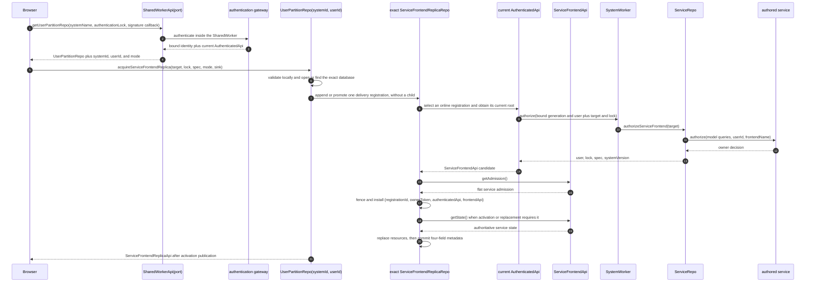

# ServiceFrontendApi

`ServiceFrontendApi` is the independently disposable read-only capability for
one admitted service frontend. Its private constructor state is exactly
`{ userId, frontendName, serviceFrontendLock, generationId, serviceName,
frontendSpec, systemId, systemVersion, systemWorkerName }`
([`ServiceFrontendApi.ts:17-54`](../../packages/system-worker/src/ServiceFrontendApi/ServiceFrontendApi.ts#L17-L54)).

Its flat public admission receipt is exactly `{ userId, serviceName,
frontendName, serviceFrontendLock, frontendSpec, systemId, systemVersion }`.
Private `generationId` and `systemWorkerName` remain inside the child
([`ServiceFrontendApi.ts:56-75`](../../packages/system-worker/src/ServiceFrontendApi/ServiceFrontendApi.ts#L56-L75),
[`getAdmission.ts:7-32`](../../packages/system-worker/src/ServiceFrontendApi/getAdmission/getAdmission.ts#L7-L32)).

## Annotated workflow steps

1. The page gives `acquireUserPartitionRepo` only `{ systemName,
authenticationLock, generateSignature }`; it does not choose `systemId`,
   `userId`, or acquisition mode
   ([`makeZerospinApp.tsx:206-237`](../../packages/react/src/makeZerospinApp.tsx#L206-L237),
   [`acquireUserPartitionRepo.ts:193-208`](../../packages/shared-worker/src/acquireUserPartitionRepo.ts#L193-L208)).
2. The port-owned authentication boundary single-flights `current`,
   `refresh-if-current`, and `force` requests and invokes `authenticate` with the
   retained page signature callback inside the SharedWorker
   ([`getUserPartitionRepo.ts:164-293`](../../packages/shared-worker/src/SharedWorker/SharedWorkerApi/getUserPartitionRepo/getUserPartitionRepo.ts#L164-L293)).
3. A successful attempt is published only if its configuration, pending token,
   prior current root, and bound identity are unchanged; the port then binds
   exact `{ systemId, userId, systemName }` and owns the current
   `AuthenticatedApi`
   ([`getUserPartitionRepo.ts:296-348`](../../packages/shared-worker/src/SharedWorker/SharedWorkerApi/getUserPartitionRepo/getUserPartitionRepo.ts#L296-L348)).
4. The port returns `{ api, systemId, userId, mode }`. Online identity comes from
   authentication; the narrow readiness/transport fallback resolves the exact
   stored identity and returns `mode: 'existing-only'`
   ([`getUserPartitionRepo.ts:381-495`](../../packages/shared-worker/src/SharedWorker/SharedWorkerApi/getUserPartitionRepo/getUserPartitionRepo.ts#L381-L495),
   [`getUserPartitionRepo.ts:717-734`](../../packages/shared-worker/src/SharedWorker/SharedWorkerApi/getUserPartitionRepo/getUserPartitionRepo.ts#L717-L734)).
5. `bootstrapBrowserServiceSession` sends `{ serviceName, frontendName,
serviceFrontendLock, serviceFrontendLockKey, frontendSpec, mode, sink }` to
   the returned partition capability
   ([`bootstrapBrowserServiceSession.ts:215-233`](../../packages/react/src/bootstrapBrowserServiceSession.ts#L215-L233)).
6. Before any child lookup, the partition validates the exact target, spec,
   complete lock bytes, canonical lock key, and persisted catalog receipt, then
   finds the exact runtime or prepares its physical database
   ([`acquireServiceFrontendReplica.ts:98-245`](../../packages/shared-worker/src/SharedWorker/UserPartitionRepo/acquireServiceFrontendReplica/acquireServiceFrontendReplica.ts#L98-L245),
   [`acquireServiceFrontendReplica.ts:279-492`](../../packages/shared-worker/src/SharedWorker/UserPartitionRepo/acquireServiceFrontendReplica/acquireServiceFrontendReplica.ts#L279-L492)).
7. An existing runtime appends or promotes a registration before repair. A new
   runtime is constructed unpublished and receives its registration before any
   server state read; registrations contain delivery gates and root accessors,
   not children
   ([`acquireServiceFrontendReplica.ts:246-277`](../../packages/shared-worker/src/SharedWorker/UserPartitionRepo/acquireServiceFrontendReplica/acquireServiceFrontendReplica.ts#L246-L277),
   [`acquireServiceFrontendReplica.ts:494-528`](../../packages/shared-worker/src/SharedWorker/UserPartitionRepo/acquireServiceFrontendReplica/acquireServiceFrontendReplica.ts#L494-L528),
   [`ServiceFrontendReplicaRepo.ts:344-415`](../../packages/shared-worker/src/SharedWorker/ServiceFrontendReplicaRepo/ServiceFrontendReplicaRepo.ts#L344-L415)).
8. When online authority is needed, the Repo keeps a usable installed tuple;
   otherwise it walks eligible registrations in allocator append order and asks
   the selected port for its current or refreshed root
   ([`ServiceFrontendReplicaRepo.ts:579-714`](../../packages/shared-worker/src/SharedWorker/ServiceFrontendReplicaRepo/ServiceFrontendReplicaRepo.ts#L579-L714)).
9. `AuthenticatedApi` adds its private `generationId`, `userId`, and
   `systemWorkerName` route to the selected target and complete lock
   ([`getServiceFrontendApi.ts:53-76`](../../packages/system-worker/src/AuthenticatedApi/getServiceFrontendApi/getServiceFrontendApi.ts#L53-L76)).
10. `SystemWorker` validates the complete service lock, proves read admission for
    the bound generation, and resolves the generation-keyed `ServiceRepo`
    ([`authorizeServiceFrontend.ts:36-69`](../../packages/system-worker/src/authorizeServiceFrontend/authorizeServiceFrontend.ts#L36-L69)).
11. `ServiceRepo` exposes synchronous queries for only the service's declared
    models to its authored owner authorization callback
    ([`ServiceRepo/authorizeServiceFrontend.ts:23-61`](../../packages/system-worker/src/ServiceRepo/authorizeServiceFrontend/authorizeServiceFrontend.ts#L23-L61)).
12. Owner success or failure remains an owner authorization decision; it is not
    collapsed into root authentication
    ([`ServiceRepo/authorizeServiceFrontend.ts:33-61`](../../packages/system-worker/src/ServiceRepo/authorizeServiceFrontend/authorizeServiceFrontend.ts#L33-L61)).
13. The worker returns `{ userId, serviceFrontendLock, frontendSpec,
systemVersion }`
    ([`authorizeServiceFrontend.ts:67-82`](../../packages/system-worker/src/authorizeServiceFrontend/authorizeServiceFrontend.ts#L67-L82)).
14. `AuthenticatedApi` verifies returned `userId`, spec kind/names, and canonical
    lock key before constructing `ServiceFrontendApi`
    ([`getServiceFrontendApi.ts:77-115`](../../packages/system-worker/src/AuthenticatedApi/getServiceFrontendApi/getServiceFrontendApi.ts#L77-L115)).
15. The Repo calls the candidate child's `getAdmission()` and decodes the full
    flat receipt before the candidate can become installed
    ([`ServiceFrontendReplicaRepo.ts:716-740`](../../packages/shared-worker/src/SharedWorker/ServiceFrontendReplicaRepo/ServiceFrontendReplicaRepo.ts#L716-L740),
    [`getAdmission.ts:7-32`](../../packages/system-worker/src/ServiceFrontendApi/getAdmission/getAdmission.ts#L7-L32)).
16. Admission must match `systemId`, `userId`, service and frontend names,
    service kind and spec names, complete lock bytes, canonical lock key, and
    byte-exact frontend spec
    ([`ServiceFrontendReplicaRepo.ts:741-789`](../../packages/shared-worker/src/SharedWorker/ServiceFrontendReplicaRepo/ServiceFrontendReplicaRepo.ts#L741-L789)).
17. Only the still-current selection may install the single inline
    `{ registrationId, ownerToken, authenticatedApi, frontendApi }` tuple, and
    its `authenticatedApi` must still be the registration's current port root
    ([`ServiceFrontendReplicaRepo.ts:790-838`](../../packages/shared-worker/src/SharedWorker/ServiceFrontendReplicaRepo/ServiceFrontendReplicaRepo.ts#L790-L838)).
18. Activation or authoritative replacement calls `getState()` only after that
    tuple is installed; a failed state call refreshes authority and retries the
    operation once
    ([`ServiceFrontendReplicaRepo.ts:862-958`](../../packages/shared-worker/src/SharedWorker/ServiceFrontendReplicaRepo/ServiceFrontendReplicaRepo.ts#L862-L958)).
19. The child supplies its bound generation, exact service target, complete
    lock, and SystemWorker route, returning canonical resources plus
    `systemVersion` and `frontendIndex`
    ([`getState.ts:17-96`](../../packages/system-worker/src/ServiceFrontendApi/getState/getState.ts#L17-L96),
    [`getServiceFrontendState.ts:24-148`](../../packages/system-worker/src/getServiceFrontendState/getServiceFrontendState.ts#L24-L148)).
20. Replacement deletes old resources before inserting authoritative resources,
    then inserts or updates `{ id, systemVersion, frontendIndex, replicaIndex }`
    in the same transaction; authority is asserted before, during, and after
    the write
    ([`ServiceFrontendReplicaRepo.ts:218-342`](../../packages/shared-worker/src/SharedWorker/ServiceFrontendReplicaRepo/ServiceFrontendReplicaRepo.ts#L218-L342),
    [`ServiceFrontendReplicaRepo.ts:960-1033`](../../packages/shared-worker/src/SharedWorker/ServiceFrontendReplicaRepo/ServiceFrontendReplicaRepo.ts#L960-L1033)).
21. A new catalog row and runtime map entry publish only after activation
    succeeds. The page receives only `ServiceFrontendReplicaApi`; failed
    unpublished activation closes the SQLite and VFS handles without deleting
    the persisted browser bytes
    ([`acquireServiceFrontendReplica.ts:529-560`](../../packages/shared-worker/src/SharedWorker/UserPartitionRepo/acquireServiceFrontendReplica/acquireServiceFrontendReplica.ts#L529-L560)).

## Repo-owned authority and release

1. Each exact service Repo owns at most one inline `{ registrationId,
ownerToken, authenticatedApi, frontendApi }` tuple. Registrations retain the
   sink, delivery gate, buffered state, mode, owner token, and port root
   accessors; they do not retain per-registration children, authentication
   promises, or registration timestamps
   ([`ServiceFrontendReplicaRepo.ts:87-133`](../../packages/shared-worker/src/SharedWorker/ServiceFrontendReplicaRepo/ServiceFrontendReplicaRepo.ts#L87-L133)).
2. The tuple stays sticky while its registration remains online and its
   `authenticatedApi` is still that port's current root. Selection prefers a
   refresh of the installed registration, then tests usable registrations in
   allocator append order; a transient candidate failure excludes that
   `ownerToken` only from the current selection and leaves its delivery
   registration attached
   ([`ServiceFrontendReplicaRepo.ts:579-860`](../../packages/shared-worker/src/SharedWorker/ServiceFrontendReplicaRepo/ServiceFrontendReplicaRepo.ts#L579-L860)).
3. State replacement captures the tuple and selection token and rechecks its
   registration plus current root before and during commit. Ticket minting and
   every socket callback additionally require the exact installed socket
   ([`ServiceFrontendReplicaRepo.ts:862-1033`](../../packages/shared-worker/src/SharedWorker/ServiceFrontendReplicaRepo/ServiceFrontendReplicaRepo.ts#L862-L1033),
   [`ServiceFrontendReplicaRepo.ts:1126-1479`](../../packages/shared-worker/src/SharedWorker/ServiceFrontendReplicaRepo/ServiceFrontendReplicaRepo.ts#L1126-L1479)).
4. Releasing the selected registration synchronously clears the tuple and exact
   socket, disposes the child, and schedules forced-fresh transfer to a
   remaining online registration. Releasing a nonselected registration removes
   only its delivery registration. When no online registration remains, the
   Repo stops networking while retaining its committed local database
   ([`ServiceFrontendReplicaRepo.ts:1636-1728`](../../packages/shared-worker/src/SharedWorker/ServiceFrontendReplicaRepo/ServiceFrontendReplicaRepo.ts#L1636-L1728)).
5. `service-frontend-lock-unsupported` or a decoded exact-admission mismatch
   terminally fails only this exact Repo: it clears the tuple, disposes the
   child, and notifies every live sink. Other authority failures leave a ready
   local Repo available for a later registration or reconnect
   ([`ServiceFrontendReplicaRepo.ts:1036-1083`](../../packages/shared-worker/src/SharedWorker/ServiceFrontendReplicaRepo/ServiceFrontendReplicaRepo.ts#L1036-L1083)).
6. The exact database contains generated resource tables plus only
   `serviceFrontendReplicaMetadata { id, systemVersion, frontendIndex,
replicaIndex }`. Registration status, tuple and socket identity, reconnect
   state, and failures remain runtime-only; service has no command journal
   ([`ServiceFrontendReplicaRepo.ts:55-71`](../../packages/shared-worker/src/SharedWorker/ServiceFrontendReplicaRepo/ServiceFrontendReplicaRepo.ts#L55-L71),
   [`ServiceFrontendReplicaRepo.ts:182-216`](../../packages/shared-worker/src/SharedWorker/ServiceFrontendReplicaRepo/ServiceFrontendReplicaRepo.ts#L182-L216)).

## Receiver-relative leaves

1. `getAdmission()` returns the flat receipt and performs no owner or transport
   work
   ([`getAdmission.ts:7-32`](../../packages/system-worker/src/ServiceFrontendApi/getAdmission/getAdmission.ts#L7-L32)).
2. `getState()` takes zero arguments and reuses the bound service target,
   complete lock, generation, and Worker route
   ([`ServiceFrontendApi.ts:77-83`](../../packages/system-worker/src/ServiceFrontendApi/ServiceFrontendApi.ts#L77-L83),
   [`getState.ts:17-70`](../../packages/system-worker/src/ServiceFrontendApi/getState/getState.ts#L17-L70)).
3. `createWebSocketTicket()` also takes zero arguments and returns only the
   opaque ticket envelope
   ([`ServiceFrontendApi.ts:85-99`](../../packages/system-worker/src/ServiceFrontendApi/ServiceFrontendApi.ts#L85-L99),
   [`createWebSocketTicket.ts:17-74`](../../packages/system-worker/src/ServiceFrontendApi/createWebSocketTicket/createWebSocketTicket.ts#L17-L74)).
4. No mutation, command-status, or query method exists on this capability
   ([`ServiceFrontendApi.ts:17-100`](../../packages/system-worker/src/ServiceFrontendApi/ServiceFrontendApi.ts#L17-L100)).

## Failure target

Acquisition failure returns `ServiceFrontendApiFailure`. Its public leaves have
the same shape and replay the exact captured error, including `getAdmission()`;
they do not attempt owner resolution or classify the error again
([`ServiceFrontendApiFailure.ts:12-36`](../../packages/system-worker/src/ServiceFrontendApi/ServiceFrontendApiFailure/ServiceFrontendApiFailure.ts#L12-L36),
[`getAdmission.ts:4-7`](../../packages/system-worker/src/ServiceFrontendApi/ServiceFrontendApiFailure/getAdmission/getAdmission.ts#L4-L7)).

## Trigger

1. The source-selected service controller supplies `serviceName`,
   `frontendName`, `frontendSpec`, and the complete lock. The SharedWorker port
   returns the authenticated or located `systemId`, `userId`, and mode that
   React passes to the service bootstrap
   ([`bootstrapBrowserServiceSession.ts:40-56`](../../packages/react/src/bootstrapBrowserServiceSession.ts#L40-L56),
   [`makeZerospinApp.tsx:238-242`](../../packages/react/src/makeZerospinApp.tsx#L238-L242),
   [`makeZerospinApp.tsx:360-387`](../../packages/react/src/makeZerospinApp.tsx#L360-L387)).
2. Online acquisition registers first, then selects and installs the Repo-owned
   tuple for replacement and socket work. Existing-only acquisition opens only
   matching persisted state and does not call the port authentication accessor,
   migrate, acquire a child, read server state, mint a ticket, or open a socket
   ([`acquireServiceFrontendReplica.ts:224-277`](../../packages/shared-worker/src/SharedWorker/UserPartitionRepo/acquireServiceFrontendReplica/acquireServiceFrontendReplica.ts#L224-L277),
   [`acquireServiceFrontendReplica.ts:316-431`](../../packages/shared-worker/src/SharedWorker/UserPartitionRepo/acquireServiceFrontendReplica/acquireServiceFrontendReplica.ts#L316-L431),
   [`acquireServiceFrontendReplica.ts:494-546`](../../packages/shared-worker/src/SharedWorker/UserPartitionRepo/acquireServiceFrontendReplica/acquireServiceFrontendReplica.ts#L494-L546)).
3. On browser `online`, React reacquires with the same sink. The exact Repo
   promotes the existing owner registration in place and disposes the temporary
   duplicate sink stub, while React disposes only the temporary returned API
   stub; the original registration remains the one later released
   ([`bootstrapBrowserServiceSession.ts:293-365`](../../packages/react/src/bootstrapBrowserServiceSession.ts#L293-L365),
   [`ServiceFrontendReplicaRepo.ts:373-389`](../../packages/shared-worker/src/SharedWorker/ServiceFrontendReplicaRepo/ServiceFrontendReplicaRepo.ts#L373-L389)).

## Callers

- [`Universal Authentication`](./Authentication.md)
- [`Frontend WebSocket`](./FrontendWebSocket.md)
- [`Service Frontend Projection`](./ServiceFrontendProjection.md)
