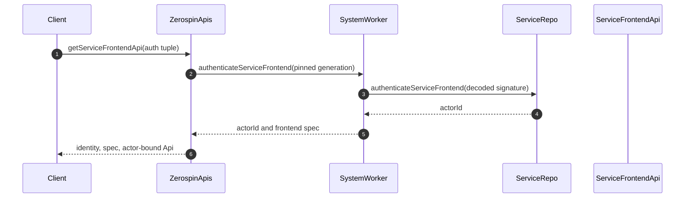
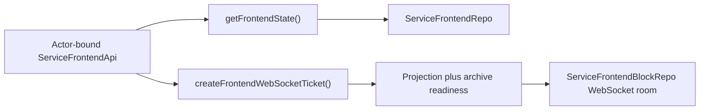

# ServiceFrontendApi

`ServiceFrontendApi` is the distinct, actor-bound RPC capability for one
service-owned frontend. Admission returns the authenticated actor identity, the
exact client-safe frontend specification, and a capability with only
`getFrontendState()` and `createFrontendWebSocketTicket()`; it has no command or
query leaf
(../../packages/dispatch-worker/src/ZerospinApis/ZerospinApis.ts:235-252,
../../packages/dispatch-worker/src/ServiceFrontendApi/ServiceFrontendApi.ts:182-266).

## Public construction boundary

`ZerospinApis.getServiceFrontendApi` validates the exact
`publishableKey/serviceName/actorName/frontendName/signature` record, resolves a
fresh SystemWorker from the publishable-key claims, and authenticates the
service frontend once
(../../packages/dispatch-worker/src/ZerospinApis/ZerospinApis.ts:257-306).
The returned actor ID is decoded before any actor-specific projection target is
created, and the returned frontend specification must match the requested
service, actor, and frontend names
(../../packages/dispatch-worker/src/ZerospinApis/ZerospinApis.ts:307-355).

Authentication first validates the deployed service/actor/frontend graph and
the authored signature schema. Its first repository lookup is the singleton
ServiceRepo for that service, not an actor-specific projection
(../../packages/system-worker/src/authenticateServiceFrontend/authenticateServiceFrontend.ts:44-86).
ServiceRepo re-resolves the executable authentication callback from its trusted
deployed system and constructs a fresh null-prototype query registry containing
only the service actor's approved readable model queries. No raw client,
transaction, SQL, mutation, finalization capability, or sibling service model
is reachable through that callback
(../../packages/system-worker/src/ServiceRepo/authenticateServiceFrontend/authenticateServiceFrontend.ts:25-74).

On success, the capability stores the authenticated actor ID, complete target
names, frontend version, system identity, worker name, deploy ID, and generation
ID. A caller cannot replace that scope on either leaf
(../../packages/dispatch-worker/src/ZerospinApis/ZerospinApis.ts:356-389,
../../packages/dispatch-worker/src/ServiceFrontendApi/ServiceFrontendApi.ts:182-217).

## Trigger

1. [`fetchServiceFrontend`](../../packages/frontend/src/fetchServiceFrontend.ts)
   obtains the locally generated signature, opens a typed Cap'n Web session, and
   requests `getServiceFrontendApi` with the compiled service frontend identity
   (../../packages/frontend/src/fetchServiceFrontend.ts:23-110).
2. The admission result must match the compiled service, actor, frontend, and
   frontend version before the browser retains the returned capability
   (../../packages/frontend/src/fetchServiceFrontend.ts:111-150).
3. The returned `releaseFrontendApi` closes both the actor-bound capability and
   its owning root transport exactly once
   (../../packages/frontend/src/fetchServiceFrontend.ts:151-181).

## Annotated workflow steps

Each leaf rejects excess arguments, resolves a fresh SystemWorker, supplies the
stored authentication scope, captures telemetry, persists that batch through
SystemWorker, and returns the linked encoded envelope. Invalid arguments return
an encoded failure without invoking the domain handler
(../../packages/dispatch-worker/src/ServiceFrontendApi/ServiceFrontendApi.ts:51-129).

1. `getFrontendState()` forwards the stored actor and frontend identity to
   `SystemWorker.getServiceFrontendState`
   (../../packages/dispatch-worker/src/ServiceFrontendApi/ServiceFrontendApi.ts:132-155).
2. SystemWorker first verifies that the bound generation and exact controller
   binding remain authoritative, then checks read admission, validates the opaque
   actor ID, resolves that generation's frontend lineage, and invokes its
   deterministic ServiceFrontendRepo target
   (../../packages/system-worker/src/getServiceFrontendState/getServiceFrontendState.ts:25-154,
   ../../packages/system-worker/src/getServiceFrontendState/getServiceFrontendState.ts:156-259).
3. `createFrontendWebSocketTicket()` forwards the same stored actor target and
   returns the raw ticket together with the exact authoritative system,
   generation, service, actor, frontend, and frontend-version identity
   (../../packages/dispatch-worker/src/ServiceFrontendApi/ServiceFrontendApi.ts:157-180).
4. SystemWorker follows only a complete recorded successor chain to a ready,
   open target, refuses ticket creation until the ServiceFrontendRepo and
   ServiceFrontendBlockRepo registrations both exist, and requires the archive
   to cover the projection's advertised frontend index before minting the ticket
   in the target SystemRepo
   (../../packages/system-worker/src/createServiceFrontendWebSocketTicket/createServiceFrontendWebSocketTicket.ts:82-265,
   ../../packages/system-worker/src/createServiceFrontendWebSocketTicket/createServiceFrontendWebSocketTicket.ts:268-452).

Admission failures return `ServiceFrontendApiFailure`, whose two leaves preserve
the same method shapes while returning the original encoded error and no
telemetry link
(../../packages/dispatch-worker/src/ZerospinApis/ZerospinApis.ts:397-408,
../../packages/dispatch-worker/src/ServiceFrontendApi/ServiceFrontendApiFailure.ts:8-27).

## Provider authority

The capability remains source-bound. Its state leaf does not follow a successor:
a drained source returns `frontend-generation-changed`, a removed target returns
`frontend-identity-changed`, and a same-generation controller version or spec
change returns `frontend-version-changed`. The stored source projection remains
untouched; this leaf returns the authority failure instead of replacing it with
successor or newer-version state
(../../packages/system-worker/src/getServiceFrontendState/getServiceFrontendState.ts:37-154).

The ticket leaf is the read-continuity exception. It verifies each drained
generation's recorded successor and the successor's inverse predecessor, rejects
cycles or incomplete lifecycle state, and mints only against the final ready,
open projection/archive pair. For a same-generation frontend-version change it
may return the newer version over the same immutable archive, while generation
reuse is rejected if model or projection schemas changed. The service surface
remains read-only throughout
(../../packages/system-worker/src/createServiceFrontendWebSocketTicket/createServiceFrontendWebSocketTicket.ts:82-265,
../../packages/system-worker/src/createServiceFrontendWebSocketTicket/createServiceFrontendWebSocketTicket.ts:268-452).

## Callers

1. The public frontend admission Effect retains the admitted capability and
   returns an explicit release that closes the capability and owning transport
   together (../../packages/frontend/src/fetchServiceFrontend.ts:93-181).
2. The frontend state and ticket Effects consume that admitted capability
   directly; neither adds a command or query operation
   (../../packages/frontend/src/fetchServiceFrontendState.ts:12-36,
   ../../packages/frontend/src/createServiceFrontendWebSocketTicket.ts:13-46).

See [[ServiceFrontendProjection]] for snapshot installation, bounded catch-up,
archive acknowledgement, and cross-generation lineage.
