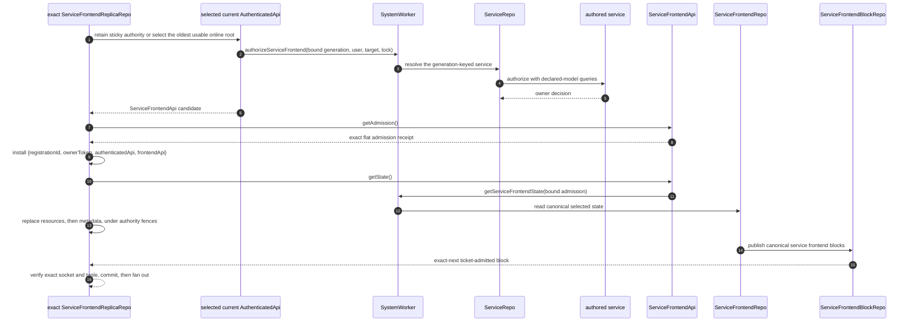
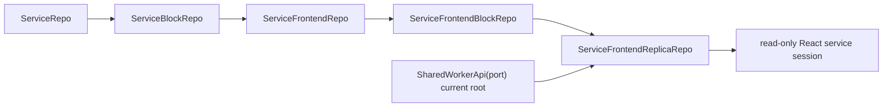

# Service Frontend Projection

A service frontend is a read-only user-scoped projection. The SharedWorker
authenticates each port and binds exact `{ systemId, userId, systemName }`;
service-owned authorization admits exact `{ serviceName, userId, frontendName }`
plus the complete service lock. Server projection and archive state are
generation-scoped, while the browser replica identity is `{ systemId, userId,
serviceName, frontendName, serviceFrontendLockKey }`
([`getUserPartitionRepo.ts:296-348`](../../packages/shared-worker/src/SharedWorker/SharedWorkerApi/getUserPartitionRepo/getUserPartitionRepo.ts#L296-L348),
[`authorizeServiceFrontend.ts:17-82`](../../packages/system-worker/src/authorizeServiceFrontend/authorizeServiceFrontend.ts#L17-L82),
[`ServiceFrontendReplicaRepo.ts:135-171`](../../packages/shared-worker/src/SharedWorker/ServiceFrontendReplicaRepo/ServiceFrontendReplicaRepo.ts#L135-L171)).

## Annotated workflow steps

1. When replacement is needed, the exact Repo retains a usable installed tuple
   or tests eligible online registrations in allocator append order. A
   registration can supply authority only while its `AuthenticatedApi` is still
   that port's current root
   ([`ServiceFrontendReplicaRepo.ts:579-714`](../../packages/shared-worker/src/SharedWorker/ServiceFrontendReplicaRepo/ServiceFrontendReplicaRepo.ts#L579-L714)).
2. `AuthenticatedApi` adds its private generation and authenticated user to the
   selected service target and complete lock
   ([`getServiceFrontendApi.ts:53-76`](../../packages/system-worker/src/AuthenticatedApi/getServiceFrontendApi/getServiceFrontendApi.ts#L53-L76)).
3. `SystemWorker` validates the lock, proves generation read admission, and
   resolves the generation-keyed `ServiceRepo`
   ([`authorizeServiceFrontend.ts:36-76`](../../packages/system-worker/src/authorizeServiceFrontend/authorizeServiceFrontend.ts#L36-L76)).
4. `ServiceRepo` invokes authored authorization with synchronous access to only
   the service's declared model queries
   ([`ServiceRepo/authorizeServiceFrontend.ts:23-61`](../../packages/system-worker/src/ServiceRepo/authorizeServiceFrontend/authorizeServiceFrontend.ts#L23-L61)).
5. Owner success or failure remains a service-owned authorization decision, not
   root authentication
   ([`ServiceRepo/authorizeServiceFrontend.ts:33-61`](../../packages/system-worker/src/ServiceRepo/authorizeServiceFrontend/authorizeServiceFrontend.ts#L33-L61)).
6. `AuthenticatedApi` target-checks the returned user, service spec, names, and
   canonical lock key before returning a `ServiceFrontendApi` candidate
   ([`getServiceFrontendApi.ts:77-115`](../../packages/system-worker/src/AuthenticatedApi/getServiceFrontendApi/getServiceFrontendApi.ts#L77-L115)).
7. The exact Repo decodes the candidate's complete flat admission receipt before
   it can be installed
   ([`ServiceFrontendReplicaRepo.ts:716-740`](../../packages/shared-worker/src/SharedWorker/ServiceFrontendReplicaRepo/ServiceFrontendReplicaRepo.ts#L716-L740),
   [`getAdmission.ts:7-32`](../../packages/system-worker/src/ServiceFrontendApi/getAdmission/getAdmission.ts#L7-L32)).
8. It verifies exact identity, target, kind, complete lock bytes and key, and
   byte-exact spec. An unsupported lock or exact-admission mismatch terminally
   fails this Repo and not the SharedWorker port or sibling exact Repos
   ([`ServiceFrontendReplicaRepo.ts:741-789`](../../packages/shared-worker/src/SharedWorker/ServiceFrontendReplicaRepo/ServiceFrontendReplicaRepo.ts#L741-L789),
   [`ServiceFrontendReplicaRepo.ts:1043-1083`](../../packages/shared-worker/src/SharedWorker/ServiceFrontendReplicaRepo/ServiceFrontendReplicaRepo.ts#L1043-L1083)).
9. The still-current selection installs one Repo-owned inline `{ registrationId,
ownerToken, authenticatedApi, frontendApi }` tuple before any state read
   ([`ServiceFrontendReplicaRepo.ts:790-838`](../../packages/shared-worker/src/SharedWorker/ServiceFrontendReplicaRepo/ServiceFrontendReplicaRepo.ts#L790-L838)).
10. Online activation or replacement uses the installed child's zero-argument
    `getState()` for authoritative hydration
    ([`fetchServiceFrontendState.ts:12-39`](../../packages/frontend/src/fetchServiceFrontendState.ts#L12-L39),
    [`ServiceFrontendApi.ts:77-83`](../../packages/system-worker/src/ServiceFrontendApi/ServiceFrontendApi.ts#L77-L83),
    [`ServiceFrontendReplicaRepo.ts:862-958`](../../packages/shared-worker/src/SharedWorker/ServiceFrontendReplicaRepo/ServiceFrontendReplicaRepo.ts#L862-L958)).
11. The child supplies bound `{ generationId, serviceName, userId, frontendName,
serviceFrontendLock }` to `SystemWorker.getServiceFrontendState`
    ([`getState.ts:17-96`](../../packages/system-worker/src/ServiceFrontendApi/getState/getState.ts#L17-L96)).
12. `SystemWorker` validates the exact lock, reads the canonical
    `ServiceFrontendRepo` projection, omits unselected models, and adapts
    selected resources
    ([`getServiceFrontendState.ts:24-93`](../../packages/system-worker/src/getServiceFrontendState/getServiceFrontendState.ts#L24-L93),
    [`getServiceFrontendState.ts:94-148`](../../packages/system-worker/src/getServiceFrontendState/getServiceFrontendState.ts#L94-L148)).
13. A new exact service database installs resources before four-field metadata
    at `replicaIndex = 0`; replacement deletes old resources, inserts the
    authoritative set, then advances metadata once under repeated authority
    fences
    ([`ServiceFrontendReplicaRepo.ts:218-342`](../../packages/shared-worker/src/SharedWorker/ServiceFrontendReplicaRepo/ServiceFrontendReplicaRepo.ts#L218-L342),
    [`ServiceFrontendReplicaRepo.ts:960-1033`](../../packages/shared-worker/src/SharedWorker/ServiceFrontendReplicaRepo/ServiceFrontendReplicaRepo.ts#L960-L1033)).
14. `ServiceFrontendRepo` persists canonical projection state and drains its
    archive outbox to `ServiceFrontendBlockRepo`
    ([`ServiceFrontendRepo.ts:97-165`](../../packages/system-worker/src/ServiceFrontendRepo/ServiceFrontendRepo.ts#L97-L165),
    [`drainServiceFrontendBlockOutbox.ts:19-109`](../../packages/system-worker/src/ServiceFrontendRepo/drainServiceFrontendBlockOutbox/drainServiceFrontendBlockOutbox.ts#L19-L109)).
15. The archive shapes retained and live blocks by the admitted complete lock,
    then delivers them to the exact SharedWorker replica. Duplicate or older
    frontend indexes are ignored and a gap requires authoritative replacement
    ([`getArchivedBlocks.ts:45-391`](../../packages/system-worker/src/ServiceFrontendBlockRepo/getArchivedBlocks/getArchivedBlocks.ts#L45-L391),
    [`ServiceFrontendReplicaRepo.ts:1314-1362`](../../packages/shared-worker/src/SharedWorker/ServiceFrontendReplicaRepo/ServiceFrontendReplicaRepo.ts#L1314-L1362)).
16. Every message callback requires the exact socket plus the installed
    `{ registrationId, ownerToken, authenticatedApi, frontendApi }`, selection
    token, live registration, and current port root. Exact-next application
    mutates resources and both metadata frontiers transactionally and fans out
    one contiguous replica block only after commit
    ([`ServiceFrontendReplicaRepo.ts:1276-1431`](../../packages/shared-worker/src/SharedWorker/ServiceFrontendReplicaRepo/ServiceFrontendReplicaRepo.ts#L1276-L1431),
    [`ServiceFrontendReplicaRepo.ts:1498-1633`](../../packages/shared-worker/src/SharedWorker/ServiceFrontendReplicaRepo/ServiceFrontendReplicaRepo.ts#L1498-L1633)).

## Offline and regain

1. Existing-only mode opens only a located exact database with a ready matching
   catalog receipt and exact schema. The exact-replica acquisition does not
   migrate, call the port authentication accessor, acquire a child, read server
   state, mint a ticket, or open a socket
   ([`acquireServiceFrontendReplica.ts:175-245`](../../packages/shared-worker/src/SharedWorker/UserPartitionRepo/acquireServiceFrontendReplica/acquireServiceFrontendReplica.ts#L175-L245),
   [`acquireServiceFrontendReplica.ts:316-431`](../../packages/shared-worker/src/SharedWorker/UserPartitionRepo/acquireServiceFrontendReplica/acquireServiceFrontendReplica.ts#L316-L431),
   [`acquireServiceFrontendReplica.ts:494-528`](../../packages/shared-worker/src/SharedWorker/UserPartitionRepo/acquireServiceFrontendReplica/acquireServiceFrontendReplica.ts#L494-L528)).
2. On browser `online`, React reacquires with the same sink. The Repo promotes
   the existing owner registration in place and disposes the duplicate sink
   stub; React disposes only the temporary returned API stub, so no second
   registration is allocated or released
   ([`bootstrapBrowserServiceSession.ts:293-355`](../../packages/react/src/bootstrapBrowserServiceSession.ts#L293-L355),
   [`ServiceFrontendReplicaRepo.ts:344-415`](../../packages/shared-worker/src/SharedWorker/ServiceFrontendReplicaRepo/ServiceFrontendReplicaRepo.ts#L344-L415)).
3. A refreshable ticket failure refreshes only the failed authority tuple and
   retries the ticket without replacing already-authoritative state. In
   contrast, `state-required` and a `1012/generation-drained` close perform
   authoritative replacement before a new socket opens
   ([`ServiceFrontendReplicaRepo.ts:1150-1228`](../../packages/shared-worker/src/SharedWorker/ServiceFrontendReplicaRepo/ServiceFrontendReplicaRepo.ts#L1150-L1228),
   [`ServiceFrontendReplicaRepo.ts:1357-1362`](../../packages/shared-worker/src/SharedWorker/ServiceFrontendReplicaRepo/ServiceFrontendReplicaRepo.ts#L1357-L1362),
   [`ServiceFrontendReplicaRepo.ts:1436-1475`](../../packages/shared-worker/src/SharedWorker/ServiceFrontendReplicaRepo/ServiceFrontendReplicaRepo.ts#L1436-L1475)).
4. Selected release clears the tuple and socket before scheduling forced-fresh
   transfer; nonselected release removes only delivery; zero online
   registrations stop networking while the ready local projection remains
   available
   ([`ServiceFrontendReplicaRepo.ts:1636-1717`](../../packages/shared-worker/src/SharedWorker/ServiceFrontendReplicaRepo/ServiceFrontendReplicaRepo.ts#L1636-L1717)).

## Read-only boundary

Service replica databases have no command journal, staging, command status,
pause, or push control. The exact database contains only generated resource
tables and `serviceFrontendReplicaMetadata { id, systemVersion, frontendIndex,
replicaIndex }`; its public replica capability and React sink cover state,
ordered block delivery, full replacement, failure, and release only
([`ServiceFrontendReplicaRepo.ts:55-71`](../../packages/shared-worker/src/SharedWorker/ServiceFrontendReplicaRepo/ServiceFrontendReplicaRepo.ts#L55-L71),
[`ServiceFrontendReplicaApi.ts:12-42`](../../packages/shared-worker/src/SharedWorker/ServiceFrontendReplicaApi/ServiceFrontendReplicaApi.ts#L12-L42),
[`ServiceFrontendReplicaSink.ts:14-62`](../../packages/react/src/ServiceFrontendReplicaSink/ServiceFrontendReplicaSink.ts#L14-L62)).

## Trigger

1. `bootstrapBrowserServiceSession` derives the exact target, lock/key, and spec
   from source selection and calls `acquireServiceFrontendReplica` with the
   worker-returned identity and mode
   ([`bootstrapBrowserServiceSession.ts:40-56`](../../packages/react/src/bootstrapBrowserServiceSession.ts#L40-L56),
   [`bootstrapBrowserServiceSession.ts:215-248`](../../packages/react/src/bootstrapBrowserServiceSession.ts#L215-L248),
   [`makeZerospinApp.tsx:238-242`](../../packages/react/src/makeZerospinApp.tsx#L238-L242),
   [`makeZerospinApp.tsx:360-387`](../../packages/react/src/makeZerospinApp.tsx#L360-L387)).
2. The SharedWorker owns authentication, authority selection, state hydration,
   ticket renewal, socket replay, repair, and fan-out; React owns only the
   main-thread session sink
   ([`getUserPartitionRepo.ts:164-379`](../../packages/shared-worker/src/SharedWorker/SharedWorkerApi/getUserPartitionRepo/getUserPartitionRepo.ts#L164-L379),
   [`ServiceFrontendReplicaRepo.ts:531-1083`](../../packages/shared-worker/src/SharedWorker/ServiceFrontendReplicaRepo/ServiceFrontendReplicaRepo.ts#L531-L1083),
   [`ServiceFrontendReplicaRepo.ts:1126-1633`](../../packages/shared-worker/src/SharedWorker/ServiceFrontendReplicaRepo/ServiceFrontendReplicaRepo.ts#L1126-L1633),
   [`bootstrapBrowserServiceSession.ts:79-214`](../../packages/react/src/bootstrapBrowserServiceSession.ts#L79-L214)).

## Callers

- [`ServiceFrontendApi`](./ServiceFrontendApi.md)
- [`Browser Session Bootstrap`](./bootstrapBrowserSession.md)
- [`Frontend WebSocket`](./FrontendWebSocket.md)
