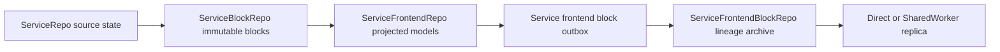
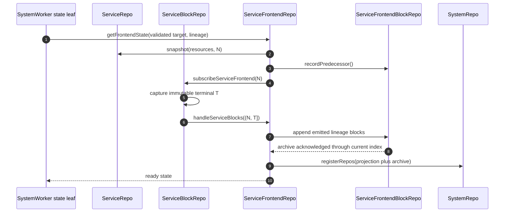

# Service Frontend Projection

Each service frontend target owns two actor-specific Durable Objects with the
same deterministic
`generation/service/actor/actorId/frontend` key: ServiceFrontendRepo stores the
read-only materialized projection, while ServiceFrontendBlockRepo stores its
immutable lineage archive and owns the hibernating WebSocket room
(../../packages/system-worker/src/ServiceFrontendRepo/ServiceFrontendRepo.ts:1-5,
../../packages/system-worker/src/ServiceFrontendRepo/ServiceFrontendRepo.ts:163-203,
../../packages/system-worker/src/ServiceFrontendBlockRepo/ServiceFrontendBlockRepo.ts:1-5,
../../packages/system-worker/src/ServiceFrontendBlockRepo/ServiceFrontendBlockRepo.ts:146-171).

The projection stores one target/lineage/watermark row, retained canonical
ServiceBlock receipts, and a frontend-block outbox. The archive separately
stores one immutable predecessor descriptor and indexed lineage blocks
(../../packages/system-worker/src/ServiceFrontendRepo/ServiceFrontendRepo.ts:96-158,
../../packages/system-worker/src/ServiceFrontendBlockRepo/ServiceFrontendBlockRepo.ts:87-137).

## Trigger

1. [`SystemWorker.getServiceFrontendState`](../../packages/system-worker/src/getServiceFrontendState/getServiceFrontendState.ts)
   first checks that the capability's exact generation and frontend binding are
   still authoritative, then checks read admission, validates the complete
   service-owned target, asks SystemRepo whether this generation is live or has
   no local segment, and calls the deterministic ServiceFrontendRepo
   (../../packages/system-worker/src/getServiceFrontendState/getServiceFrontendState.ts:25-154,
   ../../packages/system-worker/src/getServiceFrontendState/getServiceFrontendState.ts:156-259).
2. [`ServiceFrontendRepo.getFrontendState`](../../packages/system-worker/src/ServiceFrontendRepo/getFrontendState/getFrontendState.ts)
   installs the service snapshot once and records its source watermark and
   lineage. A no-local segment returns snapshot-only state; a live segment
   catches up through a captured ServiceBlock bound, verifies archive coverage,
   and atomically publishes the projection/archive registration pair before
   returning state
   (../../packages/system-worker/src/ServiceFrontendRepo/getFrontendState/getFrontendState.ts:35-72,
   ../../packages/system-worker/src/ServiceFrontendRepo/getFrontendState/getFrontendState.ts:174-318,
   ../../packages/system-worker/src/ServiceFrontendRepo/getFrontendState/getFrontendState.ts:320-364,
   ../../packages/system-worker/src/ServiceFrontendRepo/getFrontendState/getFrontendState.ts:517-672).
3. Later ServiceBlock publication drives
   [`drainServiceFrontendSubscribers`](../../packages/system-worker/src/ServiceBlockRepo/drainServiceFrontendSubscribers/drainServiceFrontendSubscribers.ts),
   which delivers only a complete contiguous suffix and acknowledges it only
   after ServiceFrontendRepo has committed the projection and archive. Failed
   delivery returns its next retry time to the shared ServiceBlockRepo alarm;
   that named alarm Effect drains both account and service-frontend subscriber
   queues and retains the earliest outstanding retry
   (../../packages/system-worker/src/ServiceBlockRepo/drainServiceFrontendSubscribers/drainServiceFrontendSubscribers.ts:18-25,
   ../../packages/system-worker/src/ServiceBlockRepo/drainServiceFrontendSubscribers/drainServiceFrontendSubscribers.ts:92-239,
   ../../packages/system-worker/src/ServiceBlockRepo/drainServiceFrontendSubscribers/drainServiceFrontendSubscribers.ts:241-303,
   ../../packages/system-worker/src/ServiceBlockRepo/drainServiceFrontendSubscribers/drainServiceFrontendSubscribers.ts:306-369,
   ../../packages/system-worker/src/ServiceBlockRepo/alarm/alarm.ts:9-75).

## Annotated workflow steps

State authority is intentionally generation-local. A drained source reports its
recorded successor instead of reading that successor's projection; a removed
service/actor/frontend reports an identity change; and a controller version or
spec change inside the same generation reports `frontend-version-changed`.
Successor selection belongs to ticket minting and browser lineage recovery, not
to this state read
(../../packages/system-worker/src/getServiceFrontendState/getServiceFrontendState.ts:37-154).

1. Snapshot installation validates every resource against the frontend's
   declared service models and writes the resources, complete target identity,
   source cursor/index, frontend index, and lineage classification in one
   transaction. A retry reuses the stored snapshot rather than taking a second
   source snapshot
   (../../packages/system-worker/src/ServiceFrontendRepo/getFrontendState/getFrontendState.ts:174-318).
2. Root and inherited segments record their immutable predecessor descriptor in
   ServiceFrontendBlockRepo before any frontend block can become visible
   (../../packages/system-worker/src/ServiceFrontendRepo/getFrontendState/getFrontendState.ts:366-416).
3. `subscribeServiceFrontend` captures one terminal source bound `T`, persists a
   `catching-up` or `live` subscriber row, synchronously drains that subscriber,
   and returns only after its stored watermark reaches the captured bound
   (../../packages/system-worker/src/ServiceBlockRepo/subscribeServiceFrontend/subscribeServiceFrontend.ts:148-265,
   ../../packages/system-worker/src/ServiceBlockRepo/subscribeServiceFrontend/subscribeServiceFrontend.ts:267-298).
4. ServiceFrontendRepo accepts source blocks only at the exact next service
   index; a duplicate succeeds only when its retained cursor and canonical bytes
   match. Every source block advances the service watermark, but only a relevant
   block in live emission mode advances the frontend index and creates an outbox
   row
   (../../packages/system-worker/src/ServiceFrontendRepo/handleServiceBlocks/handleServiceBlocks.ts:127-162,
   ../../packages/system-worker/src/ServiceFrontendRepo/handleServiceBlocks/handleServiceBlocks.ts:233-294).
5. The outbox wraps projected blocks in complete system/generation/target
   lineage envelopes and appends them to ServiceFrontendBlockRepo. A failed
   append persists the diagnostic and arms an alarm; success marks every row
   published and clears the alarm. The ServiceFrontendRepo lifecycle boundary
   runs the same named outbox-drain Effect when that alarm fires
   (../../packages/system-worker/src/ServiceFrontendRepo/drainServiceFrontendBlockOutbox/drainServiceFrontendBlockOutbox.ts:29-135,
   ../../packages/system-worker/src/ServiceFrontendRepo/drainServiceFrontendBlockOutbox/drainServiceFrontendBlockOutbox.ts:138-150,
   ../../packages/system-worker/src/ServiceFrontendRepo/alarm/alarm.ts:8-20,
   ../../packages/system-worker/src/ServiceFrontendRepo/ServiceFrontendRepo.ts:325-333).
6. The archive appends the request atomically in caller order, accepts an old
   index only when canonical bytes are identical, requires each new index to be
   exactly terminal plus one, and broadcasts only rows that committed for the
   first time
   (../../packages/system-worker/src/ServiceFrontendBlockRepo/storeServiceFrontendBlocks/storeServiceFrontendBlocks.ts:13-19,
   ../../packages/system-worker/src/ServiceFrontendBlockRepo/storeServiceFrontendBlocks/storeServiceFrontendBlocks.ts:128-285).
7. Initialization marks the projection ready only after explicit archive
   coverage, then registers ServiceFrontendRepo and ServiceFrontendBlockRepo in
   one SystemRepo call so discovery cannot observe only one half
   (../../packages/system-worker/src/ServiceFrontendRepo/getFrontendState/getFrontendState.ts:623-672).
8. The returned `frontendIndex` and resource rows are captured in one local
   transaction before the remote archive/readiness calls. The projection drains
   again afterward and asserts archive coverage through that captured index, so
   concurrent live delivery cannot pair an older index with newer resource
   bytes
   (../../packages/system-worker/src/ServiceFrontendRepo/getFrontendState/getFrontendState.ts:568-652).

## Generation continuity

Closing write admission does not itself classify a late projection as having no
local segment. Until `drainFrozenAt` is durable, lineage resolution reserves a
live segment so the final freeze transaction must include or visibly reject it;
only a draining generation with that persisted freeze timestamp returns
`no-local-segment`
(../../packages/system-worker/src/SystemRepo/resolveFrontendProjectionLineage/resolveFrontendProjectionLineage.ts:589-625).

Generation drain distinguishes hosted delivery from self-hosted inspection.
Hosted ServiceBlockRepo drain first delivers pending account and
service-frontend subscriber work, and hosted ServiceFrontendRepo drain first
publishes pending archive outbox rows. When `ZEROSPIN_SELF_HOSTED` is true,
both repos only count pending work and reject a non-empty result so newly
uploaded code cannot finish work created by the previous upload
(../../packages/system-worker/src/ServiceBlockRepo/ServiceBlockRepo.ts:308-325,
../../packages/system-worker/src/ServiceBlockRepo/drainGeneration/drainGeneration.ts:27-86,
../../packages/system-worker/src/ServiceBlockRepo/drainGeneration/drainGeneration.ts:150-220,
../../packages/system-worker/src/ServiceFrontendRepo/ServiceFrontendRepo.ts:309-323,
../../packages/system-worker/src/ServiceFrontendRepo/drainGeneration/drainGeneration.ts:27-63).

An eagerly prepared successor validates the predecessor state only as the
logical lineage receipt, then snapshots the target generation's authoritative
ServiceRepo at the exact frozen causal watermark. Target rows therefore reflect
the target model/projection definition rather than copied predecessor bytes.
Catch-up runs in `no-emission` mode, after which the projection appends exactly
one generation boundary, switches to live emission, and publishes the
registration pair
(../../packages/system-worker/src/ServiceFrontendRepo/prepareSuccessor/prepareSuccessor.ts:33-125,
../../packages/system-worker/src/ServiceFrontendRepo/prepareSuccessor/prepareSuccessor.ts:143-233,
../../packages/system-worker/src/ServiceFrontendRepo/prepareSuccessor/prepareSuccessor.ts:291-394).

A same-generation WebSocket resume receives the exact archived suffix and a
`replay-complete` control before the connection becomes live. A resume from an
ancestor generation validates every predecessor descriptor, replays the source
suffix, sends the first boundary, emits `lineage-transition-required` with any
remaining boundaries, and closes so the client can rebind to the target
generation
(../../packages/system-worker/src/ServiceFrontendBlockRepo/onMessage/onMessage.ts:103-166,
../../packages/system-worker/src/ServiceFrontendBlockRepo/onMessage/onMessage.ts:169-291,
../../packages/system-worker/src/ServiceFrontendBlockRepo/onMessage/onMessage.ts:293-369).

## Callers

1. `ServiceFrontendApi.getFrontendState()` is the public bootstrap caller; it
   cannot select a repo name and supplies only its stored authenticated target
   (../../packages/system-worker/src/getServiceFrontendState/getServiceFrontendState.ts:221-259).
2. ServiceBlockRepo is the only source-block delivery owner for this projection;
   its acknowledgement advances after the remote handler returns successfully
   (../../packages/system-worker/src/ServiceBlockRepo/drainServiceFrontendSubscribers/drainServiceFrontendSubscribers.ts:210-239,
   ../../packages/system-worker/src/ServiceBlockRepo/drainServiceFrontendSubscribers/drainServiceFrontendSubscribers.ts:306-369).
3. Browser replicas consume the immutable ServiceFrontendBlockRepo lineage
   archive through its hibernating service WebSocket room
(../../packages/system-worker/src/ServiceFrontendBlockRepo/ServiceFrontendBlockRepo.ts:158-171,
../../packages/system-worker/src/ServiceFrontendBlockRepo/ServiceFrontendBlockRepo.ts:294-328).

See [[ServiceFrontendApi]] for admission and leaf binding, and
[[FrontendWebSocket]] for the public upgrade boundary.
