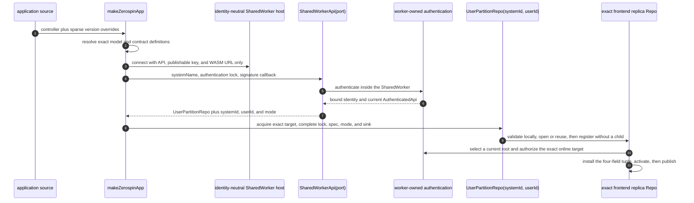
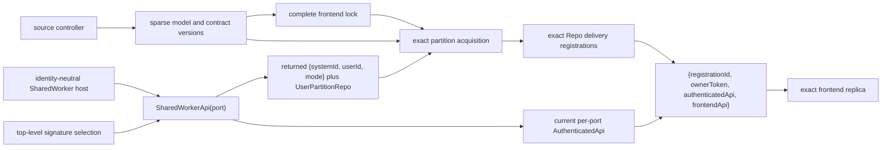

# Source-Selected Frontends

`makeZerospinApp` receives sparse local selection intent: one controller per
logical frontend plus optional retained model/contract versions. Authentication
signature selection remains root-wide and separate from frontend locks. The
SharedWorker host URL is identity-neutral: it carries only API URL, publishable
key, and WASM URL; each connected port supplies its own `systemName`,
authentication lock, and signature callback, then receives `{ systemId, userId,
mode }` from the worker-owned acquisition boundary
([`makeZerospinApp.tsx:61-135`](../../packages/react/src/makeZerospinApp.tsx#L61-L135),
[`resolveFrontendSourceSelection.ts:112-126`](../../packages/react/src/resolveFrontendSourceSelection.ts#L112-L126),
[`acquireUserPartitionRepo.ts:193-246`](../../packages/shared-worker/src/acquireUserPartitionRepo.ts#L193-L246),
[`startSharedWorker.ts:35-65`](../../packages/shared-worker/src/SharedWorker/startSharedWorker.ts#L35-L65)).

## Annotated workflow steps

1. Application source supplies one frontend controller plus optional model and
   contract version overrides
   ([`makeZerospinApp.tsx:61-94`](../../packages/react/src/makeZerospinApp.tsx#L61-L94)).
2. Source selection validates the System/frontend names and reconstructs exact
   current or retained definitions
   ([`resolveFrontendSourceSelection.ts:177-347`](../../packages/react/src/resolveFrontendSourceSelection.ts#L177-L347)).
3. The page constructs one SharedWorker URL from only `apiUrl`, `publishableKey`,
   and `wasmUrl`; the host validates those three transport inputs and creates
   shared store maps independently of any user identity
   ([`acquireUserPartitionRepo.ts:223-246`](../../packages/shared-worker/src/acquireUserPartitionRepo.ts#L223-L246),
   [`startSharedWorker.ts:35-101`](../../packages/shared-worker/src/SharedWorker/startSharedWorker.ts#L35-L101)).
4. Each connected `MessagePort` receives its own `ownerToken` and
   `SharedWorkerApi`. The page configures that port with `{ systemName,
authenticationLock, generateSignature }`; the API retains one per-port
   authentication state
   ([`startSharedWorker.ts:103-132`](../../packages/shared-worker/src/SharedWorker/startSharedWorker.ts#L103-L132),
   [`SharedWorkerApi.ts:28-61`](../../packages/shared-worker/src/SharedWorker/SharedWorkerApi/SharedWorkerApi.ts#L28-L61),
   [`getUserPartitionRepo.ts:116-162`](../../packages/shared-worker/src/SharedWorker/SharedWorkerApi/getUserPartitionRepo/getUserPartitionRepo.ts#L116-L162)).
5. The worker-owned boundary single-flights `current`, `refresh-if-current`, and
   `force` requests, invokes the retained page signature capability, decodes its
   result, and performs authentication inside the SharedWorker
   ([`getUserPartitionRepo.ts:164-293`](../../packages/shared-worker/src/SharedWorker/SharedWorkerApi/getUserPartitionRepo/getUserPartitionRepo.ts#L164-L293)).
6. A successful attempt publishes only under the same pending token,
   configuration, previous current root, and bound identity. It binds exact
   `{ systemId, userId, systemName }` and makes the returned `AuthenticatedApi`
   the port's current root
   ([`getUserPartitionRepo.ts:296-348`](../../packages/shared-worker/src/SharedWorker/SharedWorkerApi/getUserPartitionRepo/getUserPartitionRepo.ts#L296-L348)).
7. Online acquisition returns the authentication-derived identity and
   `mode: 'online'`. Only authentication failures in the five-code
   readiness/transport allowlist may use the exact last-user locator and return
   `mode: 'existing-only'`; React consumes the returned identity and mode rather
   than supplying them
   ([`getUserPartitionRepo.ts:381-495`](../../packages/shared-worker/src/SharedWorker/SharedWorkerApi/getUserPartitionRepo/getUserPartitionRepo.ts#L381-L495),
   [`getUserPartitionRepo.ts:717-734`](../../packages/shared-worker/src/SharedWorker/SharedWorkerApi/getUserPartitionRepo/getUserPartitionRepo.ts#L717-L734),
   [`makeZerospinApp.tsx:238-259`](../../packages/react/src/makeZerospinApp.tsx#L238-L259)).
8. React passes that returned `{ systemId, userId, mode }` to aggregate and
   service session bootstrap; each bootstrap supplies its source-selected exact
   target, complete lock/key, spec, and sink to the partition
   ([`makeZerospinApp.tsx:317-334`](../../packages/react/src/makeZerospinApp.tsx#L317-L334),
   [`makeZerospinApp.tsx:360-387`](../../packages/react/src/makeZerospinApp.tsx#L360-L387),
   [`bootstrapBrowserSession.ts:235-279`](../../packages/react/src/bootstrapBrowserSession.ts#L235-L279),
   [`bootstrapBrowserServiceSession.ts:215-248`](../../packages/react/src/bootstrapBrowserServiceSession.ts#L215-L248)).
9. The partition validates target, complete lock bytes/key, spec, catalog, and
   exact database before any child lookup. It reuses or constructs the exact
   Repo, then appends or promotes a delivery registration with root accessors but
   no per-registration child
   ([`acquireAggregateFrontendReplica.ts:100-279`](../../packages/shared-worker/src/SharedWorker/UserPartitionRepo/acquireAggregateFrontendReplica/acquireAggregateFrontendReplica.ts#L100-L279),
   [`acquireServiceFrontendReplica.ts:98-277`](../../packages/shared-worker/src/SharedWorker/UserPartitionRepo/acquireServiceFrontendReplica/acquireServiceFrontendReplica.ts#L98-L277),
   [`AggregateFrontendReplicaRepo.ts:1198-1280`](../../packages/shared-worker/src/SharedWorker/AggregateFrontendReplicaRepo/AggregateFrontendReplicaRepo.ts#L1198-L1280),
   [`ServiceFrontendReplicaRepo.ts:344-415`](../../packages/shared-worker/src/SharedWorker/ServiceFrontendReplicaRepo/ServiceFrontendReplicaRepo.ts#L344-L415)).
10. Online authority selection retains a usable Repo-owned tuple or walks
    eligible registrations in allocator append order. The selected port root
    acquires a child, whose decoded admission must match the exact identity,
    target, lock/key, kind, and byte-exact spec while that root remains current
    ([`AggregateFrontendReplicaRepo.ts:1559-1847`](../../packages/shared-worker/src/SharedWorker/AggregateFrontendReplicaRepo/AggregateFrontendReplicaRepo.ts#L1559-L1847),
    [`ServiceFrontendReplicaRepo.ts:579-874`](../../packages/shared-worker/src/SharedWorker/ServiceFrontendReplicaRepo/ServiceFrontendReplicaRepo.ts#L579-L874)).
11. The exact Repo installs one inline `{ registrationId, ownerToken,
authenticatedApi, frontendApi }` before its first server state read. A new Repo,
    its registration, and database handles remain outside the catalog and
    runtime map until activation succeeds; only then are both published
    ([`AggregateFrontendReplicaRepo.ts:1765-1855`](../../packages/shared-worker/src/SharedWorker/AggregateFrontendReplicaRepo/AggregateFrontendReplicaRepo.ts#L1765-L1855),
    [`ServiceFrontendReplicaRepo.ts:790-958`](../../packages/shared-worker/src/SharedWorker/ServiceFrontendReplicaRepo/ServiceFrontendReplicaRepo.ts#L790-L958),
    [`acquireAggregateFrontendReplica.ts:490-610`](../../packages/shared-worker/src/SharedWorker/UserPartitionRepo/acquireAggregateFrontendReplica/acquireAggregateFrontendReplica.ts#L490-L610),
    [`acquireServiceFrontendReplica.ts:494-560`](../../packages/shared-worker/src/SharedWorker/UserPartitionRepo/acquireServiceFrontendReplica/acquireServiceFrontendReplica.ts#L494-L560)).

## Selection validation

1. The frontend registry key must equal `controller.frontendName`, and every
   controller must match the root `systemName`; unknown model or contract
   selection keys fail during construction
   ([`resolveFrontendSourceSelection.ts:178-208`](../../packages/react/src/resolveFrontendSourceSelection.ts#L178-L208)).
2. Omitted model versions select current definitions. Explicit versions must
   be retained locally; referenced models are recursively rebuilt at their
   selected definitions, while unavailable models and circular references fail
   ([`resolveFrontendSourceSelection.ts:210-294`](../../packages/react/src/resolveFrontendSourceSelection.ts#L210-L294)).
3. Aggregate contract selections independently choose current or one retained
   direct definition and rebuild the selected controller
   ([`resolveFrontendSourceSelection.ts:296-348`](../../packages/react/src/resolveFrontendSourceSelection.ts#L296-L348)).
4. The separate universal authentication lock contains only the selected
   signature version and JSON Schema
   ([`makeAuthenticationLock.ts:6-33`](../../packages/core/src/authentication/makeAuthenticationLock.ts#L6-L33)).

## Exact identities

1. Aggregate authorization target is exactly `{ aggregateName, aggregateId,
userId, frontendName }`: the source-selected controller supplies the names,
   Provider supplies `aggregateId`, and the SharedWorker-bound identity supplies
   `userId`
   ([`makeZerospinApp.tsx:122-174`](../../packages/react/src/makeZerospinApp.tsx#L122-L174),
   [`makeZerospinApp.tsx:317-334`](../../packages/react/src/makeZerospinApp.tsx#L317-L334),
   [`bootstrapBrowserSession.ts:235-279`](../../packages/react/src/bootstrapBrowserSession.ts#L235-L279),
   [`getAggregateFrontendApi.ts:74-83`](../../packages/system-worker/src/AuthenticatedApi/getAggregateFrontendApi/getAggregateFrontendApi.ts#L74-L83)).
2. Service authorization target is exactly `{ serviceName, userId,
frontendName }`: the source-selected controller supplies both names and the
   SharedWorker-bound identity supplies `userId`
   ([`makeZerospinApp.tsx:360-387`](../../packages/react/src/makeZerospinApp.tsx#L360-L387),
   [`bootstrapBrowserServiceSession.ts:215-233`](../../packages/react/src/bootstrapBrowserServiceSession.ts#L215-L233),
   [`getServiceFrontendApi.ts:58-66`](../../packages/system-worker/src/AuthenticatedApi/getServiceFrontendApi/getServiceFrontendApi.ts#L58-L66)).
3. Complete locks encode representation identity only. Aggregate locks contain
   `{ systemName, frontendName, models, contracts }`; service locks contain
   `{ systemName, frontendName, models }`
   ([`makeAggregateFrontendLock.ts:6-33`](../../packages/core/src/frontendController/makeAggregateFrontendLock.ts#L6-L33),
   [`makeServiceFrontendLock.ts:6-25`](../../packages/core/src/frontendController/makeServiceFrontendLock.ts#L6-L25)).
4. Each exact aggregate or service Repo owns at most one inline
   `{ registrationId, ownerToken, authenticatedApi, frontendApi }`. The first two
   fields come from the Repo's registration allocator and port connection; the
   latter two come from worker-side authentication and exact child admission
   ([`AggregateFrontendReplicaRepo.ts:198-243`](../../packages/shared-worker/src/SharedWorker/AggregateFrontendReplicaRepo/AggregateFrontendReplicaRepo.ts#L198-L243),
   [`ServiceFrontendReplicaRepo.ts:87-133`](../../packages/shared-worker/src/SharedWorker/ServiceFrontendReplicaRepo/ServiceFrontendReplicaRepo.ts#L87-L133)).
5. `AggregateFrontendApi.pushCommands` later carries no acquired `generationId`;
   its `SystemRepo(systemId)` gateway selects the current writable generation.
   State and tickets retain the acquired generation-specific route
   ([`AggregateFrontendApi/pushCommands.ts:52-61`](../../packages/system-worker/src/AggregateFrontendApi/pushCommands/pushCommands.ts#L52-L61),
   [`AggregateFrontendApi.ts:111-133`](../../packages/system-worker/src/AggregateFrontendApi/AggregateFrontendApi.ts#L111-L133)).

## Failure and promotion scope

1. A definitive configuration, callback-decode, authentication, or bound-identity
   failure terminal-fences only that SharedWorker port, disposes its current root
   and signature capability, and releases every aggregate and service
   registration carrying its `ownerToken`
   ([`getUserPartitionRepo.ts:262-369`](../../packages/shared-worker/src/SharedWorker/SharedWorkerApi/getUserPartitionRepo/getUserPartitionRepo.ts#L262-L369),
   [`dispose.ts:26-45`](../../packages/shared-worker/src/SharedWorker/SharedWorkerApi/dispose/dispose.ts#L26-L45)).
2. A child lock denial or decoded exact-admission mismatch instead terminally
   fails only that exact frontend Repo. It clears the installed tuple and socket
   and notifies the Repo's live sinks without terminal-fencing the port or sibling
   exact Repos
   ([`AggregateFrontendReplicaRepo.ts:1992-2026`](../../packages/shared-worker/src/SharedWorker/AggregateFrontendReplicaRepo/AggregateFrontendReplicaRepo.ts#L1992-L2026),
   [`ServiceFrontendReplicaRepo.ts:1043-1083`](../../packages/shared-worker/src/SharedWorker/ServiceFrontendReplicaRepo/ServiceFrontendReplicaRepo.ts#L1043-L1083)).
3. A transient candidate failure excludes that `ownerToken` only for the current
   selection attempt. Its registration remains attached for delivery, while
   another online registration is tried with forced-fresh authority
   ([`AggregateFrontendReplicaRepo.ts:1812-1827`](../../packages/shared-worker/src/SharedWorker/AggregateFrontendReplicaRepo/AggregateFrontendReplicaRepo.ts#L1812-L1827),
   [`ServiceFrontendReplicaRepo.ts:839-858`](../../packages/shared-worker/src/SharedWorker/ServiceFrontendReplicaRepo/ServiceFrontendReplicaRepo.ts#L839-L858)).
4. Existing-only to online regain reacquires with the same sink and `ownerToken`.
   Each Repo promotes the existing registration in place and disposes the
   temporary duplicate stub, so regain does not allocate or release a second
   delivery registration
   ([`bootstrapBrowserSession.ts:318-380`](../../packages/react/src/bootstrapBrowserSession.ts#L318-L380),
   [`bootstrapBrowserServiceSession.ts:293-355`](../../packages/react/src/bootstrapBrowserServiceSession.ts#L293-L355),
   [`AggregateFrontendReplicaRepo.ts:1198-1280`](../../packages/shared-worker/src/SharedWorker/AggregateFrontendReplicaRepo/AggregateFrontendReplicaRepo.ts#L1198-L1280),
   [`ServiceFrontendReplicaRepo.ts:344-415`](../../packages/shared-worker/src/SharedWorker/ServiceFrontendReplicaRepo/ServiceFrontendReplicaRepo.ts#L344-L415)).

## Trigger

1. `makeZerospinApp` receives the caller's source controllers and sparse retained
   version selections, then resolves complete frontend definitions and locks
   ([`makeZerospinApp.tsx:61-135`](../../packages/react/src/makeZerospinApp.tsx#L61-L135),
   [`resolveFrontendSourceSelection.ts:177-347`](../../packages/react/src/resolveFrontendSourceSelection.ts#L177-L347)).
2. Provider bootstrap opens the identity-neutral SharedWorker client with only
   authentication configuration and a signature callback. Worker-side per-port
   authentication returns the partition capability, exact identity, and online
   or existing-only mode
   ([`makeZerospinApp.tsx:206-242`](../../packages/react/src/makeZerospinApp.tsx#L206-L242),
   [`acquireUserPartitionRepo.ts:223-372`](../../packages/shared-worker/src/acquireUserPartitionRepo.ts#L223-L372),
   [`getUserPartitionRepo.ts:381-495`](../../packages/shared-worker/src/SharedWorker/SharedWorkerApi/getUserPartitionRepo/getUserPartitionRepo.ts#L381-L495)).
3. Aggregate and service bootstraps pass the returned identity and mode through
   `UserPartitionRepo`; local validation and exact runtime lookup precede any
   child acquisition, and online authority is selected inside the exact Repo
   ([`makeZerospinApp.tsx:317-387`](../../packages/react/src/makeZerospinApp.tsx#L317-L387),
   [`UserPartitionRepo.ts:80-130`](../../packages/shared-worker/src/SharedWorker/UserPartitionRepo/UserPartitionRepo.ts#L80-L130),
   [`acquireAggregateFrontendReplica.ts:100-279`](../../packages/shared-worker/src/SharedWorker/UserPartitionRepo/acquireAggregateFrontendReplica/acquireAggregateFrontendReplica.ts#L100-L279),
   [`acquireServiceFrontendReplica.ts:98-277`](../../packages/shared-worker/src/SharedWorker/UserPartitionRepo/acquireServiceFrontendReplica/acquireServiceFrontendReplica.ts#L98-L277)).

## Callers

- [`Universal Authentication`](./Authentication.md)
- [`Browser Session Bootstrap`](./bootstrapBrowserSession.md)
- [`Browser Frontend Lifecycle`](../dev/diagrams/BrowserFrontendLifecycle.md)
