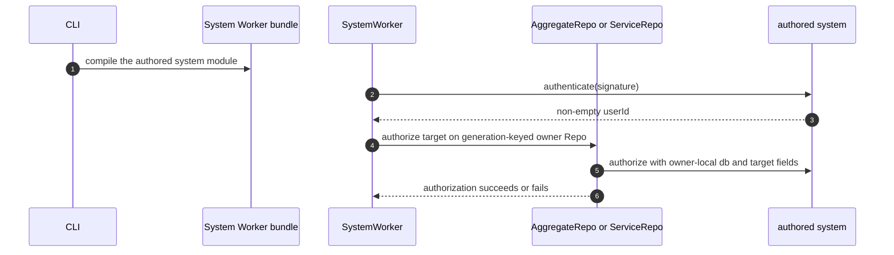
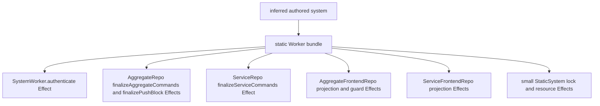

# Static System Worker

The authored `system` remains the inferred `makeSystem` value statically
imported into the Worker bundle. `SystemWorker` is the RPC/runtime boundary;
authentication, lock validation, owner authorization, command preparation,
queries, projection, and resource adaptation execute as named Effects in the
module that owns each operation. There is no programs facade, private authored
runtime, or owner-local encoded-RPC round trip
([`compileWorkerBundleFn.ts:17-97`](../../packages/cli/src/deploy/compileWorkerBundleFn.ts#L17-L97),
[`SystemWorker.ts:79-206`](../../packages/system-worker/src/SystemWorker.ts#L79-L206),
[`authenticate.ts:8-73`](../../packages/system-worker/src/authenticate/authenticate.ts#L8-L73)).

## Annotated workflow steps

1. The CLI compiles the configured authored System module into the conventional
   Worker bundle
   ([`compileWorkerBundleFn.ts:27-95`](../../packages/cli/src/deploy/compileWorkerBundleFn.ts#L27-L95)).
2. [`SystemWorker.ts:79-86`](../../packages/system-worker/src/SystemWorker.ts#L79-L86)
   runs the named authentication Effect against the statically imported
   `system`.
3. The Effect validates the selected signature definition, decodes and adapts
   historical signatures, invokes `system.authentication.authenticate`, and
   validates the returned `userId`
   ([`authenticate.ts:23-73`](../../packages/system-worker/src/authenticate/authenticate.ts#L23-L73)).
4. Aggregate admission receives exactly `{ generationId, userId, aggregateId,
aggregateName, frontendName, aggregateFrontendLock }`; service admission
   receives `{ generationId, userId, serviceName, frontendName,
serviceFrontendLock }`. `AuthenticatedApi` supplies the owner-Repo `generationId` and
   authenticated `userId`; its caller supplies the names, aggregate ID when
   applicable, and source-selected lock. Each path validates that lock before
   resolving the generation-keyed owner Repo
   ([`getAggregateFrontendApi.ts:69-90`](../../packages/system-worker/src/AuthenticatedApi/getAggregateFrontendApi/getAggregateFrontendApi.ts#L69-L90),
   [`getServiceFrontendApi.ts:64-84`](../../packages/system-worker/src/AuthenticatedApi/getServiceFrontendApi/getServiceFrontendApi.ts#L64-L84),
   [`authorizeAggregateFrontend.ts:19-93`](../../packages/system-worker/src/authorizeAggregateFrontend/authorizeAggregateFrontend.ts#L19-L93),
   [`authorizeServiceFrontend.ts:15-72`](../../packages/system-worker/src/authorizeServiceFrontend/authorizeServiceFrontend.ts#L15-L72)).
5. The aggregate callback receives exactly `{ db: { query }, frontendName,
aggregateId, userId }`; the service callback receives `{ db: { query },
frontendName, userId }`. The owner Repo copies only its declared model
   queries into that database and invokes the callback synchronously
   ([`AggregateRepo/authorizeAggregateFrontend.ts:34-73`](../../packages/system-worker/src/AggregateRepo/authorizeAggregateFrontend/authorizeAggregateFrontend.ts#L34-L73),
   [`ServiceRepo/authorizeServiceFrontend.ts:23-61`](../../packages/system-worker/src/ServiceRepo/authorizeServiceFrontend/authorizeServiceFrontend.ts#L23-L61)).
6. The owner Effect returns the authorization result through the original
   `SystemWorker` RPC boundary. Owner callbacks receive no raw SQL,
   transactions, mutation methods, or undeclared model queries
   ([`frontendBinding/types.ts:195-232`](../../packages/core/src/frontendBinding/types.ts#L195-L232),
   [`AggregateRepo/authorizeAggregateFrontend.ts:51-73`](../../packages/system-worker/src/AggregateRepo/authorizeAggregateFrontend/authorizeAggregateFrontend.ts#L51-L73),
   [`ServiceRepo/authorizeServiceFrontend.ts:40-61`](../../packages/system-worker/src/ServiceRepo/authorizeServiceFrontend/authorizeServiceFrontend.ts#L40-L61)).

## Owner boundaries

1. `AggregateFrontendRepo.prepareAggregateFrontendCommand` resolves `commandName@contractVersion`, decodes
   and adapts the payload, and runs speculative guards with only their declared
   model-query keys. If the aggregate cursor advanced after admission,
   `AggregateRepo` repeats those model-only guards at authoritative commit;
   either owner fails a missing query binding. `makeSystem` requires each guard
   model to be the identical controller and aggregate binding, while the public
   guard database type excludes undeclared queries, writes, raw SQL,
   transactions, and the underlying client
   ([`prepareAggregateFrontendCommand.ts:28-100`](../../packages/system-worker/src/AggregateFrontendRepo/prepareAggregateFrontendCommand/prepareAggregateFrontendCommand.ts#L28-L100),
   [`runAggregateFrontendGuards.ts:44-68`](../../packages/system-worker/src/AggregateRepo/runAggregateFrontendGuards/runAggregateFrontendGuards.ts#L44-L68),
   [`finalizePushBlock.ts:456-543`](../../packages/system-worker/src/AggregateRepo/finalizePushBlock/finalizePushBlock.ts#L456-L543),
   [`makeSystem.ts:1539-1553`](../../packages/core/src/system/makeSystem.ts#L1539-L1553),
   [`makeFrontendController.typecheck.ts:106-139`](../../packages/core/src/frontendController/makeFrontendController.typecheck.ts#L106-L139),
   [`aggregateFrontendGuardFlow.workerd.spec.ts:51-296`](../../packages/system-worker/src/aggregateFrontendGuardFlow.workerd.spec.ts#L51-L296)).
2. Query routing has no authored-program facade. An aggregate query validates
   the exact frontend lock, resolves only a query granted by the selected
   aggregate, and delegates to that query's generation-keyed `ServiceRepo`. A
   service query accepts the optional frontend binding only as the complete
   `{ actorRef: { aggregateName, aggregateId, userId }, frontendName,
aggregateFrontendLock }` tuple and exact-lock validates it when present.
   `ServiceRepo` validates authored query parameters, exposes only the
   service's model queries, and invokes that query synchronously. Separately,
   `AggregateRepo` keeps its administrative encoded-query execution local and
   admits only a checked read-only `SELECT`
   ([`executeAggregateQuery.ts:13-51`](../../packages/system-worker/src/executeAggregateQuery/executeAggregateQuery.ts#L13-L51),
   [`executeServiceQuery.ts:12-65`](../../packages/system-worker/src/executeServiceQuery/executeServiceQuery.ts#L12-L65),
   [`AggregateRepo/executeSelectQuery.ts:16-79`](../../packages/system-worker/src/AggregateRepo/executeSelectQuery/executeSelectQuery.ts#L16-L79),
   [`ServiceRepo/executeServiceQuery.ts:7-62`](../../packages/system-worker/src/ServiceRepo/executeServiceQuery/executeServiceQuery.ts#L7-L62),
   [`ownerLocalQueries.node.spec.ts:14-98`](../../packages/system-worker/src/ownerLocalQueries.node.spec.ts#L14-L98)).
3. Direct `AggregateRepo.finalizeAggregateCommands` and
   `ServiceRepo.finalizeServiceCommands` require the SystemRepo `writeIndex`,
   compare exact request bytes with retained command outcomes before preparing
   unseen commands, and return complete executed/failed results. The pushed
   lane drains immutable `PushBlock` rows in `writeIndex` order to
   `AggregateRepo.finalizePushBlock`; that owner adapts each frontend revision,
   revalidates stale guards at authoritative commit, and stores the complete
   terminal command, cursor/index, mutations, and originating `writeIndex`.
   Unsupported revisions become command-local failures, and retrying a retained
   command cannot repeat its business effects
   ([`AggregateRepo.ts:129-159`](../../packages/system-worker/src/AggregateRepo/AggregateRepo.ts#L129-L159),
   [`finalizeAggregateCommands.ts:38-167`](../../packages/system-worker/src/AggregateRepo/finalizeAggregateCommands/finalizeAggregateCommands.ts#L38-L167),
   [`finalizeAggregateCommands.ts:169-267`](../../packages/system-worker/src/AggregateRepo/finalizeAggregateCommands/finalizeAggregateCommands.ts#L169-L267),
   [`drainPushBlockOutbox.ts:43-127`](../../packages/system-worker/src/AggregateFrontendRepo/drainPushBlockOutbox/drainPushBlockOutbox.ts#L43-L127),
   [`adaptAggregateFrontendCommand.ts:11-65`](../../packages/system-worker/src/AggregateRepo/adaptAggregateFrontendCommand/adaptAggregateFrontendCommand.ts#L11-L65),
   [`finalizePushBlock.ts:456-543`](../../packages/system-worker/src/AggregateRepo/finalizePushBlock/finalizePushBlock.ts#L456-L543),
   [`finalizePushBlock.ts:566-650`](../../packages/system-worker/src/AggregateRepo/finalizePushBlock/finalizePushBlock.ts#L566-L650),
   [`ServiceRepo.ts:141-176`](../../packages/system-worker/src/ServiceRepo/ServiceRepo.ts#L141-L176),
   [`finalizeServiceCommands.ts:83-150`](../../packages/system-worker/src/ServiceRepo/finalizeServiceCommands/finalizeServiceCommands.ts#L83-L150),
   [`finalizeServiceCommands.ts:334-393`](../../packages/system-worker/src/ServiceRepo/finalizeServiceCommands/finalizeServiceCommands.ts#L334-L393),
   [`makeContract.ts:442-551`](../../packages/core/src/contracts/makeContract.ts#L442-L551),
   [`authoredCommandRevisions.workerd.spec.ts:31-215`](../../packages/system-worker/src/authoredCommandRevisions.workerd.spec.ts#L31-L215),
   [`authoredCommandRevisions.workerd.spec.ts:217-291`](../../packages/system-worker/src/authoredCommandRevisions.workerd.spec.ts#L217-L291)).
4. Frontend and service-frontend resource projection is local to the owning
   Repo. Persisted hybrid rows are first decoded with
   `makeEffectSchema(model.propertiesShape)`, then validated with the authored
   `resourceSchema`, projected, and validated against the frontend model. The
   small `StaticSystem.adaptFrontendResource` Effect performs the same two-stage
   decode before adapting a current or retained model revision. Aggregate
   canonical-state capture repeats shape and resource validation before
   encoding each stored row; both root state Effects then type-decode the owner
   RPC result before selected-lock shaping
   ([`projectAggregateFrontendResource.ts:43-88`](../../packages/system-worker/src/AggregateFrontendRepo/projectAggregateFrontendResource/projectAggregateFrontendResource.ts#L43-L88),
   [`projectServiceFrontendResource.ts:43-88`](../../packages/system-worker/src/ServiceFrontendRepo/projectServiceFrontendResource/projectServiceFrontendResource.ts#L43-L88),
   [`adaptFrontendResource.ts:32-79`](../../packages/system-worker/src/StaticSystem/adaptFrontendResource/adaptFrontendResource.ts#L32-L79),
   [`adaptFrontendResource.ts:92-139`](../../packages/system-worker/src/StaticSystem/adaptFrontendResource/adaptFrontendResource.ts#L92-L139),
   [`AggregateFrontendRepo/getState.ts:303-332`](../../packages/system-worker/src/AggregateFrontendRepo/getState/getState.ts#L303-L332),
   [`getState.ts:83-146`](../../packages/system-worker/src/getAggregateFrontendState/getAggregateFrontendState.ts#L83-L146),
   [`getServiceFrontendState.ts:79-141`](../../packages/system-worker/src/getServiceFrontendState/getServiceFrontendState.ts#L79-L141),
   [`authoredPersistedResourceDecoding.node.spec.ts:11-117`](../../packages/system-worker/src/authoredPersistedResourceDecoding.node.spec.ts#L11-L117)).

## Trigger

1. `SystemWorker.authenticate`, owner-authorization, state, query, and ticket
   RPC methods delegate directly to their same-domain named Effects
   ([`SystemWorker.ts:79-206`](../../packages/system-worker/src/SystemWorker.ts#L79-L206)).
2. Generation-keyed owner Repos invoke local authorization, guard, command,
   mutation, and projection Effects against the statically imported System
   ([`AggregateRepo/authorizeAggregateFrontend.ts:9-74`](../../packages/system-worker/src/AggregateRepo/authorizeAggregateFrontend/authorizeAggregateFrontend.ts#L9-L74),
   [`AggregateFrontendRepo/prepareAggregateFrontendCommand.ts:15-100`](../../packages/system-worker/src/AggregateFrontendRepo/prepareAggregateFrontendCommand/prepareAggregateFrontendCommand.ts#L15-L100),
   [`AggregateRepo.ts:353-488`](../../packages/system-worker/src/AggregateRepo/AggregateRepo.ts#L353-L488),
   [`ServiceRepo.ts:310-339`](../../packages/system-worker/src/ServiceRepo/ServiceRepo.ts#L310-L339)).

## Boundary

Authentication and owner authorization remain separate public RPC methods.
The first authenticates only the signature to `userId`; the latter methods
combine that result with caller/controller-owned target fields. Neither moves
browser replica or session ownership out of the SharedWorker
([`SystemWorker.ts:79-119`](../../packages/system-worker/src/SystemWorker.ts#L79-L119),
[`UserPartitionRepo.ts:25-175`](../../packages/shared-worker/src/SharedWorker/UserPartitionRepo/UserPartitionRepo.ts#L25-L175)).

## Callers

- [`Universal Authentication`](./Authentication.md)
- [`AggregateFrontendApi`](./AggregateFrontendApi.md)
- [`ServiceFrontendApi`](./ServiceFrontendApi.md)
- [`Blockchain`](./Blockchain.md)
