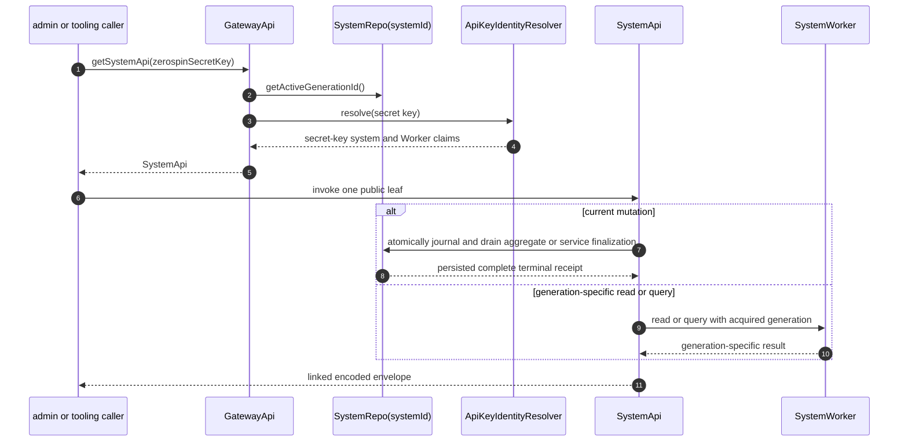

# SystemApi

`SystemApi` is the secret-key administrative capability acquired from the
stable Worker-hosted `GatewayApi`. Its private state is exactly
`{ generationId, systemId, systemWorkerName }`: the acquisition-time active
generation routes reads, while `systemId` routes current writes through the
singleton `SystemRepo`
([`getSystemApi.ts:12-57`](../../packages/system-worker/src/GatewayApi/getSystemApi/getSystemApi.ts#L12-L57),
[`SystemApi.ts:61-85`](../../packages/system-worker/src/SystemApi/SystemApi.ts#L61-L85)).

## Annotated workflow steps

1. The caller sends exactly `{ zerospinSecretKey }` to
   `GatewayApi.getSystemApi`
   ([`GatewayApi.ts:86-97`](../../packages/system-worker/src/GatewayApi/GatewayApi.ts#L86-L97)).
2. The gateway acquires the current active `generationId`; this is a private
   read route, not part of the key claims
   ([`getSystemApi.ts:29-39`](../../packages/system-worker/src/GatewayApi/getSystemApi/getSystemApi.ts#L29-L39)).
3. The deployment identity resolver receives the supplied key
   ([`getSystemApi.ts:40-42`](../../packages/system-worker/src/GatewayApi/getSystemApi/getSystemApi.ts#L40-L42)).
4. Acquisition requires `keyType: 'secret'` and retains the resolved
   `systemId` and `systemWorkerName`
   ([`getSystemApi.ts:43-54`](../../packages/system-worker/src/GatewayApi/getSystemApi/getSystemApi.ts#L43-L54)).
5. Failure returns `SystemApiFailure`, whose same-shaped public methods replay
   the captured acquisition error
   ([`getSystemApi.ts:55-57`](../../packages/system-worker/src/GatewayApi/getSystemApi/getSystemApi.ts#L55-L57),
   [`SystemApiFailure.ts:36-52`](../../packages/system-worker/src/SystemApi/SystemApiFailure/SystemApiFailure.ts#L36-L52)).
6. Every public method delegates immediately to its same-named Effect and
   returns one linked encoded envelope
   ([`SystemApi.ts:87-202`](../../packages/system-worker/src/SystemApi/SystemApi.ts#L87-L202)).
7. `finalizeAggregateCommands` and `finalizeServiceCommands` set
   `generationReadRoute: false`, resolve `SystemRepo(systemId)`, and send no
   acquired generation to the mutation owner
   ([`finalizeAggregateCommands.ts:19-49`](../../packages/system-worker/src/SystemApi/finalizeAggregateCommands/finalizeAggregateCommands.ts#L19-L49),
   [`finalizeServiceCommands.ts:18-46`](../../packages/system-worker/src/SystemApi/finalizeServiceCommands/finalizeServiceCommands.ts#L18-L46)).
8. `SystemRepo` atomically selects the writable generation, advances
   `writeIndex`, and inserts the complete finalization request before child
   delivery. Its exact-target FIFO calls
   `AggregateRepo.finalizeAggregateCommands` or
   `ServiceRepo.finalizeServiceCommands`, stores the terminal `Either`, and
   returns that persisted complete receipt
   ([`finalizeAggregateCommands.ts:87-221`](../../packages/system-worker/src/SystemRepo/finalizeAggregateCommands/finalizeAggregateCommands.ts#L87-L221),
   [`drainSystemWrites.ts:418-548`](../../packages/system-worker/src/SystemRepo/drainSystemWrites/drainSystemWrites.ts#L418-L548),
   [`finalizeServiceCommands.ts:212-265`](../../packages/system-worker/src/SystemRepo/finalizeServiceCommands/finalizeServiceCommands.ts#L212-L265)).
9. Read/query leaves resolve `SystemWorker(systemWorkerName)` and carry the
   acquisition-time `generationId`
   ([`getAggregateFrontendState.ts:20-78`](../../packages/system-worker/src/SystemApi/getAggregateFrontendState/getAggregateFrontendState.ts#L20-L78),
   [`executeSelectQuery.ts:19-51`](../../packages/system-worker/src/SystemApi/executeSelectQuery/executeSelectQuery.ts#L19-L51)).
10. `SystemWorker` resolves generation-keyed Repos and returns encoded domain
    success or failure
    ([`SystemWorker.ts:119-145`](../../packages/system-worker/src/SystemWorker.ts#L119-L145),
    [`SystemWorker.ts:178-216`](../../packages/system-worker/src/SystemWorker.ts#L178-L216)).
11. `makeApiHandler` settles every operation. Generation-read leaves append
    telemetry to the acquisition-time `SystemWorker` and may return a causal
    link; current-write leaves return the same envelope with `link: null`, while
    `SystemRepo` retains the accepted generation, `writeIndex`, request, and
    terminal business result in `systemWrites`
    ([`makeApiHandler.ts:42-120`](../../packages/system-worker/src/SystemApi/makeApiHandler/makeApiHandler.ts#L42-L120),
    [`SystemRepo.ts:314-349`](../../packages/system-worker/src/SystemRepo/SystemRepo.ts#L314-L349)).

## Operational leaves

1. `hello`, `getAggregateFrontendState`, `executeServiceQuery`,
   `executeSelectQuery`, and `makeSystemSpec` are generation-specific
   read/query operations
   ([`SystemApi.ts:87-130`](../../packages/system-worker/src/SystemApi/SystemApi.ts#L87-L130),
   [`SystemApi.ts:164-179`](../../packages/system-worker/src/SystemApi/SystemApi.ts#L164-L179),
   [`SystemApi.ts:394-401`](../../packages/system-worker/src/SystemApi/SystemApi.ts#L394-L401)).
2. `finalizeAggregateCommands` accepts `{ aggregateId, aggregateName,
commands }` and returns executed/failed complete commands, applied mutations,
   `lastAggregateCursor`, and `aggregateIndex`
   ([`SystemApi.ts:132-161`](../../packages/system-worker/src/SystemApi/SystemApi.ts#L132-L161),
   [`blockSchemas.ts:25-33`](../../packages/system-worker/src/blockSchemas.ts#L25-L33)).
3. `finalizeServiceCommands` accepts `{ serviceName, commands }` and returns
   complete executed and failed command arrays
   ([`SystemApi.ts:180-201`](../../packages/system-worker/src/SystemApi/SystemApi.ts#L180-L201),
   [`blockSchemas.ts:35-38`](../../packages/system-worker/src/blockSchemas.ts#L35-L38)).
4. `getAggregateFrontendState` is aggregate-qualified because `SystemApi` owns
   many Repo families. Receiver-local aggregate/service child APIs instead use
   the leaf name `getState()`
   ([`SystemApi.ts:95-114`](../../packages/system-worker/src/SystemApi/SystemApi.ts#L95-L114),
   [`AggregateFrontendApi.ts:125-131`](../../packages/system-worker/src/AggregateFrontendApi/AggregateFrontendApi.ts#L125-L131),
   [`ServiceFrontendApi.ts:77-83`](../../packages/system-worker/src/ServiceFrontendApi/ServiceFrontendApi.ts#L77-L83)).

## Repository explorer

`SystemApi` exposes paired registration/table-row methods for System,
Aggregate, AggregateFrontend, Service, AggregateBlock,
AggregateFrontendBlock, ServiceFrontendBlock, ServiceBlock, and SystemLog Repo
families. Aggregate-only names remain explicitly aggregate-qualified
([`SystemApi.ts:204-291`](../../packages/system-worker/src/SystemApi/SystemApi.ts#L204-L291),
[`SystemApi.ts:293-392`](../../packages/system-worker/src/SystemApi/SystemApi.ts#L293-L392)).

Table-row methods validate the requested Repo name against the matching
generation-qualified registration before reading its declared table; they do
not turn a caller-supplied Repo name into ambient authority
([`getAggregateFrontendRepoTableRows.ts:18-48`](../../packages/system-worker/src/SystemApi/getAggregateFrontendRepoTableRows/getAggregateFrontendRepoTableRows.ts#L18-L48),
[`getAggregateFrontendBlockRepoTableRows.ts:18-48`](../../packages/system-worker/src/SystemApi/getAggregateFrontendBlockRepoTableRows/getAggregateFrontendBlockRepoTableRows.ts#L18-L48)).

## Trigger

1. Admin and tooling clients open the Worker root and call
   `GatewayApi.getSystemApi` with a secret key
   ([`GatewayApi.ts:86-97`](../../packages/system-worker/src/GatewayApi/GatewayApi.ts#L86-L97)).
2. The resulting capability is pinned to one acquired generation for reads but
   uses SystemRepo current-write selection for direct finalization
   ([`SystemApi.ts:65-85`](../../packages/system-worker/src/SystemApi/SystemApi.ts#L65-L85),
   [`finalizeAggregateCommands.ts:37-49`](../../packages/system-worker/src/SystemApi/finalizeAggregateCommands/finalizeAggregateCommands.ts#L37-L49)).

## Callers

- CLI and administrative tooling
- [`System Lifecycle`](./SystemLifecycle.md)
- [`Block and Replication Flow`](./Blockchain.md)
