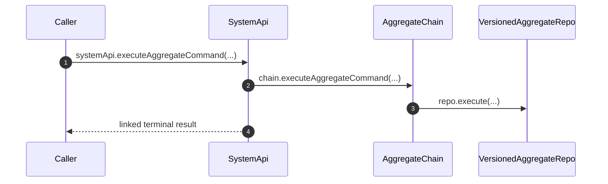
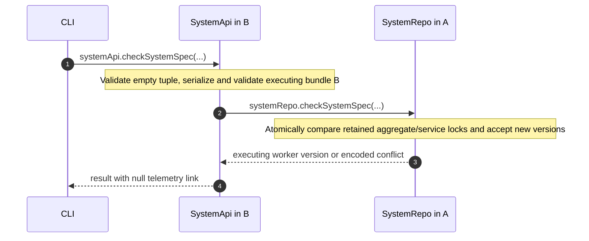

# System API

SystemApi accepts the executing bundle's authored spec, accepts direct aggregate and service commands, reads registered Repos. Frontend admission uses AggregateFrontendApi.

## Trigger

1. A secret-key caller acquires the system capability.
   - [`getSystemApi.ts`](../../packages/system-worker/src/GatewayApi/getSystemApi/getSystemApi.ts) — Binds SystemApi to the configured systemId.

## Annotated workflow steps

1. The secret-key capability accepts the complete aggregate command and binds the configured systemId.
   - [`executeAggregateCommand.ts:34-44`](../../packages/system-worker/src/SystemApi/executeAggregateCommand/executeAggregateCommand.ts#L34-L44) — Validates the envelope within the capability's linked RPC handler.
2. The direct command routes by the checked aggregate fields and capability-bound systemId.
   - [`executeAggregateCommand.ts`](../../packages/system-worker/src/SystemApi/executeAggregateCommand/executeAggregateCommand.ts) — Resolves AC and delegates the complete command.
3. AC validates the caller-selected aggregate version and requests execution or committed-result recovery.
   - [`executeAggregateCommand.ts`](../../packages/system-worker/src/AggregateChain/executeAggregateCommand/executeAggregateCommand.ts) — Keeps the requested version explicit for both first execution and retries.
4. The API returns the settled terminal occurrence; durable publication continues independently.
   - [`executeAggregateCommand.ts:69-80`](../../packages/system-worker/src/SystemApi/executeAggregateCommand/executeAggregateCommand.ts#L69-L80) — Decodes the chain result through the linked handler.
   - [`execute.ts:59-106`](../../packages/system-worker/src/VersionedAggregateRepo/execute/execute.ts#L59-L106) — Returns a committed VAR result or the retained VAC occurrence.

## Inspection

SystemApi inspection pairs list explicit Repo registrations and read their
catalogued tables. A registration identifies an instance whose bundled
definitions were accepted; it may remain even when later initialization fails.
The spec-inspection RPC serializes the executing Worker independently of the
retained lock tables and requires no accepted child Repo.

- [`getRepoRegistrations.ts`](../../packages/system-worker/src/SystemRepo/getRepoRegistrations/getRepoRegistrations.ts) — reads persisted registrations by Repo kind and decodes table names.
- [`registerRepo.ts`](../../packages/system-worker/src/SystemRepo/registerRepo/registerRepo.ts) — requires accepted locks before inserting the known instance.
- [`SystemApi.ts`](../../packages/system-worker/src/SystemApi/SystemApi.ts) — declares the registration and table-row inspection pairs.
- [`makeSystemSpec.ts`](../../packages/system-worker/src/SystemApi/makeSystemSpec/makeSystemSpec.ts) — returns the executing bundle's spec with child telemetry persistence disabled.

Studio's Admin view displays each aggregate's exact version, service pins, model versions, and contract versions.

- [`RepoExplorer.tsx:220-306`](../../packages/studio/src/RepoExplorer.tsx#L220-L306) — Reads the serialized aggregate snapshot fields for inspection.
- [`RepoExplorer.react.spec.tsx:193-227`](../../packages/studio/src/RepoExplorer.react.spec.tsx#L193-L227) — Verifies service pins appear with their model versions.

## Authored spec acceptance

`SystemApi.checkSystemSpec()` takes no domain arguments; the wire request retains
`{ traceContext, args: [] }`. The authenticated/configured systemId selects
SystemRepo. The executing Worker supplies the entire serialized candidate, so a
candidate B HTTP request can check B even while SystemRepo executes incumbent A.
The successful result includes SystemRepo's `workerVersionId` (null in development
without version metadata), allowing production to await B's DO assignment after
promotion and before initialization.
Telemetry persistence is skipped for spec acceptance and inspection because their
results must be available before child Repos can activate.

## Annotated workflow steps

1. The existing authenticated SystemApi capability validates an empty argument tuple.
   - [`checkSystemSpec.ts`](../../packages/system-worker/src/SystemApi/checkSystemSpec/checkSystemSpec.ts) — defines `Schema.Tuple([])` without caller-supplied spec input.
2. The API serializes its own executing bundle before resolving the configured SystemRepo.
   - [`getSystemSpec.ts`](../../packages/system-worker/src/getSystemSpec/getSystemSpec.ts) — calls the authored spec generator and validates its result.
   - [`checkSystemSpec.ts`](../../packages/system-worker/src/SystemApi/checkSystemSpec/checkSystemSpec.ts) — sends that candidate through the Repo RPC.
3. SystemRepo inserts additions only if every retained definition matches; absence from a candidate does not delete locks.
   - [`checkSystemSpec.ts`](../../packages/system-worker/src/SystemRepo/checkSystemSpec/checkSystemSpec.ts) — compares structural JSON and commits the candidate in one transaction.
4. The API preserves the encoded outcome and SystemRepo's executing-version metadata without requiring SystemLogRepo activation.
   - [`makeApiHandler.ts`](../../packages/system-worker/src/SystemApi/makeApiHandler/makeApiHandler.ts) — bypasses telemetry persistence for these methods and prevents telemetry failures from replacing other settled outcomes.

## Deployed versions

Each physical aggregate chain binds `{ systemId, aggregateId, aggregateName }`;
activation derives its active VAR destinations from the executing bundle's
aggregate versions after the common spec guard succeeds. Direct command
execution validates the caller-selected aggregateVersion, including on retry.

- [`onDOActivation.ts`](../../packages/system-worker/src/AggregateChain/onDOActivation/onDOActivation.ts) — reconciles active destinations while retaining delivery cursors and failures.
- [`executeAggregateCommand.ts`](../../packages/system-worker/src/AggregateChain/executeAggregateCommand/executeAggregateCommand.ts) — validates the requested version and dispatches to its VAR.

## Callers

- [Authored System and static deployment](./AuthoredSystem.md)
- [Command chains and materialization](./server/admitCommands.md)
- [`executeAggregateCommand` lifecycle](./server/executeAggregateCommand.md)
