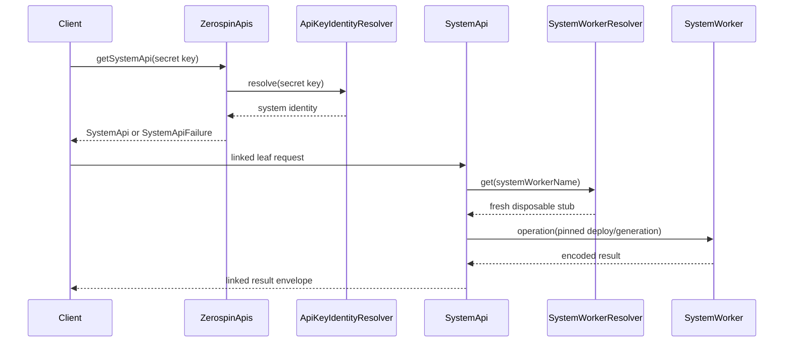
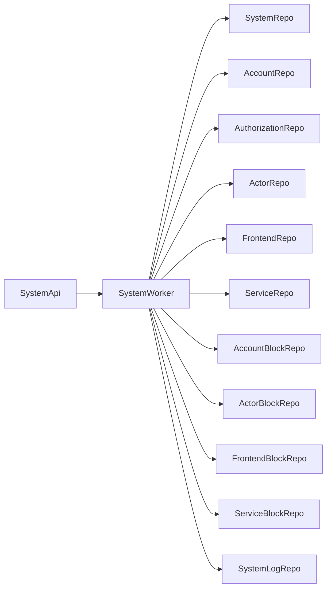

# SystemApi

`SystemApi` is the secret-key capability for imperative system operations and
generation-scoped repository inspection. `ZerospinApis.getSystemApi` validates
the request, resolves the supplied key through the configured identity
resolver, rejects non-secret identities, derives `systemWorkerName`, and
constructs `SystemApi` with the root's pinned `deployId` and `generationId`.
Failures are returned as `SystemApiFailure`
(../../packages/dispatch-worker/src/ZerospinApis/ZerospinApis.ts:154-199).

## Resolver-owned runtime

The gateway does not own an environment-specific dispatch implementation.
`makeDispatchRuntime` combines the public identity and SystemWorker resolver
layers with the shared async/id services. `ISystemWorkerResolver.get` is the
portable boundary: every leaf resolves a fresh disposable stub by
`systemWorkerName`, so an RPC target does not retain a stub across Durable
Object redeploys
(../../packages/dispatch-worker/src/makeDispatchRuntime.ts:12-35,
../../packages/dispatch-worker/src/SystemWorkerResolver/SystemWorkerResolver.ts:4-17).

Standalone Workers use `WorkerExportsSystemWorkerResolver`; it ignores the
logical dispatch name and returns the co-located `exports.SystemWorker` loopback
binding. The shopping example supplies that resolver and deployment-bound
identity to one concrete `ZerospinApis` root
(../../packages/dispatch-worker/src/SystemWorkerResolver/WorkerExportsSystemWorkerResolver.ts:7-30,
../../examples/shopping/src/Worker.ts:26-41).

## Common leaf boundary

All 29 leaves use the same handler boundary. It validates the exact argument
tuple, returns schema failures as an encoded result with `link: null`, resolves
one fresh SystemWorker, annotates the server span with system/deploy/generation
identity, and runs the named Effect. After the domain operation settles, it
flushes and persists the telemetry batch with the same pinned pair; a valid
caller trace receives a `causedBy` link only when persistence succeeds
(../../packages/dispatch-worker/src/SystemApi/SystemApi.ts:72-155).

The class keeps only the immutable auth result and dispatch runtime. Every
public Promise method is boundary glue that invokes the named Effect through
the common handler
(../../packages/dispatch-worker/src/SystemApi/SystemApi.ts:679-1351).

## Operational leaves

1. `hello` checks the bound generation through `SystemWorker.hello`
   (../../packages/dispatch-worker/src/SystemApi/SystemApi.ts:157-168,
   ../../packages/dispatch-worker/src/SystemApi/SystemApi.ts:714-730).
2. `getFrontendState` reads one account/actor/frontend projection while adding
   the pinned deployment identity and system-worker name
   (../../packages/dispatch-worker/src/SystemApi/SystemApi.ts:170-194,
   ../../packages/dispatch-worker/src/SystemApi/SystemApi.ts:731-764).
3. `executeServiceQuery` delegates a named service query and unknown parameters
   (../../packages/dispatch-worker/src/SystemApi/SystemApi.ts:196-216,
   ../../packages/dispatch-worker/src/SystemApi/SystemApi.ts:765-795).
4. `finalizeAccountCommands` forwards full account commands through a traced
   SystemWorker call with transient Durable Object retries. It rejects a pushed
   block result on this direct path and validates the account-specific terminal
   command shapes before returning the block result
   (../../packages/dispatch-worker/src/SystemApi/SystemApi.ts:218-282,
   ../../packages/dispatch-worker/src/SystemApi/SystemApi.ts:796-858).
5. `executeSelectQuery` delegates an encoded select-only query with transient
   retries (../../packages/dispatch-worker/src/SystemApi/SystemApi.ts:284-303,
   ../../packages/dispatch-worker/src/SystemApi/SystemApi.ts:859-893).
6. `finalizeServiceCommands` forwards full service commands and returns the
   executed and failed terminal command arrays
   (../../packages/dispatch-worker/src/SystemApi/SystemApi.ts:305-327,
   ../../packages/dispatch-worker/src/SystemApi/SystemApi.ts:894-929).
7. `makeSystemSpec` returns the deployed system specification snapshot
   (../../packages/dispatch-worker/src/SystemApi/SystemApi.ts:659-677,
   ../../packages/dispatch-worker/src/SystemApi/SystemApi.ts:1337-1350).

## Repository explorer leaves

The remaining 22 leaves form eleven registration/table-read pairs. Each
`get*Repos` call returns the registered repos for one category, and each matching
`get*RepoTableRows` call accepts `{ repoName, tableName }` and returns that
table's data. The categories are SystemRepo, AccountRepo, AuthorizationRepo,
ActorRepo, FrontendRepo, ServiceRepo, AccountBlockRepo, ActorBlockRepo,
FrontendBlockRepo, ServiceBlockRepo, and SystemLogRepo
(../../packages/dispatch-worker/src/SystemApi/SystemApi.ts:329-657,
../../packages/dispatch-worker/src/SystemApi/SystemApi.ts:930-1335).

Every delegated leaf includes the capability's `deployId` and `generationId`;
the client cannot select another generation through repository-explorer input
(../../packages/dispatch-worker/src/SystemApi/SystemApi.ts:329-657).

## Telemetry storage

`SystemApi` persists each completed server batch through
`SystemWorker.appendTelemetryBatch` using the same deploy/generation pair used
by the domain leaf. The Worker delegates to the generation-scoped SystemLogRepo,
whose append program validates the batch, stores spans/logs/links, and preserves
the supplied identity on the rows
(../../packages/dispatch-worker/src/SystemApi/SystemApi.ts:124-131,
../../packages/system-worker/src/SystemWorker.ts:246-273,
../../packages/system-worker/src/SystemLogRepo/appendTelemetryBatch/appendTelemetryBatch.ts:21-155).

## Callers

1. A public Worker may expose `ZerospinApis` directly through Cap'n Web, as the
   standalone shopping example does
   (../../examples/shopping/src/Worker.ts:43-61).
2. Tooling clients request `SystemApi` from the concrete root and consume the
   linked envelopes; environment-specific key verification and SystemWorker
   lookup remain resolver responsibilities
   (../../packages/dispatch-worker/src/ZerospinApis/ZerospinApis.ts:129-199,
   ../../packages/dispatch-worker/src/SystemWorkerResolver/SystemWorkerResolver.ts:4-17).
