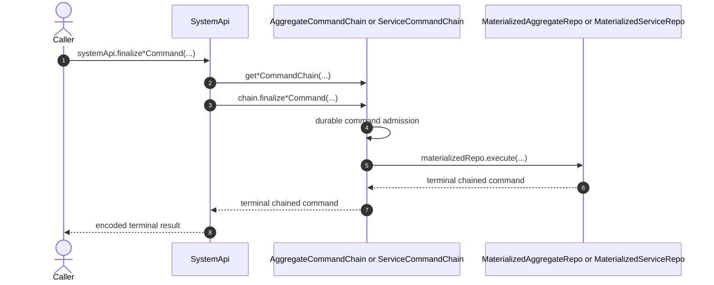

# System API

SystemApi is the secret-key capability bound to the configured `systemId`.
Its command surface accepts one complete encoded command and returns one
terminal chained occurrence.

- [`SystemApi.ts:60-73`](../../packages/system-worker/src/SystemApi/SystemApi.ts#L60-L73) — stores only the authenticated `systemId` and the static System Worker runtime.
- [`SystemApi.ts:119-134`](../../packages/system-worker/src/SystemApi/SystemApi.ts#L119-L134) — declares one aggregate command in the RPC argument tuple and its terminal aggregate occurrence result.
- [`SystemApi.ts:153-163`](../../packages/system-worker/src/SystemApi/SystemApi.ts#L153-L163) — declares the matching singular service command boundary.

## Trigger

1. A secret-key caller acquires SystemApi from GatewayApi.
   - [`getSystemApi.ts:17-32`](../../packages/system-worker/src/GatewayApi/getSystemApi/getSystemApi.ts#L17-L32) — validates the secret key and constructs SystemApi with the configured `systemId`.
2. The caller invokes `finalizeAggregateCommand(command)` or
   `finalizeServiceCommand(command)` with one full encoded command; the
   traceable RPC adapter injects caller trace context and the argument envelope.
   - [`SystemApi.ts:119-134`](../../packages/system-worker/src/SystemApi/SystemApi.ts#L119-L134) — exposes the singular aggregate command method.
   - [`SystemApi.ts:153-163`](../../packages/system-worker/src/SystemApi/SystemApi.ts#L153-L163) — exposes the singular service command method.
   - [`executeRpc.ts:20-50`](../../packages/core/src/utils/executeRpc.ts#L20-L50) — exposes each root capability getter as a traceable child API and keeps the batch session alive while the callback Effect runs.
   - [`makeTraceableApiTarget.ts:37-68`](../../packages/logger/src/makeTraceableApiTarget.ts#L37-L68) — reads the current caller span and constructs the wire request from the method arguments.

## Annotated workflow steps

1. The caller invokes one of the two singular SystemApi command methods.
   - [`SystemApi.ts:119-134`](../../packages/system-worker/src/SystemApi/SystemApi.ts#L119-L134) — the aggregate RpcTarget method immediately runs its same-named Effect.
   - [`SystemApi.ts:153-163`](../../packages/system-worker/src/SystemApi/SystemApi.ts#L153-L163) — the service RpcTarget method immediately runs its same-named Effect.
2. The Effect derives the exact source-chain key from authenticated `systemId`
   and fields carried by the complete command.
   - [`finalizeAggregateCommand.ts:24-33`](../../packages/system-worker/src/SystemApi/finalizeAggregateCommand/finalizeAggregateCommand.ts#L24-L33) — derives `{ systemId, aggregateId, aggregateName }` and resolves AggregateCommandChain.
   - [`finalizeServiceCommand.ts:24-32`](../../packages/system-worker/src/SystemApi/finalizeServiceCommand/finalizeServiceCommand.ts#L24-L32) — derives `{ systemId, serviceName }` and resolves ServiceCommandChain.
3. SystemApi forwards the unchanged command through the chain's singular
   method and decodes the RPC result.
   - [`finalizeAggregateCommand.ts:34-38`](../../packages/system-worker/src/SystemApi/finalizeAggregateCommand/finalizeAggregateCommand.ts#L34-L38) — calls `chain.finalizeAggregateCommand({ command })`.
   - [`finalizeServiceCommand.ts:33-37`](../../packages/system-worker/src/SystemApi/finalizeServiceCommand/finalizeServiceCommand.ts#L33-L37) — calls `chain.finalizeServiceCommand({ command })`.
4. Under its admission semaphore, the chain returns an exact retained command,
   rejects changed canonical bytes, or durably appends the next pending
   occurrence with its materialized Repo name.
   - [`finalizeAggregateCommand.ts:64-177`](../../packages/system-worker/src/AggregateCommandChain/finalizeAggregateCommand/finalizeAggregateCommand.ts#L64-L177) — performs canonical-byte idempotency and aggregate-indexed durable admission.
   - [`finalizeServiceCommand.ts:61-147`](../../packages/system-worker/src/ServiceCommandChain/finalizeServiceCommand/finalizeServiceCommand.ts#L61-L147) — performs the matching service-indexed admission.
5. Head-at-a-time chain work invokes the materialized Repo retained on the
   occurrence.
   - [`runScheduledWork.ts:51-117`](../../packages/system-worker/src/AggregateCommandChain/runScheduledWork/runScheduledWork.ts#L51-L117) — selects the lowest pending aggregate occurrence and executes its retained materialized Repo.
   - [`runScheduledWork.ts:50-97`](../../packages/system-worker/src/ServiceCommandChain/runScheduledWork/runScheduledWork.ts#L50-L97) — performs the equivalent service dispatch.
6. The chain validates the materializer's terminal occurrence, halts on
   execution-in-doubt, durably retains the result, and queues subscriber tips.
   - [`runScheduledWork.ts:118-228`](../../packages/system-worker/src/AggregateCommandChain/runScheduledWork/runScheduledWork.ts#L118-L228) — validates canonical identity and commits the aggregate result plus subscriber tips.
   - [`runScheduledWork.ts:98-205`](../../packages/system-worker/src/ServiceCommandChain/runScheduledWork/runScheduledWork.ts#L98-L205) — performs the matching service validation and terminal commit.
7. The chain returns the retained terminal occurrence to SystemApi.
   - [`finalizeAggregateCommand.ts:184-214`](../../packages/system-worker/src/AggregateCommandChain/finalizeAggregateCommand/finalizeAggregateCommand.ts#L184-L214) — runs scheduled work and decodes only a retained terminal result.
   - [`finalizeServiceCommand.ts:155-183`](../../packages/system-worker/src/ServiceCommandChain/finalizeServiceCommand/finalizeServiceCommand.ts#L155-L183) — returns the retained service terminal result.
8. The API handler encodes that settled result in the linked RPC envelope.
   - [`finalizeAggregateCommand.ts:20-44`](../../packages/system-worker/src/SystemApi/finalizeAggregateCommand/finalizeAggregateCommand.ts#L20-L44) — owns request decoding, tracing, delegation, and the API response.
   - [`finalizeServiceCommand.ts:20-43`](../../packages/system-worker/src/SystemApi/finalizeServiceCommand/finalizeServiceCommand.ts#L20-L43) — owns the matching service response.

## Inspection

SystemApi inspection pairs cover SystemRepo, all five command chains, all four
materialized Repos, and SystemLogRepo: each pair lists registered instances or
reads one registered table.

- [`SystemApi.ts:166-376`](../../packages/system-worker/src/SystemApi/SystemApi.ts#L166-L376) — declares the registration and table-row inspection pairs for the complete durable topology.

## Callers

- [Authored System and static deployment](./AuthoredSystem.md)
- [Command chains and materialization](./CommandChains.md)
- [`finalizeAggregateCommand` lifecycle](./server/finalizeAggregateCommand.md)
