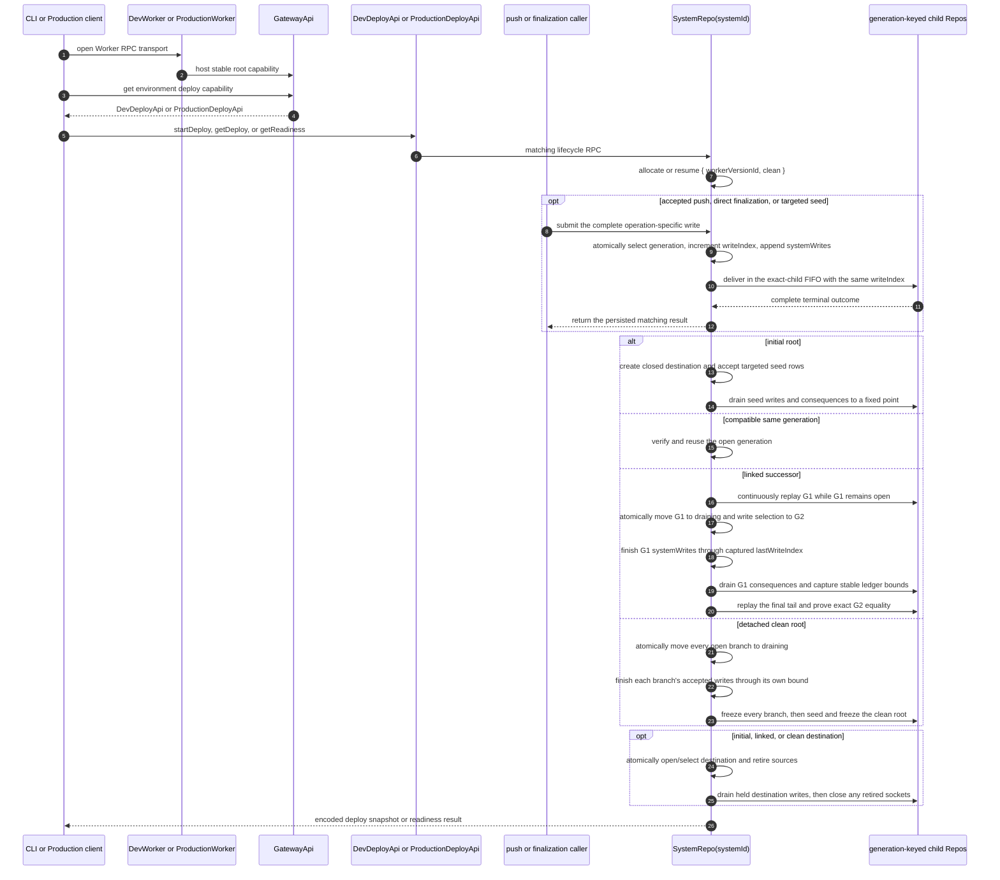

# System Lifecycle

One `SystemRepo(systemId)` Durable Object owns deployment selection, deploy
history, activation checkpoints, generation lifecycle state, frozen bounds,
replay receipts, WebSocket tickets, the globally ordered `systemWrites`
journal, aggregate registry, and generation-qualified Repo registrations. Its
selection row owns `{ activeDeployId, activatingDeployId, writeGenerationId,
lastWriteIndex, lastCleanRequestId }`; deploy rows own lifecycle checkpoints;
generation rows own lineage, the `closed | migrating | open | draining |
retired` phase, and each generation's accepted-write bound
([`SystemRepo.ts:93-205`](../../packages/system-worker/src/SystemRepo/SystemRepo.ts#L93-L205),
[`SystemRepo.ts:207-349`](../../packages/system-worker/src/SystemRepo/SystemRepo.ts#L207-L349)).

`DevWorker` and `ProductionWorker` host `GatewayApi`. Dev deploy control is
available only through `GatewayApi.getDevDeployApi`; Production readiness is
available only through `GatewayApi.getProductionDeployApi`. The Worker
entrypoints forward only reserved WebSocket paths to `SystemRepo.fetch`
([`GatewayApi.ts:57-75`](../../packages/system-worker/src/GatewayApi/GatewayApi.ts#L57-L75),
[`DevWorker.ts:31-50`](../../packages/dev-worker/src/DevWorker.ts#L31-L50),
[`ProductionWorker.ts:67-115`](../../packages/production-worker/src/ProductionWorker.ts#L67-L115)).

## Annotated workflow steps

1. A client opens the conventional Worker endpoint. Ordinary requests remain
   RPC traffic; the entrypoint does not route them through `SystemRepo.fetch`
   ([`DevWorker.ts:31-50`](../../packages/dev-worker/src/DevWorker.ts#L31-L50),
   [`ProductionWorker.ts:67-115`](../../packages/production-worker/src/ProductionWorker.ts#L67-L115)).
2. The Worker constructs one `GatewayApi` around the singleton SystemRepo
   capability and the deployment-provided identity resolver
   ([`DevWorker.ts:41-49`](../../packages/dev-worker/src/DevWorker.ts#L41-L49),
   [`ProductionWorker.ts:106-114`](../../packages/production-worker/src/ProductionWorker.ts#L106-L114)).
3. Dev selects `getDevDeployApi`; Production selects
   `getProductionDeployApi`
   ([`GatewayApi.ts:57-75`](../../packages/system-worker/src/GatewayApi/GatewayApi.ts#L57-L75)).
4. The environment mismatch returns the same-shaped failure target. It does not
   expose the other environment's operations
   ([`getDevDeployApi.ts:8-24`](../../packages/system-worker/src/GatewayApi/getDevDeployApi/getDevDeployApi.ts#L8-L24),
   [`getProductionDeployApi.ts:8-24`](../../packages/system-worker/src/GatewayApi/getProductionDeployApi/getProductionDeployApi.ts#L8-L24)).
5. `DevDeployApi` exposes `startDeploy`, `getDeploy`, and `getReadiness`;
   `ProductionDeployApi` exposes only `getReadiness`
   ([`DevDeployApi.ts:27-75`](../../packages/system-worker/src/DevDeployApi/DevDeployApi.ts#L27-L75),
   [`ProductionDeployApi.ts:10-22`](../../packages/system-worker/src/ProductionDeployApi/ProductionDeployApi.ts#L10-L22)).
6. Each deploy capability delegates directly to the same singleton
   `SystemRepo` RPC surface
   ([`DevDeployApi.ts:15-83`](../../packages/system-worker/src/DevDeployApi/DevDeployApi.ts#L15-L83),
   [`ProductionDeployApi.ts:13-22`](../../packages/system-worker/src/ProductionDeployApi/ProductionDeployApi.ts#L13-L22)).
7. `SystemRepo` combines `startDeploy({ clean })` with the executing
   `WORKER_VERSION_METADATA.id` and allocates or resumes the exact
   `{ workerVersionId, clean }` deploy. Production construction uses the same
   Worker metadata plus its clean-request binding, persists the same deploy
   model, and schedules the same activation runner
   ([`SystemRepo.ts:473-652`](../../packages/system-worker/src/SystemRepo/SystemRepo.ts#L473-L652),
   [`SystemRepo.ts:721-758`](../../packages/system-worker/src/SystemRepo/SystemRepo.ts#L721-L758),
   [`allocateDeploy.ts:75-191`](../../packages/system-worker/src/SystemRepo/allocateDeploy/allocateDeploy.ts#L75-L191)).
8. Stale frontend pushes, direct aggregate/service finalization, and internal
   lifecycle seeds all enter the singleton current-write surface with their
   complete encoded commands
   ([`SystemRepo.ts:830-939`](../../packages/system-worker/src/SystemRepo/SystemRepo.ts#L830-L939)).
9. Acceptance is one SystemRepo transaction: it chooses the selected or
   explicitly targeted generation, enforces its phase, advances the global and
   generation-local `lastWriteIndex`, and inserts the exact request before any
   child RPC
   ([`pushCommands.ts:81-202`](../../packages/system-worker/src/SystemRepo/pushCommands/pushCommands.ts#L81-L202),
   [`finalizeAggregateCommands.ts:87-221`](../../packages/system-worker/src/SystemRepo/finalizeAggregateCommands/finalizeAggregateCommands.ts#L87-L221)).
10. `drainSystemWrites` orders unresolved rows by `writeIndex`, partitions them
    by exact child target, and calls `AggregateFrontendRepo.pushCommands`,
    `AggregateRepo.finalizeAggregateCommands`, or
    `ServiceRepo.finalizeServiceCommands` with the accepted index
    ([`drainSystemWrites.ts:78-289`](../../packages/system-worker/src/SystemRepo/drainSystemWrites/drainSystemWrites.ts#L78-L289),
    [`drainSystemWrites.ts:357-548`](../../packages/system-worker/src/SystemRepo/drainSystemWrites/drainSystemWrites.ts#L357-L548)).
11. A domain success or failure is terminal. SystemRepo stores that encoded
    `Either` and `resolvedAt`; delivery exceptions remain pending diagnostics
    for retry
    ([`drainSystemWrites.ts:551-613`](../../packages/system-worker/src/SystemRepo/drainSystemWrites/drainSystemWrites.ts#L551-L613)).
12. The original call waits through its accepted index, reads that same row,
    and returns or fails with its persisted terminal result
    ([`pushCommands.ts:204-260`](../../packages/system-worker/src/SystemRepo/pushCommands/pushCommands.ts#L204-L260),
    [`finalizeServiceCommands.ts:212-265`](../../packages/system-worker/src/SystemRepo/finalizeServiceCommands/finalizeServiceCommands.ts#L212-L265)).
13. Initial activation creates a predecessor-free closed generation. Each seed
    is accepted as an explicitly targeted durable write, so seed delivery has
    the same retry and outcome semantics as public writes
    ([`activateDeploy.ts:271-313`](../../packages/system-worker/src/SystemRepo/activateDeploy/activateDeploy.ts#L271-L313),
    [`SystemRepo.ts:520-602`](../../packages/system-worker/src/SystemRepo/SystemRepo.ts#L520-L602)).
14. The initial root drains targeted seed writes and repeatedly drains child
    producers, outboxes, subscribers, and ledgers until its proof is stable
    before the checkpoint advances
    ([`prepareGeneration.ts:305-358`](../../packages/system-worker/src/SystemRepo/prepareGeneration/prepareGeneration.ts#L305-L358),
    [`freezeGeneration.ts:120-340`](../../packages/system-worker/src/SystemRepo/freezeGeneration/freezeGeneration.ts#L120-L340)).
15. A compatible deploy validates the new SystemSpec against the existing open
    generation, records it as preparing, and promotes without changing
    generation identity
    ([`prepareGeneration.ts:181-251`](../../packages/system-worker/src/SystemRepo/prepareGeneration/prepareGeneration.ts#L181-L251),
    [`activateDeploy.ts:346-354`](../../packages/system-worker/src/SystemRepo/activateDeploy/activateDeploy.ts#L346-L354)).
16. A linked successor is `migrating` while repeated service-first replay passes
    compare fresh G1 ledger-tip fingerprints. G1 stays open and selected during
    this continuous replay
    ([`prepareGeneration.ts:316-338`](../../packages/system-worker/src/SystemRepo/prepareGeneration/prepareGeneration.ts#L316-L338),
    [`prepareGeneration.ts:417-660`](../../packages/system-worker/src/SystemRepo/prepareGeneration/prepareGeneration.ts#L417-L660),
    [`activateDeploy.ts:535-562`](../../packages/system-worker/src/SystemRepo/activateDeploy/activateDeploy.ts#L535-L562)).
17. The linked ownership cut is one transaction that rechecks G1 and G2, moves
    G1 from `open` to `draining`, records G2 as its successor, and moves
    `selection.writeGenerationId` to G2 while G2 remains `migrating`
    ([`activateDeploy.ts:977-1061`](../../packages/system-worker/src/SystemRepo/activateDeploy/activateDeploy.ts#L977-L1061)).
18. The cut makes G1's durable tail finite. Activation drains only G1 rows
    through G1's captured `lastWriteIndex` before advancing the
    `source-writes-terminal` checkpoint
    ([`activateDeploy.ts:582-604`](../../packages/system-worker/src/SystemRepo/activateDeploy/activateDeploy.ts#L582-L604)).
19. `freezeGeneration` drains the finite write tail first, then repeats the
    authoritative consequence graph until two adjacent proofs match and stores
    immutable ledger bounds, subscriber watermarks, and `drainFrozenAt`
    ([`freezeGeneration.ts:88-140`](../../packages/system-worker/src/SystemRepo/freezeGeneration/freezeGeneration.ts#L88-L140),
    [`freezeGeneration.ts:280-340`](../../packages/system-worker/src/SystemRepo/freezeGeneration/freezeGeneration.ts#L280-L340)).
20. Linked activation performs one final replay with subscription restoration
    and requires G2 ledger cursor/index pairs and subscriber watermarks to equal
    the stored G1 bounds
    ([`activateDeploy.ts:639-688`](../../packages/system-worker/src/SystemRepo/activateDeploy/activateDeploy.ts#L639-L688),
    [`activateDeploy.ts:1160-1322`](../../packages/system-worker/src/SystemRepo/activateDeploy/activateDeploy.ts#L1160-L1322)).
21. A clean cut atomically moves every open generation branch to `draining`, so
    no displaced branch remains writable while the detached root is prepared
    ([`activateDeploy.ts:253-269`](../../packages/system-worker/src/SystemRepo/activateDeploy/activateDeploy.ts#L253-L269),
    [`activateDeploy.ts:1071-1158`](../../packages/system-worker/src/SystemRepo/activateDeploy/activateDeploy.ts#L1071-L1158)).
22. Clean activation reads every displaced branch's own `lastWriteIndex` and
    waits for all accepted rows through that branch-specific bound to become
    terminal
    ([`activateDeploy.ts:381-420`](../../packages/system-worker/src/SystemRepo/activateDeploy/activateDeploy.ts#L381-L420)).
23. It freezes every displaced branch to a stable proof, then prepares the
    predecessor-free clean destination, accepts its seeds through targeted
    writes, and freezes their consequences too
    ([`activateDeploy.ts:422-531`](../../packages/system-worker/src/SystemRepo/activateDeploy/activateDeploy.ts#L422-L531)).
24. Promotion rechecks the durable fixed-point prerequisites, retires linked or
    clean sources, opens the destination, marks the deploy succeeded, and moves
    active and write selection in one transaction
    ([`activateDeploy.ts:1324-1535`](../../packages/system-worker/src/SystemRepo/activateDeploy/activateDeploy.ts#L1324-L1535)).
25. Only after promotion commits does SystemRepo release held destination rows
    and close retired aggregate/service frontend sockets. Socket closure is
    cleanup after the durable retirement fence
    ([`activateDeploy.ts:697-751`](../../packages/system-worker/src/SystemRepo/activateDeploy/activateDeploy.ts#L697-L751),
    [`retireGeneration.ts:26-140`](../../packages/system-worker/src/SystemRepo/retireGeneration/retireGeneration.ts#L26-L140)).
26. Dev receives the persisted snapshot. Production readiness returns success
    only when the selected succeeded deploy belongs to the executing Worker;
    activating and failed Production deploys preserve their concrete lifecycle
    errors
    ([`getDeploy.ts:91-114`](../../packages/system-worker/src/SystemRepo/getDeploy/getDeploy.ts#L91-L114),
    [`getReadiness.ts:62-129`](../../packages/system-worker/src/SystemRepo/getReadiness/getReadiness.ts#L62-L129),
    [`getReadiness.ts:131-203`](../../packages/system-worker/src/SystemRepo/getReadiness/getReadiness.ts#L131-L203)).

## Persistence and identity boundaries

1. The selection row owns active, activating, and current-write selection plus
   the global `lastWriteIndex` and last clean request ID. Each deploy row is
   uniquely allocated by
   `{ workerVersionId, clean }` and owns its SystemSpec, status, checkpoint, and
   terminal failure
   ([`SystemRepo.ts:93-160`](../../packages/system-worker/src/SystemRepo/SystemRepo.ts#L93-L160)).
2. Generation rows own storage lineage, phase, active/preparing deploys, and the
   last accepted write for that generation. Reads remain admitted in `open` and
   `draining`; ordinary generation-qualified writes require `open`
   ([`SystemRepo.ts:161-205`](../../packages/system-worker/src/SystemRepo/SystemRepo.ts#L161-L205),
   [`assertGenerationAdmission.ts:54-111`](../../packages/system-worker/src/SystemRepo/assertGenerationAdmission/assertGenerationAdmission.ts#L54-L111)).
3. `systemWrites.writeIndex` is the sole primary key and ordering identity. Each
   row retains its owning generation, operation-discriminated target, complete
   commands, nullable terminal result, attempt diagnostics, and timestamps;
   the schemas pair each operation with its exact terminal `Either`
   ([`SystemRepo.ts:314-349`](../../packages/system-worker/src/SystemRepo/SystemRepo.ts#L314-L349),
   [`systemWriteSchemas.ts:16-82`](../../packages/system-worker/src/SystemRepo/systemWriteSchemas.ts#L16-L82)).
4. Deploy identity never travels on ordinary child capabilities or command
   mutations
   ([`SystemRepo.ts:161-205`](../../packages/system-worker/src/SystemRepo/SystemRepo.ts#L161-L205),
   [`AggregateFrontendApi.ts:32-43`](../../packages/system-worker/src/AggregateFrontendApi/AggregateFrontendApi.ts#L32-L43)).
5. Aggregate and service ticket rows bind one opaque ticket to its generation,
   archive Repo name, exact logical target, user, frontend, and complete lock
   ([`SystemRepo.ts:256-305`](../../packages/system-worker/src/SystemRepo/SystemRepo.ts#L256-L305)).

## Failure and resume boundaries

1. Activation progress is durable in the eight `activationCheckpoint` values;
   an in-memory activation promise only serializes local wakeups
   ([`SystemRepo.ts:134-145`](../../packages/system-worker/src/SystemRepo/SystemRepo.ts#L134-L145),
   [`SystemRepo.ts:500-652`](../../packages/system-worker/src/SystemRepo/SystemRepo.ts#L500-L652)).
2. Acceptance commits the journal row before child delivery and schedules a
   Durable Object alarm. A disappeared caller therefore cannot cancel its
   accepted row
   ([`pushCommands.ts:81-204`](../../packages/system-worker/src/SystemRepo/pushCommands/pushCommands.ts#L81-L204)).
3. On a cold wake, `SystemRepo.alarm` drains unresolved journal lanes without
   waiting for a single caller and then resumes any activating deploy
   ([`alarm.ts:5-19`](../../packages/system-worker/src/SystemRepo/alarm/alarm.ts#L5-L19),
   [`SystemRepo.ts:941-1006`](../../packages/system-worker/src/SystemRepo/SystemRepo.ts#L941-L1006)).
4. A pre-cut deterministic activation error may mark the deploy failed. Once
   durable state proves the cut happened, activation remains resumable instead
   of clearing selection or pretending G1 is still open
   ([`activateDeploy.ts:755-824`](../../packages/system-worker/src/SystemRepo/activateDeploy/activateDeploy.ts#L755-L824)).
5. `getDeploy` and `getReadiness` may reschedule an activating deployment, so a
   restarted Worker resumes from persisted state rather than inventing a new
   deploy
   ([`getDeploy.ts:91-95`](../../packages/system-worker/src/SystemRepo/getDeploy/getDeploy.ts#L91-L95),
   [`getReadiness.ts:62-98`](../../packages/system-worker/src/SystemRepo/getReadiness/getReadiness.ts#L62-L98)).
6. Ordinary APIs do not imply readiness. Callers select the environment deploy
   capability explicitly when they need a readiness decision
   ([`GatewayApi.ts:57-75`](../../packages/system-worker/src/GatewayApi/GatewayApi.ts#L57-L75)).
7. `SystemRepo.fetch` is ticket-only apart from the generation-qualified system
   log socket. It rejects non-WebSocket requests to reserved routes with 426 and
   every other path with 404
   ([`fetch.ts:52-97`](../../packages/system-worker/src/SystemRepo/fetch/fetch.ts#L52-L97),
   [`fetch.ts:232-236`](../../packages/system-worker/src/SystemRepo/fetch/fetch.ts#L232-L236)).

## Trigger

1. Dev lifecycle enters through
   `GatewayApi.getDevDeployApi().startDeploy/getDeploy/getReadiness`; Production
   lifecycle enters through constructor allocation and
   `GatewayApi.getProductionDeployApi().getReadiness`
   ([`GatewayApi.ts:57-75`](../../packages/system-worker/src/GatewayApi/GatewayApi.ts#L57-L75),
   [`SystemRepo.ts:413-496`](../../packages/system-worker/src/SystemRepo/SystemRepo.ts#L413-L496)).
2. The same `SystemRepo(systemId)` owns current-write selection and
   durable delivery for push and direct-finalization entrypoints
   ([`SystemRepo.ts:830-939`](../../packages/system-worker/src/SystemRepo/SystemRepo.ts#L830-L939)).
3. Its alarm and deploy-status/readiness paths resume the same persisted write
   and activation state after a cold start
   ([`SystemRepo.ts:941-1006`](../../packages/system-worker/src/SystemRepo/SystemRepo.ts#L941-L1006),
   [`getDeploy.ts:91-95`](../../packages/system-worker/src/SystemRepo/getDeploy/getDeploy.ts#L91-L95)).

## Callers

- [`Development Lifecycle`](./DevLifecycle.md)
- [`Gateway System API`](./SystemApi.md)
- [`Frontend WebSocket`](./FrontendWebSocket.md)
