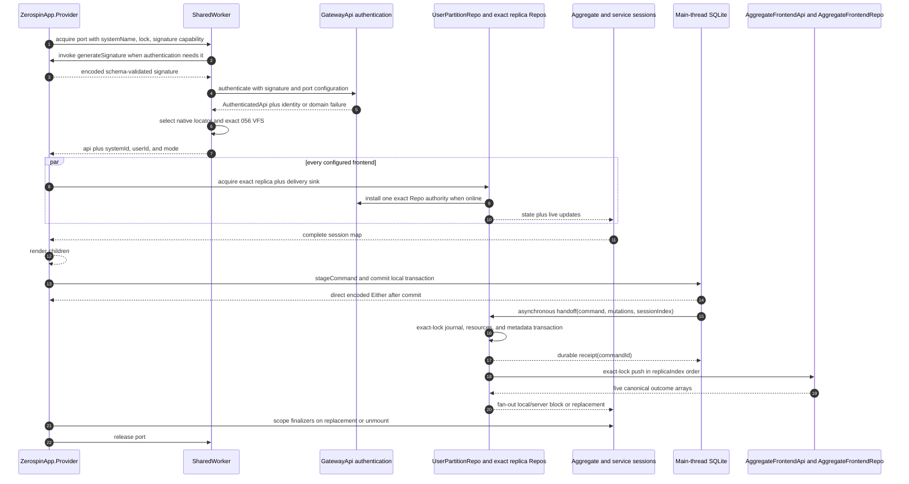
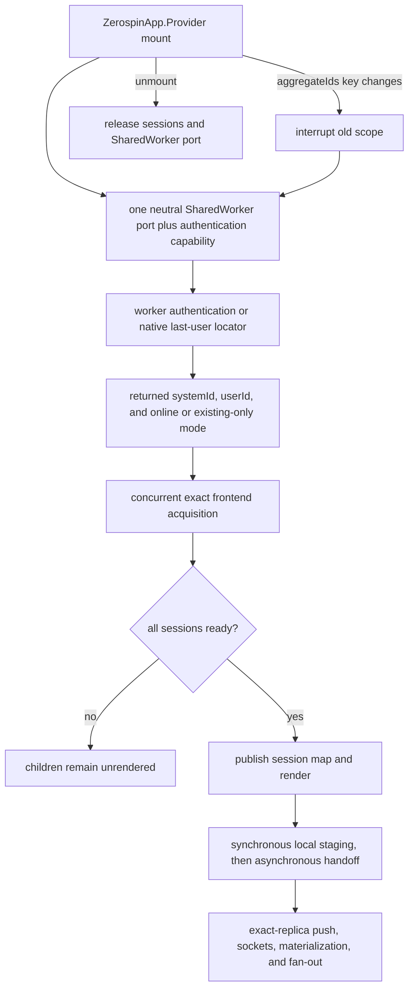

# Browser Session Bootstrap

One `ZerospinApp.Provider` mount owns one scoped Effect lifecycle. The page
supplies `{ systemName, authenticationLock, generateSignature }` to one neutral
SharedWorker MessagePort; the worker authenticates or resolves its native
last-user locator and returns `{ api, systemId, userId, mode }`. The Provider
then acquires every configured aggregate and service session concurrently.
Children render only after the complete session set is ready, and scope cleanup
releases acquired sessions before the SharedWorker port
([`makeZerospinApp.tsx:206-267`](../../packages/react/src/makeZerospinApp.tsx#L206-L267),
[`makeZerospinApp.tsx:269-445`](../../packages/react/src/makeZerospinApp.tsx#L269-L445),
[`makeZerospinApp.tsx:454-459`](../../packages/react/src/makeZerospinApp.tsx#L454-L459)).

## Annotated workflow steps

1. The Provider builds the selected authentication lock and opens one
   SharedWorker port with `{ systemName, authenticationLock,
generateSignature }`. The worker asset URL contains only `apiUrl`,
   `publishableKey`, and `wasmUrl`; neither user identity field is a worker URL
   parameter
   ([`makeZerospinApp.tsx:206-237`](../../packages/react/src/makeZerospinApp.tsx#L206-L237),
   [`acquireUserPartitionRepo.ts:223-258`](../../packages/shared-worker/src/acquireUserPartitionRepo.ts#L223-L258)).
2. The worker retains the port-owned signature capability and invokes it only
   from a worker authentication attempt
   ([`getUserPartitionRepo.ts:117-159`](../../packages/shared-worker/src/SharedWorker/SharedWorkerApi/getUserPartitionRepo/getUserPartitionRepo.ts#L117-L159),
   [`getUserPartitionRepo.ts:227-245`](../../packages/shared-worker/src/SharedWorker/SharedWorkerApi/getUserPartitionRepo/getUserPartitionRepo.ts#L227-L245)).
3. The Provider's live callback ref produces the current signature, validates
   it against the selected signature schema, and returns an encoded RPC result;
   changing only the callback function does not restart the Provider scope
   ([`makeZerospinApp.tsx:174-177`](../../packages/react/src/makeZerospinApp.tsx#L174-L177),
   [`makeZerospinApp.tsx:211-235`](../../packages/react/src/makeZerospinApp.tsx#L211-L235)).
4. SharedWorker decodes that result and authenticates through the configured
   Gateway boundary. Authentication and refresh attempts are single-flight per
   port
   ([`getUserPartitionRepo.ts:164-258`](../../packages/shared-worker/src/SharedWorker/SharedWorkerApi/getUserPartitionRepo/getUserPartitionRepo.ts#L164-L258)).
5. Online success binds the port to the returned `{ systemId, userId,
systemName }` and exact `AuthenticatedApi` object. Definitive callback,
   authentication, configuration, or identity failures dispose the port;
   transient failures remain retryable
   ([`getUserPartitionRepo.ts:264-376`](../../packages/shared-worker/src/SharedWorker/SharedWorkerApi/getUserPartitionRepo/getUserPartitionRepo.ts#L264-L376)).
6. Online acquisition opens or creates the exact Plan-056 user VFS and writes a
   native IndexedDB locator keyed by `{ apiUrl, publishableKey, systemName,
authenticationLock }`. Only an initial remote-authentication failure in the
   five-code allowlist may read that locator and open the already-existing VFS
   in `existing-only` mode
   ([`getUserPartitionRepo.ts:380-492`](../../packages/shared-worker/src/SharedWorker/SharedWorkerApi/getUserPartitionRepo/getUserPartitionRepo.ts#L380-L492),
   [`getUserPartitionRepo.ts:520-688`](../../packages/shared-worker/src/SharedWorker/SharedWorkerApi/getUserPartitionRepo/getUserPartitionRepo.ts#L520-L688),
   [`makeVfsName.ts:3-10`](../../packages/shared-worker/src/SharedWorker/makeVfsName.ts#L3-L10)).
7. One MessagePort returns `{ api, systemId, userId, mode }`; the page uses the
   returned identity and mode for diagnostics and every child bootstrap
   ([`acquireUserPartitionRepo.ts:328-372`](../../packages/shared-worker/src/acquireUserPartitionRepo.ts#L328-L372),
   [`makeZerospinApp.tsx:238-267`](../../packages/react/src/makeZerospinApp.tsx#L238-L267)).
8. Aggregate and service bootstraps pass the exact target, complete lock and
   lock key, frontend spec, acquisition mode, and a main-thread delivery sink
   through the shared user root
   ([`bootstrapBrowserSession.ts:235-287`](../../packages/react/src/bootstrapBrowserSession.ts#L235-L287),
   [`bootstrapBrowserServiceSession.ts:215-264`](../../packages/react/src/bootstrapBrowserServiceSession.ts#L215-L264)).
9. In `online` mode, the exact Repo selects the oldest eligible live online
   registration and installs exactly one authority tuple `{ registrationId,
ownerToken, authenticatedApi, frontendApi }`. Child admission is accepted
   only while the selected registration, port parent, selection attempt,
   identity, complete lock, lock key, and frontend spec remain current
   ([`AggregateFrontendReplicaRepo.ts:1479-1801`](../../packages/shared-worker/src/SharedWorker/AggregateFrontendReplicaRepo/AggregateFrontendReplicaRepo.ts#L1479-L1801),
   [`ServiceFrontendReplicaRepo.ts:531-830`](../../packages/shared-worker/src/SharedWorker/ServiceFrontendReplicaRepo/ServiceFrontendReplicaRepo.ts#L531-L830)).
10. The acquired exact replica supplies current state and owns later block,
    replacement-state, or terminal-failure delivery through the registered sink
    ([`bootstrapBrowserSession.ts:123-316`](../../packages/react/src/bootstrapBrowserSession.ts#L123-L316),
    [`bootstrapBrowserServiceSession.ts:95-291`](../../packages/react/src/bootstrapBrowserServiceSession.ts#L95-L291)).
11. The Provider waits for every configured session before publishing the map
    ([`makeZerospinApp.tsx:269-426`](../../packages/react/src/makeZerospinApp.tsx#L269-L426)).
12. React renders children only after the complete session map is ready
    ([`makeZerospinApp.tsx:454-459`](../../packages/react/src/makeZerospinApp.tsx#L454-L459)).
13. Aggregate `stageCommand` prepares the complete command and applies command,
    resource, and inverse writes in one synchronous local transaction
    ([`makeSession.ts:243-337`](../../packages/core/src/session/makeSession.ts#L243-L337)).
14. The session returns the direct encoded Either after the transaction and
    synchronous table notification complete
    ([`makeSession.ts:340-369`](../../packages/core/src/session/makeSession.ts#L340-L369)).
15. A successful local commit starts exactly one asynchronous handoff with the
    complete command, mutations, and committed `sessionIndex`
    ([`makeSession.ts:371-480`](../../packages/core/src/session/makeSession.ts#L371-L480)).
16. The exact-replica transaction checks idempotency by command ID and
    `(sessionId, sessionIndex)`, allocates the next `replicaIndex`, applies the
    optimistic resource mutations, stores the full staged replica command plus
    mutation bytes and applied inverses in the journal, and advances metadata.
    Fan-out and push scheduling begin only after commit
    ([`AggregateFrontendReplicaRepo.ts:3515-3785`](../../packages/shared-worker/src/SharedWorker/AggregateFrontendReplicaRepo/AggregateFrontendReplicaRepo.ts#L3515-L3785)).
17. SharedWorker returns only `{ commandId }` after that exact database
    transaction completes; a byte-identical repeated handoff returns the same
    durable receipt without applying optimism again
    ([`AggregateFrontendReplicaRepo.ts:3596-3665`](../../packages/shared-worker/src/SharedWorker/AggregateFrontendReplicaRepo/AggregateFrontendReplicaRepo.ts#L3596-L3665),
    [`AggregateFrontendReplicaRepo.ts:3771-3785`](../../packages/shared-worker/src/SharedWorker/AggregateFrontendReplicaRepo/AggregateFrontendReplicaRepo.ts#L3771-L3785)).
18. Exact-lock push captures staged rows in staging `replicaIndex` order,
    selects a live online registration, retries byte-identical complete commands,
    and fences the result by the selected registration, child, and parent
    ([`AggregateFrontendReplicaRepo.ts:2857-3033`](../../packages/shared-worker/src/SharedWorker/AggregateFrontendReplicaRepo/AggregateFrontendReplicaRepo.ts#L2857-L3033),
    [`AggregateFrontendReplicaRepo.ts:3107-3178`](../../packages/shared-worker/src/SharedWorker/AggregateFrontendReplicaRepo/AggregateFrontendReplicaRepo.ts#L3107-L3178)).
19. `AggregateFrontendApi.pushCommands` returns pending, newly pushed, executed,
    failed-staged, and failed-pushed commands with full provenance
    ([`AggregateFrontendApi.ts:83-90`](../../packages/system-worker/src/AggregateFrontendApi/AggregateFrontendApi.ts#L83-L90),
    [`types.ts:338-349`](../../packages/core/src/contracts/types.ts#L338-L349)).
20. Failed-stage results are settled immediately by rewinding all active
    optimism, removing the failed journal rows, reapplying the remaining
    journal, and emitting one replacement. Pushed, executed, and failed-pushed
    convergence remains canonical-block or authoritative-replacement work; local
    stage, server block, and replacement fan-out all stay inside SharedWorker
    ([`AggregateFrontendReplicaRepo.ts:3194-3429`](../../packages/shared-worker/src/SharedWorker/AggregateFrontendReplicaRepo/AggregateFrontendReplicaRepo.ts#L3194-L3429),
    [`AggregateFrontendReplicaRepo.ts:2477-2813`](../../packages/shared-worker/src/SharedWorker/AggregateFrontendReplicaRepo/AggregateFrontendReplicaRepo.ts#L2477-L2813),
    [`AggregateFrontendReplicaRepo.ts:868-1195`](../../packages/shared-worker/src/SharedWorker/AggregateFrontendReplicaRepo/AggregateFrontendReplicaRepo.ts#L868-L1195)).
21. Provider replacement, unmount, or partial bootstrap failure interrupts the
    scoped Effect and releases every acquired aggregate/service session before
    the earlier-acquired port finalizer
    ([`makeZerospinApp.tsx:227-237`](../../packages/react/src/makeZerospinApp.tsx#L227-L237),
    [`makeZerospinApp.tsx:317-387`](../../packages/react/src/makeZerospinApp.tsx#L317-L387),
    [`makeZerospinApp.tsx:429-445`](../../packages/react/src/makeZerospinApp.tsx#L429-L445)).
22. SharedWorker client release or a non-persisted `pagehide` disposes its RPC
    session and closes that port; a persisted `pagehide` retains both for
    BFCache restoration
    ([`acquireUserPartitionRepo.ts:299-371`](../../packages/shared-worker/src/acquireUserPartitionRepo.ts#L299-L371)).

## Trigger

1. `makeZerospinApp` requires `systemName`, a top-level authentication signature
   selection, source-selected frontends, and a session runtime. Provider props
   are exactly `generateSignature`, aggregate IDs keyed by aggregate name, and
   children
   ([`makeZerospinApp.tsx:63-90`](../../packages/react/src/makeZerospinApp.tsx#L63-L90),
   [`makeZerospinApp.tsx:144-166`](../../packages/react/src/makeZerospinApp.tsx#L144-L166)).
2. The Provider delegates root identity and acquisition mode to
   `acquireUserPartitionRepo`; it does not authenticate on the page or inspect
   a page-local locator
   ([`makeZerospinApp.tsx:206-242`](../../packages/react/src/makeZerospinApp.tsx#L206-L242)).
3. `acquireUserPartitionRepo` transfers the authentication configuration and
   signature capability to the port-bound `SharedWorkerApi`; worker-side
   authentication is single-flight for that port. Refresh is
   compare-and-refresh by exact failed-parent object identity: a stale sibling
   failure reuses the newer current parent instead of replacing it
   ([`acquireUserPartitionRepo.ts:193-208`](../../packages/shared-worker/src/acquireUserPartitionRepo.ts#L193-L208),
   [`acquireUserPartitionRepo.ts:328-372`](../../packages/shared-worker/src/acquireUserPartitionRepo.ts#L328-L372),
   [`getUserPartitionRepo.ts:164-225`](../../packages/shared-worker/src/SharedWorker/SharedWorkerApi/getUserPartitionRepo/getUserPartitionRepo.ts#L164-L225)).
4. SharedWorker is the only execution transport. Missing `SharedWorker` or
   `MessagePort` support fails with `shared-worker-unavailable`; there is no
   direct-mode fallback
   ([`acquireUserPartitionRepo.ts:212-221`](../../packages/shared-worker/src/acquireUserPartitionRepo.ts#L212-L221)).
5. Each aggregate frontend resolves `aggregateIds[aggregateName]`, constructs
   one core/browser session, and acquires its exact replica through the shared
   `UserPartitionRepo`
   ([`makeZerospinApp.tsx:279-357`](../../packages/react/src/makeZerospinApp.tsx#L279-L357),
   [`bootstrapBrowserSession.ts:37-325`](../../packages/react/src/bootstrapBrowserSession.ts#L37-L325)).
6. Each service frontend constructs its read-only session and acquires its exact
   service replica through the same `UserPartitionRepo`
   ([`makeZerospinApp.tsx:360-416`](../../packages/react/src/makeZerospinApp.tsx#L360-L416),
   [`bootstrapBrowserServiceSession.ts:27-291`](../../packages/react/src/bootstrapBrowserServiceSession.ts#L27-L291)).
7. The Provider publishes the session map in one state update after every
   acquisition succeeds. Cleanup interrupts the scope, which runs replica,
   database, DevTools, and SharedWorker finalizers
   ([`makeZerospinApp.tsx:419-445`](../../packages/react/src/makeZerospinApp.tsx#L419-L445)).

## Lifecycle keys

1. Only the serialized `aggregateIds` record restarts the Provider scope. A new
   `generateSignature` function alone does not; a live ref supplies its latest
   function to every later worker authentication attempt
   ([`makeZerospinApp.tsx:174-177`](../../packages/react/src/makeZerospinApp.tsx#L174-L177),
   [`makeZerospinApp.tsx:211-235`](../../packages/react/src/makeZerospinApp.tsx#L211-L235),
   [`makeZerospinApp.tsx:438-445`](../../packages/react/src/makeZerospinApp.tsx#L438-L445)).
2. The native locator key is exactly `{ apiUrl, publishableKey, systemName,
authenticationLock }`; its value is `{ key, systemId, userId }`. The selected
   SharedWorker persistence root is `{ systemId, userId }`, with Plan-056 VFS
   path `zerospin/056/{systemId}/users/{userId}` and SQLite database name
   `replicas.db`. Existing-only opens neither a missing VFS nor an empty schema,
   and every incompatible legacy, locator, VFS, or schema layout fails before
   mutation with `browser-persistence-reset-required`
   ([`makeVfsName.ts:3-10`](../../packages/shared-worker/src/SharedWorker/makeVfsName.ts#L3-L10),
   [`getUserPartitionRepo.ts:411-492`](../../packages/shared-worker/src/SharedWorker/SharedWorkerApi/getUserPartitionRepo/getUserPartitionRepo.ts#L411-L492),
   [`lastUserPartitionStore.ts:7-14`](../../packages/shared-worker/src/SharedWorker/lastUserPartitionStore.ts#L7-L14),
   [`lastUserPartitionStore.ts:29-303`](../../packages/shared-worker/src/SharedWorker/lastUserPartitionStore.ts#L29-L303),
   [`makeIdbSQLite3.ts:30-155`](../../packages/shared-worker/src/drizzle/makeIdbSQLite3.ts#L30-L155),
   [`migrateUserReplicaDbAsync.ts:214-251`](../../packages/shared-worker/src/SharedWorker/migrateUserReplicaDbAsync.ts#L214-L251)).
3. Aggregate replica identity adds `{ aggregateName, aggregateId, frontendName,
aggregateFrontendLockKey }`; service replica identity adds `{ serviceName,
frontendName, serviceFrontendLockKey }`. `userId` is already bound by the
   parent `UserPartitionRepo`
   ([`UserPartitionRepo.ts:30-119`](../../packages/shared-worker/src/SharedWorker/UserPartitionRepo/UserPartitionRepo.ts#L30-L119)).

## Runtime registrations and persisted rows

1. A browser replica registration is runtime-only state inside one exact
   SharedWorker aggregate or service replica Repo. The worker allocator supplies
   `registrationId`, the MessagePort supplies `ownerToken` and its authentication
   callbacks, and the main-thread acquisition supplies the delivery `sink` and
   `online | existing-only` mode. Delivery gates, captured state, buffered
   blocks, and release state remain registration-local. Neither child
   `frontendApi` nor its parent `authenticatedApi` is registration state
   ([`AggregateFrontendReplicaRepo.ts:188-243`](../../packages/shared-worker/src/SharedWorker/AggregateFrontendReplicaRepo/AggregateFrontendReplicaRepo.ts#L188-L243),
   [`AggregateFrontendReplicaRepo.ts:1198-1280`](../../packages/shared-worker/src/SharedWorker/AggregateFrontendReplicaRepo/AggregateFrontendReplicaRepo.ts#L1198-L1280),
   [`ServiceFrontendReplicaRepo.ts:87-133`](../../packages/shared-worker/src/SharedWorker/ServiceFrontendReplicaRepo/ServiceFrontendReplicaRepo.ts#L87-L133),
   [`ServiceFrontendReplicaRepo.ts:344-415`](../../packages/shared-worker/src/SharedWorker/ServiceFrontendReplicaRepo/ServiceFrontendReplicaRepo.ts#L344-L415)).
2. Each exact Repo owns at most one installed authority tuple, exactly `{
registrationId, ownerToken, authenticatedApi, frontendApi }`, plus one
   selection-attempt token and one joined selection promise. Authority RPCs and
   callbacks fence on that tuple, the selected live registration, and the
   selection attempt before any state, socket, or push result commits. A failed
   parent is passed to the selected port's compare-and-refresh operation; a
   stale failure receives the newer port parent rather than replacing it
   ([`AggregateFrontendReplicaRepo.ts:198-209`](../../packages/shared-worker/src/SharedWorker/AggregateFrontendReplicaRepo/AggregateFrontendReplicaRepo.ts#L198-L209),
   [`AggregateFrontendReplicaRepo.ts:1479-2049`](../../packages/shared-worker/src/SharedWorker/AggregateFrontendReplicaRepo/AggregateFrontendReplicaRepo.ts#L1479-L2049),
   [`ServiceFrontendReplicaRepo.ts:97-106`](../../packages/shared-worker/src/SharedWorker/ServiceFrontendReplicaRepo/ServiceFrontendReplicaRepo.ts#L97-L106),
   [`ServiceFrontendReplicaRepo.ts:531-1093`](../../packages/shared-worker/src/SharedWorker/ServiceFrontendReplicaRepo/ServiceFrontendReplicaRepo.ts#L531-L1093),
   [`getUserPartitionRepo.ts:164-225`](../../packages/shared-worker/src/SharedWorker/SharedWorkerApi/getUserPartitionRepo/getUserPartitionRepo.ts#L164-L225)).
3. IndexedDB persists exact replica locators and replica contents, not browser
   registrations. A new exact Repo remains unpublished with `activating` state
   and no placeholder metadata. It first installs authority and commits the
   initial authoritative state transaction, then inserts the locator row and
   publishes the runtime. Failure releases only a newly appended registration
   and closes unowned handles; it does not delete SQLite or VFS bytes
   ([`acquireAggregateFrontendReplica.ts:492-588`](../../packages/shared-worker/src/SharedWorker/UserPartitionRepo/acquireAggregateFrontendReplica/acquireAggregateFrontendReplica.ts#L492-L588),
   [`acquireAggregateFrontendReplica.ts:595-610`](../../packages/shared-worker/src/SharedWorker/UserPartitionRepo/acquireAggregateFrontendReplica/acquireAggregateFrontendReplica.ts#L595-L610),
   [`acquireServiceFrontendReplica.ts:494-541`](../../packages/shared-worker/src/SharedWorker/UserPartitionRepo/acquireServiceFrontendReplica/acquireServiceFrontendReplica.ts#L494-L541),
   [`acquireServiceFrontendReplica.ts:547-559`](../../packages/shared-worker/src/SharedWorker/UserPartitionRepo/acquireServiceFrontendReplica/acquireServiceFrontendReplica.ts#L547-L559)).
4. The aggregate locator key is `{ aggregateId, aggregateName, userId,
frontendName, aggregateFrontendLockKey }`; the service locator key is `{
serviceName, userId, frontendName, serviceFrontendLockKey }`. Those rows also
   retain the complete lock, frontend spec, database name, and creation time.
   Each exact aggregate database contains generated resource tables, metadata
   `{ id, systemVersion, frontendIndex, replicaIndex }`, and the command journal
   `{ commandId, sessionId, sessionIndex, command, mutations,
appliedMutationInverses }`. Each exact service database contains generated
   resource tables and only the same four metadata fields. Online reacquisition
   finds a live registration by the same MessagePort owner token without writing
   a registration row
   ([`userReplicaSchemas.ts:176-247`](../../packages/shared-worker/src/SharedWorker/userReplicaSchemas.ts#L176-L247),
   [`AggregateFrontendReplicaRepo.ts:90-132`](../../packages/shared-worker/src/SharedWorker/AggregateFrontendReplicaRepo/AggregateFrontendReplicaRepo.ts#L90-L132),
   [`ServiceFrontendReplicaRepo.ts:53-69`](../../packages/shared-worker/src/SharedWorker/ServiceFrontendReplicaRepo/ServiceFrontendReplicaRepo.ts#L53-L69),
   [`AggregateFrontendReplicaRepo.ts:1198-1280`](../../packages/shared-worker/src/SharedWorker/AggregateFrontendReplicaRepo/AggregateFrontendReplicaRepo.ts#L1198-L1280),
   [`ServiceFrontendReplicaRepo.ts:344-415`](../../packages/shared-worker/src/SharedWorker/ServiceFrontendReplicaRepo/ServiceFrontendReplicaRepo.ts#L344-L415)).
5. SystemRepo has a separate persisted repo-registration concept with exact
   shape `{ generationId, repoType, repoName, tableNames }`. SystemRepo writes
   those generation-qualified Durable Object inventory rows to its `repos`
   table; they do not represent browser MessagePorts, sessions, or delivery
   sinks
   ([`types.ts:63-68`](../../packages/core/src/system/types.ts#L63-L68),
   [`SystemRepo.ts:947-955`](../../packages/system-worker/src/SystemRepo/SystemRepo.ts#L947-L955)).

## Failure and release

1. Initial worker authentication or native-locator/VFS failure prevents every
   child session. One target acquisition failure prevents the atomic session
   map from being published; Effect scope cleanup releases any successful
   sibling acquisition before it releases the port
   ([`getUserPartitionRepo.ts:380-566`](../../packages/shared-worker/src/SharedWorker/SharedWorkerApi/getUserPartitionRepo/getUserPartitionRepo.ts#L380-L566),
   [`makeZerospinApp.tsx:227-237`](../../packages/react/src/makeZerospinApp.tsx#L227-L237),
   [`makeZerospinApp.tsx:269-445`](../../packages/react/src/makeZerospinApp.tsx#L269-L445)).
2. An initial worker-side remote authentication failure in the explicit
   five-code allowlist may hydrate an existing exact replica offline. A later
   browser `online` event reacquires that exact replica in `online` mode. The
   Repo promotes the same owner registration in place, disposes the duplicate
   incoming sink, and performs authority selection without changing replica or
   registration identity
   ([`bootstrapBrowserSession.ts:318-380`](../../packages/react/src/bootstrapBrowserSession.ts#L318-L380),
   [`bootstrapBrowserServiceSession.ts:293-355`](../../packages/react/src/bootstrapBrowserServiceSession.ts#L293-L355),
   [`acquireAggregateFrontendReplica.ts:228-276`](../../packages/shared-worker/src/SharedWorker/UserPartitionRepo/acquireAggregateFrontendReplica/acquireAggregateFrontendReplica.ts#L228-L276),
   [`acquireServiceFrontendReplica.ts:224-277`](../../packages/shared-worker/src/SharedWorker/UserPartitionRepo/acquireServiceFrontendReplica/acquireServiceFrontendReplica.ts#L224-L277),
   [`AggregateFrontendReplicaRepo.ts:1198-1249`](../../packages/shared-worker/src/SharedWorker/AggregateFrontendReplicaRepo/AggregateFrontendReplicaRepo.ts#L1198-L1249),
   [`ServiceFrontendReplicaRepo.ts:344-390`](../../packages/shared-worker/src/SharedWorker/ServiceFrontendReplicaRepo/ServiceFrontendReplicaRepo.ts#L344-L390)).
3. A late aggregate state, ticket, or push result and a late service state or
   ticket result cannot commit after exact Repo authority changes. Every such
   path fences the captured `{ registrationId, ownerToken, authenticatedApi,
frontendApi }`, selected live registration, and selection attempt before
   commit or socket transition
   ([`AggregateFrontendReplicaRepo.ts:1857-2049`](../../packages/shared-worker/src/SharedWorker/AggregateFrontendReplicaRepo/AggregateFrontendReplicaRepo.ts#L1857-L2049),
   [`AggregateFrontendReplicaRepo.ts:2082-2474`](../../packages/shared-worker/src/SharedWorker/AggregateFrontendReplicaRepo/AggregateFrontendReplicaRepo.ts#L2082-L2474),
   [`AggregateFrontendReplicaRepo.ts:2961-3211`](../../packages/shared-worker/src/SharedWorker/AggregateFrontendReplicaRepo/AggregateFrontendReplicaRepo.ts#L2961-L3211),
   [`ServiceFrontendReplicaRepo.ts:862-1093`](../../packages/shared-worker/src/SharedWorker/ServiceFrontendReplicaRepo/ServiceFrontendReplicaRepo.ts#L862-L1093),
   [`ServiceFrontendReplicaRepo.ts:1126-1495`](../../packages/shared-worker/src/SharedWorker/ServiceFrontendReplicaRepo/ServiceFrontendReplicaRepo.ts#L1126-L1495)).
4. A `1012 / generation-drained` close suppresses ordinary reconnect. The exact
   replica conditionally refreshes the failed parent, fetches authoritative
   current-generation state, commits replacement or aggregate intent rebase,
   and only then mints a ticket and resumes from the committed `frontendIndex`.
   `state-required` follows that replacement-first path. A ticket RPC failure
   instead refreshes and installs child authority without replacing state, then
   retries only that ticket once
   ([`AggregateFrontendReplicaRepo.ts:2082-2474`](../../packages/shared-worker/src/SharedWorker/AggregateFrontendReplicaRepo/AggregateFrontendReplicaRepo.ts#L2082-L2474),
   [`ServiceFrontendReplicaRepo.ts:1126-1495`](../../packages/shared-worker/src/SharedWorker/ServiceFrontendReplicaRepo/ServiceFrontendReplicaRepo.ts#L1126-L1495)).
5. Port close, explicit disposal, or a non-persisted `pagehide` releases
   registrations and authentication owned by that port. Releasing a selected
   registration synchronously invalidates the installed authority, selection
   token, and socket before queued cleanup; another live online registration
   may become authority later. Persisted BFCache transitions retain the port,
   while user-root and exact-replica bytes remain in IndexedDB
   ([`AggregateFrontendReplicaRepo.ts:1332-1398`](../../packages/shared-worker/src/SharedWorker/AggregateFrontendReplicaRepo/AggregateFrontendReplicaRepo.ts#L1332-L1398),
   [`ServiceFrontendReplicaRepo.ts:1636-1715`](../../packages/shared-worker/src/SharedWorker/ServiceFrontendReplicaRepo/ServiceFrontendReplicaRepo.ts#L1636-L1715),
   [`dispose.ts:26-46`](../../packages/shared-worker/src/SharedWorker/SharedWorkerApi/dispose/dispose.ts#L26-L46),
   [`acquireUserPartitionRepo.ts:299-371`](../../packages/shared-worker/src/acquireUserPartitionRepo.ts#L299-L371)).

## Callers

- [`Browser Frontend Lifecycle`](../dev/diagrams/BrowserFrontendLifecycle.md)
- [`Universal Authentication`](./Authentication.md)
- [`Source-Selected Frontends`](./SourceSelectedFrontends.md)
