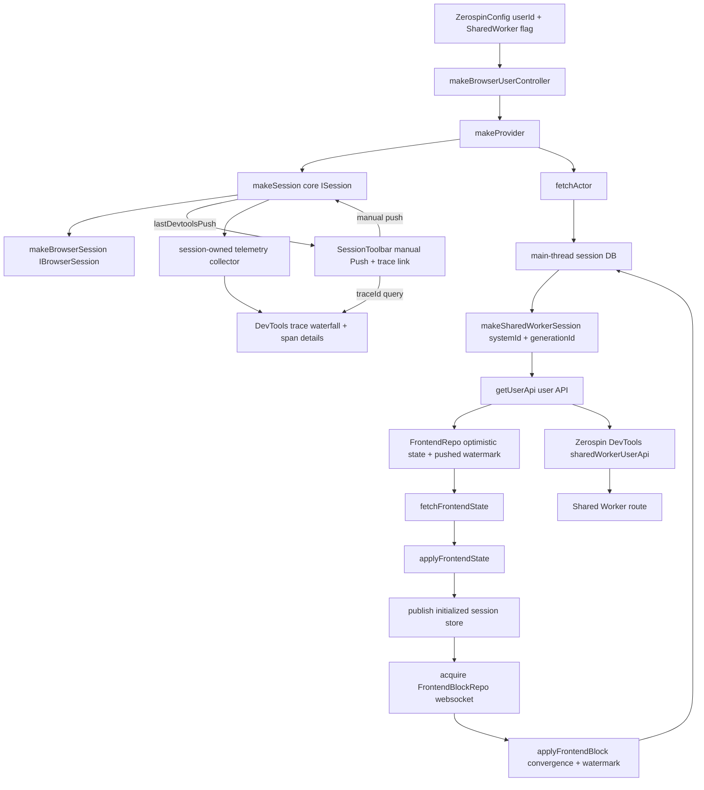
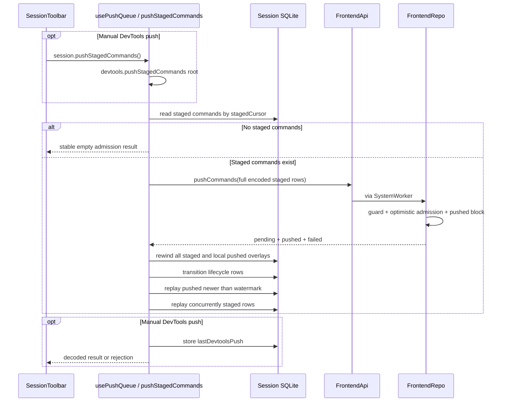

# bootstrapBrowserSession

## What this does

`ZerospinConfig` requires a browser `userId`, accepts an optional `isSharedWorkerEnabled` flag that defaults to `false`, constructs one `IBrowserUserController` carrying both values, and provides that controller to React sessions through context (../../packages/react/src/ZerospinConfig.tsx:8-24, ../../packages/react/src/makeBrowserUserController.ts:5-95). `makeProvider` captures the controller's flag for the Provider mount, passes it into the core `ISession`, wraps it as an `IBrowserSession`, and bootstraps that session without adding a SharedWorker staging mirror path (../../packages/react/src/makeProvider.tsx:81-167, ../../packages/react/src/makeBrowserSession.ts:11-25).

`bootstrapBrowserSession` builds the session schema, fetches the actor plus pinned `deployId`/`generationId` and authored `systemVersion` before opening the main-thread WASM DB, and uses `generationId` for every browser persistence and live-delivery boundary. When SharedWorker mode is enabled it opens the root with `{ systemId, generationId }`, stores only the user-scoped `UserApi`, fetches `IFrontendState`, applies that state into the main-thread session DB, publishes initialized state with `generationId` and `systemVersion`, and opens the exact generation-prefixed FrontendBlockRepo websocket. `@zerospin/frontend` owns actor/state fetch, push, and actor-query programs; React supplies their session telemetry layer (../../packages/frontend/src/fetchActor.ts:25-68, ../../packages/react/src/bootstrapBrowserSession.ts:74-190, ../../packages/shared-worker/src/makeSharedWorkerSession.ts:8-119, ../../packages/react/src/acquireFrontendWebSocket.ts:20-81).

`IFrontendState.resources` is FrontendRepo's current optimistic snapshot, not an authoritative-only base. Its pushed rows at or below `lastRebasedPushedCursor` are already represented in those resources, so bootstrap inserts the resources and lifecycle rows without replaying pending commands a second time (../../packages/system-worker/src/FrontendRepo/getFrontendState/getFrontendState.ts:47-84, ../../packages/core/src/session/types.ts:89-104, ../../packages/core/src/session/applyFrontendState.ts:60-131).

## Trigger

1. [`makeProvider`](../../packages/react/src/makeProvider.tsx) creates one core session using the mount-time SharedWorker flag from `ZerospinConfig`, creates its browser-session wrapper, then `useSWRImmutable` runs `bootstrapBrowserSession` and retains its release Effect (../../packages/react/src/makeProvider.tsx:81-163).
2. Once bootstrap publishes initialized state, `makeProvider` enables `usePushQueue`; the browser websocket is already scoped to the same account/actor/frontend identity (../../packages/react/src/makeProvider.tsx:186-196, ../../packages/react/src/bootstrapBrowserSession.ts:154-176).

## Annotated flow

1. [`ZerospinConfig`](../../packages/react/src/ZerospinConfig.tsx) requires `userId`, defaults optional `isSharedWorkerEnabled` to `false`, creates `makeBrowserUserController(userId, isSharedWorkerEnabled)` synchronously, and provides the controller to child providers (../../packages/react/src/ZerospinConfig.tsx:8-24).
2. [`makeProvider`](../../packages/react/src/makeProvider.tsx) requires that controller context before creating a provider session; it captures the controller's `isSharedWorkerEnabled` value for the Provider mount, creates the core session with that value, then exposes `makeBrowserSession({ session: coreSession, browserUserController })` through React context and refs (../../packages/react/src/makeProvider.tsx:81-131, ../../packages/core/src/session/makeSession.ts:45-252).
3. [`bootstrapBrowserSession`](../../packages/react/src/bootstrapBrowserSession.ts) builds frontend models from `session.frontend`, merges `sessionRepoTables`, and calls [`fetchActor`](../../packages/frontend/src/fetchActor.ts) before opening the migrated in-memory WASM SQLite DB on the main thread (../../packages/react/src/bootstrapBrowserSession.ts:69-94, ../../packages/frontend/src/fetchActor.ts:21-64).
4. `fetchActor` opens `newSyncRpcSession<ZerospinApis>`, resolves the bound FrontendApi, and uses `makeTraceableApiTarget` so a domain Left becomes the existing `IAnyError` and a promise rejection becomes `async-failed`; it makes one attempt (../../packages/frontend/src/fetchActor.ts:40-63). [`makeProvider`](../../packages/react/src/makeProvider.tsx) configures `useSWRImmutable` with `shouldRetryOnError: false` and maps terminal deploy/auth/transport failures to user-facing hints (../../packages/react/src/makeProvider.tsx:136-174, ../../packages/react/src/makeProvider.tsx:228-253).
5. `fetchActor` returns `{ actor, deployId, generationId, systemId, systemVersion, systemWorkerName, systemEnvironmentId }` from a FrontendApi capability already pinned to the active hosted deploy. Bootstrap retains the generation and authored version, then calls `makeSharedWorkerSession({ systemId, generationId })` when the session enables SharedWorker mode. The client puts both identities and the WASM URL into the worker URL; the host rejects a missing value, keys its user store by `systemId/generationId/userId`, and derives the IndexedDB VFS name as `zerospin/{systemId}/{generationId}/users/{userId}`. Disabled mode skips this boundary and leaves `sharedWorkerSession` null (../../packages/frontend/src/fetchActor.ts:25-68, ../../packages/react/src/bootstrapBrowserSession.ts:74-109, ../../packages/shared-worker/src/makeSharedWorkerSession.ts:8-119, ../../packages/shared-worker/src/SharedWorker/makeSharedWorkerHost.ts:39-60, ../../packages/shared-worker/src/SharedWorker/makeSharedWorkerHost.ts:133-185, ../../packages/shared-worker/src/SharedWorker/makeVfsName.ts:1-11).
6. The SharedWorker client API is root-scoped: bootstrap calls `api.getUserApi({ userId })` and stores the returned user-scoped API in `browserUserController.store.sharedWorkerUserApi` and `zerospinDevtoolsStore`; downstream React code does not receive root SharedWorker methods. The Shared Worker route reads that DevTools value and renders disabled for `null` or enabled for a connected handle (../../packages/react/src/bootstrapBrowserSession.ts:98-117, ../../packages/react/src/makeBrowserUserController.ts:5-38, ../../packages/shared-worker/src/makeSharedWorkerSession.ts:12-27, ../../packages/devtools/src/zerospinDevtoolsStore.ts:6-38, ../../packages/devtools/src/sharedWorker/SharedWorkerRoute.tsx:5-18).
7. Bootstrap always fetches `IFrontendState` through the linked-envelope [`fetchFrontendState`](../../packages/frontend/src/fetchFrontendState.ts) program, replaces the main-thread DB from its resource and command-lifecycle snapshots with `applyFrontendState`, and copies the resolved actor/account/system worker values, `generationId`, authored `systemVersion`, frontend index, and pushed rebase watermark into the initialized session store (../../packages/react/src/bootstrapBrowserSession.ts:110-171, ../../packages/frontend/src/fetchFrontendState.ts:32-58, ../../packages/core/src/session/applyFrontendState.ts:26-131).
8. Bootstrap passes `generationId` into `acquireFrontendWebSocket` only after publishing initialized state. The room name is exactly `frtbrepo_{generationId}/{accountId}/{accountName}/{actorName}/{actorId}/{frontendName}`. `releaseBrowserSession` closes that websocket scope, clears the user-scoped SharedWorker handle from the browser and DevTools stores, and releases the SharedWorker root session (../../packages/react/src/bootstrapBrowserSession.ts:152-212, ../../packages/react/src/acquireFrontendWebSocket.ts:20-81, ../../packages/react/src/acquireFrontendWebSocket.ts:133-153).

## Browser session staging

1. Core [`makeSession`](../../packages/core/src/session/makeSession.ts) accepts optional `isPushPaused`, `isSharedWorkerEnabled`, and `runtime` inputs (`ManagedRuntime` or captured `Runtime.Runtime`); React passes both flags and `sessionRuntime`, and callers without a runtime get `defaultSessionRuntime`. It eagerly creates `session.pushQueue` as `Queue.bounded(1)`, exposes a one-shot `session.onInitialized` readiness callback, defines `stageCommandEffect`, and runs the staging transaction under that session's telemetry layer before offering the queue wake (../../packages/react/src/makeProvider.tsx:109-123, ../../packages/core/src/session/makeSession.ts:50-88, ../../packages/core/src/session/makeSession.ts:178-307).
2. The rollback metadata is session-local: `sessionRepoTables` adds `optimisticAppliedMutations`, and `sessionCommandShape` stores one JSON array of encoded applied mutations per command id. Pushed session rows preserve the full frontend/staged provenance plus pushed cursor/time so response and block rebases can order them against the server watermark (../../packages/core/src/session/sessionRepoTables.ts:35-58, ../../packages/core/src/session/sessionCommandShape.ts:1-149).
3. [`makeBrowserSession`](../../packages/react/src/makeBrowserSession.ts) wraps the core `ISession` and delegates `stageCommand` directly to `session.stageCommand`; no SharedWorker forwarding runs in the React package (../../packages/react/src/makeBrowserSession.ts:11-25).

## Browser session push

1. [`makeProvider`](../../packages/react/src/makeProvider.tsx) mounts [`usePushQueue`](../../packages/react/src/usePushQueue.ts) once the session store is initialized (../../packages/react/src/makeProvider.tsx:186-196).
2. [`makeSession`](../../packages/core/src/session/makeSession.ts) exposes `isPushPaused`, defaults `lastDevtoolsPush` to `null`, and supplies an empty Promise-returning `session.pushStagedCommands` boundary. [`usePushQueue`](../../packages/react/src/usePushQueue.ts) installs the real imperative callback on mount; a pre-initialization call still throws `session-store-not-initialized` synchronously (../../packages/core/src/session/makeSession.ts:71-153, ../../packages/core/src/session/makeSession.ts:292-313, ../../packages/react/src/usePushQueue.ts:28-74).
3. The imperative callback runs only manual calls under `devtools.pushStagedCommands`, captures the current trace id directly, and writes `{ traceId, completedAt, status }` on either Effect exit before preserving the decoded result or rejection. The automatic online queue consumer remains independently gated by `enabled && !isPushPaused`, runs under the session telemetry layer, and never updates the pointer (../../packages/react/src/usePushQueue.ts:28-92, ../../packages/react/src/usePushQueue.ts:94-166, ../../packages/react/src/usePushQueue.react.spec.tsx:213-299, ../../packages/react/src/usePushQueue.react.spec.tsx:320-342).
4. [`pushStagedCommands`](../../packages/frontend/src/pushStagedCommands.ts) reads staged rows in staged-cursor order. With no rows it returns stable empty admission partitions without signing or opening an RPC session; otherwise it sends the full encoded shapes through one linked `FrontendApi.pushCommands` call and returns the exact decoded response only after the local rebase commits (../../packages/frontend/src/pushStagedCommands.ts:55-101, ../../packages/frontend/src/pushStagedCommands.ts:103-448, ../../packages/frontend/src/pushStagedCommands.node.spec.ts:141-259).
5. In one local transaction, the response path rewinds every staged overlay and each locally overlaid pushed command newer than the session's prior watermark, removes their optimistic metadata, transitions recovered pending/new successes to `pushedCommands`, and records rejected staged rows as local failures (../../packages/frontend/src/pushStagedCommands.ts:94-246).
6. The response path then replays pushed commands newer than the unchanged local watermark in pushed order and commands staged while the RPC was in flight in staged order. Each command runs in a savepoint; a replay failure removes that lifecycle row and records a local failed command without rolling back successful siblings (../../packages/frontend/src/pushStagedCommands.ts:248-430).

### DevTools boundary

Each session state owns one stable telemetry collector, an ordered non-deduplicating batch, and nullable `lastDevtoolsPush` state. `SessionToolbar` owns the visible Pause push, single-flight Push, and timestamped success/failure trace link; the manual React boundary updates that pointer, while automatic queue pushes never do. The Commands sidebar retains its staged count without a push glyph (../../packages/core/src/session/types.ts:107-166, ../../packages/core/src/session/makeSession.ts:88-153, ../../packages/react/src/usePushQueue.ts:28-92, ../../packages/devtools/src/sessions/sessions/sessionId/SessionToolbar.tsx:39-125, ../../packages/devtools/src/sessions/sessions/sessionId/commands/SessionsCommandsLayout.tsx:24-80, ../../packages/devtools/src/sessions/sessions/sessionId/SessionToolbar.react.spec.tsx:28-170).

Browser-owned `Effect.fn` procedures opt into `annotateFunctionSpan`, which snapshots the original argument tuple before execution and a successful result before the span closes. The snapshot traversal masks sensitive keys and `Redacted` values, avoids getters, converts non-JSON values to markers, and bounds depth, collection size, string size, and total visited values; shared core/database and Worker procedures do not opt in (../../packages/logger/src/annotateFunctionSpan.ts:3-248, ../../packages/react/src/bootstrapBrowserSession.ts:26-224, ../../packages/react/src/acquireFrontendWebSocket.ts:9-142, ../../packages/frontend/src/fetchActor.ts:13-65, ../../packages/frontend/src/fetchFrontendState.ts:11-59, ../../packages/frontend/src/executeActorQuery.ts:9-84, ../../packages/frontend/src/pushStagedCommands.ts:35-452, ../../packages/shared-worker/src/makeSharedWorkerSession.ts:1-126).

`ZerospinDevtools` registers a direct `logs` child route and the session pane exposes Logs beside Commands and Database. The route groups local spans/logs and returned links by browser trace, selects a valid `traceId` query or falls back to the newest trace when absent/stale, and updates the query on trace-row selection. For the selected trace it computes one timing range, renders the span hierarchy as proportional status-colored waterfall bars, preserves a still-present span selection, and shows span identity, timing, attributes, attached logs, and server links in a fixed details pane. Clear affects only the selected session and atomically clears its telemetry and push pointer before removing the trace query; the route and shopping integration tests cover query selection, manual Push linking, and clear behavior (../../packages/devtools/src/ZerospinDevtools.tsx:31-37, ../../packages/devtools/src/ZerospinDevtools.tsx:328-338, ../../packages/devtools/src/sessions/sessions/sessionId/SessionPane.tsx:76-124, ../../packages/devtools/src/sessions/sessions/sessionId/logs/SessionsLogsRoute.tsx:18-283, ../../packages/devtools/src/sessions/sessions/sessionId/logs/SessionsLogsRoute.tsx:371-760, ../../packages/devtools/src/sessions/sessions/sessionId/logs/SessionsLogsSpanNode.tsx:3-125, ../../packages/devtools/src/sessions/sessions/sessionId/logs/SessionsLogsRoute.react.spec.tsx:150-531, ../../examples/shopping/tests/unit/frontendSessionLogs.spec.tsx:170-340).

## Frontend reads and live blocks

1. Browser bootstrap reads frontend state through `FrontendApi.getFrontendState` after SharedWorker setup (or after skipping it when `isSharedWorkerEnabled` is false). `applyFrontendState` recreates the main-thread database from FrontendRepo's current optimistic resources and inserts its pending lifecycle rows without replaying commands already included at `lastRebasedPushedCursor` (../../packages/react/src/bootstrapBrowserSession.ts:130-174, ../../packages/core/src/session/applyFrontendState.ts:26-131).
2. Each live message runs in its own root `acquireFrontendWebSocket.frontendBlock` span. After decoding with the core [`FrontendBlockSchema`](../../packages/core/src/session/FrontendBlockSchema.ts), the span records the `frontendIndex`; duplicate or older blocks finish successfully with `outcome: stale`, while a newer block applies with the prior session watermark, advances both `frontendIndex` and `lastRebasedPushedCursor`, and records `outcome: applied`. Decode or apply failure ends that root span as an error and still escapes the callback without advancing the store watermarks (../../packages/react/src/acquireFrontendWebSocket.ts:86-135, ../../packages/core/src/session/FrontendBlockSchema.ts:17-35).
3. [`applyFrontendBlock`](../../packages/core/src/session/applyFrontendBlock.ts) rewinds staged overlays and only locally overlaid pushed mutations newer than the prior watermark, applies the convergence rows/deletes, reconciles the complete pending snapshot and terminal outcomes through the block watermark, then replays newer pushed commands before staged commands (../../packages/core/src/session/applyFrontendBlock.ts:50-238, ../../packages/core/src/session/applyFrontendBlock.ts:240-480).
4. A staged replay failure becomes a local failed command. A pushed replay failure also remains locally failed; a later authoritative execution is ignored for that id, while a later authoritative failure replaces the local failure details (../../packages/core/src/session/applyFrontendBlock.ts:240-299, ../../packages/core/src/session/applyFrontendBlock.ts:301-480).
5. The browser release path closes the FrontendBlockRepo websocket scope through `releaseBrowserSession` (../../packages/react/src/acquireFrontendWebSocket.ts:133-140, ../../packages/react/src/bootstrapBrowserSession.ts:170-197).
