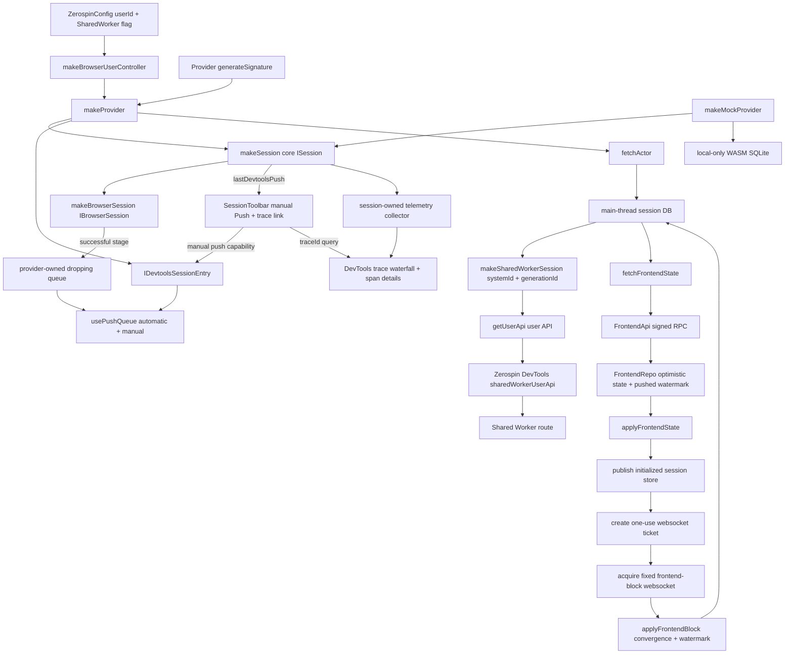
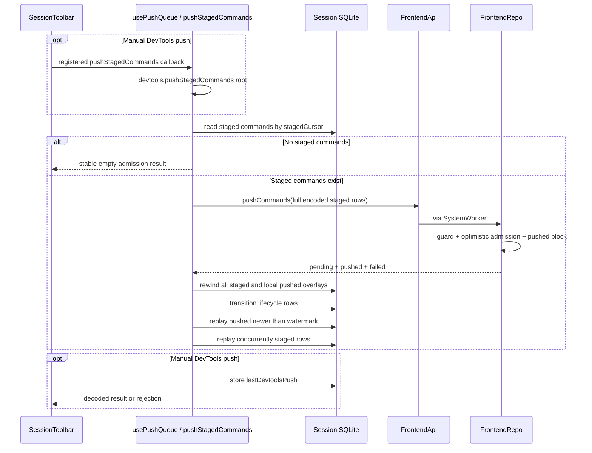

# bootstrapBrowserSession

## What this does

`ZerospinConfig` requires a browser `userId`, accepts an optional `isSharedWorkerEnabled` flag that defaults to `false`, constructs one `IBrowserUserController` carrying both values, and provides that controller to production React sessions through context (../../packages/react/src/ZerospinConfig.tsx:8-24, ../../packages/react/src/makeBrowserUserController.ts:5-95). `makeProvider` captures the controller flag and the `generateSignature` prop once, stores the exact signature factory on the core `ISession`, wraps that session as an `IBrowserSession`, and bootstraps it without adding a SharedWorker staging mirror path (../../packages/react/src/makeProvider.tsx:79-177, ../../packages/core/src/session/makeSession.ts:51-68, ../../packages/core/src/session/makeSession.ts:272-290, ../../packages/react/src/makeBrowserSession.ts:7-31).

`bootstrapBrowserSession` builds the session schema, fetches the actor plus pinned `deployId`/`generationId` and authored `systemVersion` before opening the main-thread WASM DB, and uses `generationId` for every browser persistence boundary. When SharedWorker mode is enabled it opens the root with `{ systemId, generationId }`, stores only the user-scoped `UserApi`, fetches `IFrontendState`, applies that state into the main-thread session DB, and publishes initialized state with `generationId` and `systemVersion`. It then authenticates again to mint a one-use frontend WebSocket ticket, opens the fixed two-parameter route, and does not finish until the browser emits `open`. `@zerospin/frontend` owns actor/state fetch, push, actor-query, and ticket programs, and every path that constructs a remote RPC target obtains its signature from the supplied session first (../../packages/frontend/src/fetchActor.ts:21-61, ../../packages/frontend/src/fetchFrontendState.ts:19-53, ../../packages/frontend/src/executeActorQuery.ts:17-82, ../../packages/frontend/src/pushStagedCommands.ts:44-105, ../../packages/frontend/src/createFrontendWebSocketTicket.ts:16-47, ../../packages/react/src/bootstrapBrowserSession.ts:46-204, ../../packages/react/src/acquireFrontendWebSocket.ts:38-181).

`makeMockProvider` is a separate local-only entrypoint. It captures identity and typed resource fixtures once, creates the same core/browser session surfaces with a deliberately failing remote signature factory, migrates and seeds a real in-memory WASM SQLite database through `applyFrontendState`, publishes initialized state, and closes the database on initialization failure, late completion, or unmount. It mounts no `ZerospinConfig`, push queue, bootstrap RPC, websocket, SharedWorker, or DevTools entry (../../packages/react/src/mock.ts:49-285, ../../packages/react/src/mock.react.spec.tsx:140-787).

`IFrontendState.resources` is FrontendRepo's current optimistic snapshot, not an authoritative-only base. Its pushed rows at or below `lastRebasedPushedCursor` are already represented in those resources, so bootstrap inserts the resources and lifecycle rows without replaying pending commands a second time (../../packages/system-worker/src/FrontendRepo/getFrontendState/getFrontendState.ts:47-84, ../../packages/core/src/session/types.ts:89-104, ../../packages/core/src/session/applyFrontendState.ts:60-131).

The main-thread wa-sqlite connection and the SharedWorker IndexedDB connection both enable SQLite foreign-key enforcement immediately after opening and outside transactions. Snapshot replacement disables enforcement only while it destructively drops the prior schema, re-enables it before migration, and then inserts the FrontendRepo snapshot under the new constraints; retained service-deletion rows therefore remain ordinary resource rows carrying `deletedAt` rather than becoming physical deletes (../../packages/core/src/drizzle/makeInMemorySQLite3.ts:20-24, ../../packages/core/src/drizzle/makeWaSqliteDrizzle.ts:29-42, ../../packages/shared-worker/src/drizzle/makeIdbSQLite3.ts:27-43, ../../packages/core/src/session/applyFrontendState.ts:46-80).

## Trigger

1. [`makeProvider`](../../packages/react/src/makeProvider.tsx) creates one core session using the mount-time SharedWorker flag and signature factory, creates its browser-session wrapper plus provider-owned capacity-one dropping push queue, then `useSWRImmutable` runs `bootstrapBrowserSession` and retains its release Effect (../../packages/react/src/makeProvider.tsx:96-181).
2. Once bootstrap publishes initialized state, `makeProvider` enables `usePushQueue` with the provider queue and registers the returned manual callback beside the core session in DevTools; the browser websocket is already scoped to the same account/actor/frontend identity (../../packages/react/src/makeProvider.tsx:183-244, ../../packages/react/src/bootstrapBrowserSession.ts:148-171).
3. [`makeMockProvider`](../../packages/react/src/mock.ts) instead opens and seeds one local database through `useSWRImmutable`, publishes the supplied identities, and exposes the existing React session context only after initialization succeeds (../../packages/react/src/mock.ts:49-285, ../../packages/react/src/mock.react.spec.tsx:140-254).

## Annotated flow

1. [`ZerospinConfig`](../../packages/react/src/ZerospinConfig.tsx) requires `userId`, defaults optional `isSharedWorkerEnabled` to `false`, creates `makeBrowserUserController(userId, isSharedWorkerEnabled)` synchronously, and provides the controller to child providers (../../packages/react/src/ZerospinConfig.tsx:8-24).
2. [`makeProvider`](../../packages/react/src/makeProvider.tsx) requires that controller context before creating a provider session; it captures the controller's `isSharedWorkerEnabled` and supplied signature factory for the Provider mount, creates a capacity-one dropping queue, passes the exact factory into `makeSession`, and gives `makeBrowserSession` an inline successful-staging wake callback (../../packages/react/src/makeProvider.tsx:79-144, ../../packages/core/src/session/makeSession.ts:51-68, ../../packages/react/src/makeBrowserSession.ts:7-31).
3. [`bootstrapBrowserSession`](../../packages/react/src/bootstrapBrowserSession.ts) builds frontend models from `session.frontend`, merges `sessionRepoTables`, and calls [`fetchActor`](../../packages/frontend/src/fetchActor.ts) with that session before opening the migrated in-memory WASM SQLite DB on the main thread; bootstrap receives no separate signature factory or signature service (../../packages/react/src/bootstrapBrowserSession.ts:66-83, ../../packages/frontend/src/fetchActor.ts:21-61).
4. `fetchActor` obtains `session.generateSignature()`, opens `newSyncRpcSession<ZerospinApis>`, resolves the bound FrontendApi, and uses `makeTraceableApiTarget` so a domain Left becomes the existing `IAnyError` and a promise rejection becomes `async-failed`; it makes one attempt (../../packages/frontend/src/fetchActor.ts:40-60). [`makeProvider`](../../packages/react/src/makeProvider.tsx) configures `useSWRImmutable` with `shouldRetryOnError: false` and maps terminal deploy/auth/transport failures to user-facing hints (../../packages/react/src/makeProvider.tsx:148-181, ../../packages/react/src/makeProvider.tsx:246-271).
5. `fetchActor` returns `{ actor, deployId, generationId, systemId, systemVersion, systemWorkerName, systemEnvironmentId }` from a FrontendApi capability already pinned to the active hosted deploy. Bootstrap retains the generation and authored version, then calls `makeSharedWorkerSession({ systemId, generationId })` when the session enables SharedWorker mode. The client puts both identities and the WASM URL into the worker URL; the host rejects a missing value, keys its user store by `systemId/generationId/userId`, and derives the IndexedDB VFS name as `zerospin/{systemId}/{generationId}/users/{userId}`. Disabled mode skips this boundary and leaves `sharedWorkerSession` null (../../packages/frontend/src/fetchActor.ts:21-61, ../../packages/react/src/bootstrapBrowserSession.ts:76-90, ../../packages/shared-worker/src/makeSharedWorkerSession.ts:8-119, ../../packages/shared-worker/src/SharedWorker/makeSharedWorkerHost.ts:39-60, ../../packages/shared-worker/src/SharedWorker/makeSharedWorkerHost.ts:133-185, ../../packages/shared-worker/src/SharedWorker/makeVfsName.ts:1-11).
6. The SharedWorker client API is root-scoped: bootstrap calls `api.getUserApi({ userId })` and stores the returned user-scoped API in `browserUserController.store.sharedWorkerUserApi` and `zerospinDevtoolsStore`; downstream React code does not receive root SharedWorker methods. The Shared Worker route reads that DevTools value and renders disabled for `null` or enabled for a connected handle (../../packages/react/src/bootstrapBrowserSession.ts:94-113, ../../packages/react/src/makeBrowserUserController.ts:5-38, ../../packages/shared-worker/src/makeSharedWorkerSession.ts:12-27, ../../packages/devtools/src/zerospinDevtoolsStore.ts:6-42, ../../packages/devtools/src/sharedWorker/SharedWorkerRoute.tsx:5-18).
7. Bootstrap always fetches `IFrontendState` through the linked-envelope [`fetchFrontendState`](../../packages/frontend/src/fetchFrontendState.ts) program, replaces the main-thread DB from its resource and command-lifecycle snapshots with `applyFrontendState`, and copies the resolved actor/account/system worker values, `generationId`, authored `systemVersion`, frontend index, and pushed rebase watermark into the initialized session store (../../packages/react/src/bootstrapBrowserSession.ts:120-164, ../../packages/frontend/src/fetchFrontendState.ts:30-52, ../../packages/core/src/session/applyFrontendState.ts:26-131).
8. After publishing initialized state, bootstrap passes only `session` into `acquireFrontendWebSocket`. Acquisition mints a fresh ticket, constructs `/ws-frontend-blocks?publishableKey=...&ticket=...`, and waits for `open`; `error` or `close` before open fails bootstrap. `releaseBrowserSession` closes that websocket scope, clears the user-scoped SharedWorker handle from the browser and DevTools stores, and releases the SharedWorker root session (../../packages/react/src/bootstrapBrowserSession.ts:148-204, ../../packages/frontend/src/createFrontendWebSocketTicket.ts:25-46, ../../packages/react/src/acquireFrontendWebSocket.ts:38-191).

## Browser session staging

1. Core [`makeSession`](../../packages/core/src/session/makeSession.ts) requires `generateSignature`, accepts optional `isPushPaused`, `isSharedWorkerEnabled`, and `runtime` inputs (`ManagedRuntime` or captured `Runtime.Runtime`), exposes a one-shot `session.onInitialized` readiness callback, and runs `stageCommandEffect` under the session telemetry layer. The core staging transaction returns the encoded result without owning a push queue, installing an imperative push method, or emitting a browser wake (../../packages/core/src/session/makeSession.ts:47-161, ../../packages/core/src/session/makeSession.ts:163-290, ../../packages/core/src/session/types.ts:170-198).
2. The rollback metadata is session-local: `sessionRepoTables` adds `optimisticAppliedMutations`, and `sessionCommandShape` stores one JSON array of encoded applied mutations per command id. Pushed session rows preserve the full frontend/staged provenance plus pushed cursor/time so response and block rebases can order them against the server watermark (../../packages/core/src/session/sessionRepoTables.ts:35-58, ../../packages/core/src/session/sessionCommandShape.ts:1-149).
3. [`makeBrowserSession`](../../packages/react/src/makeBrowserSession.ts) wraps the core `ISession`, awaits core `stageCommand`, invokes its optional `onCommandStaged` callback only for an encoded `Right`, and returns the unchanged result. The production provider supplies a queue offer while mounted; the mock provider omits the callback, so real local optimistic staging remains available without push infrastructure (../../packages/react/src/makeBrowserSession.ts:7-31, ../../packages/react/src/makeProvider.tsx:132-144, ../../packages/react/src/mock.ts:107-114).

## Browser session push

1. [`makeProvider`](../../packages/react/src/makeProvider.tsx) owns one capacity-one dropping Effect queue. Successful browser staging and online resume fork offers into that queue; dropping capacity coalesces repeated wakes while paused or offline instead of parking producer fibers. Provider teardown interrupts the consumer and defers terminal queue shutdown past React's StrictMode effect-replay window, while an immediate replay keeps the queue open (../../packages/react/src/makeProvider.tsx:108-144, ../../packages/react/src/makeProvider.tsx:195-231, ../../packages/react/src/usePushQueue.ts:74-126, ../../packages/react/src/makeReactFrontend.react.spec.tsx:281-318).
2. [`usePushQueue`](../../packages/react/src/usePushQueue.ts) receives that raw queue, gates automatic consumption by initialization, `isPushPaused`, and browser online state, and calls the named frontend `pushStagedCommands({ session })` Effect under the session telemetry layer. It neither reads nor writes a queue or push method on `ISession` (../../packages/react/src/usePushQueue.ts:14-126, ../../packages/core/src/session/types.ts:170-198).
3. `usePushQueue` also returns one stable Promise callback for explicit DevTools pushes. A pre-initialization call throws `session-store-not-initialized` synchronously; a valid call runs under `devtools.pushStagedCommands`, captures the current trace id, writes `{ traceId, completedAt, status }` on either Effect exit, and preserves the decoded result or rejection. Automatic queue drains never update that pointer, and manual push remains callable while automatic pushing is paused (../../packages/react/src/usePushQueue.ts:25-71, ../../packages/react/src/usePushQueue.react.spec.tsx:268-529).
4. [`pushStagedCommands`](../../packages/frontend/src/pushStagedCommands.ts) reads staged rows in staged-cursor order. With no rows it returns stable empty admission partitions without signing or opening an RPC session; otherwise it sends the full encoded shapes through one linked `FrontendApi.pushCommands` call and returns the exact decoded response only after the local rebase commits (../../packages/frontend/src/pushStagedCommands.ts:63-105, ../../packages/frontend/src/pushStagedCommands.ts:106-450, ../../packages/frontend/src/pushStagedCommands.node.spec.ts:141-259).
5. In one local transaction, the response path rewinds every staged overlay and each locally overlaid pushed command newer than the session's prior watermark, removes their optimistic metadata, transitions recovered pending/new successes to `pushedCommands`, and records rejected staged rows as local failures (../../packages/frontend/src/pushStagedCommands.ts:106-258).
6. The response path then replays pushed commands newer than the unchanged local watermark in pushed order and commands staged while the RPC was in flight in staged order. Each command runs in a savepoint; a replay failure removes that lifecycle row and records a local failed command without rolling back successful siblings (../../packages/frontend/src/pushStagedCommands.ts:260-441).

### DevTools boundary

Each session state owns one stable telemetry collector, an ordered non-deduplicating batch, and nullable `lastDevtoolsPush` state. The production provider registers an `IDevtoolsSessionEntry` containing the plain core session and the manual callback returned by `usePushQueue`; the DevTools store keys that entry by `entry.session.sessionId` while session data hooks unwrap and return only `entry.session` (../../packages/core/src/session/makeSession.ts:70-137, ../../packages/core/src/session/types.ts:73-160, ../../packages/react/src/makeProvider.tsx:233-244, ../../packages/devtools/src/types.ts:57-75, ../../packages/devtools/src/zerospinDevtoolsStore.ts:9-42, ../../packages/devtools/src/sessions/sessions/sessionId/useSession.ts:7-24).

`SessionToolbar` selects the entry for the route session id and invokes its narrow push capability. It still owns the visible Pause push, single-flight Push, and timestamped success/failure trace link; the returned React callback updates that pointer, while automatic queue pushes never do. The Commands sidebar retains its staged count without a push glyph (../../packages/react/src/usePushQueue.ts:25-71, ../../packages/devtools/src/sessions/sessions/sessionId/SessionToolbar.tsx:47-130, ../../packages/devtools/src/sessions/sessions/sessionId/commands/SessionsCommandsLayout.tsx:24-80, ../../packages/devtools/src/sessions/sessions/sessionId/SessionToolbar.react.spec.tsx:28-179).

Browser-owned `Effect.fn` procedures opt into `annotateFunctionSpan`, which snapshots the original argument tuple before execution and a successful result before the span closes. The snapshot traversal masks sensitive keys and `Redacted` values, avoids getters, converts non-JSON values to markers, and bounds depth, collection size, string size, and total visited values; shared core/database and Worker procedures do not opt in (../../packages/logger/src/annotateFunctionSpan.ts:3-248, ../../packages/react/src/bootstrapBrowserSession.ts:37-207, ../../packages/react/src/acquireFrontendWebSocket.ts:17-194, ../../packages/frontend/src/fetchActor.ts:14-61, ../../packages/frontend/src/fetchFrontendState.ts:12-53, ../../packages/frontend/src/executeActorQuery.ts:10-82, ../../packages/frontend/src/pushStagedCommands.ts:36-450, ../../packages/shared-worker/src/makeSharedWorkerSession.ts:1-126).

`ZerospinDevtools` registers a direct `logs` child route and the session pane exposes Logs beside Commands and Database. The route groups local spans/logs and returned links by browser trace, selects a valid `traceId` query or falls back to the newest trace when absent/stale, and updates the query on trace-row selection. For the selected trace it computes one timing range, renders the span hierarchy as proportional status-colored waterfall bars, preserves a still-present span selection, and shows span identity, timing, attributes, attached logs, and server links in a fixed details pane. Clear affects only the selected session and atomically clears its telemetry and push pointer before removing the trace query; the route and shopping integration tests cover query selection, manual Push linking, and clear behavior (../../packages/devtools/src/ZerospinDevtools.tsx:31-37, ../../packages/devtools/src/ZerospinDevtools.tsx:328-338, ../../packages/devtools/src/sessions/sessions/sessionId/SessionPane.tsx:76-124, ../../packages/devtools/src/sessions/sessions/sessionId/logs/SessionsLogsRoute.tsx:18-283, ../../packages/devtools/src/sessions/sessions/sessionId/logs/SessionsLogsRoute.tsx:371-760, ../../packages/devtools/src/sessions/sessions/sessionId/logs/SessionsLogsSpanNode.tsx:3-125, ../../packages/devtools/src/sessions/sessions/sessionId/logs/SessionsLogsRoute.react.spec.tsx:150-531, ../../examples/shopping/tests/unit/frontendSessionLogs.spec.tsx:170-340).

## Local mock provider

1. [`makeMockProvider`](../../packages/react/src/mock.ts) accepts only the supplied React frontend's controller, context, and session runtime. Its returned component requires `userId`, `accountId`, `actorId`, `generationId`, `systemVersion`, and `systemWorkerName`, plus an optional partial fixture map whose keys and complete decoded rows are inferred from the frontend models (../../packages/react/src/mock.ts:49-70).
2. The mock creates a normal core session with SharedWorker support disabled and a signature factory that fails with `mock-session-remote-api-unsupported`, then wraps it through `makeBrowserSession` without `onCommandStaged`. Consequently `useSession`, ID generation, initialized-state reads, live queries, and real optimistic `stageCommand` work, while remote actor APIs fail before constructing an RPC session and no automatic or manual push boundary exists (../../packages/react/src/mock.ts:80-114, ../../packages/react/src/useApi.ts:16-71, ../../packages/frontend/src/executeActorQuery.ts:40-53, ../../packages/react/src/mock.react.spec.tsx:140-254, ../../packages/react/src/mock.react.spec.tsx:359-463, ../../packages/react/src/mock.react.spec.tsx:629-687).
3. One `useSWRImmutable` initialization derives the frontend models, combines them with `sessionRepoTables`, opens a non-migrated in-memory WASM SQLite database, DB-encodes each supplied model array with Date-preserving metadata plus the model's attributes schema, and calls `applyFrontendState` with empty command lifecycle arrays. Missing fixture keys and an omitted fixture map therefore leave migrated empty tables (../../packages/react/src/mock.ts:116-204, ../../packages/core/src/session/applyFrontendState.ts:26-131, ../../packages/react/src/mock.react.spec.tsx:140-357).
4. After successful seeding, the mock publishes the captured identities, real DB/schema/models, null frontend watermarks and VFS name, and `isInitialized: true`; rerenders cannot reseed because initialization props are retained in a ref and the browser session is the immutable SWR key. A new React key remounts the component and creates a fresh session/database (../../packages/react/src/mock.ts:71-72, ../../packages/react/src/mock.ts:118-246, ../../packages/react/src/mock.react.spec.tsx:465-627).
5. The close Effect is created immediately after the database opens. Initialization failure runs it before surfacing the error; completion after unmount runs it without publishing state; normal unmount schedules it in a microtask after child live-query cleanup. Each lifecycle path clears or bypasses the release ref so the SQLite handle closes once (../../packages/react/src/mock.ts:137-144, ../../packages/react/src/mock.ts:212-268, ../../packages/react/src/mock.react.spec.tsx:140-254, ../../packages/react/src/mock.react.spec.tsx:689-786).

## Frontend reads and live blocks

1. Browser bootstrap reads frontend state through `FrontendApi.getFrontendState` after SharedWorker setup (or after skipping it when `isSharedWorkerEnabled` is false). `applyFrontendState` recreates the main-thread database from FrontendRepo's current optimistic resources and inserts its pending lifecycle rows without replaying commands already included at `lastRebasedPushedCursor` (../../packages/react/src/bootstrapBrowserSession.ts:86-164, ../../packages/core/src/session/applyFrontendState.ts:26-131).
2. Each live message runs in its own root `acquireFrontendWebSocket.frontendBlock` span. After decoding with the core [`FrontendBlockSchema`](../../packages/core/src/session/FrontendBlockSchema.ts), the span records the `frontendIndex`; duplicate or older blocks finish successfully with `outcome: stale`, while a newer block applies with the prior session watermark, advances both `frontendIndex` and `lastRebasedPushedCursor`, and records `outcome: applied`. Decode or apply failure ends that root span as an error and still escapes the callback without advancing the store watermarks (../../packages/react/src/acquireFrontendWebSocket.ts:73-117, ../../packages/core/src/session/FrontendBlockSchema.ts:17-35).
3. [`applyFrontendBlock`](../../packages/core/src/session/applyFrontendBlock.ts) rewinds staged overlays and only locally overlaid pushed mutations newer than the prior watermark, applies the convergence rows/deletes, reconciles the complete pending snapshot and terminal outcomes through the block watermark, then replays newer pushed commands before staged commands (../../packages/core/src/session/applyFrontendBlock.ts:50-238, ../../packages/core/src/session/applyFrontendBlock.ts:240-480).
4. A staged replay failure becomes a local failed command. A pushed replay failure also remains locally failed; a later authoritative execution is ignored for that id, while a later authoritative failure replaces the local failure details (../../packages/core/src/session/applyFrontendBlock.ts:240-299, ../../packages/core/src/session/applyFrontendBlock.ts:301-480).
5. The browser release path closes the FrontendBlockRepo websocket scope through `releaseBrowserSession` (../../packages/react/src/acquireFrontendWebSocket.ts:183-191, ../../packages/react/src/bootstrapBrowserSession.ts:178-204).
