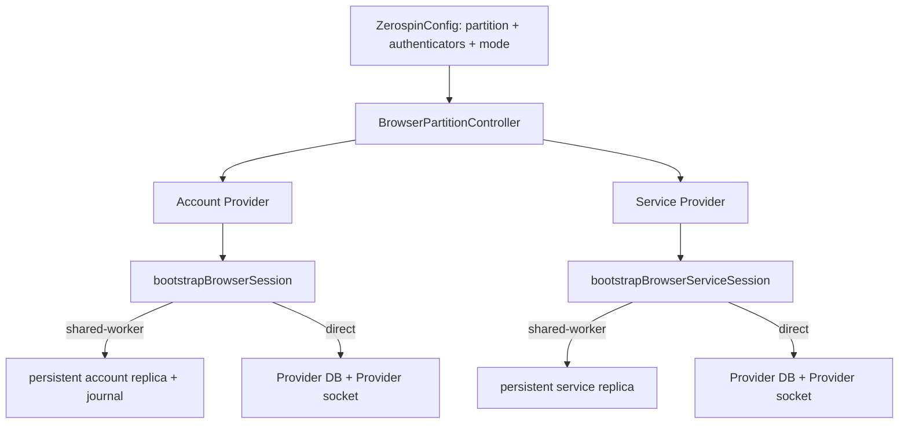
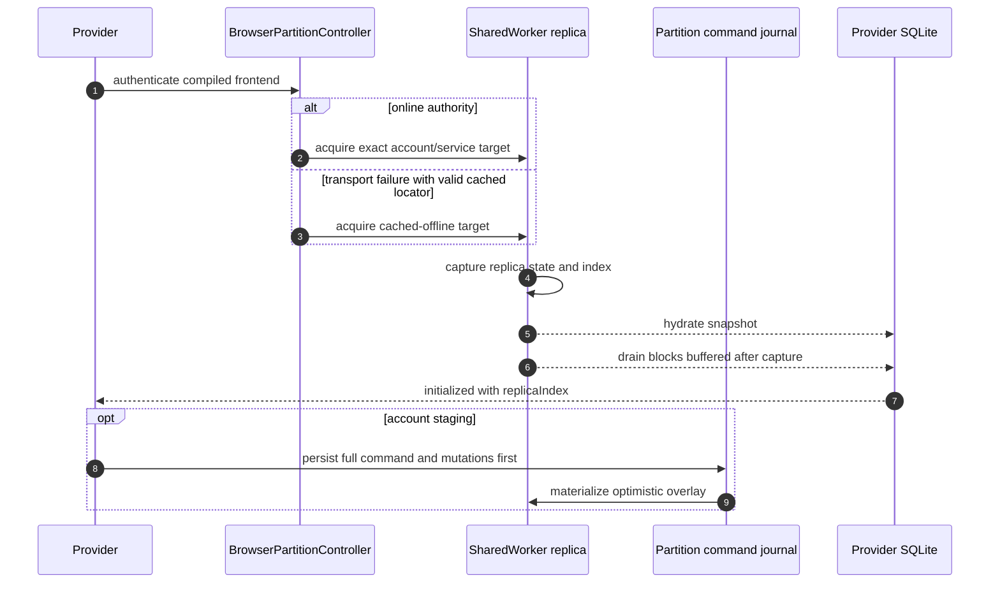

# bootstrapBrowserSession

Browser startup is Config-owned and target-specific. `ZerospinConfig` owns the
partition key, execution mode, and current authenticator registry; account and
service Providers consume that controller but do not own signature generation.
Registry keys must equal each registered frontend's authored `frontendName`
(../../packages/react/src/ZerospinConfig.tsx:93-143).

Account code that needs identity before mounting Config or a Provider uses the
public `makeReactFrontend(...).authenticate(signature)` Promise. It runs the
standalone frontend `authenticate` Effect through the frontend's managed runtime;
that Effect uses the ordinary `fetchFrontend` admission, returns only
actor/deploy/generation/system identity, and releases the admitted capability in
the same operation. It creates no browser session, replica, journal, or retained
RPC target
(../../packages/react/src/makeReactFrontend.ts:63-121,
../../packages/frontend/src/authenticate.ts:19-54).

The two bootstrap Effects remain separate. `bootstrapBrowserSession` creates a
writable account session with command-journal support, while
`bootstrapBrowserServiceSession` creates a read-only service session. Both
validate the authenticated identity and deterministic frontend-spec hash before
installing any network state
(../../packages/react/src/bootstrapBrowserSession.ts:75-170,
../../packages/react/src/bootstrapBrowserSession.ts:1141-1173,
../../packages/react/src/bootstrapBrowserServiceSession.ts:36-121,
../../packages/react/src/bootstrapBrowserServiceSession.ts:888-920).

## Trigger

1. `ZerospinConfig` creates one `BrowserPartitionController` for the exact
   `partitionKey` and `isSharedWorkerEnabled` pair and supplies live
   authenticator lookup through a ref. Unmount releases the controller after
   React's effect-replay microtask window
   (../../packages/react/src/ZerospinConfig.tsx:127-143,
   ../../packages/react/src/ZerospinConfig.tsx:237-260).
2. An account or service Provider creates its own in-memory main-thread SQLite
   database and invokes the matching bootstrap Effect. Separate Providers may
   share one worker replica while retaining separate main-thread databases
   (../../packages/react/src/bootstrapBrowserSession.ts:169-191,
   ../../packages/react/src/bootstrapBrowserServiceSession.ts:116-140).
3. Bootstrap authenticates through the Config registry first. A successful
   admission is authoritative; a domain authentication or signature-schema
   failure invalidates matching cached locators and does not fall back to
   cached identity
   (../../packages/react/src/bootstrapBrowserSession.ts:95-149,
   ../../packages/react/src/bootstrapBrowserServiceSession.ts:58-112).

## Lazy DevTools trigger

1. [`ZerospinConfig`](../../packages/react/src/ZerospinConfig.tsx) registers its
   lazy shell loader and installs only
   `window.zerospin.devtools.open()` for its mounted lifetime
   (../../packages/react/src/ZerospinConfig.tsx:190-235).
2. A console caller invokes `open()`. If a DevTools shell is already mounted,
   the controller opens that shell directly; otherwise it asks Config to load
   and commit the shell first
   (../../packages/devtools/src/zerospinDevtoolsController.ts:64-106).

## Annotated DevTools steps

1. The controller returns the same in-flight Promise to concurrent callers and
   rejects when no Config loader is registered
   (../../packages/devtools/src/zerospinDevtoolsController.ts:64-80).
2. Config dynamically imports `ZerospinDevtools` only after that request and
   resolves the load only after the rendered subtree confirms its mount. Import
   or mount failure clears the loaded component so a later `open()` may retry
   (../../packages/react/src/ZerospinConfig.tsx:145-188,
   ../../packages/react/src/ZerospinConfig.tsx:262-278).
3. Config unmount unregisters only its loader, rejects unfinished load/mount
   work, and restores the exact previous `window.zerospin.devtools` value when
   its own property is still installed
   (../../packages/react/src/ZerospinConfig.tsx:190-235,
   ../../packages/devtools/src/zerospinDevtoolsController.ts:13-51).

## SharedWorker mode

SharedWorker mode is persistent and online-first. Only a transport failure may
select a validated, unexpired cached locator, and only when the cached
controller identity, version, and spec hash match the code currently mounted.
The cached replica is then readable with `authority: cached-offline`; a later
healthy Config capability can upgrade that acquisition to online without
replacing the Provider database object
(../../packages/react/src/bootstrapBrowserSession.ts:115-175,
../../packages/react/src/bootstrapBrowserSession.ts:176-1136,
../../packages/react/src/bootstrapBrowserServiceSession.ts:78-145,
../../packages/react/src/bootstrapBrowserServiceSession.ts:145-890,
../../packages/react/src/makeBrowserPartitionController.ts:1797-1874,
../../packages/react/src/makeBrowserPartitionController.ts:2220-3642,
../../packages/react/src/makeBrowserPartitionController.ts:4198-5125).

Each active account or service acquisition installs a serialized browser
`online` listener. Another classified transport failure leaves its readable
replica and locator intact. Exact same-generation reauthentication either
upgrades cached authority or confirms the existing online acquisition. A
different authenticated generation starts a separate active target acquisition
with fresh state, ticket, and account-push callbacks; the partition controller
transfers the mounted sessions only after the target handoff succeeds and keeps
the source intact when it fails. A same-principal version or compiled-spec
change reports `update-required`. Signature-schema, other authority, or
identity failures invalidate matching locators and revoke only the matching
account or service entries
(../../packages/react/src/bootstrapBrowserSession.ts:183-1136,
../../packages/react/src/bootstrapBrowserSession.ts:1627-2206,
../../packages/react/src/bootstrapBrowserServiceSession.ts:140-890,
../../packages/react/src/bootstrapBrowserServiceSession.ts:1215-1633,
../../packages/react/src/makeBrowserPartitionController.ts:2220-2924,
../../packages/react/src/makeBrowserPartitionController.ts:4198-4892).

Authentication, authorization, or signature-schema rejection and an
independently resolved target change remove every matching active and
commissioned locator across frontend versions, detach matching main-thread
sessions, and preserve the persistent replica and journal bytes. Ordinary
state, ticket, push, transport, and repair failures do not revoke that
authority. Provider rejection returns before the
controller schedules the worker acquisition release, avoiding a callback that
waits on the same worker that is waiting for the rejection
(../../packages/react/src/makeBrowserPartitionController.ts:949-1227,
../../packages/react/src/makeBrowserPartitionController.ts:1403-1586,
../../packages/react/src/makeBrowserPartitionController.ts:2014-2218).

Authenticated online handoff discovery retains structurally valid source
locators even after their TTL expires; expiry gates cached-offline admission,
not discovery after fresh authentication. Malformed TTL pairs are still deleted
before either account or service source discovery proceeds
(../../packages/react/src/makeBrowserPartitionController.ts:1797-2009,
../../packages/react/src/makeBrowserPartitionController.ts:2220-2502,
../../packages/react/src/makeBrowserPartitionController.ts:4198-4418).

The controller obtains a root SharedWorker session keyed by system,
generation, API URL, and public key, then asks its partition target for a
separate account or service replica. The account provider surface includes
state, ticket, and full-command push methods; the service provider surface has
only state and ticket methods
(../../packages/react/src/makeBrowserPartitionController.ts:340-448,
../../packages/shared-worker/src/makeSharedWorkerSession.ts:33-155,
../../packages/shared-worker/src/makeSharedWorkerSession.ts:292-396).

Those provider methods are stable operation callbacks, not retained admitted
frontend APIs. Every state, ticket, and account-push operation generates a fresh
signature, obtains a new actor-bound capability, validates its complete
identity, version, spec, and generation as required by that operation, performs
one leaf call, and releases the capability. Initial online admission is also
released before the SharedWorker acquisition begins
(../../packages/react/src/bootstrapBrowserSession.ts:1148-1175,
../../packages/react/src/bootstrapBrowserSession.ts:1231-1625,
../../packages/react/src/bootstrapBrowserServiceSession.ts:895-922,
../../packages/react/src/bootstrapBrowserServiceSession.ts:961-1213).

Hydration is a barrier. The worker captures one replica snapshot, buffers blocks
committed after that capture, and does not expose the acquisition until the
Provider has installed the snapshot and the buffered suffix in order. Every
worker-visible commit increments `replicaIndex` once after durable transaction
success; each main-thread session rejects gaps and schedules isolated repair
instead of mutating from an uncertain base
(../../packages/shared-worker/src/SharedWorker/makeSharedWorkerHost.ts:1758-1883,
../../packages/shared-worker/src/SharedWorker/makeSharedWorkerHost.ts:4568-4712,
../../packages/react/src/bootstrapBrowserSession.ts:785-1136,
../../packages/react/src/bootstrapBrowserSession.ts:2227-2521,
../../packages/react/src/bootstrapBrowserServiceSession.ts:650-890,
../../packages/react/src/bootstrapBrowserServiceSession.ts:1654-1926).

## Ongoing authority and version changes

Each replica provider remains bound to the generation and frontend identity
that admitted it, while every SharedWorker network operation independently
reauthenticates instead of retaining that admitted API capability. State and
account push do not silently retarget that provider. A generation change starts
a separately bound target acquisition, and the partition controller moves the
session only after lineage and target activation succeed. An authoritative
frontend-version change instead propagates `frontend-version-changed` to every
mounted source session as `update-required`. A ticket may still identify the
recorded successor or a newer frontend version in the same generation because
archive continuity is resolved separately from state and write authority
(../../packages/react/src/makeBrowserPartitionController.ts:949-1227,
../../packages/react/src/makeBrowserPartitionController.ts:1403-1586,
../../packages/react/src/bootstrapBrowserSession.ts:1627-2206,
../../packages/react/src/bootstrapBrowserServiceSession.ts:1215-1633).

For a same-generation version change, both old replicas stay readable and keep
consuming their immutable archive while the mounted session reports
`update-required`. The service session remains read-only. The account worker
marks its catalog `writeSuspended`, makes staged, pushing, and
transport-uncertain journal rows dormant, stops new push, and retains the source
database and journal for later commissioning or migration to matching code
(../../packages/shared-worker/src/SharedWorker/makeSharedWorkerHost.ts:1992-2060,
../../packages/shared-worker/src/SharedWorker/makeSharedWorkerHost.ts:2198-2305,
../../packages/shared-worker/src/SharedWorker/makeSharedWorkerHost.ts:3170-3369,
../../packages/shared-worker/src/SharedWorker/makeSharedWorkerHost.ts:4739-4772,
../../packages/shared-worker/src/SharedWorker/makeSharedWorkerHost.ts:4908-4934).

## Partition journal and repair

The partition database keeps distinct account and service replica catalogs and
a partition-owned account command journal. Journal rows retain source/adapted
provenance, full encoded command bytes, encoded mutations and inverses,
lifecycle, push uncertainty, source locator, and materialization receipt; the
journal is not stored inside one replaceable replica database
(../../packages/shared-worker/src/SharedWorker/partitionSchemas.ts:212-338,
../../packages/shared-worker/src/SharedWorker/partitionSchemas.ts:340-433).

Account staging commits journal intent before optimistic materialization. Push
selects ordered pushable journal rows, sends the full command objects through an
online provider, and records pending, pushed, failed, or transport-uncertain
outcomes without discarding original command identity. Service replicas have no
stage or push branch
(../../packages/shared-worker/src/SharedWorker/makeSharedWorkerHost.ts:3170-3869,
../../packages/shared-worker/src/SharedWorker/makeSharedWorkerHost.ts:3871-4096,
../../packages/shared-worker/src/makeSharedWorkerSession.ts:33-98).

A logical block gap, wrong target, conflicting equal index, invalid block, or
application failure enters repair. Account repair replaces authoritative state
and rematerializes only healthy journal overlays; service repair replaces state
directly. If physical account materialization is corrupt, the worker verifies
the separate journal and swaps to a rebuilt database only after success. A
corrupt journal or quarantined legacy database is preserved and fails closed
(../../packages/shared-worker/src/SharedWorker/makeSharedWorkerHost.ts:825-1345,
../../packages/shared-worker/src/SharedWorker/makeSharedWorkerHost.ts:1347-1756,
../../packages/shared-worker/src/SharedWorker/makeSharedWorkerHost.ts:4210-4568,
../../packages/shared-worker/src/SharedWorker/makeSharedWorkerHost.ts:5523-7568).

## Direct mode

Direct mode has no persistent catalog, cached-offline startup, cross-tab socket,
commissioning, or refresh-durable command journal. It authenticates online,
fetches full state, commits that state into the Provider's database, and owns
its WebSocket and account push behavior on the main thread
(../../packages/react/src/bootstrapBrowserSession.ts:2524-3430,
../../packages/react/src/bootstrapBrowserServiceSession.ts:1929-2448).

Direct account and service sockets still send an in-band resume watermark,
apply exact suffixes, repair from bound full state on `state-required`, mint a
fresh one-use ticket for every reconnect, and cap exponential reconnect delay at
30 seconds. A generation transition authenticates and validates the target
before replacing the same Provider database; incompatible mounted code retains
the readable source and reports `update-required`. A same-generation version
change likewise keeps applying archive blocks to the old readable replica; the
account session no longer treats that source as writable, and the service
session remains read-only
(../../packages/react/src/acquireFrontendWebSocket.ts:62-127,
../../packages/react/src/acquireFrontendWebSocket.ts:195-839,
../../packages/react/src/acquireServiceFrontendWebSocket.ts:85-154,
../../packages/react/src/acquireServiceFrontendWebSocket.ts:215-859).

Before a matching-code account transition replaces authoritative state, direct
mode reads staged commands oldest-first and validates every current or
historical payload adapter and current mutation program. A missing contract,
adapter, or compatible payload returns `update-required` without touching the
source database or staged intent. After target state commits, one transaction
removes all old optimistic overlays newest-first, reverses each command's
mutations in reverse order, installs adapted commands oldest-first, and applies
each new mutation program in declaration order. Command IDs, staged cursors,
timestamps, and target provenance remain intact, and the session identity
changes only after the adaptation transaction succeeds
(../../packages/react/src/bootstrapBrowserSession.ts:2770-3221).

On ticket or connect transport failure, direct account and service sockets
reauthenticate through the current Config authenticator. An exact target,
frontend version, and compiled spec atomically replaces the API capability and
releases the prior capability. A same-target version change preserves the
readable database as `update-required`; other identity or spec mismatches fail
closed, clear session authority, and close the Provider database. A generation
target is adopted only after exact identity/spec validation and full target
state application; unmatched compiled code preserves the readable source as
`update-required`
(../../packages/react/src/bootstrapBrowserSession.ts:2673-3221,
../../packages/react/src/bootstrapBrowserServiceSession.ts:2064-2255,
../../packages/react/src/acquireFrontendWebSocket.ts:665-830,
../../packages/react/src/acquireServiceFrontendWebSocket.ts:693-852).

## Commissioning and transitions

`useCommissionFrontendReplica` is SharedWorker-only. It authenticates the
candidate, validates its compiled spec, and acquires a separate commissioned
replica. The hook releases that initial admitted API before acquisition and
retains only commission ownership plus account state/ticket/push or service
state/ticket operation callbacks; every later operation reauthenticates through
a one-shot capability. `release()` records the release request without waiting
for an in-flight commission. An already-acquired owner is released immediately;
a later successful account or service acquisition sees the request and releases
that hook instance's commission owner exactly once
(../../packages/react/src/useCommissionFrontendReplica.ts:45-127,
../../packages/react/src/useCommissionFrontendReplica.ts:142-615,
../../packages/react/src/useCommissionFrontendReplica.ts:650-976).

For a commissioned account target with predecessors, the controller serially
records every exact source target in the target catalog through an empty command
import before commission resolves. If that catalog write fails, it removes and
releases the exact commission owner so the failed acquisition cannot strand its
sole SharedWorker registration or network capability
(../../packages/react/src/makeBrowserPartitionController.ts:2765-2890).

Generation transition never repoints a source database. The worker persists the
pending transition, keeps source replicas and journals, and acquires or reuses a
target replica. When matching target code is mounted, dormant source commands
are adapted directly to current code, imported with byte-exact source/adapted
provenance, and only then marked migrated; missing definitions or invalid
lineage preserve every source byte and fail closed
(../../packages/shared-worker/src/SharedWorker/makeSharedWorkerHost.ts:5523-7568,
../../packages/shared-worker/src/SharedWorker/makeSharedWorkerHost.ts:7570-8870).

The worker never trusts a catalog transition by itself. On resume and before
cross-generation journal migration, it rereads the replica state and previous
block, requires the recorded applied index to equal the catalog's logical
index, proves that block is the exact source generation boundary, and verifies
that the remaining descriptors are ordered, acyclic, and reach the recorded
target. An unproven transition fails the source replica without discarding its
database or journal
(../../packages/shared-worker/src/SharedWorker/makeSharedWorkerHost.ts:5982-6130,
../../packages/shared-worker/src/SharedWorker/makeSharedWorkerHost.ts:7275-7419,
../../packages/shared-worker/src/SharedWorker/makeSharedWorkerHost.ts:8527-8729).

## Ownership and release

One worker replica runtime serializes its queue and owns at most one socket.
Multiple Provider and commission registrations are reference-counted; losing
one Provider or commission registration does not tear down a healthy acquisition
owned elsewhere. An authoritative rejection is the deliberate exception: it
revokes every matching registration and locator, returns the provider failure,
and schedules worker release afterward. When the final ordinary owner releases,
reconnect is interrupted and the socket closes, but retained catalog, replica,
archive, and journal bytes are not deleted
(../../packages/shared-worker/src/SharedWorker/makeSharedWorkerHost.ts:313-358,
../../packages/shared-worker/src/SharedWorker/makeSharedWorkerHost.ts:1885-1919,
../../packages/shared-worker/src/SharedWorker/makeSharedWorkerHost.ts:5280-5312,
../../packages/react/src/ZerospinConfig.tsx:237-260,
../../packages/react/src/makeBrowserPartitionController.ts:2014-2218).

Config teardown first fences every local entry and registration and revokes its
account or service transport. It starts each explicit worker acquisition
release before disposing the owning root session; root disposal is also the
crash path that rejects release RPCs left pending on a dead MessagePort. All
release outcomes are settled before the controller clears its entry maps
(../../packages/react/src/makeBrowserPartitionController.ts:5609-5734,
../../packages/shared-worker/src/makeSharedWorkerSession.ts:366-385).

Each SharedWorker MessagePort has an owner token. Port close or `messageerror`
releases only that port's account and service registrations, preserving
registrations owned by other Configs
(../../packages/shared-worker/src/SharedWorker/makeSharedWorkerHost.ts:9093-9198).

See [[FrontendWebSocket]] for the wire handshake and
[[ServiceFrontendProjection]] for the service-owned server projection.
