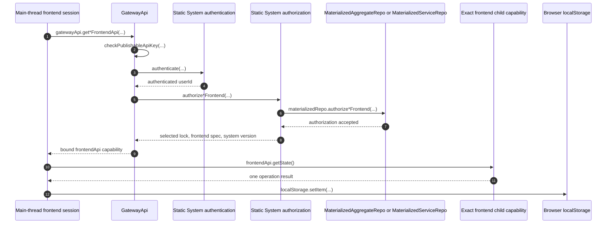

# Main-Thread Exact Frontend Authentication

Every state fetch, WebSocket-ticket request, and aggregate push starts from the
page's current signature callback. The operation opens a fresh synchronous RPC
session, asks GatewayApi for one exact aggregate or service frontend
capability, performs one call, and disposes the RPC session on both success and
failure.

- [`fetchAggregateFrontendState.ts:23-63`](../../../packages/frontend/src/fetchAggregateFrontendState.ts#L23-L63) — authenticates and performs one aggregate state call through a fresh disposable RPC session.
- [`pushAggregateFrontendCommand.ts:31-75`](../../../packages/frontend/src/pushAggregateFrontendCommand.ts#L31-L75) — independently authenticates each aggregate push and closes its RPC session.
- [`createServiceFrontendWebSocketTicket.ts:21-59`](../../../packages/frontend/src/createServiceFrontendWebSocketTicket.ts#L21-L59) — applies the same one-operation boundary to a service socket ticket.

The aggregate child is bound to `{ systemId, aggregateId, aggregateName,
userId, frontendName, aggregateFrontendLock }`; the service child is bound to
`{ systemId, serviceName, userId, frontendName, serviceFrontendLock }`.
`userId` comes from authentication, `systemId` comes from Worker
configuration, and the remaining target fields are caller-supplied and then
authorized.

- [`getAggregateFrontendApi.ts:19-118`](../../../packages/system-worker/src/GatewayApi/getAggregateFrontendApi/getAggregateFrontendApi.ts#L19-L118) — validates, authenticates, authorizes, and constructs the exact aggregate child binding.
- [`getServiceFrontendApi.ts:16-105`](../../../packages/system-worker/src/GatewayApi/getServiceFrontendApi/getServiceFrontendApi.ts#L16-L105) — constructs the exact service child through the equivalent boundary.

## Trigger

1. A main-thread frontend operation generates a current signature and calls
   `gatewayApi.getAggregateFrontendApi(...)` or
   `gatewayApi.getServiceFrontendApi(...)` through a fresh HTTP-batch RPC
   session.
   - [`fetchAggregateFrontendState.ts:40-53`](../../../packages/frontend/src/fetchAggregateFrontendState.ts#L40-L53) — obtains the signature and exact aggregate capability for a state fetch.
   - [`fetchServiceFrontendState.ts:37-49`](../../../packages/frontend/src/fetchServiceFrontendState.ts#L37-L49) — obtains the exact service capability independently.

## Annotated workflow steps

1. The main-thread operation supplies the publishable key, authentication lock,
   fresh signature, and exact authored target.
   - [`createAggregateFrontendWebSocketTicket.ts:39-52`](../../../packages/frontend/src/createAggregateFrontendWebSocketTicket.ts#L39-L52) — supplies the complete aggregate target for a ticket operation.
   - [`createServiceFrontendWebSocketTicket.ts:37-49`](../../../packages/frontend/src/createServiceFrontendWebSocketTicket.ts#L37-L49) — supplies the complete service target.
2. Gateway rejects the request unless its publishable key matches Worker
   configuration.
   - [`getAggregateFrontendApi.ts:76`](../../../packages/system-worker/src/GatewayApi/getAggregateFrontendApi/getAggregateFrontendApi.ts#L76) — checks the aggregate request before authentication.
   - [`getServiceFrontendApi.ts:68`](../../../packages/system-worker/src/GatewayApi/getServiceFrontendApi/getServiceFrontendApi.ts#L68) — applies the same service gate.
3. Gateway invokes authored static authentication with the validated lock and
   caller signature.
   - [`getAggregateFrontendApi.ts:77-80`](../../../packages/system-worker/src/GatewayApi/getAggregateFrontendApi/getAggregateFrontendApi.ts#L77-L80) — invokes aggregate authentication.
   - [`getServiceFrontendApi.ts:69-72`](../../../packages/system-worker/src/GatewayApi/getServiceFrontendApi/getServiceFrontendApi.ts#L69-L72) — invokes service authentication.
4. Authentication supplies `userId`; Gateway validates that result against the
   authored System identity.
   - [`getAggregateFrontendApi.ts:81-85`](../../../packages/system-worker/src/GatewayApi/getAggregateFrontendApi/getAggregateFrontendApi.ts#L81-L85) — validates the returned aggregate authentication identity.
5. Gateway asks static authorization to validate the exact target and frontend
   lock for that user.
   - [`getAggregateFrontendApi.ts:86-102`](../../../packages/system-worker/src/GatewayApi/getAggregateFrontendApi/getAggregateFrontendApi.ts#L86-L102) — authorizes the aggregate target and returned fields.
   - [`getServiceFrontendApi.ts:78-92`](../../../packages/system-worker/src/GatewayApi/getServiceFrontendApi/getServiceFrontendApi.ts#L78-L92) — performs the equivalent service check.
6. Authorization resolves the matching materialized Repo and invokes its exact
   frontend authorizer.
   - [`authorizeAggregateFrontend.ts:62-76`](../../../packages/system-worker/src/authorizeAggregateFrontend/authorizeAggregateFrontend.ts#L62-L76) — resolves `{ systemId, aggregateId, aggregateName }` and invokes the materialized aggregate authorizer.
   - [`authorizeServiceFrontend.ts:50-59`](../../../packages/system-worker/src/authorizeServiceFrontend/authorizeServiceFrontend.ts#L50-L59) — resolves `{ systemId, serviceName }` and invokes the materialized service authorizer.
7. The materialized Repo exposes only the authored target's readable model
   queries to its authorizer.
   - [`authorizeAggregateFrontend.ts:18-57`](../../../packages/system-worker/src/MaterializedAggregateRepo/authorizeAggregateFrontend/authorizeAggregateFrontend.ts#L18-L57) — constructs the aggregate query surface.
   - [`authorizeServiceFrontend.ts:15-47`](../../../packages/system-worker/src/MaterializedServiceRepo/authorizeServiceFrontend/authorizeServiceFrontend.ts#L15-L47) — constructs the service query surface.
8. Static authorization returns the selected lock, frontend spec, and System
   version.
   - [`authorizeAggregateFrontend.ts:77-84`](../../../packages/system-worker/src/authorizeAggregateFrontend/authorizeAggregateFrontend.ts#L77-L84) — returns the exact aggregate authorization result.
   - [`authorizeServiceFrontend.ts:60-65`](../../../packages/system-worker/src/authorizeServiceFrontend/authorizeServiceFrontend.ts#L60-L65) — returns the service result.
9. Gateway binds those accepted fields into the child capability and adds
   configured `systemId`.
   - [`getAggregateFrontendApi.ts:103-113`](../../../packages/system-worker/src/GatewayApi/getAggregateFrontendApi/getAggregateFrontendApi.ts#L103-L113) — constructs AggregateFrontendApi with its exact six-field binding.
   - [`getServiceFrontendApi.ts:93-102`](../../../packages/system-worker/src/GatewayApi/getServiceFrontendApi/getServiceFrontendApi.ts#L93-L102) — constructs ServiceFrontendApi with its exact five-field binding.
10. The fresh child performs exactly one state, ticket, or push operation.
    - [`fetchAggregateFrontendState.ts:54-63`](../../../packages/frontend/src/fetchAggregateFrontendState.ts#L54-L63) — performs the aggregate state call and disposes its RPC session.
    - [`pushAggregateFrontendCommand.ts:66-75`](../../../packages/frontend/src/pushAggregateFrontendCommand.ts#L66-L75) — performs the aggregate push and disposes its RPC session.
11. The child returns that operation's domain result; it is not retained as a
    browser capability owner.
    - [`fetchServiceFrontendState.ts:50-59`](../../../packages/frontend/src/fetchServiceFrontendState.ts#L50-L59) — maps the service result and guarantees session disposal.
12. A successful online state fetch writes the exact authentication locator
    key `{ apiUrl, publishableKey, systemName, authenticationLock }` to
    `{ systemId, userId }`. Offline startup may read this locator only to find
    the exact backup namespace.
    - [`bootstrapAggregateFrontendSession.ts:192-271`](../../../packages/frontend/src/bootstrapAggregateFrontendSession.ts#L192-L271) — writes or validates the aggregate authentication locator.
    - [`bootstrapServiceFrontendSession.ts:130-207`](../../../packages/frontend/src/bootstrapServiceFrontendSession.ts#L130-L207) — applies the same service locator boundary.

## Callers

- [Browser session bootstrap](./bootstrapBrowserSession.md)
- [Frontend WebSocket](./FrontendWebSocket.md)
- [Architecture overview](../../overview.md)
