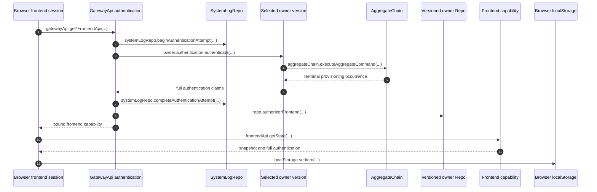

# Owner Authentication and Selection Partitions

Each aggregate or service version owns its signature schema, full authentication schema, selection schema, route pattern, and authentication callback. Each browser operation generates a current signature using that frontend's signer, acquires a disposable Gateway capability, performs its operation, and closes the RPC session. Full claims govern authorization and commands; selected string claims determine shared replica storage.

## Trigger

1. A state fetch, WebSocket-ticket request, or aggregate push invokes its frontend's current `generateSignature` callback.
   - [`makeZerospinApp.tsx`](../../../packages/react/src/makeZerospinApp.tsx) — retains the latest signer callback on each mounted frontend component; identity changes require remounting.
   - [`fetchAggregateFrontendState.ts`](../../../packages/frontend/src/fetchAggregateFrontendState.ts) — acquires an aggregate capability for one state fetch.
   - [`pushAggregateFrontendCommand.ts`](../../../packages/frontend/src/pushAggregateFrontendCommand.ts) — independently authenticates each push.

## Annotated workflow steps

1. The caller supplies a publishable key, fresh signature, owner name/version, frontend name, and frontend lock. Worker configuration supplies `systemId`; aggregate authentication supplies `aggregateId`.
   - [`getAggregateFrontendApi.ts`](../../../packages/system-worker/src/GatewayApi/getAggregateFrontendApi/getAggregateFrontendApi.ts) — validates the request and configured publishable key.
   - [`getServiceFrontendApi.ts`](../../../packages/system-worker/src/GatewayApi/getServiceFrontendApi/getServiceFrontendApi.ts) — performs service admission independently.
2. Authentication persists an unfinished attempt before signature validation or application code executes.
   - [`authenticate.ts`](../../../packages/system-worker/src/authenticate/authenticate.ts) — establishes audit ordering and interruption behavior.
   - [`beginAuthenticationAttempt.ts`](../../../packages/system-worker/src/SystemLogRepo/beginAuthenticationAttempt/beginAuthenticationAttempt.ts) — stores owner kind/name/version, attempt ID, and start time.
3. The selected owner decodes the signature and invokes its own callback. Authentication versions are the owner versions; there is no independent authentication registry or lock.
   - [`AuthenticationSchema.ts`](../../../packages/core/src/authentication/AuthenticationSchema.ts) — validates owner declarations.
   - [`authenticate.ts`](../../../packages/system-worker/src/authenticate/authenticate.ts) — selects the exact authored owner and validates its input/output.
4. Aggregate authenticators may await provisioning commands bound to that exact aggregate version and registered contract. These commands carry `authentication: null` and do not recursively authenticate.
   - [`authenticate.ts`](../../../packages/system-worker/src/authenticate/authenticate.ts) — checks contract ownership and executes trusted commands.
5. Application authentication inspects the terminal command result and owns repeat-safe provisioning. Shopping generates independent User IDs and accepts only its specific duplicate-Clerk-identity failure.
   - [`ShopperV1.ts`](../../../examples/shopping/src/zerospin/aggregates/shopper/ShopperV1.ts) — provisions a User in shared `acct_1`.
   - [`CreateUserV1.ts`](../../../examples/shopping/src/zerospin/aggregates/shopper/contracts/createUser/CreateUserV1.ts) — checks duplicate Clerk identity transactionally.
6. The Worker validates and encodes full authentication, extracts only declared selection fields, validates those strings, and uses `@remix-run/route-pattern` to format and parse a canonical, lossless selection path.
   - [`authenticate.ts`](../../../packages/system-worker/src/authenticate/authenticate.ts) — validates the round trip and hashes canonical full encoded authentication.
7. Successful attempts retain full encoded authentication, its hash, selection, and path. Failed attempts retain sanitized failure details. Signatures and invalid output are never recorded. An audit persistence failure withholds admission; interrupted or unsuccessfully completed attempts remain unfinished. Audit records have no automatic trimming.
   - [`completeAuthenticationAttempt.ts`](../../../packages/system-worker/src/SystemLogRepo/completeAuthenticationAttempt/completeAuthenticationAttempt.ts) — permits one terminal completion of an unfinished attempt.
   - [`systemLogRepoDbConfig.ts`](../../../packages/system-worker/src/SystemLogRepo/systemLogRepoDbConfig.ts) — defines retained attempt storage.
8. Authorization receives full decoded authentication and read-only owner-local model queries. Frontend locks include signature/full-authentication/selection JSON schemas and the pattern source, alongside model and contract definitions.
   - [`authorizeAggregateFrontend.ts`](../../../packages/system-worker/src/VersionedAggregateRepo/authorizeAggregateFrontend/authorizeAggregateFrontend.ts) — decodes claims before aggregate authorization.
   - [`authorizeServiceFrontend.ts`](../../../packages/system-worker/src/VersionedServiceRepo/authorizeServiceFrontend/authorizeServiceFrontend.ts) — decodes claims before service authorization.
   - [`validateAggregateFrontendLock.ts`](../../../packages/system-worker/src/StaticSystem/validateAggregateFrontendLock/validateAggregateFrontendLock.ts) — compares the authentication descriptor against the selected owner.
9. The aggregate capability binds `{ systemId, aggregateId, aggregateName, aggregateVersion, authentication, selectionPath, frontendName, aggregateFrontendLock }`. The service capability binds `{ systemId, serviceName, serviceVersion, authentication, selectionPath, frontendName, serviceFrontendLock }`. Configuration supplies `systemId`; authentication supplies full encoded claims, aggregate ID, and the derived path; admission checks caller-selected owner/frontend fields and locks.
   - [`getAggregateFrontendApi.ts`](../../../packages/system-worker/src/GatewayApi/getAggregateFrontendApi/getAggregateFrontendApi.ts) — constructs the aggregate binding.
   - [`getServiceFrontendApi.ts`](../../../packages/system-worker/src/GatewayApi/getServiceFrontendApi/getServiceFrontendApi.ts) — constructs the service binding.
10. The browser uses the capability for its current operation. Pushes must match both saved full authentication and aggregate ID; rejection never rewrites the occurrence.
    - [`pushCommand.ts`](../../../packages/system-worker/src/AggregateFrontendApi/pushCommand/pushCommand.ts) — compares full authentication before admission.
11. Snapshots contain connection-specific authentication. Shared replica identity contains only the selection path, and command resolutions are filtered by frontend and full authentication.
    - [`getState.ts`](../../../packages/system-worker/src/AggregateFrontendApi/getState/getState.ts) — attaches full claims and filters resolutions at the API boundary.
    - [`getCommands.ts`](../../../packages/system-worker/src/SelectionVersionedAggregateChain/getCommands/getCommands.ts) — filters individual connection delivery while preserving shared cursors.
12. Successful online bootstrap writes a frontend-specific locator containing only `systemId`, full-authentication hash, and aggregate ID where applicable. Locator keys include API URL, publishable key, system/frontend name, owner name/version, and frontend lock key. Offline locators locate backups; they grant no server authority.
    - [`bootstrapAggregateFrontendSession.ts`](../../../packages/frontend/src/bootstrapAggregateFrontendSession.ts) — validates full backup claims against the hash and frontend schema.
    - [`bootstrapServiceFrontendSession.ts`](../../../packages/frontend/src/bootstrapServiceFrontendSession.ts) — uses the equivalent independent service locator.

## Cold recovery and browser backups

Aggregate replicas and chains share `{ systemId, aggregateId, aggregateName, aggregateVersion, selectionPath }`. Service replica keys retain their system/service/version/frontend fields plus `selectionPath`. Cold activation reconstructs only selected claims using the selected owner's pattern and schema, rejects malformed or noncanonical paths before subscription, and requires no authentication callback or audit lookup.

- [`selectionVersionedAggregateRepoFixedDORepoConfig.ts`](../../../packages/system-worker/src/SelectionVersionedAggregateRepo/selectionVersionedAggregateRepoFixedDORepoConfig.ts) — validates the path before replica activation.
- [`frontendVersionedServiceRepoFixedDORepoConfig.ts`](../../../packages/system-worker/src/FrontendVersionedServiceRepo/frontendVersionedServiceRepoFixedDORepoConfig.ts) — applies the same service invariant.

Different full claims can share one server selection partition. Browser backups instead include the canonical hash of the entire encoded authentication object alongside owner/version/frontend fields. A changed guard claim selects a different backup; restored SQLite claims must match that hash. Recovery rejects changed authentication rather than attaching an old journal to new claims.

- [`makeAggregateFrontendBackupKey.ts`](../../../packages/frontend/src/makeAggregateFrontendBackupKey.ts) — formats aggregate backup coordinates.
- [`makeServiceFrontendBackupKey.ts`](../../../packages/frontend/src/makeServiceFrontendBackupKey.ts) — formats service backup coordinates.
- [`bootstrapAggregateFrontendSession.ts`](../../../packages/frontend/src/bootstrapAggregateFrontendSession.ts) — validates restored authentication and subsequent online recovery.

## Callers

- [Browser session bootstrap](./bootstrapBrowserSession.md)
- [Frontend WebSocket](./FrontendWebSocket.md)
- [IndexedDB backup coordination](./IndexedDbBackupCoordination.md)
