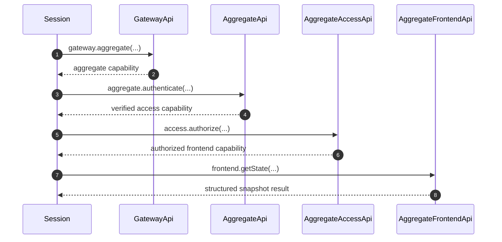

# Aggregate and Service Authentication and Access

Each aggregate and service version declares its own signature schema, authentication schema, selection schema, pattern, and authentication callback. The gateway exposes separate `aggregate(...)` and `service(...)` capabilities. Authentication returns access; authorization returns a frontend API. No stage accepts an aggregate/service union or dispatches by discriminating request properties.

```ts
const aggregate = gateway.aggregate({
  publishableKey,
  systemName,
  name,
  version,
});
const access = aggregate.authenticate({ signature });
const frontend = access.authorize({ frontendName, aggregateFrontendLock });
```

Services use `gateway.service(...)` and `serviceFrontendLock`. The browser pipelines these capabilities through the existing HTTP batch session. Each operation or reconnect generates a fresh signature; access is not cached across browser operations. Server-side access retains claims privately, and authorization checks current database state on every invocation.

## Trigger

1. A state fetch, WebSocket-ticket request, or aggregate push generates its current signature and creates a disposable RPC session.
   - [`fetchAggregateFrontendState.ts`](../../../packages/frontend/src/fetchAggregateFrontendState.ts) — pipelines aggregate selection, authentication, authorization, and state retrieval.
   - [`createServiceFrontendWebSocketTicket.ts`](../../../packages/frontend/src/createServiceFrontendWebSocketTicket.ts) — uses the equivalent service chain and disposes the session after the result.

The diagram shows the aggregate path; the service path uses `ServiceApi`, `ServiceAccessApi`, and `ServiceFrontendApi` with the same sequence.


```mermaid
sequenceDiagram
  participant Session
  participant GatewayApi
  participant AggregateApi
  participant AggregateAccessApi
  participant AggregateFrontendApi
  autonumber
  Session->>GatewayApi: gateway.aggregate(...)
  GatewayApi-->>Session: aggregate capability
  Session->>AggregateApi: aggregate.authenticate(...)
  AggregateApi-->>Session: verified access capability
  Session->>AggregateAccessApi: access.authorize(...)
  AggregateAccessApi-->>Session: authorized frontend capability
  Session->>AggregateFrontendApi: frontend.getState(...)
  AggregateFrontendApi-->>Session: structured snapshot result
```

## Annotated workflow steps

1. The browser selects an aggregate or service by publishable key, system name, name, and version.
   - [`aggregate.ts:21-26`](../../../packages/system-worker/src/GatewayApi/aggregate/aggregate.ts#L21-L26) — decodes the aggregate selector. (`packages/system-worker/src/GatewayApi/aggregate/aggregate.ts:21-26`)
   - [`service.ts:21-26`](../../../packages/system-worker/src/GatewayApi/service/service.ts#L21-L26) — decodes the service selector. (`packages/system-worker/src/GatewayApi/service/service.ts:21-26`)
2. The gateway validates the key, system, and definition, then returns a capability bound to that version.
   - [`aggregate.ts:49-54`](../../../packages/system-worker/src/GatewayApi/aggregate/aggregate.ts#L49-L54) — binds the aggregate coordinates. (`packages/system-worker/src/GatewayApi/aggregate/aggregate.ts:49-54`)
   - [`service.ts:47-52`](../../../packages/system-worker/src/GatewayApi/service/service.ts#L47-L52) — binds the service coordinates. (`packages/system-worker/src/GatewayApi/service/service.ts:47-52`)
3. The browser submits a fresh signature to the selected capability.
   - [`authenticate.ts:28-33`](../../../packages/system-worker/src/AggregateApi/authenticate/authenticate.ts#L28-L33) — runs aggregate authentication. (`packages/system-worker/src/AggregateApi/authenticate/authenticate.ts:28-33`)
   - [`authenticate.ts:28-33`](../../../packages/system-worker/src/ServiceApi/authenticate/authenticate.ts#L28-L33) — runs service authentication. (`packages/system-worker/src/ServiceApi/authenticate/authenticate.ts:28-33`)
4. Successful authentication returns access with private verified claims and selection.
   - [`authenticate.ts:32-37`](../../../packages/system-worker/src/AggregateApi/authenticate/authenticate.ts#L32-L37) — constructs aggregate access. (`packages/system-worker/src/AggregateApi/authenticate/authenticate.ts:32-37`)
   - [`authenticate.ts:32-37`](../../../packages/system-worker/src/ServiceApi/authenticate/authenticate.ts#L32-L37) — constructs service access. (`packages/system-worker/src/ServiceApi/authenticate/authenticate.ts:32-37`)
5. The browser requests authorization for a frontend name and lock. Identity and version cannot be resubmitted.
   - [`authorize.ts:36-41`](../../../packages/system-worker/src/AggregateAccessApi/authorize/authorize.ts#L36-L41) — rejects extra aggregate authorization fields. (`packages/system-worker/src/AggregateAccessApi/authorize/authorize.ts:36-41`)
   - [`authorize.ts:32-37`](../../../packages/system-worker/src/ServiceAccessApi/authorize/authorize.ts#L32-L37) — rejects extra service authorization fields. (`packages/system-worker/src/ServiceAccessApi/authorize/authorize.ts:32-37`)
6. Access checks the current database authorization and matching target, then returns the frontend API.
   - [`authorize.ts:65-70`](../../../packages/system-worker/src/AggregateAccessApi/authorize/authorize.ts#L65-L70) — invokes aggregate authorization with bound claims. (`packages/system-worker/src/AggregateAccessApi/authorize/authorize.ts:65-70`)
   - [`authorize.ts:53-58`](../../../packages/system-worker/src/ServiceAccessApi/authorize/authorize.ts#L53-L58) — invokes service authorization with bound claims. (`packages/system-worker/src/ServiceAccessApi/authorize/authorize.ts:53-58`)
7. The browser invokes its frontend operation.
   - [`AggregateFrontendApi.ts:150-155`](../../../packages/system-worker/src/AggregateFrontendApi/AggregateFrontendApi.ts#L150-L155) — delegates the aggregate state read. (`packages/system-worker/src/AggregateFrontendApi/AggregateFrontendApi.ts:150-155`)
   - [`ServiceFrontendApi.ts:66-71`](../../../packages/system-worker/src/ServiceFrontendApi/ServiceFrontendApi.ts#L66-L71) — delegates the service state read. (`packages/system-worker/src/ServiceFrontendApi/ServiceFrontendApi.ts:66-71`)
8. The operation returns its existing structured result. The browser disposes the RPC session afterward.
   - [`getState.ts:39-44`](../../../packages/system-worker/src/AggregateFrontendApi/getState/getState.ts#L39-L44) — runs the aggregate snapshot operation. (`packages/system-worker/src/AggregateFrontendApi/getState/getState.ts:39-44`)
   - [`getState.ts:51-56`](../../../packages/system-worker/src/ServiceFrontendApi/getState/getState.ts#L51-L56) — runs the service snapshot operation. (`packages/system-worker/src/ServiceFrontendApi/getState/getState.ts:51-56`)

## Authentication and failure boundaries

Aggregate authentication may execute trusted provisioning commands belonging to the selected aggregate version. Service authentication receives only its decoded signature. Aggregate authentication must return a valid aggregate ID. Both paths validate claims, derive the declared selection subset, require a canonical reversible selection path, and hash the complete encoded claims.

- [`authenticateAggregate.ts`](../../../packages/system-worker/src/authenticateAggregate/authenticateAggregate.ts) — validates aggregate provisioning contracts and records aggregate authentication attempts.
- [`authenticateService.ts`](../../../packages/system-worker/src/authenticateService/authenticateService.ts) — invokes service authentication without an aggregate command capability.

`beginAggregateAuthenticationAttempt` and `beginServiceAuthenticationAttempt` persist unfinished attempts before signature validation or application authentication. Both use the existing audit table and `completeAuthenticationAttempt`; failed attempts retain sanitized errors, and interrupted attempts remain unfinished. Successful access is withheld until the audit completion is durable.

Each failed capability stage returns a failure target retaining the original error. Subsequent methods propagate that error to the frontend result without running authentication, authorization, or data operations again. Authorization failure does not erase a successfully completed authentication audit.

Omitting aggregate authentication fields installs caller-selected `{ aggregateId }` authentication and selection with pattern `/:aggregateId`; validation and auditing still run. Services require an explicit authentication declaration. Browser descriptors retain their authentication schema without receiving the server callbacks.

## Cold recovery and browser backups

Aggregate replicas and chains share `{ systemId, aggregateId, aggregateName, aggregateVersion, selectionPath }`. Service replica keys retain their system/service/version/frontend fields plus `selectionPath`. Cold activation reconstructs only selected claims using the selected aggregate or service’s pattern and schema, rejects malformed or noncanonical paths before subscription, and requires no authentication callback or audit lookup.

- [`selectionVersionedAggregateRepoFixedDORepoConfig.ts`](../../../packages/system-worker/src/SelectionVersionedAggregateRepo/selectionVersionedAggregateRepoFixedDORepoConfig.ts) — validates the path before replica activation.
- [`frontendVersionedServiceRepoFixedDORepoConfig.ts`](../../../packages/system-worker/src/FrontendVersionedServiceRepo/frontendVersionedServiceRepoFixedDORepoConfig.ts) — applies the same service invariant.

Different full claims can share one server selection partition. Browser backups instead include the canonical hash of the entire encoded authentication object alongside aggregate-or-service/version/frontend fields. A changed guard claim selects a different backup; restored SQLite claims must match that hash. Recovery rejects changed authentication rather than attaching an old journal to new claims.

- [`makeAggregateFrontendBackupKey.ts`](../../../packages/frontend/src/makeAggregateFrontendBackupKey.ts) — formats aggregate backup coordinates.
- [`makeServiceFrontendBackupKey.ts`](../../../packages/frontend/src/makeServiceFrontendBackupKey.ts) — formats service backup coordinates.
- [`bootstrapAggregateFrontendSession.ts`](../../../packages/frontend/src/bootstrapAggregateFrontendSession.ts) — validates restored authentication and subsequent online recovery.

## Callers

- [Browser session bootstrap](./bootstrapBrowserSession.md)
- [Frontend WebSocket](./FrontendWebSocket.md)
- [IndexedDB backup coordination](./IndexedDbBackupCoordination.md)

## Claims codecs and frontend authoring

`App.makeAggregateFrontend` and `App.makeServiceFrontend` resolve the selected definition from `typeof system`, validate its exact model/contract subset, and return a typed component and selector. The app supplies `systemName`. Browser declarations retain only `authenticationSchema`; signature and selection schemas, patterns, and callbacks stay on the aggregate or service. Claims locks compare the claims JSON schema with that selected definition. Services have no frontend registry or projection adapters; `authorize` is optional.

Signers return decoded values. Authentication validates the signature against `Schema.toType`, and application authorizers receive decoded claims. Private access state, authentication audit rows, command provenance, and WebSocket-ticket persistence retain encoded claims. Public frontend snapshots decode those claims before returning them. HTTP batch RPC supports decoded `Date` values; the focused transport test exercises that round trip.

Bootstrap encodes incoming claims before canonical hashing and SQLite backup persistence. Offline reopen validates the encoded partition identity, then decodes claims before publishing session state. Reconnect encodes fresh claims before comparing hashes; it cannot silently move pending commands to a different identity. Commands retain their creation-time encoded claims, while local and authoritative application guards receive decoded claims. A locally matching backup hash is a consistency check, not proof of authenticity.

Service snapshots filter by the admitted lock. Live WebSocket delivery, WebSocket replay, and HTTP replay filter every complete command's resource delta using that connection or capability's lock. Shared materialization does not treat `frontendName` as a unique subset. Empty selected deltas retain their service index, and deletion and duplicate/restart handling preserve contiguous progress.

- [`makeZerospinApp.tsx`](../../../packages/react/src/makeZerospinApp.tsx) — typed app-bound authoring and decoded signers.
- [`bootstrapAggregateFrontendSession.ts`](../../../packages/frontend/src/bootstrapAggregateFrontendSession.ts), [`bootstrapServiceFrontendSession.ts`](../../../packages/frontend/src/bootstrapServiceFrontendSession.ts) — durable encoding and decoded restoration.
- [`filterServiceFrontendCommand.ts`](../../../packages/core/src/serviceSession/filterServiceFrontendCommand.ts) — subset filtering without discarding command provenance or progress.
