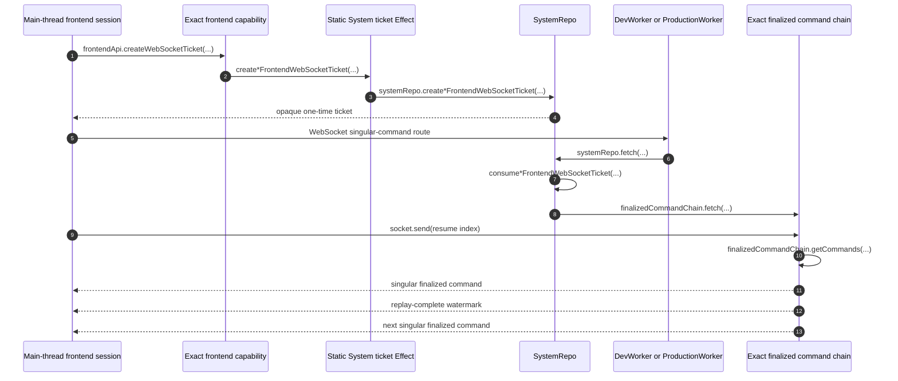

# Frontend Finalized-Command WebSocket

A main-thread frontend session authenticates through a fresh HTTP-batch RPC
session and requests a one-time ticket for its exact finalized command chain.
The RPC session closes after ticket creation. The frontend session then owns
one per-session WebSocket: aggregate sessions connect to
`/ws-aggregate-frontend-commands`, while service sessions connect to
`/ws-service-frontend-commands`. Each data message carries one complete
`aggregateFrontendCommand` or `serviceFrontendCommand` occurrence.

- [`Worker.ts:24-40`](../../../examples/shopping/src/Worker.ts#L24-L40) — routes only the two singular frontend-command paths and system-log paths through SystemRepo.
- [`fetch.ts:58-84`](../../../packages/system-worker/src/SystemRepo/fetch/fetch.ts#L58-L84) — accepts exactly the two command routes, a WebSocket upgrade, and one opaque ticket query parameter.

## Trigger

1. A main-thread bootstrap calls
   `createAggregateFrontendWebSocketTicket(...)` or
   `createServiceFrontendWebSocketTicket(...)`, then opens the matching
   singular command route itself.
   - [`bootstrapAggregateFrontendSession.ts:440-504`](../../../packages/frontend/src/bootstrapAggregateFrontendSession.ts#L440-L504) — obtains the aggregate ticket, constructs the WebSocket URL, and subscribes from zero.
   - [`bootstrapServiceFrontendSession.ts:282-344`](../../../packages/frontend/src/bootstrapServiceFrontendSession.ts#L282-L344) — performs the equivalent service connection.

## Annotated workflow steps

1. The exact child capability accepts an empty ticket request; its bound fields
   are not resubmitted by the caller.
   - [`createWebSocketTicket.ts:18-50`](../../../packages/system-worker/src/AggregateFrontendApi/createWebSocketTicket/createWebSocketTicket.ts#L18-L50) — validates the empty aggregate request against the capability binding.
   - [`createWebSocketTicket.ts:17-47`](../../../packages/system-worker/src/ServiceFrontendApi/createWebSocketTicket/createWebSocketTicket.ts#L17-L47) — validates the empty service request.
2. The API delegates to the static System ticket Effect with its bound target,
   user, lock, and configured `systemId`.
   - [`createWebSocketTicket.ts:51-65`](../../../packages/system-worker/src/AggregateFrontendApi/createWebSocketTicket/createWebSocketTicket.ts#L51-L65) — forwards the aggregate binding unchanged.
   - [`createWebSocketTicket.ts:49-62`](../../../packages/system-worker/src/ServiceFrontendApi/createWebSocketTicket/createWebSocketTicket.ts#L49-L62) — forwards the service binding.
3. The System Effect derives the exact finalized-chain name, verifies only the
   matching materialized frontend registration, and asks SystemRepo to mint a
   ticket for that name. It deliberately does not require the sparse finalized
   chain to be registered before its first connection.
   - [`createAggregateFrontendWebSocketTicket.ts:58-108`](../../../packages/system-worker/src/createAggregateFrontendWebSocketTicket/createAggregateFrontendWebSocketTicket.ts#L58-L108) — derives both names, checks only MaterializedAggregateFrontendRepo readiness, and stores the finalized-chain target in the ticket request.
   - [`createServiceFrontendWebSocketTicket.ts:55-103`](../../../packages/system-worker/src/createServiceFrontendWebSocketTicket/createServiceFrontendWebSocketTicket.ts#L55-L103) — applies the same materialized-only readiness check for the service target.
4. SystemRepo returns the opaque one-time ticket; the ticket row retains the
   exact target fields, lock, chain name, and expiry.
   - [`SystemRepoDbConfig.ts:34-78`](../../../packages/system-worker/src/SystemRepo/SystemRepoDbConfig.ts#L34-L78) — defines both bound ticket row shapes.
5. The main-thread frontend session opens the aggregate or service
   singular-command route with that ticket.
   - [`Worker.ts:24-40`](../../../examples/shopping/src/Worker.ts#L24-L40) — routes these WebSocket paths to the configured SystemRepo.
6. The Worker forwards the exact request to `SystemRepo(systemId)`.
   - [`ProductionWorker.ts:33-62`](../../../packages/production-worker/src/ProductionWorker.ts#L33-L62) — validates the WebSocket and ticket query before delegating to SystemRepo.
7. SystemRepo consumes the matching ticket exactly once and rejects an invalid
   or expired ticket.
   - [`fetch.ts:84-106`](../../../packages/system-worker/src/SystemRepo/fetch/fetch.ts#L84-L106) — consumes and validates a service ticket.
   - [`fetch.ts:145-166`](../../../packages/system-worker/src/SystemRepo/fetch/fetch.ts#L145-L166) — consumes and validates an aggregate ticket.
8. SystemRepo resolves the finalized chain from the consumed target and
   activates it lazily by installing bound identity headers and forwarding the
   WebSocket request.
   - [`fetch.ts:107-142`](../../../packages/system-worker/src/SystemRepo/fetch/fetch.ts#L107-L142) — resolves the exact ServiceFrontendFinalizedCommandChain and forwards `fetch(...)` without a registration prerequisite.
   - [`fetch.ts:167-204`](../../../packages/system-worker/src/SystemRepo/fetch/fetch.ts#L167-L204) — performs the same lazy resolution and fetch for AggregateFrontendFinalizedCommandChain.
9. Once connected, bootstrap sends zero so the new in-memory replica receives a
   complete replay before admission.
   - [`onMessage.ts:38-65`](../../../packages/system-worker/src/AggregateFrontendFinalizedCommandChain/onMessage/onMessage.ts#L38-L65) — accepts exactly one initial aggregate resume message from the bound connection.
   - [`onMessage.ts:33-60`](../../../packages/system-worker/src/ServiceFrontendFinalizedCommandChain/onMessage/onMessage.ts#L33-L60) — accepts the service resume watermark.
10. The chain repeatedly pulls paginated contiguous history after the delivered
    index until it reaches the observed tip.
    - [`onMessage.ts:67-102`](../../../packages/system-worker/src/AggregateFrontendFinalizedCommandChain/onMessage/onMessage.ts#L67-L102) — replays aggregate finalized history and rejects gaps or regressed tips.
    - [`onMessage.ts:62-101`](../../../packages/system-worker/src/ServiceFrontendFinalizedCommandChain/onMessage/onMessage.ts#L62-L101) — replays service finalized history.
11. Each replay item is one singular message with the matching discriminant and
    complete encoded command under `sync`.
    - [`onMessage.ts:77-95`](../../../packages/system-worker/src/AggregateFrontendFinalizedCommandChain/onMessage/onMessage.ts#L77-L95) — sends one `aggregateFrontendCommand` at a time.
    - [`onMessage.ts:73-94`](../../../packages/system-worker/src/ServiceFrontendFinalizedCommandChain/onMessage/onMessage.ts#L73-L94) — sends one `serviceFrontendCommand` at a time.
12. The chain emits one replay-complete watermark and marks the connection live.
    - [`onMessage.ts:104-110`](../../../packages/system-worker/src/AggregateFrontendFinalizedCommandChain/onMessage/onMessage.ts#L104-L110) — completes aggregate replay at the delivered `frontendIndex`.
    - [`onMessage.ts:103-109`](../../../packages/system-worker/src/ServiceFrontendFinalizedCommandChain/onMessage/onMessage.ts#L103-L109) — completes service replay at `serviceFrontendIndex`.
13. A new persisted finalized occurrence is broadcast as one singular message
    only to live connections. The main-thread session applies it directly to
    its in-memory SQLite database; a replay race closes for recovery.
    - [`AggregateFrontendFinalizedCommandChain.ts:58-98`](../../../packages/system-worker/src/AggregateFrontendFinalizedCommandChain/AggregateFrontendFinalizedCommandChain.ts#L58-L98) — broadcasts aggregate commands and fences replay races.
    - [`ServiceFrontendFinalizedCommandChain.ts:57-93`](../../../packages/system-worker/src/ServiceFrontendFinalizedCommandChain/ServiceFrontendFinalizedCommandChain.ts#L57-L93) — broadcasts service commands with the service discriminant.
    - [`bootstrapAggregateFrontendSession.ts:649-712`](../../../packages/frontend/src/bootstrapAggregateFrontendSession.ts#L649-L712) — validates and applies each live aggregate occurrence and reconnects after close.

## Callers

- [Browser session bootstrap](./bootstrapBrowserSession.md)
- [Aggregate command finalization](../server/finalizeAggregateCommand.md)
- [Command chains and materialization](../CommandChains.md)
