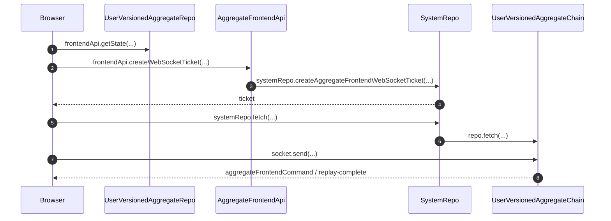

# Frontend WebSocket Delivery

Aggregate sessions use `/ws-aggregate-frontend-commands`; service sessions use `/ws-service-frontend-commands`. Aggregate tickets pin the version captured by the snapshot, so a cutover between snapshot and socket creation cannot mix histories.

## Trigger

1. Before opening the aggregate socket, the browser fetches a snapshot with its published user position, consumed aggregate position, and aggregate version.
   - [`getState.ts`](../../../packages/system-worker/src/UserVersionedAggregateRepo/getState/getState.ts) — Captures graph and both indices together, awaits publication outside the execution permit, then retrieves requested outcomes through that user position.

## Annotated workflow steps

1. Before opening the aggregate socket, the browser fetches a snapshot with its published user position, consumed aggregate position, and aggregate version.
   - [`getState.ts`](../../../packages/system-worker/src/UserVersionedAggregateRepo/getState/getState.ts) — Captures graph and both indices together, awaits publication outside the execution permit, then retrieves requested outcomes through that user position.
2. The browser requests a ticket for the snapshot aggregateVersion; target and user fields remain capability-bound.
   - [`createWebSocketTicket.ts`](../../../packages/system-worker/src/AggregateFrontendApi/createWebSocketTicket/createWebSocketTicket.ts) — Decodes the version and passes it with the bound view.
3. The ticket procedure verifies the matching UVAR registration and persists the exact versioned UVAC name.
   - [`createWebSocketTicket.ts`](../../../packages/system-worker/src/AggregateFrontendApi/createWebSocketTicket/createWebSocketTicket.ts) — Constructs version-bound UVAR and UVAC names and asks SystemRepo for a ticket.
4. SystemRepo returns an opaque one-use ticket.
   - [`createAggregateFrontendWebSocketTicket.ts`](../../../packages/system-worker/src/SystemRepo/createAggregateFrontendWebSocketTicket/createAggregateFrontendWebSocketTicket.ts) — Retains the target, frontend lock, and expiry with the token.
5. The Worker forwards the upgrade request to the configured singleton SystemRepo.
   - [`fetch.ts`](../../../packages/system-worker/src/SystemRepo/fetch/fetch.ts) — Consumes the ticket and routes using its retained versioned repoName.
   - [`consumeAggregateFrontendWebSocketTicket.ts`](../../../packages/system-worker/src/SystemRepo/consumeAggregateFrontendWebSocketTicket/consumeAggregateFrontendWebSocketTicket.ts) — Atomically spends the ticket and returns every required stored-row field, including aggregateVersion; the schema checks projection completeness at compile time and stored values at runtime.
   - [`consumeServiceFrontendWebSocketTicket.ts`](../../../packages/system-worker/src/SystemRepo/consumeServiceFrontendWebSocketTicket/consumeServiceFrontendWebSocketTicket.ts) — Applies the same schema-derived projection check to service tickets, including serviceVersion.
6. The exact UVAC accepts the bound connection and waits for a resume cursor.
   - [`onConnect.ts`](../../../packages/system-worker/src/UserVersionedAggregateChain/onConnect/onConnect.ts) — Validates headers and records awaiting-resume connection state.
7. The browser sends the snapshot `userIndex`; replay and completion use that user position independently of `aggregateIndex`.
   - [`bootstrapAggregateFrontendSession.ts`](../../../packages/frontend/src/bootstrapAggregateFrontendSession.ts) — Pins the snapshot version in the ticket and sends its user resume position.
   - [`onMessage.ts`](../../../packages/system-worker/src/UserVersionedAggregateChain/onMessage/onMessage.ts) — Replays contiguous retained outputs strictly after the supplied user position and returns `replay-complete`.
8. UVAC sends retained replay, then committed live outputs. A service-only output advances `userIndex`, retains the aggregate watermark, and has no command resolution. Browser participation never gates the internal pipeline.
   - [`UserVersionedAggregateChain.ts`](../../../packages/system-worker/src/UserVersionedAggregateChain/UserVersionedAggregateChain.ts) — Broadcasts committed output only to live connections and closes a replay race for reconnect.
   - [`AggregateFrontendCommandSchema.ts`](../../../packages/core/src/session/AggregateFrontendCommandSchema.ts) — Decodes a positive user position, nonnegative aggregate watermark, and nullable full originating execution entry.

## Shared aggregate delivery

UVAR and UVAC share the key `{ systemId, aggregateId, aggregateName, aggregateVersion, userId }`. Worker configuration supplies `systemId`, authentication supplies `userId`, and admission validates and authorizes the caller's aggregate fields. The capability and socket retain their own `frontendName` and compatible lock. Snapshots and stream deltas expose only locked models; pushes require a locked contract version. Empty filtered entries still advance the shared `userIndex`. Resolutions retain the complete occurrence and are sent only to its originating frontend.

- [`userVersionedAggregateRepoFixedDORepoConfig.ts`](../../../packages/system-worker/src/UserVersionedAggregateRepo/userVersionedAggregateRepoFixedDORepoConfig.ts) — defines shared identity and the aggregate version's complete model schema.
- [`getCommands.ts`](../../../packages/system-worker/src/UserVersionedAggregateChain/getCommands/getCommands.ts) — filters replay and performs indexed, cursor-bounded command reconciliation.
- [`UserVersionedAggregateChain.ts`](../../../packages/system-worker/src/UserVersionedAggregateChain/UserVersionedAggregateChain.ts) — filters committed live output independently for each socket.
- [`pushCommand.ts`](../../../packages/system-worker/src/AggregateFrontendApi/pushCommand/pushCommand.ts) — restricts pushes to the admitted contract selection.

A changed lock selects a separate browser backup and a freshly admitted connection. Recovery replaces that view with a fresh filtered snapshot and resumes strictly after its `userIndex`. The user chain retains history indefinitely; no bounded window or frontend-specific server replica is created.

- [`bootstrapAggregateFrontendSession.ts`](../../../packages/frontend/src/bootstrapAggregateFrontendSession.ts) — obtains the lock-specific backup, requests outstanding outcomes, installs the snapshot, and opens replay.

## Service frontend delivery

The service route captures a published snapshot before opening its socket. Its
ticket pins that snapshot's `serviceVersion`; FSC replays strictly after
`serviceIndex`. Later online recovery can update the retained session's version
by installing a newly fetched snapshot and its matching socket.

- [`createWebSocketTicket.ts`](../../../packages/system-worker/src/ServiceFrontendApi/createWebSocketTicket/createWebSocketTicket.ts) — Binds the snapshot serviceVersion, service target, and frontend lock to its opaque ticket.
- [`onMessage.ts`](../../../packages/system-worker/src/FrontendServiceChain/onMessage/onMessage.ts) — Replays service frontend occurrences from the service cursor.
- [`bootstrapServiceFrontendSession.ts`](../../../packages/frontend/src/bootstrapServiceFrontendSession.ts) — recovers through a snapshot and version-pinned socket, then publishes the recovered metadata on the existing session store.

## Ownership periods

Each live socket belongs to the currently acquired frontend backup capability.
Revocation closes that socket and interrupts recovery and live-message fibers;
callbacks check period and socket identity again before publishing frontiers.
A new acquisition restores the retained live database, renews execution
identity, and creates a fresh socket through the same authenticated ticket flow.

- [`bootstrapAggregateFrontendSession.ts`](../../../packages/frontend/src/bootstrapAggregateFrontendSession.ts) — closes sockets in the ownership-period finalizer and fences delivery callbacks by current period and socket identity.
- [`bootstrapServiceFrontendSession.ts`](../../../packages/frontend/src/bootstrapServiceFrontendSession.ts) — applies the equivalent service socket and replay fencing independently.
- [IndexedDB backup coordination](./IndexedDbBackupCoordination.md) — describes per-key acquisition and worker-loss recovery.

## Verification

- [`consumeAggregateFrontendWebSocketTicket.node.spec.ts`](../../../packages/system-worker/src/SystemRepo/consumeAggregateFrontendWebSocketTicket/consumeAggregateFrontendWebSocketTicket.node.spec.ts) — Verifies a real SQLite ticket round trip retains the aggregate version and lock, deletes the ticket, and rejects reuse.

- [`UserVersionedAggregateChain.workerd.spec.ts`](../../../packages/system-worker/src/UserVersionedAggregateChain/UserVersionedAggregateChain.workerd.spec.ts) — Tests durable service-only output with aggregate watermark zero, exact duplicate delivery, gap rejection, and real WebSocket replay after a nonzero user position.

- [`frontendPrograms.node.spec.ts`](../../../packages/frontend/src/frontendPrograms.node.spec.ts) — Verifies snapshot-first bootstrap and reconnect send the independent user position and accept duplicate buffered delivery.

See [Versioned Service Execution and Delivery](../server/serviceExecution.md) for projection, publication, and cutover routing.
