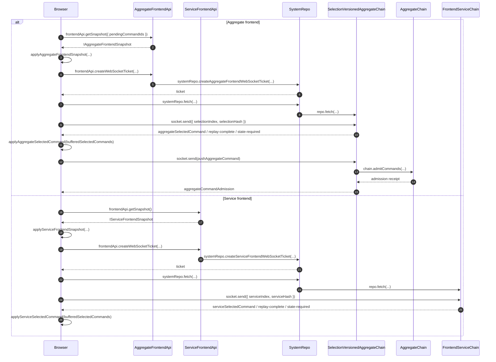

# Frontend WebSocket Delivery

Aggregate sessions use `/ws-aggregate-frontend-commands`; service sessions use `/ws-service-frontend-commands`. Aggregate tickets pin the version captured by the snapshot, so a cutover between snapshot and socket creation cannot mix histories.

## Trigger

1. Before opening the aggregate socket, the browser fetches a snapshot with its published selection position, consumed aggregate position, and aggregate version.
   - [`getSnapshot.ts`](../../../packages/system-worker/src/SelectionVersionedAggregateRepo/getSnapshot/getSnapshot.ts) — captures graph and both indices together, awaits publication outside the execution permit, then retrieves exact-owner selected commands for `pendingCommandIds` through that selection position.
2. Before opening a service socket for a new or replacement database, the browser fetches the complete selected service snapshot and resumes from its `serviceIndex` and `serviceHash`.
   - [`bootstrapServiceFrontendSession.ts`](../../../packages/frontend/src/bootstrapServiceFrontendSession.ts) — installs authoritative service state, buffers replay, applies its contiguous suffix, and then switches to live delivery.

```mermaid
sequenceDiagram
  participant Browser
  participant AggregateFrontendApi
  participant ServiceFrontendApi
  participant SystemRepo
  participant SelectionVersionedAggregateChain
  participant AggregateChain
  participant FrontendServiceChain
  alt Aggregate frontend
    autonumber 1
    Browser->>AggregateFrontendApi: frontendApi.getSnapshot({ pendingCommandIds })
    autonumber 2
    AggregateFrontendApi-->>Browser: IAggregateFrontendSnapshot
    autonumber 3
    Browser->>Browser: applyAggregateFrontendSnapshot(...)
    autonumber 4
    Browser->>AggregateFrontendApi: frontendApi.createWebSocketTicket(...)
    autonumber 5
    AggregateFrontendApi->>SystemRepo: systemRepo.createAggregateFrontendWebSocketTicket(...)
    autonumber 6
    SystemRepo-->>Browser: ticket
    autonumber 7
    Browser->>SystemRepo: systemRepo.fetch(...)
    autonumber 8
    SystemRepo->>SelectionVersionedAggregateChain: repo.fetch(...)
    autonumber 9
    Browser->>SelectionVersionedAggregateChain: socket.send({ selectionIndex, selectionHash })
    autonumber 10
    SelectionVersionedAggregateChain-->>Browser: aggregateSelectedCommand / replay-complete / state-required
    autonumber 11
    Browser->>Browser: applyAggregateSelectedCommand(bufferedSelectedCommands)
    autonumber 12
    Browser->>SelectionVersionedAggregateChain: socket.send(pushAggregateCommand)
    autonumber 13
    SelectionVersionedAggregateChain->>AggregateChain: chain.admitCommands(...)
    autonumber 14
    AggregateChain-->>SelectionVersionedAggregateChain: admission receipt
    autonumber 15
    SelectionVersionedAggregateChain-->>Browser: aggregateCommandAdmission
  else Service frontend
    autonumber 16
    Browser->>ServiceFrontendApi: frontendApi.getSnapshot()
    autonumber 17
    ServiceFrontendApi-->>Browser: IServiceFrontendSnapshot
    autonumber 18
    Browser->>Browser: applyServiceFrontendSnapshot(...)
    autonumber 19
    Browser->>ServiceFrontendApi: frontendApi.createWebSocketTicket(...)
    autonumber 20
    ServiceFrontendApi->>SystemRepo: systemRepo.createServiceFrontendWebSocketTicket(...)
    autonumber 21
    SystemRepo-->>Browser: ticket
    autonumber 22
    Browser->>SystemRepo: systemRepo.fetch(...)
    autonumber 23
    SystemRepo->>FrontendServiceChain: repo.fetch(...)
    autonumber 24
    Browser->>FrontendServiceChain: socket.send({ serviceIndex, serviceHash })
    autonumber 25
    FrontendServiceChain-->>Browser: serviceSelectedCommand / replay-complete / state-required
    autonumber 26
    Browser->>Browser: applyServiceSelectedCommand(bufferedSelectedCommands)
  end
```

## Annotated workflow steps

1. Before opening the aggregate socket, the browser calls
   `frontendApi.getSnapshot({ pendingCommandIds })`; the IDs come from restored
   local commands whose optimistic mutation rows remain unresolved.
   - [`fetchAggregateFrontendSnapshot.ts`](../../../packages/frontend/src/fetchAggregateFrontendSnapshot.ts) — sends the pending IDs through the freshly authenticated frontend capability.
2. `IAggregateFrontendSnapshot` returns resources, aggregate and selection positions,
   `selectionHash`, and exact-owner `selectedCommands` through the captured
   selection position.
   - [`getSnapshot.ts`](../../../packages/system-worker/src/SelectionVersionedAggregateRepo/getSnapshot/getSnapshot.ts) — captures the coherent snapshot and performs owner-filtered reconciliation.
3. The browser installs the snapshot before socket replay. Matching selected
   commands complete journal rows and remove optimism, but their deltas are not
   applied because `snapshot.resources` already incorporates them.
   - [`applyAggregateFrontendSnapshotTx.ts`](../../../packages/core/src/session/applyAggregateFrontendSnapshotTx.ts) — installs resources and reconciles matching commands atomically.
4. The browser requests a ticket for the snapshot aggregateVersion; target and user fields remain capability-bound.
   - [`createWebSocketTicket.ts`](../../../packages/system-worker/src/AggregateFrontendApi/createWebSocketTicket/createWebSocketTicket.ts) — Decodes the version and passes it with the bound view.
5. The ticket procedure verifies the matching SelectionVAR registration and persists the exact versioned SelectionVAC name.
   - [`createWebSocketTicket.ts`](../../../packages/system-worker/src/AggregateFrontendApi/createWebSocketTicket/createWebSocketTicket.ts) — Constructs version-bound SelectionVAR and SelectionVAC names and asks SystemRepo for a ticket.
6. SystemRepo returns an opaque one-use ticket.
   - [`createAggregateFrontendWebSocketTicket.ts`](../../../packages/system-worker/src/SystemRepo/createAggregateFrontendWebSocketTicket/createAggregateFrontendWebSocketTicket.ts) — Retains the target, frontend lock, and expiry with the token.
7. The Worker forwards the upgrade request to the configured singleton SystemRepo.
   - [`fetch.ts`](../../../packages/system-worker/src/SystemRepo/fetch/fetch.ts) — Consumes the ticket and routes using its retained versioned repoName.
   - [`consumeAggregateFrontendWebSocketTicket.ts`](../../../packages/system-worker/src/SystemRepo/consumeAggregateFrontendWebSocketTicket/consumeAggregateFrontendWebSocketTicket.ts) — Atomically spends the ticket and returns every required stored-row field, including aggregateVersion; the schema checks projection completeness at compile time and stored values at runtime.
   - [`consumeServiceFrontendWebSocketTicket.ts`](../../../packages/system-worker/src/SystemRepo/consumeServiceFrontendWebSocketTicket/consumeServiceFrontendWebSocketTicket.ts) — Applies the same schema-derived projection check to service tickets, including serviceVersion.
8. The exact SelectionVAC accepts the bound connection and waits for a resume cursor.
   - [`onConnect.ts`](../../../packages/system-worker/src/SelectionVersionedAggregateChain/onConnect/onConnect.ts) — Validates headers and records awaiting-resume connection state.
9. The browser sends the snapshot `selectionIndex` and `selectionHash`; replay and completion use that selection checkpoint independently of `aggregateIndex`.
   - [`bootstrapAggregateFrontendSession.ts`](../../../packages/frontend/src/bootstrapAggregateFrontendSession.ts) — Pins the snapshot version in the ticket and sends its user resume position.
   - [`onMessage.ts`](../../../packages/system-worker/src/SelectionVersionedAggregateChain/onMessage/onMessage.ts) — Replays contiguous retained outputs strictly after the supplied selection position and returns `replay-complete`.
10. SelectionVAC sends domain-specific `aggregateSelectedCommand` envelopes
    followed by `replay-complete`; a mismatched checkpoint receives
    `state-required`, and subsequent live delivery uses the same command envelope.
    A service-derived occurrence advances `selectionIndex` and `selectionHash`,
    retains the aggregate watermark, and exposes `failure: null`.
   - [`SelectionVersionedAggregateChain.ts`](../../../packages/system-worker/src/SelectionVersionedAggregateChain/SelectionVersionedAggregateChain.ts) — Broadcasts committed output only to live connections and closes a replay race for reconnect.
   - [`AggregateSelectedCommandSchema.ts`](../../../packages/core/src/session/AggregateSelectedCommandSchema.ts) — decodes only command ID, positions, minimal delta, nullable private failure, and `selectionHash`.
11. The browser buffers selected commands through `replay-complete`, validates
    contiguity, passes `bufferedSelectedCommands` to
    `applyAggregateSelectedCommand`, and only then switches the socket to direct
    live delivery. A `state-required` response replaces the database from a
    fresh snapshot before retrying the resume sequence.
    - [`bootstrapAggregateFrontendSession.ts`](../../../packages/frontend/src/bootstrapAggregateFrontendSession.ts) — owns buffering, replay validation, contiguous application, and the live-handler transition.
12. Once replay completes, the browser submits one unchanged journal occurrence over the retained live socket; selected messages may interleave with its receipt.
    - [`bootstrapAggregateFrontendSession.ts`](../../../packages/frontend/src/bootstrapAggregateFrontendSession.ts) — registers the pending command ID and Deferred before sending.
13. SelectionVAC validates retained target and contract fields and submits `[command]` unchanged to `{ systemId, aggregateId, aggregateName }`. The Repo key supplies systemId; aggregate fields must match connection state derived from the consumed ticket. One admission marker prevents concurrent submissions without leaving live.
    - [`onMessage.ts`](../../../packages/system-worker/src/SelectionVersionedAggregateChain/onMessage/onMessage.ts) — checks the connection and selected contract, then calls AggregateChain.
14. AggregateChain durably retains the occurrence or recovers its identical-byte receipt.
    - [`admitCommandsTx.ts`](../../../packages/system-worker/src/AggregateChain/admitCommands/admitCommandsTx.ts) — rejects conflicting retries and returns the original index for identical bytes.
15. The same socket returns the encoded success or typed failure and optional persisted telemetry link. Success updates journal pushIndex; only selected completion or snapshot reconciliation removes optimism. Close fails pending admission and recovery validates a new socket before resending.
    - [`onMessage.ts`](../../../packages/system-worker/src/SelectionVersionedAggregateChain/onMessage/onMessage.ts) — persists the server span without replacing the domain receipt on telemetry failure.
    - [`bootstrapAggregateFrontendSession.ts`](../../../packages/frontend/src/bootstrapAggregateFrontendSession.ts) — validates receipt identity and settles only the pending admission.
16. A fresh service bootstrap or authoritative replacement calls
    `frontendApi.getSnapshot()` on the authorized service capability.
    - [`fetchServiceFrontendSnapshot.ts`](../../../packages/frontend/src/fetchServiceFrontendSnapshot.ts) — selects, authenticates, authorizes, and reads the service snapshot through one disposable RPC session.
17. `IServiceFrontendSnapshot` returns the filtered resources together with
    `serviceName`, `frontendName`, `serviceVersion`, `serviceIndex`, and
    `serviceHash`.
    - [`types.ts`](../../../packages/core/src/serviceSession/types.ts) — defines the complete service frontend snapshot without a frontend `systemId` field.
18. `applyServiceFrontendSnapshot` replaces all selected resource rows and
    commits the service version and index/hash checkpoint in the same local
    transaction.
    - [`applyServiceFrontendSnapshotTx.ts`](../../../packages/core/src/serviceSession/applyServiceFrontendSnapshotTx.ts) — replaces the graph and upserts service session metadata atomically.
19. The browser requests a WebSocket ticket for the retained service version,
    service target, frontend name, and frontend lock.
    - [`createServiceFrontendWebSocketTicket.ts`](../../../packages/frontend/src/createServiceFrontendWebSocketTicket.ts) — requests the ticket through a freshly authenticated and authorized capability.
20. The service frontend capability verifies the matching FVSR registration and
    asks SystemRepo to persist a one-use ticket for the exact FSC target.
    - [`createWebSocketTicket.ts`](../../../packages/system-worker/src/ServiceFrontendApi/createWebSocketTicket/createWebSocketTicket.ts) — binds the pinned service projection and selected-command chain.
21. SystemRepo returns the opaque one-use service ticket.
    - [`createServiceFrontendWebSocketTicket.ts`](../../../packages/system-worker/src/SystemRepo/createServiceFrontendWebSocketTicket/createServiceFrontendWebSocketTicket.ts) — retains the service target, frontend lock, and expiry.
22. The Worker forwards the service upgrade request to the configured singleton
    SystemRepo.
    - [`fetch.ts`](../../../packages/system-worker/src/SystemRepo/fetch/fetch.ts) — consumes both aggregate and service tickets at the shared routing boundary.
23. SystemRepo routes the accepted socket to the exact FrontendServiceChain.
    - [`consumeServiceFrontendWebSocketTicket.ts`](../../../packages/system-worker/src/SystemRepo/consumeServiceFrontendWebSocketTicket/consumeServiceFrontendWebSocketTicket.ts) — returns the persisted versioned FSC identity after atomically spending the ticket.
24. The browser sends `{ serviceIndex, serviceHash }`; both values come from the
    installed or restored service session metadata.
    - [`bootstrapServiceFrontendSession.ts`](../../../packages/frontend/src/bootstrapServiceFrontendSession.ts) — opens the service route and sends the retained checkpoint on `onopen`.
25. FSC validates the index/hash against its durable `commands` table, replays
    `serviceSelectedCommand` envelopes through the retained tip, sends
    `replay-complete`, and then marks the socket live. A missing or mismatched
    checkpoint yields `state-required` instead.
    - [`frontendServiceChainDbConfig.ts`](../../../packages/system-worker/src/FrontendServiceChain/frontendServiceChainDbConfig.ts) — stores each `IServiceSelectedCommand` by `serviceIndex` with its `serviceHash` and encoded output.
    - [`onMessage.ts`](../../../packages/system-worker/src/FrontendServiceChain/onMessage/onMessage.ts) — validates the checkpoint, replays the contiguous suffix, and performs the live transition.
26. The browser decodes, sorts, and validates `bufferedSelectedCommands`, applies
    each exact next occurrence with `applyServiceSelectedCommand`, and installs
    the direct live handler. Duplicate service indices are harmless; a gap fails
    the session. `state-required` first installs a fresh snapshot and retries the
    same resume protocol.
    - [`bootstrapServiceFrontendSession.ts`](../../../packages/frontend/src/bootstrapServiceFrontendSession.ts) — owns replay buffering, state replacement, retry, contiguous application, and live recovery.
    - [`applyServiceSelectedCommandTx.ts`](../../../packages/core/src/serviceSession/applyServiceSelectedCommandTx.ts) — applies upserts/deletes and advances `serviceIndex`/`serviceHash` atomically.

## Shared aggregate delivery

SelectionVAR and SelectionVAC share the key `{ systemId, aggregateId, aggregateName, aggregateVersion, selectionPath }`. Worker configuration supplies `systemId`; authentication supplies `aggregateId` and the canonical path derived from declared selection claims. Admission checks the caller-selected aggregate name/version and frontend lock. The capability and socket retain their own `frontendName` and compatible lock. Snapshots and selected-command deltas expose only locked models; pushes require a locked contract version. Empty filtered entries still advance the shared `selectionIndex` and `selectionHash`. SelectionVAC privately retains nullable originating authentication and frontend name. Only an exact match receives the selected command's failure; all other deliveries expose `failure: null` and never receive source payloads or execution metadata.

- [`selectionVersionedAggregateRepoFixedDORepoConfig.ts`](../../../packages/system-worker/src/SelectionVersionedAggregateRepo/selectionVersionedAggregateRepoFixedDORepoConfig.ts) — defines shared identity and the aggregate version's complete model schema.
- [`getSelectedCommands.ts`](../../../packages/system-worker/src/SelectionVersionedAggregateChain/getSelectedCommands/getSelectedCommands.ts) — filters replay and performs indexed, cursor-bounded pending-command reconciliation.
- [`SelectionVersionedAggregateChain.ts`](../../../packages/system-worker/src/SelectionVersionedAggregateChain/SelectionVersionedAggregateChain.ts) — filters committed live output independently for each socket.
- [`onMessage.ts`](../../../packages/system-worker/src/SelectionVersionedAggregateChain/onMessage/onMessage.ts) — restricts pushes to the admitted contract selection.

A changed lock selects a separate browser backup and a freshly admitted connection. Recovery replaces that view with a fresh filtered snapshot and resumes strictly after its `selectionIndex`. The user chain retains history indefinitely; no bounded window or frontend-specific server replica is created.

- [`bootstrapAggregateFrontendSession.ts`](../../../packages/frontend/src/bootstrapAggregateFrontendSession.ts) — obtains the lock-specific backup, requests pending-command outcomes, installs the snapshot, and opens replay.

## Service frontend delivery

The service route captures a published snapshot before opening its socket. Its
ticket pins that snapshot's `serviceVersion`; FSC replays strictly after
`serviceIndex`. Later online recovery can update the retained session's version
by installing a newly fetched snapshot and its matching socket.

- [`createWebSocketTicket.ts`](../../../packages/system-worker/src/ServiceFrontendApi/createWebSocketTicket/createWebSocketTicket.ts) — Binds the snapshot serviceVersion, service target, and frontend lock to its opaque ticket.
- [`onMessage.ts`](../../../packages/system-worker/src/FrontendServiceChain/onMessage/onMessage.ts) — Replays service frontend occurrences from the service cursor.
- [`bootstrapServiceFrontendSession.ts`](../../../packages/frontend/src/bootstrapServiceFrontendSession.ts) — recovers through a snapshot and version-pinned socket, then publishes the recovered metadata on the existing session store.

## Ownership periods

Each live socket belongs to the currently acquired frontend backup capability.
Revocation closes that socket and interrupts recovery and live-message fibers;
callbacks check period and socket identity again before publishing frontiers.
A new acquisition restores the retained live database, renews execution
identity, and creates a fresh socket through the same authenticated ticket flow.

- [`bootstrapAggregateFrontendSession.ts`](../../../packages/frontend/src/bootstrapAggregateFrontendSession.ts) — closes sockets in the ownership-period finalizer and fences delivery callbacks by current period and socket identity.
- [`bootstrapServiceFrontendSession.ts`](../../../packages/frontend/src/bootstrapServiceFrontendSession.ts) — applies the equivalent service socket and replay fencing independently.
- [IndexedDB backup coordination](./IndexedDbBackupCoordination.md) — describes per-key acquisition and worker-loss recovery.

## Verification

- [`consumeAggregateFrontendWebSocketTicket.node.spec.ts`](../../../packages/system-worker/src/SystemRepo/consumeAggregateFrontendWebSocketTicket/consumeAggregateFrontendWebSocketTicket.node.spec.ts) — Verifies a real SQLite ticket round trip retains the aggregate version and lock, deletes the ticket, and rejects reuse.

- [`SelectionVersionedAggregateChain.workerd.spec.ts`](../../../packages/system-worker/src/SelectionVersionedAggregateChain/SelectionVersionedAggregateChain.workerd.spec.ts) — Tests durable service-only output with aggregate watermark zero, exact duplicate delivery, gap rejection, and real WebSocket replay after a nonzero selection position.

- [`frontendPrograms.node.spec.ts`](../../../packages/frontend/src/frontendPrograms.node.spec.ts) — Verifies snapshot-first bootstrap and reconnect send the independent selection position and accept duplicate buffered delivery.

See [Versioned Service Execution and Delivery](../server/serviceExecution.md) for projection, publication, and cutover routing.
