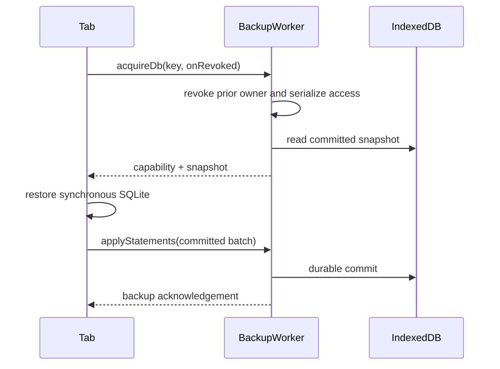

# Standalone IndexedDB backup coordination

This path belongs to standalone sessions. Synchronized aggregate/service sessions
use [durable nodes](./bootstrapBrowserSession.md).

Standalone tabs retain synchronous SQLite and send committed SQL batches to the
backup worker. Initial restore copies the saved database into the live view.
A successful local command does not wait for IndexedDB durability; `backupState`
tracks that asynchronous boundary.

## Trigger

`makeStandaloneSession` claims a backup key through the shared `BrowserBackup`
layer. `backupWorkerPlugin()` serves the stable worker and WASM assets.

## Annotated workflow steps

1. The standalone key includes its authored key, session name, and full lock.
   Concurrent claims retain the existing exclusive ownership behavior.
   - [`makeStandaloneSessionBackupKey.ts`](../../../packages/browser/src/makeStandaloneSessionBackupKey.ts)
   - [`BrowserBackup.ts`](../../../packages/browser/src/BrowserBackup/BrowserBackup.ts)
2. Acquisition revokes the previous capability before serialized export. Frozen
   callbacks cannot hold the storage boundary. Reacquisition restores committed
   state; ordinary current-owner reuse does not restore it again.
   - [`acquireDb.ts`](../../../packages/backup-worker/src/BackupWorkerApi/acquireDb/acquireDb.ts)
3. Async SQLite uses IDBBatchAtomicVFS with strict durability and FULL sync.
   - [`backupWorker.entry.ts`](../../../packages/backup-worker/src/backupWorker.entry.ts)
   - [`exportSnapshot.ts`](../../../packages/backup-worker/src/BackupDbApi/exportSnapshot/exportSnapshot.ts)
4. SQL batches check ownership inside serialization and roll back failed writes.
   The standalone lifecycle retains revocation, repair, reset, and visible resume.
   - [`applyStatements.ts`](../../../packages/backup-worker/src/BackupDbApi/applyStatements/applyStatements.ts)
   - [`makeStandaloneSession.ts`](../../../packages/browser/src/makeStandaloneSession/makeStandaloneSession.ts)
