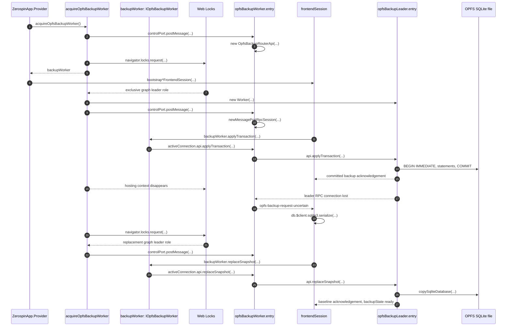

# OPFS Backup Coordination

One emitted OPFS backup SharedWorker URL defines one browser backup graph. The
SharedWorker mediates registered main-thread clients, while one Web-Lock-
elected dedicated Worker owns synchronous wa-sqlite, `OPFSCoopSyncVFS`, and
every exact `{ backupKey, sessionId }` file opened by that graph. Main-thread
aggregate and service sessions remain the live replicas and repair their own
backup lanes independently.

## Trigger

1. `ZerospinApp.Provider` acquires one scoped `IOpfsBackupWorker` before it
   initializes the selected main-thread frontend sessions in parallel.
   - [`makeZerospinApp.tsx:243-249`](../../../packages/react/src/makeZerospinApp.tsx#L243-L249) — acquires the page backup connection immediately before constructing selected frontend sessions.

## Annotated workflow steps

1. Provider invokes the exported acquisition function once per mounted page.
   - [`makeZerospinApp.tsx:243-249`](../../../packages/react/src/makeZerospinApp.tsx#L243-L249) — acquires the backup interface before parallel session bootstrap.
2. Inside `acquireOpfsBackupWorker`, the page opens the graph-qualified
   SharedWorker and calls `postMessage` on its `controlPort`, transferring a
   fresh client port in `RegisterClient`.
   - [`acquireOpfsBackupWorker.ts:117-147`](../../../packages/opfs-backup-worker/src/acquireOpfsBackupWorker/acquireOpfsBackupWorker.ts#L117-L147) — creates the control connection, sends `RegisterClient`, and constructs the router stub.
3. The mediator assigns the registration its next numeric `backupClientId` and
   installs one `OpfsBackupRouterApi` on the transferred port.
   - [`opfsBackupWorker.entry.ts:51-64`](../../../packages/opfs-backup-worker/src/opfsBackupWorker.entry.ts#L51-L64) — allocates the client ID and constructs its router target.
   - [`opfsBackupWorker.entry.ts:148-152`](../../../packages/opfs-backup-worker/src/opfsBackupWorker.entry.ts#L148-L152) — exposes that target through the transferred client port.
4. The acquisition function requests the same exclusive graph leader lock for
   every connected page.
   - [`acquireOpfsBackupWorker.ts:74-78`](../../../packages/opfs-backup-worker/src/acquireOpfsBackupWorker/acquireOpfsBackupWorker.ts#L74-L78) — derives graph, leader, and termination identities from emitted asset URLs.
   - [`acquireOpfsBackupWorker.ts:201-205`](../../../packages/opfs-backup-worker/src/acquireOpfsBackupWorker/acquireOpfsBackupWorker.ts#L201-L205) — requests the exclusive graph leader role.
5. The acquisition function returns its six-method `IOpfsBackupWorker` object
   to Provider while the page's asynchronous leader election remains active.
   - [`acquireOpfsBackupWorker.ts:289-374`](../../../packages/opfs-backup-worker/src/acquireOpfsBackupWorker/acquireOpfsBackupWorker.ts#L289-L374) — constructs the public backup object whose methods close over the active connection.
   - [`acquireOpfsBackupWorker.ts:381-382`](../../../packages/opfs-backup-worker/src/acquireOpfsBackupWorker/acquireOpfsBackupWorker.ts#L381-L382) — maps the scoped connection resource to its public `worker` object.
6. Provider passes that same `backupWorker` object into every selected frontend
   session bootstrap.
   - [`makeZerospinApp.tsx:247-304`](../../../packages/react/src/makeZerospinApp.tsx#L247-L304) — passes the acquired object into aggregate frontend bootstrap.
   - [`makeZerospinApp.tsx:353-375`](../../../packages/react/src/makeZerospinApp.tsx#L353-L375) — passes the same object into service frontend bootstrap.
7. Web Locks invokes exactly one waiting acquisition callback while the current
   graph leader lock is held.
   - [`acquireOpfsBackupWorker.ts:205-212`](../../../packages/opfs-backup-worker/src/acquireOpfsBackupWorker/acquireOpfsBackupWorker.ts#L205-L212) — admits only the live connection generation after lock acquisition.
8. The elected acquisition callback creates the dedicated module Worker that
   will own synchronous SQLite and transfers one end of its leader channel to
   it.
   - [`acquireOpfsBackupWorker.ts:215-220`](../../../packages/opfs-backup-worker/src/acquireOpfsBackupWorker/acquireOpfsBackupWorker.ts#L215-L220) — creates the dedicated leader and passes its RPC port.
   - [`opfsBackupLeader.entry.ts:14-27`](../../../packages/opfs-backup-worker/src/opfsBackupLeader.entry.ts#L14-L27) — initializes synchronous wa-sqlite and registers `OPFSCoopSyncVFS`.
9. From the same acquisition function, the elected callback calls `postMessage`
   on its `controlPort` and transfers the other leader-channel port in
   `InstallLeader`.
   - [`acquireOpfsBackupWorker.ts:219-225`](../../../packages/opfs-backup-worker/src/acquireOpfsBackupWorker/acquireOpfsBackupWorker.ts#L219-L225) — sends the raw leader installation control message.
10. The mediator binds the leader port to `OpfsBackupLeaderApi`, replacing and
    closing any stale installed leader first.

- [`opfsBackupWorker.entry.ts:156-177`](../../../packages/opfs-backup-worker/src/opfsBackupWorker.entry.ts#L156-L177) — evicts a stale leader and installs the new leader stub.

11. A successful main-thread SQLite commit enters only that session's ordered
    backup queue; its lane sends one `applyTransaction(...)` at a time.

- [`bootstrapAggregateFrontendSession.ts:789-824`](../../../packages/frontend/src/bootstrapAggregateFrontendSession.ts#L789-L824) — captures committed aggregate SQL, takes the next batch, and calls the public backup interface once.
- [`bootstrapServiceFrontendSession.ts:545-580`](../../../packages/frontend/src/bootstrapServiceFrontendSession.ts#L545-L580) — owns the independent service backup lane.

12. The returned `backupWorker` object calls the per-client router stub captured
    by its acquisition closure and decodes the
    encoded result without retrying an uncertain SQL batch.
    - [`acquireOpfsBackupWorker.ts:335-345`](../../../packages/opfs-backup-worker/src/acquireOpfsBackupWorker/acquireOpfsBackupWorker.ts#L335-L345) — sends one `applyTransaction` RPC and maps transport rejection to typed uncertainty.
13. The router method forwards the unchanged batch while adding only its
    mediator-assigned `backupClientId`.
    - [`applyTransaction.ts:7-22`](../../../packages/opfs-backup-worker/src/OpfsBackupRouter/applyTransaction/applyTransaction.ts#L7-L22) — adds client identity and calls the leader's same-named method.
    - [`opfsBackupWorker.entry.ts:65-106`](../../../packages/opfs-backup-worker/src/opfsBackupWorker.entry.ts#L65-L106) — queues only undispatched work and invokes the installed leader once.
14. The dedicated leader verifies that client owns the retained exact-file
    claim, then applies every statement under one SQLite transaction and rolls
    back the entire batch on failure.
    - [`applyTransaction.ts:17-59`](../../../packages/opfs-backup-worker/src/OpfsBackupLeader/applyTransaction/applyTransaction.ts#L17-L59) — validates claim identity and owns `BEGIN IMMEDIATE`, ordered statements, commit, and rollback.
15. The mediator settles the original caller only from that single dispatched
    leader call; it never retains a completed batch for replay.
    - [`opfsBackupWorker.entry.ts:72-94`](../../../packages/opfs-backup-worker/src/opfsBackupWorker.entry.ts#L72-L94) — resumes the caller from the one leader result and removes in-flight tracking after settlement.
16. If the hosting page disappears or its dedicated Worker fails, the leader
    callback ends, the Worker is terminated, and the exclusive graph lock is
    released for a waiting page.

- [`acquireOpfsBackupWorker.ts:224-260`](../../../packages/opfs-backup-worker/src/acquireOpfsBackupWorker/acquireOpfsBackupWorker.ts#L224-L260) — races host lifetime against worker failure, performs explicit normal shutdown, and replaces a failed connection generation.
- [`mainThreadOpfsAdverse.playwright.spec.ts:492-588`](../../../examples/shopping/tests/browser/mainThreadOpfsAdverse.playwright.spec.ts#L492-L588) — removes the hosting iframe and verifies Chromium elects a distinct dedicated-worker target.

17. A delivered close or message error removes the installed leader. A later
    authoritative `InstallLeader` also evicts an orphaned stale port that the
    browser did not report closed.
    - [`opfsBackupWorker.entry.ts:156-190`](../../../packages/opfs-backup-worker/src/opfsBackupWorker.entry.ts#L156-L190) — owns stale replacement and leader-loss listeners.
18. Every request already handed to the lost leader fails with
    `opfs-backup-request-uncertain`; the router does not put it back in the
    pending FIFO.
    - [`opfsBackupWorker.entry.ts:65-96`](../../../packages/opfs-backup-worker/src/opfsBackupWorker.entry.ts#L65-L96) — marks the request dispatched before the call and maps leader failure to typed uncertainty.
19. The affected main-thread session changes only its backup lane to
    `repairing`, diverts later commits, discards queued incremental batches,
    and serializes its current live database.

- [`bootstrapAggregateFrontendSession.ts:833-859`](../../../packages/frontend/src/bootstrapAggregateFrontendSession.ts#L833-L859) — enters aggregate repair and captures the authoritative in-memory snapshot.
- [`bootstrapServiceFrontendSession.ts:589-615`](../../../packages/frontend/src/bootstrapServiceFrontendSession.ts#L589-L615) — performs the same operation within only the affected service session.

20. After the old leader releases the graph lock, connected replacement
    candidates remain queued on the same build-qualified exclusive lock.

- [`acquireOpfsBackupWorker.ts:201-212`](../../../packages/opfs-backup-worker/src/acquireOpfsBackupWorker/acquireOpfsBackupWorker.ts#L201-L212) — keeps each current connection generation in the graph election.

21. Web Locks admits one replacement page and keeps every other candidate
    waiting without a heartbeat or lease.

- [`acquireOpfsBackupWorker.ts:201-218`](../../../packages/opfs-backup-worker/src/acquireOpfsBackupWorker/acquireOpfsBackupWorker.ts#L201-L218) — makes dedicated-worker creation conditional on exclusive callback admission.

22. The replacement acquisition callback calls `postMessage` on its
    `controlPort` to install the new dedicated Worker. Installation is
    authoritative even when the previous browser `MessagePort` did not emit a
    close event.

- [`acquireOpfsBackupWorker.ts:215-225`](../../../packages/opfs-backup-worker/src/acquireOpfsBackupWorker/acquireOpfsBackupWorker.ts#L215-L225) — creates and submits the replacement leader port.
- [`opfsBackupWorker.entry.ts:156-177`](../../../packages/opfs-backup-worker/src/opfsBackupWorker.entry.ts#L156-L177) — replaces any still-recorded stale leader.

23. The affected session calls `replaceSnapshot(...)` on the returned
    `backupWorker` object with its full current snapshot. Authoritative
    snapshot replacement may retry once after mediator uncertainty; incremental
    SQL never does.

- [`bootstrapAggregateFrontendSession.ts:844-859`](../../../packages/frontend/src/bootstrapAggregateFrontendSession.ts#L844-L859) — sends the aggregate rebaseline and restricts retry to typed mediator uncertainty.
- [`bootstrapServiceFrontendSession.ts:600-615`](../../../packages/frontend/src/bootstrapServiceFrontendSession.ts#L600-L615) — sends the independent service rebaseline.

24. The returned `backupWorker` object calls the per-client router stub captured
    by its acquisition closure.
    - [`acquireOpfsBackupWorker.ts:326-336`](../../../packages/opfs-backup-worker/src/acquireOpfsBackupWorker/acquireOpfsBackupWorker.ts#L326-L336) — waits for mediator readiness, invokes the active router stub, and maps transport loss to typed uncertainty.
25. The per-client router method adds `backupClientId` to the full snapshot
    request and forwards it through the same request-state machine.
    - [`replaceSnapshot.ts:6-21`](../../../packages/opfs-backup-worker/src/OpfsBackupRouter/replaceSnapshot/replaceSnapshot.ts#L6-L21) — forwards snapshot bytes with mediator client identity.
    - [`opfsBackupWorker.entry.ts:193-203`](../../../packages/opfs-backup-worker/src/opfsBackupWorker.entry.ts#L193-L203) — drains only undispatched requests after leader installation.
26. The leader holds the build-independent exact-file Web Lock, deserializes
    into temporary memory SQLite, and uses SQLite's backup API to copy into the
    existing OPFS connection.
    - [`replaceSnapshot.ts:24-56`](../../../packages/opfs-backup-worker/src/OpfsBackupLeader/replaceSnapshot/replaceSnapshot.ts#L24-L56) — acquires or transfers the exact-file exclusive claim before the local operation turn.
    - [`replaceSnapshot.ts:70-123`](../../../packages/opfs-backup-worker/src/OpfsBackupLeader/replaceSnapshot/replaceSnapshot.ts#L70-L123) — deserializes memory SQLite and copies into the retained OPFS destination.
    - [`copySqliteDatabase.ts:31-82`](../../../packages/opfs-backup-worker/src/OpfsBackupLeader/copySqliteDatabase/copySqliteDatabase.ts#L31-L82) — requires `SQLITE_DONE` and calls `sqlite3_backup_finish` exactly once after successful initialization.
27. After baseline acknowledgement, the session restores incremental capture,
    requeues commits made during repair, and returns only its own backup lane to
    `ready` when nothing remains.

- [`bootstrapAggregateFrontendSession.ts:870-887`](../../../packages/frontend/src/bootstrapAggregateFrontendSession.ts#L870-L887) — completes aggregate repair without changing unrelated session state.
- [`bootstrapServiceFrontendSession.ts:628-645`](../../../packages/frontend/src/bootstrapServiceFrontendSession.ts#L628-L645) — completes the equivalent service-local repair.

Mediator death is fenced separately from leader election. The SharedWorker
holds its graph-qualified termination lock exclusively and announces readiness
only after acquisition; pages wait in shared mode and reconnect when that lock
is released. Calls outstanding at mediator death are uncertain, while the new
mediator starts with an empty in-memory queue and a fresh election.

- [`opfsBackupWorker.entry.ts:10-23`](../../../packages/opfs-backup-worker/src/opfsBackupWorker.entry.ts#L10-L23) — acquires the current mediator's exclusive termination lock.
- [`acquireOpfsBackupWorker.ts:96-115`](../../../packages/opfs-backup-worker/src/acquireOpfsBackupWorker/acquireOpfsBackupWorker.ts#L96-L115) — replaces a dead connection without preserving mediator state and opens the next generation.
- [`acquireOpfsBackupWorker.ts:177-199`](../../../packages/opfs-backup-worker/src/acquireOpfsBackupWorker/acquireOpfsBackupWorker.ts#L177-L199) — starts the page's shared termination-lock wait only after `RouterReady`.
- [`acquireOpfsBackupWorker.ts:274-285`](../../../packages/opfs-backup-worker/src/acquireOpfsBackupWorker/acquireOpfsBackupWorker.ts#L274-L285) — maps an outstanding mediator call to typed uncertainty and triggers connection replacement.

## Callers

- [Main-thread frontend session bootstrap and recovery](./bootstrapBrowserSession.md)
- [Aggregate frontend push and finalization](./PushSequence.md)
- [Frontend finalized-command WebSocket](./FrontendWebSocket.md)
- [Direct exact frontend authentication](./Authentication.md)
