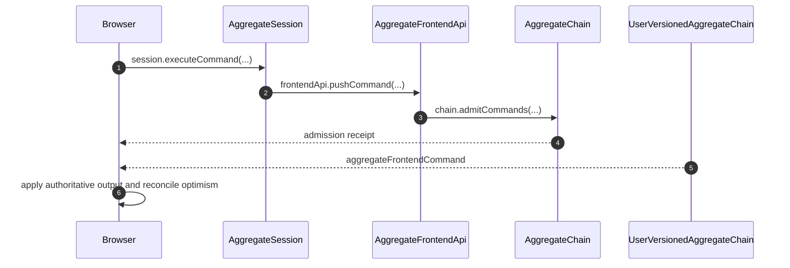

# Aggregate Frontend Submission

Server execution starts in VAR after AC admission. The browser owns optimism; UVAR computes authoritative per-command view changes.

## Trigger

1. The local session executes the frontend command and commits its complete occurrence, optimistic mutations, and inverse journal.
   - [`makeAggregateSession.ts`](../../../packages/core/src/session/makeAggregateSession.ts) — Requires current ownership and captures the current execution ID before constructing the complete command.

## Annotated workflow steps

1. The local session executes the frontend command and commits its complete occurrence, optimistic mutations, and inverse journal.
   - [`makeAggregateSession.ts`](../../../packages/core/src/session/makeAggregateSession.ts) — Requires current ownership and captures the current execution ID before constructing the complete command.
2. The browser submits that complete occurrence through its authenticated frontend capability.
   - [`pushAggregateFrontendCommand.ts`](../../../packages/frontend/src/pushAggregateFrontendCommand.ts) — Sends the full encoded session command.
3. The API checks the bound aggregate/user/frontend fields and admits the unchanged input.
   - [`pushCommand.ts`](../../../packages/system-worker/src/AggregateFrontendApi/pushCommand/pushCommand.ts) — Returns only the assigned aggregate index and command ID.
4. An admission receipt stops resubmission; it does not resolve optimism.
   - [`bootstrapAggregateFrontendSession.ts`](../../../packages/frontend/src/bootstrapAggregateFrontendSession.ts) — Stores receipt progress in the journal while retaining optimistic mutation rows.
5. A durable output supplies the per-command delta and complete originating resolution for this view.
   - [`receiveDeltas.ts`](../../../packages/system-worker/src/UserVersionedAggregateChain/receiveDeltas/receiveDeltas.ts) — Validates the resolution target and persists output before broadcasting.
6. The session rewinds optimism, applies the authoritative delta, resolves that command ID, and replays the remaining optimism in one transaction.
   - [`applyAggregateFrontendCommandTx.ts`](../../../packages/core/src/session/applyAggregateFrontendCommandTx.ts) — Rejects gaps, ignores committed duplicates, and advances the aggregate cursor after application.

## Ownership and execution identity

Local execution captures `sessionId` from the current session state and uses
that same ID for the occurrence and durable command position. Reacquisition
publishes a fresh execution ID, while retained journal occurrences keep their
original session ID, positions, and payload bytes. A superseded frontend rejects
new execution and submission; DevTools push controls resolve the current
ownership period each time they run.

- [`makeAggregateSession.ts`](../../../packages/core/src/session/makeAggregateSession.ts) — captures execution identity only after checking current session status.
- [`executeCommandTx.ts`](../../../packages/core/src/session/executeCommandTx.ts) — reads the durable next position for that captured ID in the command transaction.
- [`bootstrapAggregateFrontendSession.ts`](../../../packages/frontend/src/bootstrapAggregateFrontendSession.ts) — fences push work by ownership period and returns controls that consult the current lane.
- [`makeZerospinApp.tsx`](../../../packages/react/src/makeZerospinApp.tsx) — retains bootstrap control callbacks while moving DevTools registration between current execution IDs.
- [`makeAggregateSession.node.spec.ts`](../../../packages/core/src/session/makeAggregateSession.node.spec.ts) — verifies fresh session indexing, rejection while superseded, and unchanged original journal rows.

Unadmitted optimism replays in durable journal insertion order across execution
periods. Admitted occurrences retain `pushIndex` order. `sessionIndex` orders
commands within their original execution identity and does not reorder pending
commands from older periods.

- [`applyAggregateFrontendStateTx.ts`](../../../packages/core/src/session/applyAggregateFrontendStateTx.ts) — sorts admitted commands before unadmitted commands and uses SQLite row identity to retain cross-period insertion order.
- [`applyAggregateFrontendCommandTx.ts`](../../../packages/core/src/session/applyAggregateFrontendCommandTx.ts) — uses the same ordering before rewinding active optimism.
- [`applyAggregateFrontendCommandTx.ts`](../../../packages/core/src/session/applyAggregateFrontendCommandTx.ts) — reapplies surviving commands in admitted/insertion order after authoritative state changes.
- [`makeAggregateSession.node.spec.ts`](../../../packages/core/src/session/makeAggregateSession.node.spec.ts) — preserves the latest optimistic update through snapshot and finalized replay after execution indices restart.

## Reconnect

A published UVAR snapshot carries `aggregateVersion`, cursor `n`, and complete resolutions for the requested outstanding command IDs. The browser installs that state, retains unresolved local optimism, and consumes UVAC output strictly after `n`.

- [`getState.ts`](../../../packages/system-worker/src/UserVersionedAggregateRepo/getState/getState.ts) — Captures state and cursor together and awaits publication outside the execution semaphore.
- [`applyAggregateFrontendStateTx.ts`](../../../packages/core/src/session/applyAggregateFrontendStateTx.ts) — Records full outcomes and their admission indices, then replays surviving local optimism.
- [`frontendReplica.node.spec.ts`](../../../packages/system-worker/src/frontendReplica.node.spec.ts) — Verifies rejection resolution, surviving optimism, duplicate delivery, empty progress, and gap rejection.
