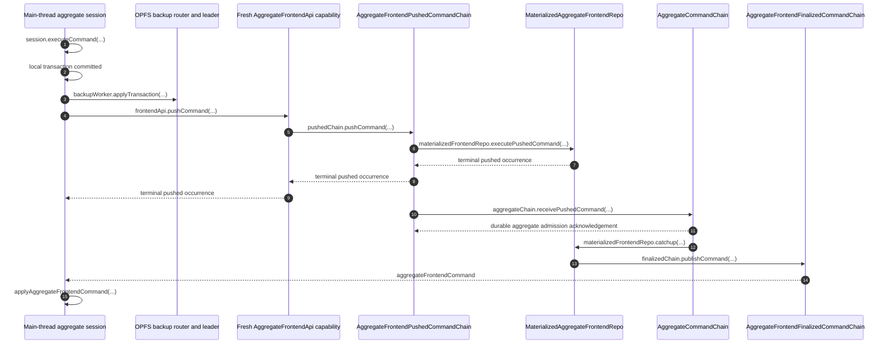

# Aggregate Frontend Push and Finalization

The page-owned aggregate session executes an authored command synchronously in
its in-memory database. One transaction commits the complete terminal session
occurrence, optimistic mutations, and monotonic `sessionIndex`; committed SQL
is then queued through the OPFS SharedWorker mediator to its elected dedicated
storage Worker. A separate Effect lane pushes unresolved occurrences by
`sessionIndex` through a freshly authenticated HTTP-batch RPC session.

- [`makeSession.ts:177-212`](../../../packages/core/src/session/makeSession.ts#L177-L212) — gates local execution on an initialized current session.
- [`makeSession.ts:247-504`](../../../packages/core/src/session/makeSession.ts#L247-L504) — applies the local transaction and retains the full occurrence by `sessionIndex`.
- [`bootstrapAggregateFrontendSession.ts:937-1021`](../../../packages/frontend/src/bootstrapAggregateFrontendSession.ts#L937-L1021) — selects the earliest unresolved session occurrence and drives the push lane.

AggregateFrontendPushedCommandChain assigns `pushIndex`, executes server-side
optimism, and returns one terminal pushed occurrence. A successful push
forwards the complete aggregate command to AggregateCommandChain for
authoritative execution; finalized socket delivery resolves the exact origin
through `pushIndex`.

## Trigger

1. `session.executeCommand(...)` commits a complete local occurrence and
   signals the aggregate push lane after commit.
   - [`makeSession.ts:507-553`](../../../packages/core/src/session/makeSession.ts#L507-L553) — commits locally, validates the returned receipt identity, and starts the post-commit push signal.

## Annotated workflow steps

1. The browser calls the synchronous session boundary. It rejects any
   `bootstrapping`, `superseded`, `failed`, or `released` session before
   constructing a command.
   - [`makeSession.ts:177-212`](../../../packages/core/src/session/makeSession.ts#L177-L212) — enforces initialization and current-session admission.
2. One local transaction assigns `sessionIndex`, applies optimistic mutations,
   stores the complete command bytes and mutation journal, and advances
   `nextSessionIndex`; the browser has no second command-order frontier.
   - [`makeSession.ts:247-334`](../../../packages/core/src/session/makeSession.ts#L247-L334) — persists terminal local failures as complete occurrences.
   - [`makeSession.ts:336-504`](../../../packages/core/src/session/makeSession.ts#L336-L504) — persists successful optimism, command bytes, and session metadata atomically.
3. The wa-sqlite driver reports only a committed outer transaction; the backup
   lane routes its ordered SQL statements through the mediator to the dedicated
   leader holding the current OPFS claim. An uncertain dispatched batch is
   never replayed; that session replaces a full live snapshot instead.
   - [`WaSqliteSession.ts:345-383`](../../../packages/core/src/drizzle/WaSqliteSession.ts#L345-L383) — emits statements after commit and discards them after rollback.
   - [`bootstrapAggregateFrontendSession.ts:813-888`](../../../packages/frontend/src/bootstrapAggregateFrontendSession.ts#L813-L888) — applies queued SQL once and replaces a full snapshot after failure.
   - [`opfsBackupWorker.entry.ts:65-106`](../../../packages/opfs-backup-worker/src/opfsBackupWorker.entry.ts#L65-L106) — distinguishes undispatched FIFO work from dispatched calls that can only settle or fail uncertain.
4. The push lane selects the lowest unresolved occurrence by `sessionIndex`,
   creates a fresh signature and capability, and calls
   `frontendApi.pushCommand({ command })`. Transient failures use exponential
   Effect retry capped at 30 seconds; pause, release, or a terminal result stops
   automatic retry.
   - [`bootstrapAggregateFrontendSession.ts:937-984`](../../../packages/frontend/src/bootstrapAggregateFrontendSession.ts#L937-L984) — selects and pushes the complete earliest session occurrence.
   - [`frontendPushRetrySchedule.ts:1-7`](../../../packages/frontend/src/frontendPushRetrySchedule.ts#L1-L7) — defines the capped exponential retry schedule.
   - [`pushAggregateFrontendCommand.ts:52-75`](../../../packages/frontend/src/pushAggregateFrontendCommand.ts#L52-L75) — authenticates, pushes once, and disposes the fresh RPC session.
5. AggregateFrontendApi verifies that command identity matches its six bound
   fields and resolves the pushed chain identified by `{ systemId,
aggregateId, aggregateName, userId, frontendName }`.
   - [`pushCommand.ts:35-102`](../../../packages/system-worker/src/AggregateFrontendApi/pushCommand/pushCommand.ts#L35-L102) — decodes the request and rejects a mismatched or pending occurrence.
   - [`pushCommand.ts:104-127`](../../../packages/system-worker/src/AggregateFrontendApi/pushCommand/pushCommand.ts#L104-L127) — invokes the exact pushed chain with the unchanged command.
6. AggregateFrontendPushedCommandChain enforces canonical-byte idempotency,
   assigns the next `pushIndex`, and dispatches only the lowest pending
   occurrence to its retained MaterializedAggregateFrontendRepo.
   - [`pushCommand.ts:75-210`](../../../packages/system-worker/src/AggregateFrontendPushedCommandChain/pushCommand/pushCommand.ts#L75-L210) — admits the complete pushed command under the chain semaphore.
   - [`runScheduledWork.ts:62-105`](../../../packages/system-worker/src/AggregateFrontendPushedCommandChain/runScheduledWork/runScheduledWork.ts#L62-L105) — dispatches the lowest pending push.
7. The frontend materializer returns one terminal pushed occurrence; a success
   causes the pushed chain to retain a complete aggregate-forwarding outbox.
   - [`runScheduledWork.ts:130-261`](../../../packages/system-worker/src/AggregateFrontendPushedCommandChain/runScheduledWork/runScheduledWork.ts#L130-L261) — validates terminal output and atomically stores forwarding work.
8. The pushed chain returns only its retained terminal occurrence to
   AggregateFrontendApi.
   - [`pushCommand.ts:218-251`](../../../packages/system-worker/src/AggregateFrontendPushedCommandChain/pushCommand/pushCommand.ts#L218-L251) — decodes the retained terminal result.
9. AggregateFrontendApi returns the complete pushed occurrence. The main-thread
   session applies it exactly once, assigning `pushIndex` to the retained local
   command or retaining a failed push.
   - [`pushCommand.ts:113-132`](../../../packages/system-worker/src/AggregateFrontendApi/pushCommand/pushCommand.ts#L113-L132) — returns the singular pushed result.
   - [`bootstrapAggregateFrontendSession.ts:993-1019`](../../../packages/frontend/src/bootstrapAggregateFrontendSession.ts#L993-L1019) — applies the pushed occurrence and refreshes the visible push frontier.
10. The pushed chain forwards each successful complete output, including flat
    `{ sessionId, userId, frontendName, pushIndex }` provenance.
    - [`runScheduledWork.ts:285-328`](../../../packages/system-worker/src/AggregateFrontendPushedCommandChain/runScheduledWork/runScheduledWork.ts#L285-L328) — calls `receivePushedCommand({ command })` with the complete occurrence.
11. AggregateCommandChain durably accepts the occurrence before the pushed
    chain marks its aggregate-forward outbox row complete.
    - [`receivePushedCommand.ts:47-160`](../../../packages/system-worker/src/AggregateCommandChain/receivePushedCommand/receivePushedCommand.ts#L47-L160) — enforces exact-byte idempotency and durably appends a new pushed aggregate occurrence.
    - [`runScheduledWork.ts:329-346`](../../../packages/system-worker/src/AggregateFrontendPushedCommandChain/runScheduledWork/runScheduledWork.ts#L329-L346) — records the forwarding acknowledgement or retained failure.
12. AggregateCommandChain later notifies MaterializedAggregateFrontendRepo,
    which pulls contiguous aggregate history and checks its durable execution
    claim before projection.
    - [`catchup.ts:215-390`](../../../packages/system-worker/src/MaterializedAggregateFrontendRepo/catchup/catchup.ts#L215-L390) — validates source history and reuses, halts, or creates the exact claim.
13. The materialized frontend commits authoritative state, finalized output,
    completed claim result, and frontiers atomically, then publishes pending
    output in `frontendIndex` order.
    - [`catchup.ts:392-917`](../../../packages/system-worker/src/MaterializedAggregateFrontendRepo/catchup/catchup.ts#L392-L917) — owns projection, optimistic replay, known failure, outbox, and frontier commit.
    - [`runScheduledWork.ts:38-106`](../../../packages/system-worker/src/MaterializedAggregateFrontendRepo/runScheduledWork/runScheduledWork.ts#L38-L106) — publishes ordered finalized output.
14. AggregateFrontendFinalizedCommandChain emits one complete
    `aggregateFrontendCommand` over each live session socket.
    - [`AggregateFrontendFinalizedCommandChain.ts:58-98`](../../../packages/system-worker/src/AggregateFrontendFinalizedCommandChain/AggregateFrontendFinalizedCommandChain.ts#L58-L98) — broadcasts one singular command and fences replay races.
15. The main-thread session validates exact duplicate bytes and contiguous
    source frontiers, rewinds unresolved optimism, applies the authoritative
    delta, resolves the exact push, replays survivors by `pushIndex` then
    `sessionIndex`, and commits the result before updating visible frontiers.
    - [`applyAggregateFrontendCommand.ts:152-238`](../../../packages/core/src/session/applyAggregateFrontendCommand.ts#L152-L238) — validates duplicate and next-index semantics and orders active commands.
    - [`applyAggregateFrontendCommand.ts:240-420`](../../../packages/core/src/session/applyAggregateFrontendCommand.ts#L240-L420) — rewinds, applies, resolves, replays, and updates metadata in one transaction.
    - [`bootstrapAggregateFrontendSession.ts:685-741`](../../../packages/frontend/src/bootstrapAggregateFrontendSession.ts#L685-L741) — applies live socket occurrences and publishes their frontiers.

## Socket-before-response race

The same local transaction procedure handles either arrival order. If finalized
delivery resolves an origin before its push response, the later pushed result
must match retained command bytes and exact `pushIndex`; it advances pushed
state without reapplying resolved optimism.

- [`applyAggregateFrontendCommand.ts:194-221`](../../../packages/core/src/session/applyAggregateFrontendCommand.ts#L194-L221) — validates exact duplicate pushed bytes and contiguous `pushIndex`.
- [`applyAggregateFrontendCommand.ts:295-420`](../../../packages/core/src/session/applyAggregateFrontendCommand.ts#L295-L420) — resolves finalized origins and reapplies only surviving optimism.

## Callers

- [Browser session bootstrap](./bootstrapBrowserSession.md)
- [OPFS backup coordination](./OpfsBackupCoordination.md)
- [Frontend WebSocket](./FrontendWebSocket.md)
- [Command chains and materialization](../CommandChains.md)
