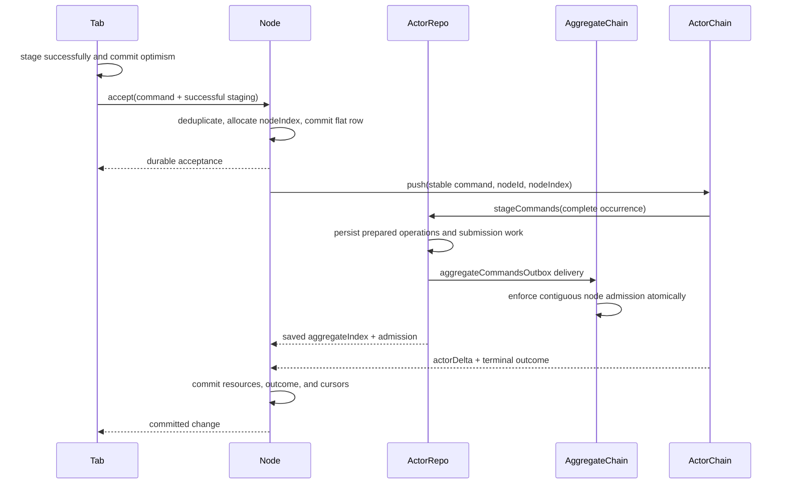

# Durable node command admission

`stageCommand` executes synchronously in the tab. Its result reports the local
optimistic transaction. Durable acceptance is asynchronous and exposed through
`nodeState.nodeIndex` and `nodeState.uncertainHandoffs`.

```mermaid
sequenceDiagram
  participant Tab
  participant Node
  participant ActorRepo
  participant AggregateChain
  participant ActorChain
  Tab->>Tab: stage successfully and commit optimism
  Tab->>Node: accept(command + successful staging)
  Node->>Node: deduplicate, allocate nodeIndex, commit flat row
  Node-->>Tab: durable acceptance
  Node->>ActorChain: push(stable command, nodeId, nodeIndex)
  ActorChain->>ActorRepo: stageCommands(complete occurrence)
  ActorRepo->>ActorRepo: persist prepared operations and submission work
  ActorRepo->>AggregateChain: aggregateCommandsOutbox delivery
  AggregateChain->>AggregateChain: enforce contiguous node admission atomically
  ActorRepo-->>Node: saved aggregateIndex + admission
  ActorChain-->>Node: actorDelta + terminal outcome
  Node->>Node: commit resources, outcome, and cursors
  Node-->>Tab: committed change
```

## Annotated workflow steps

1. The tab retains uncertain handoffs and retries by command ID. A crash before
   the node commits remains the accepted durability gap.
   - [`stageCommand.ts`](../../../packages/core/src/aggregateSession/stageCommand/stageCommand.ts)
   - [`bootstrapAggregateSession.ts`](../../../packages/browser/src/bootstrapAggregateSession.ts)
2. A node transaction allocates the next index and retains one complete command
   row. Duplicate IDs return that retained row, including any completed outcome.
   No SQL statement forwarding or separate pending/history copies are used.
   - [`Node.ts`](../../../packages/browser/src/Node/Node.ts)
   - [`nodeTables.ts`](../../../packages/browser/src/Node/nodeTables.ts)
3. Only committed rows can be pushed. `pushPaused` is persisted and shared across
   tabs. Manual `pushNow` attempts one next command without clearing the pause.
   - [`NodeSynchronization.ts`](../../../packages/browser/src/Node/NodeSynchronization.ts)
4. The actor repo stages the complete occurrence against derived optimism and saves prepared operations before its outbox calls AC. Admission binds the node to its authenticated target/session, deduplicates IDs,
   and requires the next node index in the insertion transaction. Gaps return the
   expected index; the node resends retained earlier work without renumbering.
   - [`stageActorCommands.ts`](../../../packages/system-worker/src/AggregateActorVersionRepo/optimistic/stageActorCommands.ts)
   - [`onMessage.ts`](../../../packages/system-worker/src/AggregateActorVersionChain/onMessage/onMessage.ts)
   - [`admitCommandsTx.ts`](../../../packages/system-worker/src/AggregateChain/admitCommands/admitCommandsTx.ts)
5. Successful execution and terminal business failure both resolve positions.
   Admission receipts alone do not advance the outcome cursor. Resource changes
   from `actorDelta` and own outcomes commit together; missed outcomes use the existing retained
   actor history and the [two-cursor protocol](./SessionWebSocket.md).
   - [`commitActorProjectionTx.ts`](../../../packages/system-worker/src/AggregateActorVersionRepo/commitActorProjectionTx/commitActorProjectionTx.ts)
   - [`Node.ts`](../../../packages/browser/src/Node/Node.ts)

A new definition has a new node and retains its original lock. Older work is
never translated or rebound to a different user. DevTools queries completed
history in pages and displays node authentication, storage, synchronization,
blocked work, and pause separately.

Failed staging returns a structured error without a retained command or position.
Successful staging records `startedAt`, `completedAt`, and `stagedDelta`. Push excludes
this local result. Admission receipts retain their own result and timestamps; a
rejection sets execution to `skipped/admission-failed` and triggers snapshot-based
optimistic rollback immediately. It advances no authoritative checkpoint by itself.
The later ordered actor command advances progress with private operation summaries
and permitted `actorDelta`. Retry deliveries retain the original result timestamps.

The actor socket retains the existing admission response shape by waiting for the
saved outbox admission result after durable staging. That wait does not change
the staging commit or turn its optimistic resources into authoritative state.
