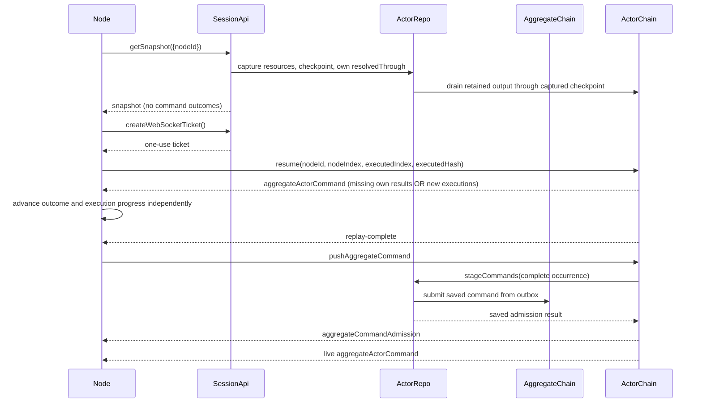

# Durable node session WebSocket

The authorized actor socket carries aggregate command admission,
missed own outcomes, and live selected-resource updates. Tickets bind the exact
aggregate/service version, actor, identity, session, and lock.

## Trigger

A node submits direct identity or fresh credentials, fetches a snapshot, creates a ticket,
and resumes the selected actor chain. Services use their service checkpoint;
aggregate nodes also supply their durable outcome cursor.

## Annotated workflow steps

1. The actor replica captures resources, execution position/hash, and the
   requesting node's contiguous resolved-through watermark in one transaction.
   Publication is awaited outside that transaction. No pending-ID list or
   command-outcome bundle crosses the snapshot API.
   - [`getSnapshot.ts`](../../../packages/system-worker/src/AggregateActorVersionRepo/getSnapshot/getSnapshot.ts)
2. Ticket consumption preserves existing target and identity binding.
   - [`createWebSocketTicket.ts`](../../../packages/system-worker/src/AggregateSessionApi/createWebSocketTicket/createWebSocketTicket.ts)
   - [`consumeAggregateSessionWebSocketTicket.ts`](../../../packages/system-worker/src/SystemRepo/consumeAggregateSessionWebSocketTicket/consumeAggregateSessionWebSocketTicket.ts)
3. Resume validates the execution hash. One ordered query selects the union of
   executions beyond the execution cursor and owned results beyond the node cursor.
   Pages contain at most 64 commands; ownership filtering scans onward to fill the
   page. A command matching both predicates appears once. Historical results advance
   only node progress; new executions and owned results each require contiguous
   progress. Private fields require matching node, session, and structural identity;
   resource deltas retain the admitted model-lock projection. `replay-complete`
   reports execution progress even after historical-only replay. Publication racing
   replay closes the socket so the node reconnects from a fresh snapshot.
   - [`onMessage.ts`](../../../packages/system-worker/src/AggregateActorVersionChain/onMessage/onMessage.ts)
   - [`getActorCommands.ts`](../../../packages/system-worker/src/AggregateActorVersionChain/getActorCommands/getActorCommands.ts)
   - [`stageActorCommands.ts`](../../../packages/system-worker/src/AggregateActorVersionRepo/optimistic/stageActorCommands.ts)
4. The node fills its retained history from historical outcomes without applying
   their `actorDelta`. It publishes replacement resources only when all outcomes
   through the watermark can commit with them. Interrupted recovery leaves the
   previous state and durable cursors intact.
   - [`Node.ts`](../../../packages/browser/src/Node/Node.ts)
5. `NodeSynchronization` validates aggregate and service commands with their
   domain schemas, then adapts service positions while retaining `actorDelta`.
   Both enter `Node.receiveCommand`, which derives ownership locally and checks
   duplicate results before ignoring covered executions. New execution updates
   atomically apply resources and any missing own result. Execution beyond a pending
   snapshot is rejected until all required results have arrived. Socket
   loss retries from a new snapshot; incompatible cursors request state again.
   - [`NodeSynchronization.ts`](../../../packages/browser/src/Node/NodeSynchronization.ts)

`pushAggregateCommand` contains stable command fields and node provenance only.
`aggregateCommandAdmission` returns the completed admission result after AAVR has durably staged the command and its outbox has submitted it to AC. AAVR persists authoritative resources and prepared pending operations; its optimistic database is derived and excluded from snapshots. Rejection causes
an immediate node snapshot notification and tab optimistic replay without the command,
but the resource and outcome cursors wait for ordered actor output. Actor commands
carry `actorDelta`, nullable private `admission`, and nullable private `execution`
summaries. A rejected admission has skipped execution and no execution failure or
timestamps. Failure envelopes remain structured JSON; historical recognition is
optional and cannot block acknowledgement or recovery.
